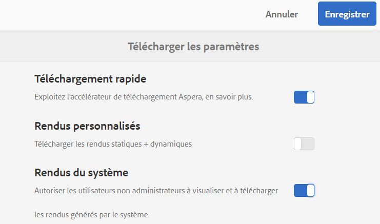
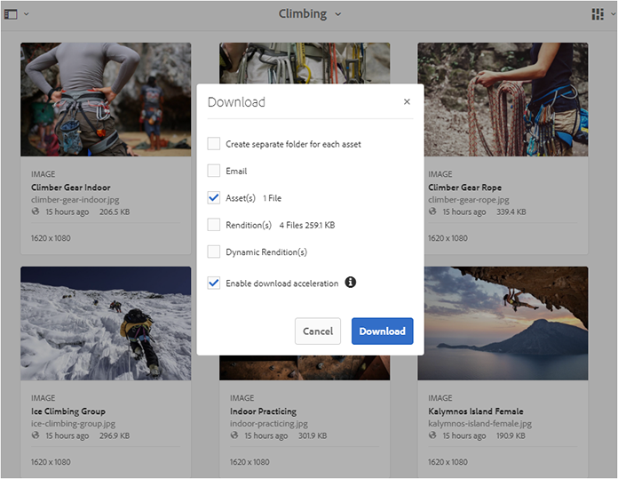
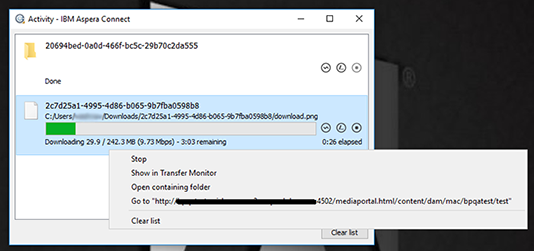
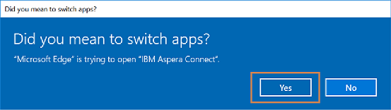
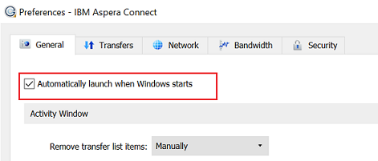

# Accélération des téléchargements de Brand Portal {#guide-to-accelerate-downloads-from-brand-portal}

Brand Portal permet d’améliorer les performances de téléchargement des fichiers de ressources volumineux par le biais d’une intégration à l’application IBM Aspera Connect, qui s’installe à la demande. Cette application utilise une technologie propriétaire pour éliminer les surcharges TCP, et améliore la vitesse de transfert des fichiers de ressources. Cette intégration garantit une meilleure expérience de téléchargement.

>[!NOTE]
>
>La vitesse de téléchargement varie en fonction de facteurs tels que la bande passante du réseau, la latence du serveur et l’emplacement géographique des clients.

La configuration **[!UICONTROL Téléchargement rapide]** est activée par défaut, ce qui réduit considérablement le temps nécessaire au téléchargement des fichiers de ressources désirés à partir de Brand Portal.

## Conditions préalables pour accélérer le téléchargement de fichiers   {#prerequisites-to-accelerate-file-download}

Pour télécharger les fichiers plus rapidement, vérifiez les points suivants :

* Accédez à **[!UICONTROL Outils]** > **[!UICONTROL Télécharger]** et vérifiez que la configuration **[!UICONTROL Téléchargement rapide]** est activée dans les **[!UICONTROL Paramètres de téléchargement]**.
* Assurez-vous que le port 33001 (TCP et UDP) est ouvert sur le pare-feu. Pour plus d’informations sur les conditions préalables, voir [Documentation du client IBM Aspera Connect](https://downloads.asperasoft.com/en/documentation/8).
* [Installez IBM Aspera Connect 3.9.9](https://www.ibm.com/support/knowledgecenter/SSXMX3_3.9.9/kc/connect_welcome.html) dans l’extension de votre navigateur à l’aide des droits d’administrateur.
* Pour la prise en charge de la plate-forme du client de transfert Aspera, voir [matrice de prise en charge de la plate-forme IBM Aspera Connect](https://www.asperasoft.com/company/support/transfer-clients/).

## Domaines de téléchargement {#download-domains}

Vous trouverez ci-après les domaines de téléchargement pour différentes zones géographiques :

| Code de région | Domaine |
|---|---|
| NA OR1 | downloads-na1.brand-portal.adobe.com |
| NA VA5 | downloads-na2.brand-portal.adobe.com |
| EMEA LON5 | downloads-emea1.brand-portal.adobe.com |
| APAC SIN2 | downloads-apac1.brand-portal.adobe.com |

## Exemple de performances de téléchargement à l’aide de l’accélérateur de fichiers {#expected-download-performance-using-file-accelerator}

Le tableau suivant affiche les performances de téléchargement obtenues pour un fichier de 2 Go en utilisant l’accélérateur de téléchargement de fichiers d’Aspera Connect :

*Les résultats observés varient en fonction de facteurs tels que la bande passante du réseau, la latence du serveur et l’emplacement du client, en sachant que le serveur Brand Portal se situe dans l’État de l’Oregon aux États-Unis.*

| Emplacement du client | Latence entre le client et le serveur  (millisecondes) | Vitesse mesurée avec l’accélérateur de transfert de fichiers d’Aspera Connect (Mbit/s) | Temps nécessaire pour télécharger un fichier de 2 Go avec l’accélérateur de transfert de fichiers Aspera (en secondes) |
|---------------------------|-----------------------------------|---------------------------------------------|-------------------------------------------------------------------------|
| Ouest des États-Unis (Californie du Nord) | 18 | 36 | 57 |
| Ouest des États-Unis (Oregon) | 42 | 36 | 57 |
| Est des États-Unis (Virginie du Nord) | 85 | 35 | 58 |
| Asie-Pacifique (Tokyo) | 124 | 36 | 57 |
| Noida (Inde) | 275 | 13.36 | 153 |
| Sydney | 175 | 29 | 70 |
| Londres | 179 | 35 | 58 |
| Singapour | 196 | 34 | 60 |

## Workflow de téléchargement avec l’accélérateur de fichiers {#download-workflow-using-file-accelerator}

Pour télécharger des ressources plus rapidement à partir de Brand Portal :

1. Connectez-vous à Brand Portal à l’aide d’un navigateur pris en charge.
1. Accédez aux dossiers ou aux ressources que vous souhaitez télécharger et sélectionnez-les. Dans la barre d’outils supérieure, cliquez sur l’icône **[!UICONTROL Télécharger]**. La boîte de dialogue **[!UICONTROL Télécharger]** s’affiche avec les cases **[!UICONTROL Ressource(s)]** et **[!UICONTROL Activer l’accélération des téléchargements]** cochées par défaut.

   

   >[!NOTE]
   >
   >La fonctionnalité d’envoi d’email de notification contenant le lien pour télécharger les ressources n’est actuellement pas prise en charge lorsque les téléchargements plus rapides sont activés.

   

1. Cliquez sur **[!UICONTROL Télécharger]**.

   Pour accélérer les téléchargements sur votre compte de client Brand Portal, l’application cliente Aspera Connect doit être installée sur l’extension de votre navigateur.

1. **Téléchargement du client Aspera Connect**

   Si le client Aspera Connect n’est pas installé sur votre système ou si ce client est obsolète, une invite s’affiche sur la page du navigateur pour vous permettre de télécharger le client Aspera Connect spécifique au système en sélectionnant **[!UICONTROL Télécharger la dernière version]**.

   

   Pour télécharger la dernière version d’Aspera Connect à partir de [https://downloads.asperasoft.com/connect2/](https://downloads.asperasoft.com/connect2/), sélectionnez **[!UICONTROL Télécharger maintenant]** et suivez les instructions.

1. **Installez le client Aspera Connect**

   Pour installer la configuration du client IBM Aspera Connect, exécutez le programme d’installation à partir du fichier .msi de l’’application cliente IBM Aspera Connect et suivez l’assistant d’installation.

1. Une fois le client installé, actualisez la page du navigateur et relancez les étapes de téléchargement.

   Lorsque vous utilisez Aspera Connect pour la première fois, le navigateur vous invite à ouvrir le lien à l’aide d’**[!UICONTROL IBM Aspera Connect]**. Pour ignorer cette boîte de dialogue à l’avenir, activez **[!UICONTROL Mémoriser mon choix pour les liens FASP]**.

   >[!NOTE]
   >
   >Ce message varie en fonction du navigateur.

1. Une boîte de dialogue vous permet de confirmer si vous voulez poursuivre le transfert. Sélectionnez **[!UICONTROL Autoriser]** pour commencer.
Pour ignorer cette boîte de dialogue à l’avenir, activez **[!UICONTROL Utiliser ce choix pour toutes les connexions avec cet hôte]**.
Le téléchargement démarre. Une boîte de dialogue affiche la progression du téléchargement. Utilisez la boîte de dialogue pour **[!UICONTROL mettre en pause]**, **[!UICONTROL reprendre]** ou **[!UICONTROL annuler]** le téléchargement.
L’application Aspera Connect fournit un workflow d’activité sur le système où l’utilisateur peut visualiser et gérer toutes les sessions de transfert. Pour plus d’informations, consultez la [documentation du client Aspera Connect](https://downloads.asperasoft.com/en/documentation/8).

À la fin du téléchargement, une boîte de dialogue affiche l’emplacement où les ressources sont téléchargées sur le système de l’utilisateur. En cas d’échec, une erreur s’affiche.

>[!NOTE]
>
>Une limite connue dans l’application cliente Aspera Connect fait qu’aucune invite ne s’affiche pour sélectionner l’emplacement de téléchargement si l’option **[!UICONTROL Always ask me where to save downloaded files]** (Toujours me demander où enregistrer les fichiers téléchargés) est activée sous l’onglet **[!UICONTROL Transfers]** (Transferts) dans **[!UICONTROL Preferences]** (Préférences). Avant tout téléchargement, fournissez donc l’emplacement dans la zone de texte **[!UICONTROL Enregistrer les fichiers téléchargés dans]**.

## Utilisation de l’accélérateur de fichiers sur le navigateur Microsoft Edge {#using-file-accelerator-on-microsoft-edge-browser}

Microsoft Edge s’exécute en mode protégé amélioré (EPM) qui empêche la communication avec le serveur Aspera Connect sur le même réseau privé ou avec un site de confiance. Par conséquent, une fenêtre s’affiche chaque fois qu’une connexion au serveur est établie.

Pour utiliser la fonctionnalité de téléchargement accéléré sur Microsoft Edge, supprimez le site Brand Portal de la liste des sites de confiance.

1. Ouvrez le Panneau de configuration (**[!UICONTROL touche Windows + X]**, puis sélectionnez **[!UICONTROL Panneau de configuration]**).
1. Accédez à **[!UICONTROL Réseau et Internet]** > **[!UICONTROL Options Internet]**. Cliquez sur l’onglet **[!UICONTROL Sécurité]**.
1. Cliquez sur **[!UICONTROL Zone Sites de confiance]**, puis sur **[!UICONTROL Sites]**.
1. Supprimez le site Brand Portal de la liste.

## Préférences du client Aspera Connect   {#aspera-connect-client-preferences}

Certaines préférences utiles peuvent être définies dans les préférences du client IBM Aspera Connect en cliquant avec le bouton droit sur l’icône et en sélectionnant **[!UICONTROL Préférences]**.

Vous pouvez définir l’emplacement de téléchargement par défaut.

En outre, le client Aspera Connect peut être marqué pour se lancer automatiquement au démarrage du système de manière à ce que le client de connexion soit exécuté et disponible pour que le téléchargement démarre plus rapidement.

## Résolution des problèmes liés à l’accélération des téléchargements   {#troubleshoot-issues-with-download-acceleration}

Si l’accélération des téléchargements ne fonctionne pas, suivez ces étapes de dépannage :

1. Vérifiez que les ports ne sont pas bloqués en vous rendant sur [https://test-connect.asperasoft.com](https://test-connect.asperasoft.com/) à partir de votre ordinateur.

   Si les ports ne sont pas ouverts, demandez à votre équipe réseau de veiller à ce que les ports 33001 (à la fois TCP et UDP) ne soient pas bloqués dans le pare-feu.

1. Si les ports sont ouverts, vérifiez que votre réseau n’est pas trop lent en mesurant la bande passante disponible à l’aide de [https://www.speedtest.net/](https://www.speedtest.net/).

   Si la bande passante est faible (1 à 10 Mbit/s) ou en Kbit/s, utilisez les Préférences Aspera et essayez de limiter la bande passante en fonction de celle disponible.

1. Pour confirmer que les téléchargements à partir du serveur de démonstration d’Aspera fonctionnent, utilisez [https://demo.asperasoft.com/aspera/user](https://demo.asperasoft.com/aspera/user).\
   (nom d&#39;utilisateur : asperaweb, mot de passe : demoaspera).

1. Si aucune des étapes de dépannage ci-dessus ne fonctionne, désélectionnez l’option Activer l’accélération des téléchargements et utilisez le téléchargement normal.
