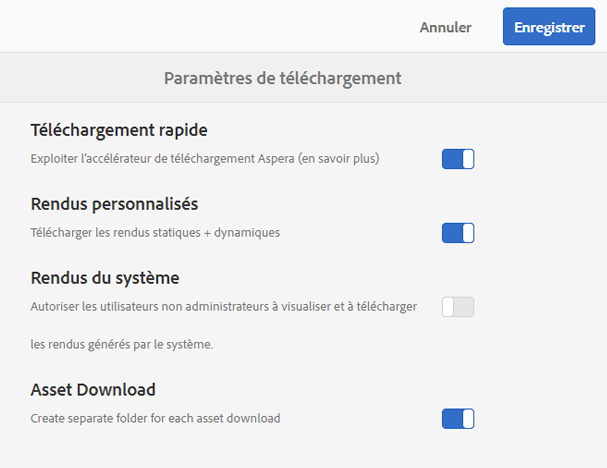
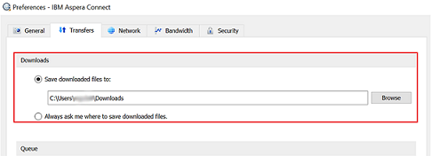

# Accélération des téléchargements de Brand Portal {#guide-to-accelerate-downloads-from-brand-portal}

<!-- This topic is woefully out of date. It talks at length about using a third party application whose URLs have a variety of problems. Topic should either be deleted or updated entirely to not talk about a specific third party application that Adobe has no control over. It also appears that the third party app is NOT free anymore. -->

Adobe Experience Manager Assets Brand Portal permet d’améliorer les performances de téléchargement des fichiers de ressources volumineux par le biais d’une intégration à l’application IBM® Aspera Connect, qui s’installe à la demande. L’application utilise une technologie propriétaire pour supprimer les surcharges TCP et contribue à améliorer la vitesse de transfert des fichiers de ressources. Cette intégration garantit une expérience de téléchargement améliorée.

>[!NOTE]
>
>La vitesse de téléchargement varie selon les utilisateurs, car elle dépend de facteurs tels que la bande passante du réseau, la latence du serveur et l’emplacement géographique des clients.

La configuration **[!UICONTROL Téléchargement rapide]** est activée par défaut, ce qui réduit considérablement le temps nécessaire au téléchargement des fichiers de ressources désirés à partir de Brand Portal.

## Conditions préalables pour accélérer le téléchargement de fichiers {#prerequisites-to-accelerate-file-download}

Pour télécharger les fichiers plus rapidement, vérifiez les points suivants :

* Accédez à **[!UICONTROL Outils]** > **[!UICONTROL Télécharger]** et vérifiez que la configuration **[!UICONTROL Téléchargement rapide]** est activée dans les **[!UICONTROL Paramètres de téléchargement]**.
* Veillez à ce que le port 33001 (TCP et UDP) soit ouvert sur le pare-feu.
* **Installez IBM® Aspera Connect 3.9.9** dans l’extension de votre navigateur à l’aide des droits d’administration ([Téléchargements IBM® Asperra Connect](https://www.ibm.com/support/fixcentral/swg/selectFixes?parent=ibm%7EOther%20software&product=ibm/Other+software/IBM+Aspera+Connect&release=3.9.9&platform=All&function=all)).

>[!NOTE]
>
>Il existe un problème connu avec IBM® Aspera Connect. Le téléchargement rapide ne fonctionne pas avec les versions 3.10 et ultérieures d’IBM® Aspera Connect.

## Domaines de téléchargement {#download-domains}

Vous trouverez ci-après les domaines de téléchargement pour différentes zones géographiques :

| Code de région | Domaine |
|---|---|
| NA OR1 | downloads-na1.brand-portal.adobe.com |
| NA VA5 | downloads-na2.brand-portal.adobe.com |
| EMEA LON5 | downloads-emea1.brand-portal.adobe.com |
| APAC SIN2 | downloads-apac1.brand-portal.adobe.com |

## Exemple de performances de téléchargement à l’aide de l’accélérateur de fichiers {#expected-download-performance-using-file-accelerator}

Le tableau suivant présente les performances de téléchargement d’un fichier de 2 Go à l’aide de l’accélérateur de téléchargement de fichiers Aspera Connect :

*Les résultats observés varient en fonction de facteurs tels que la bande passante du réseau, la latence du serveur et l’emplacement du client, en sachant que le serveur Brand Portal se situe dans l’État de l’Oregon aux États-Unis.*

| Emplacement du client | Latence entre le client et le serveur (millisecondes) | Vitesse mesurée avec l’accélérateur de transfert de fichiers d’Aspera Connect (Mbit/s) | Temps nécessaire pour télécharger un fichier de 2 Go avec l’accélérateur de transfert de fichiers d’Aspera (en secondes) |
|---------------------------|-----------------------------------|---------------------------------------------|-------------------------------------------------------------------------|
| Ouest des États-Unis (Californie du Nord) | 18 | 36 | 57 |
| Ouest des États-Unis (Oregon) | 42 | 36 | 57 |
| Est des États-Unis (Virginie du Nord) | 85 | 35 | 58 |
| Asie-Pacifique (Tokyo) | 124 | 36 | 57 |
| Noida (Inde) | 275 | 13.36 | 153 |
| Sydney | 175 | 29 | 70 |
| Londres | 179 | 35 | 58 |
| Singapour | 196 | 34 | 60 |

## Téléchargement de ressources {#download-assets}

Pour télécharger des ressources plus rapidement à partir de Brand Portal :

1. Connectez-vous à votre client Brand Portal. Par défaut, la vue **[!UICONTROL Fichiers]** s’ouvre et contient toutes les ressources et dossiers publiés.

   Utilisez l’une des méthodes suivantes :

   * Sélectionnez les ressources ou les dossiers que vous souhaitez télécharger. Dans la barre d’outils supérieure, cliquez sur l’icône **[!UICONTROL Télécharger]**.

     

   * Pour télécharger des rendus de ressource spécifiques pour une ressource, survolez celle-ci avec le pointeur et cliquez sur l’icône **[!UICONTROL Télécharger]** disponible dans les miniatures d’action rapide.

     

1. La boîte de dialogue **[!UICONTROL Télécharger]** répertoriant toutes les ressources sélectionnées s’ouvre.

   Pour conserver la hiérarchie des dossiers Brand Portal lors du téléchargement des ressources, cochez la case **[!UICONTROL `Create separate folder for each asset`]** .

   Le bouton de téléchargement indique le nombre d’éléments sélectionnés. Une fois les règles appliquées, cliquez sur **[!UICONTROL Télécharger les éléments]**. Pour en savoir plus sur l’application des règles, voir [Téléchargement des ressources](../using/brand-portal-download-assets.md#download-assets).

   

1. Par défaut, le paramètre **[!UICONTROL Téléchargement rapide]** est activé dans les **[!UICONTROL Paramètres de téléchargement]**. Par conséquent, une zone de confirmation s’affiche pour télécharger des ressources à l’aide d’IBM® Aspera Connect.

   Si vous avez téléchargé des ressources pour la première fois et qu’IBM® Aspera Connect n’est pas installé dans votre navigateur, vous êtes invité à les installer. Si la version existante est obsolète, vous êtes également invité à installer l’[accélérateur de téléchargement Aspera](https://www.ibm.com/support/fixcentral/swg/selectFixes?parent=ibm%7EOther%20software&product=ibm/Other+software/IBM+Aspera+Connect&release=3.9.9&platform=All&function=all).

   

1. **Installer le client d’Aspera Connect**

   Pour installer la configuration du client IBM® Aspera Connect, exécutez la configuration à partir du fichier .msi de l’application cliente IBM® Aspera Connect et suivez l’assistant d’installation.

   

1. Une fois le client installé, actualisez la page du navigateur et relancez les étapes de téléchargement.

1. Pour continuer à utiliser le **[!UICONTROL Téléchargement rapide]**, cliquez sur **[!UICONTROL Autoriser]**. Tous les rendus sélectionnés sont téléchargés dans un dossier ZIP à l’aide d’IBM® Aspera Connect.

   À la fin du téléchargement, une boîte de dialogue affiche l’emplacement où les ressources sont téléchargées sur le système de l’utilisateur ou de l’utilisatrice.

   

   Si vous ne souhaitez pas utiliser IBM® Aspera Connect, cliquez sur **[!UICONTROL Refuser]**. Si le **[!UICONTROL Téléchargement rapide]** est refusé ou échoue, le système renvoie un message d’erreur. Cliquez sur le bouton **[!UICONTROL Téléchargement normal]** pour continuer à télécharger les ressources.

>[!NOTE]
>
>Si le paramètre **[!UICONTROL Téléchargement rapide]** est désactivé par l’administration, les rendus sélectionnés sont directement téléchargés dans un dossier ZIP sans utiliser IBM® Aspera Connect.

<!-- 
On successful completion of the download, a dialog box shows the location where assets are downloaded onto the user's system. If there is a failure, it shows error.

   >[!NOTE]
   >
   >There is a known limitation in Aspera Connect client application that no prompt to select download location appears if **[!UICONTROL Always ask me where to save downloaded files]** is enabled under the tab **[!UICONTROL Transfers]** within **[!UICONTROL Preferences]**. Before any download begins, provide the location in the text box **[!UICONTROL Save downloaded files to]**.

1. Log in to Brand Portal using a supported browser.
1. Browse and select the folders or assets you want to download. From the toolbar at the top, click the **[!UICONTROL Download]** icon. the **[!UICONTROL Download]** dialog appears with the **[!UICONTROL Asset(s)]** and **[!UICONTROL Enable download acceleration]** check boxes selected by default. 

   

   >[!NOTE]
   >
   >The functionality to send email notification with the link to download assets is presently not supported while faster downloads are enabled.

   

1. Click **[!UICONTROL Download]**.

   To speed up the download experience on your Brand Portal tenant account, you need to have Aspera Connect client application installed in your browser's extension.

1. **Download Aspera Connect Client**

   If Aspera Connect client is not installed on your system or the existing Aspera Connect client is out of date, a prompt is displayed on the browser page from where you can download the system-specific Aspera Connect client by selecting **[!UICONTROL Download Latest Version]**.

   

   To download the latest version of Aspera Connect from [https://downloads.asperasoft.com/connect2/](https://downloads.asperasoft.com/connect2/), select **[!UICONTROL Download Now]** and follow the instructions.

1. **Install Aspera Connect Client**

   To install IBM Aspera Connect client setup, run the setup from  .msi  file of IBM Aspera Connect client application and follow the installation wizard.

1. Once the client is successfully installed, refresh the browser page and initiate the download steps again.

   When using Aspera Connect for the first time, the browser prompts to open the link using **[!UICONTROL IBM Aspera Connect]**. To skip this dialog in future, enable **[!UICONTROL Remember my choice for FASP links]**.

   >[!NOTE]
   >
   >This message is different on the different browsers.

1. A dialog box confirms whether to proceed the transfer or not. Select **[!UICONTROL Allow]** to begin.
To skip this dialog in future, enable **[!UICONTROL Use my choice for all connections with this host]**.
Download begins. A dialog box shows the progress of the download. Use the dialog box to **[!UICONTROL pause]**, **[!UICONTROL resume]**, or **[!UICONTROL cancel]** the download.
Aspera Connect application provides an Activity Window on the system where user can view and manage all transfer sessions. For more information, refer [Aspera Connect Client documentation](https://downloads.asperasoft.com/en/documentation/8).

On successful completion of the download, a dialog box shows the location where assets are downloaded onto the user's system. If there is a failure, it shows error.

   >[!NOTE]
   >
   >There is a known limitation in Aspera Connect client application that no prompt to select download location appears if **[!UICONTROL Always ask me where to save downloaded files]** is enabled under the tab **[!UICONTROL Transfers]** within **[!UICONTROL Preferences]**. Before any download begins, provide the location in the text box **[!UICONTROL Save downloaded files to]**.
-->

## Utiliser l’accélérateur de fichiers sur le navigateur Microsoft® Edge {#using-file-accelerator-on-microsoft-edge-browser}

Microsoft® Edge s’exécute en mode protégé amélioré (MPI), ce qui empêche la communication avec le serveur Aspera Connect, sur le même réseau privé ou avec un site approuvé. Par conséquent, une fenêtre contextuelle s’affiche chaque fois qu’une connexion au serveur est établie.

Pour utiliser la fonctionnalité de téléchargement accéléré sur Microsoft® Edge, supprimez le site Brand Portal de la liste Site de confiance.

1. Ouvrez le Panneau de configuration (**[!UICONTROL touche Windows + X]**, puis sélectionnez **[!UICONTROL Panneau de configuration]**).
1. Accédez à **[!UICONTROL Réseau et Internet]** > **[!UICONTROL Options Internet]**. Cliquez sur l’onglet **[!UICONTROL Sécurité]**.
1. Cliquez sur **[!UICONTROL Zone Sites de confiance]**, puis sur **[!UICONTROL Sites]**.
1. Supprimez le site Brand Portal de la liste.

## Préférences du client Aspera Connect {#aspera-connect-client-preferences}

Certaines préférences utiles peuvent être définies dans les préférences du client IBM® Aspera Connect en cliquant avec le bouton droit de la souris sur l’icône et en sélectionnant **[!UICONTROL Préférences]**.

Vous pouvez définir l’emplacement de téléchargement par défaut.

En outre, le client Aspera Connect peut être marqué de sorte qu’il démarre automatiquement au démarrage du système. De plus, le client Connect s’exécute et est disponible pour que le téléchargement démarre plus rapidement.

## Résolution des problèmes liés à l’accélération des téléchargements {#troubleshoot-issues-with-download-acceleration}

Si l’accélération de téléchargement ne fonctionne pas, essayez les suggestions suivantes :

1. Vérifiez que les ports ne sont pas bloqués. Effectuez une recherche Google pour trouver les options permettant de vérifier si les ports sont bloqués, en fonction du système d’exploitation utilisé. <!-- THIS URL IS 404 AND DOES NOT REDIRECT [https://test-connect.asperasoft.com](https://test-connect.asperasoft.com/) from your computer. -->

   Si les ports ne sont pas ouverts, demandez à votre équipe réseau de veiller à ce que les ports 33001 (à la fois TCP et UDP) ne soient pas bloqués dans le pare-feu.

1. Si les ports sont ouverts, vérifiez si votre réseau n&#39;est pas lent en mesurant la bande passante disponible à l&#39;aide de [https://www.speedtest.net/](https://www.speedtest.net/).

   Si la bande passante est faible (1 à 10 Mbit/s) ou en Kbit/s, utilisez les Préférences Aspera et essayez de limiter la bande passante en fonction de celle disponible.

   <!-- The URL in this step is giving a 404 error. 1. To confirm whether the downloads from Aspera demo server are working, use [https://demo.asperasoft.com/aspera/user](https://demo.asperasoft.com/aspera/user).  
   (login:  asperaweb , password:  demoaspera ) -->

1. Si aucune des étapes de dépannage ci-dessus ne fonctionne, désélectionnez l’option Activer l’accélération des téléchargements et utilisez le téléchargement normal.
