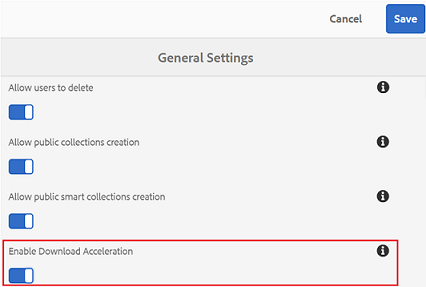
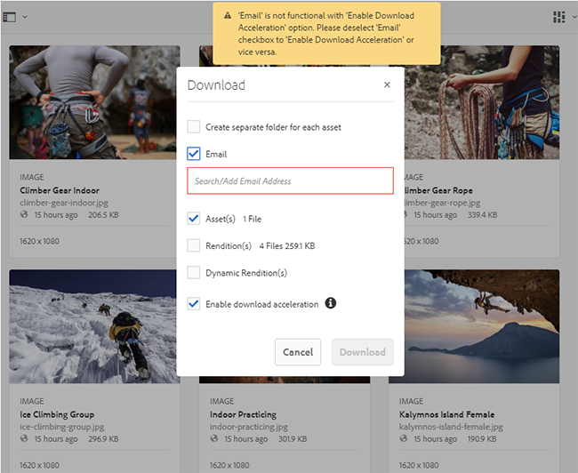

# Guide d’accélération des téléchargements à partir de Brand Portal {#guide-to-accelerate-downloads-from-brand-portal}

Brand Portal prend en charge le téléchargement accéléré de fichiers volumineux en s'intégrant à IBM Aspera Connect, une application d'installation à la demande. L’application utilise une technologie propriétaire pour éliminer les surcharges TCP afin d’améliorer la vitesse de transfert des fichiers. L’expérience de téléchargement est ainsi améliorée. Les utilisateurs situés dans d’autres zones géographiques qui constatent une latence élevée peuvent également bénéficier de cette fonctionnalité.

>[!NOTE]
>
>IBM Aspera Connect permet le téléchargement rapide de fichiers volumineux à partir de Brand Portal et de liens partagés, mais la vitesse de téléchargement peut varier en fonction de divers critères tels que la bande passante du réseau, la latence du serveur et l’emplacement géographique des clients.

To configure specific tenants for accelerated file download, administrators **[!UICONTROL Enable Download Acceleration]** (which is disabled by default)from **General Settings** in the administrative tools panel.

Si cette option est activée, les utilisateurs de Brand Portal peuvent réduire considérablement le temps nécessaire pour télécharger les fichiers de ressources souhaités à partir de Brand Portal ou de liens partagés en installant le client Aspera Connect.

## Conditions préalables pour accélérer le téléchargement de fichiers {#prerequisites-to-accelerate-file-download}

Pour utiliser plus rapidement la fonctionnalité de téléchargement de fichiers, assurez-vous que :

* les ports 33001 (à la fois TCP et UDP) sont ouverts dans le pare-feu par les administrateurs. For more information on the prerequisites to using IBM Aspera Connect, see [Aspera Connect Client documentation](https://downloads.asperasoft.com/en/documentation/8).

   Vous trouverez ci-après les domaines de téléchargement pour différentes zones géographiques :

   | Région | Domaine |
   |---|---|
   | NA OR1 | downloads-na1.brand-portal.adobe.com |
   | NA VA5 | downloads-na2.brand-portal.adobe.com |
   | EMEA LON5 | downloads-emea1.brand-portal.adobe.com |
   | APAC SIN2 | downloads-apac1.brand-portal.adobe.com |

* Les privilèges d’administrateur sont utilisés pour télécharger le module d’installation IBM Aspera Connect, car vous ne pouvez pas installer Aspera Connect sous le compte d’invité.

### Exigences de système et navigateur {#system-and-browser-requirements}

Les exigences de système et navigateur pour Aspera Connect 3.8.0 sont les suivantes :

| Système d’exploitation | Version du SE | Navigateur |  | Bibliothèques requises |
|----------------|----------------------------------------|-------------------|-------|--------------------------|
| Windows | Windows 7, 8, 10 | Chrome | 64 à 66 |  |
|  | Windows Server 2008, R2, 2012 R2, 2016 | Firefox | 57 à 60 |  |
|  |  | Firefox ESR | 52 |  |
|  |  | Internet Explorer | 11 |  |
|  |  | Microsoft Edge | 39-42 |  |
| Mac OS | 10.11 à 10.13 | Chrome | 64 à 66 |  |
|  |  | Firefox | 57 à 60 |  |
|  |  | Firefox ESR | 52 |  |
|  |  | Safari | 11 |  |
| Linux (64 bits) | RHEL 6 à 7 | Chrome | 64 à 66 | OpenSSL 1.0.2g ou version supérieure |
|  | CentOS 6 à 7 |  |  | Mesa EGL |
|  | Debian 7 à 9 |  |  | glib2 2.28 ou version supérieure |
|  | SLES 11 à 12 |  |  |  |
|  | Fedora 26 à 27 |  |  |  |
|  | OpenSUSE 42.3 | Firefox | 57 à 60 |  |
|  | Ubuntu 14 à 17 | Firefox ESR | 52 |  |

Pour consulter le tableau des plates-formes prises en charge par les différentes versions du client de transfert Aspera, voir le [Tableau des plates-formes prises en charge par Aspera Connect](https://www.asperasoft.com/company/support/transfer-clients/).

## Performances de téléchargement attendues à l’aide de l’accélérateur de fichiers {#expected-download-performance-using-file-accelerator}

Les performances de téléchargement attendues pour un fichier 2 Go utilisant l'accélérateur de téléchargement de fichiers Aspera Connect à différents emplacements client sont les suivantes, à l'attention du serveur de portail de marque chez Oregon aux États-Unis :

| Emplacement du client | Latence entre client et serveur | Vitesse avec l’accélérateur de transfert de fichiers Aspera | Temps nécessaire pour télécharger un fichier 2 Go avec Aspera File Transfer Accelerator |
|---------------------------|-----------------------------------|---------------------------------------------|-------------------------------------------------------------------------|
| Ouest des États-Unis (Californie du Nord) | 18 millisecondes | 36 Mo/s. | 57 secondes |
| Ouest des États-Unis (Oregon) | 42 millisecondes | 36 Mo/s. | 57 secondes |
| Est des États-Unis (Virginie du Nord) | 85 millisecondes | 35 Mo/s. | 58 secondes |
| Asie-Pacifique (Tokyo) | 124 millisecondes | 36 Mo/s. | 57 secondes |
| Noida | 275 millisecondes | 13,36 Mo/s. | 153 secondes |
| Sydney | 175 millisecondes | 29 Mo/s. | 70 secondes |
| Londres | 179 millisecondes | 35 Mo/s. | 58 secondes |
| Singapour | 196 millisecondes | 34 Mo/s. | 60 secondes |

>[!NOTE]
>
>Les données citées sont selon les tests effectués en lab et ne sont qu'indicative. Les résultats observés varient en raison de facteurs tels que la bande passante du réseau, la latence du serveur et l'emplacement du client.

## Workflow de téléchargement à l’aide de l’accélérateur de fichiers {#download-workflow-using-file-accelerator}

Pour télécharger des ressources plus rapidement à partir de Brand Portal :

1. Connectez-vous à Brand Portal sur un navigateur recommandé.
2. Recherchez et sélectionnez le fichier de ressource, le dossier ou la collection que vous souhaitez télécharger. Appuyez/cliquez sur l’option de téléchargement.
Download dialog appears with [Enable download acceleration] option selected.
   

   >[!NOTE]
   >
   >La fonctionnalité d'envoi de notifications par courrier électronique avec le lien permettant de télécharger des ressources n'est pas prise en charge, alors que les téléchargements plus rapides sont activés.

   

3. Tap/ click **Download**.
Pour accélérer les téléchargements sur votre compte de client Brand Portal, l’application cliente Aspera Connect doit être installée sur votre système.

4. **Téléchargement du client Aspera Connect**
Si le client Aspera Connect n’est pas installé sur le système ou si le client installé est obsolète, une invite s’affiche sur la page du navigateur pour vous permettre de télécharger le client Aspera Connect spécifique au système en sélectionnant **Télécharger la dernière version**.

   

   To download the latest version of Aspera Connect from [https://downloads.asperasoft.com/connect2/](https://downloads.asperasoft.com/connect2/), select **Download Now** and follow the instructions.

5. **Installez le client
Aspera Connect** pour installer la configuration du client IBM Aspera Connect, exécutez la configuration à partir du fichier. msi de l'application cliente IBM Aspera Connect et suivez l'assistant d'installation.

6. Une fois le client installé, actualisez la page du navigateur et recommencez la procédure de téléchargement ou sélectionnez **Redémarrer** dans la boîte de dialogue **Téléchargement** de la ressource (étape 2).
When using Aspera Connect for the first time, the browser prompts to open the link using **IBM Aspera Connect**. To skip this dialog in future, enable **Remember my choice for FASP links**.

   >[!NOTE]
   >
   >Ce message est différent en fonction du navigateur.

7. Une boîte de dialogue indique si le transfert doit être effectué ou non. Select **Allow** to begin.
To skip this dialog in future, enable **Use my choice for all connections with this host**.
Le téléchargement démarre. Une boîte de dialogue affiche la progression du téléchargement. Use the dialog box to **pause**, **resume**, or **cancel** the download.
L’application Aspera Connect fournit un workflow d’activité sur le système où l’utilisateur peut visualiser et gérer toutes les sessions de transfert. Pour plus d’informations, consultez la [documentation du client Aspera Connect](https://downloads.asperasoft.com/en/documentation/8).

Une fois le téléchargement terminé, une boîte de dialogue affiche l'emplacement où les ressources sont téléchargées sur le système de l'utilisateur. En cas d’échec, une erreur s’affiche.

>[!NOTE]
>
>There is a known limitation in Aspera Connect client application that no prompt to select download location appears if **Always ask me where to save downloaded files** is enabled under the tab **Transfers **within **Preferences**. Before any download begins, provide the location in the text box **Save downloaded files to**.

## Utilisation de l’accélérateur de fichiers sur le navigateur Microsoft Edge {#using-file-accelerator-on-microsoft-edge-browser}

Microsoft Edge s’exécute en mode protégé amélioré (EPM) qui empêche la communication avec le serveur Aspera Connect sur le même réseau privé ou avec un site de confiance. Par conséquent, une fenêtre s’affiche chaque fois qu’une connexion au serveur est établie.

Pour utiliser la fonctionnalité de téléchargement rapide sur Microsoft Edge, supprimez le site du portail de marque de la liste de site approuvée.

1. Open the Control Panel (press **Window key + X**, then select **Control Panel**).
2. Accédez à **Réseau et Internet &gt; Options Internet**. Cliquez sur l’onglet **Sécurité**.
3. Cliquez sur **Zone Sites de confiance**, puis sur **Sites**.
4. Supprimez le site Brand Portal de la liste.

## Préférences du client Aspera Connect {#aspera-connect-client-preferences}

Il existe certaines préférences utiles qui peuvent être définies dans les préférences du client IBM Aspera Connect en cliquant avec le bouton droit sur l’icône et en sélectionnant **Préférences**.

Vous pouvez définir l’emplacement de téléchargement par défaut.

En outre, le client Aspera Connect peut être marqué pour se lancer automatiquement au démarrage du système de manière à ce que le client soit exécuté et disponible pour que le téléchargement démarre plus rapidement.

## Résolution des problèmes relatifs à l’accélération des téléchargements {#troubleshoot-issues-with-download-acceleration}

Si l'accélération de téléchargement ne fonctionne pas pour vous, procédez comme suit pour résoudre les problèmes :

1. Check that ports are not blocked, by visiting [https://test-connect.asperasoft.com](https://test-connect.asperasoft.com/) from your machine.

   Si les ports ne sont pas ouverts, demandez à votre équipe réseau de veiller à ce que les ports 33001 (à la fois TCP et UDP) ne soient pas bloqués dans le pare-feu.

2. If the ports are OK then check if your network is not slow, by measuring the available bandwidth using [https://www.speedtest.net/](https://www.speedtest.net/).

   Si la bande passante est faible (1 à 10 Mbit/s) ou en Kbit/s, utilisez les Préférences Aspera et essayez de limiter la bande passante en fonction de celle disponible.

3. To confirm whether the downloads from Aspera demo server are working, use [https://demo.asperasoft.com/aspera/user](https://demo.asperasoft.com/aspera/user).\
   (connexion : asperaweb, password : demoaspera)

4. Si aucune des étapes de dépannage ci-dessus ne fonctionne, désélectionnez l’option Activer l’accélération des téléchargements et utilisez le téléchargement normal.
