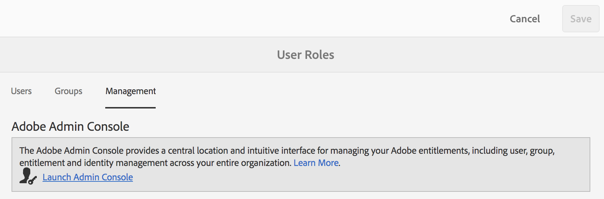
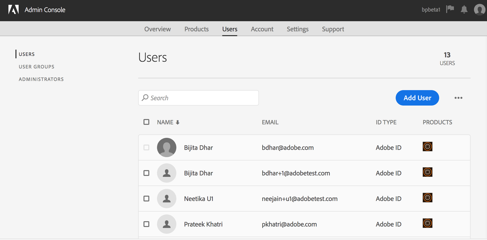
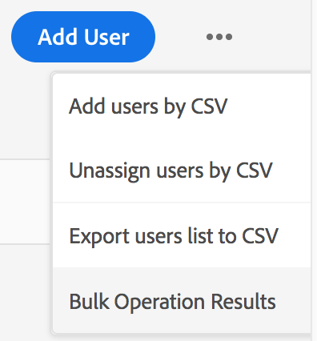

# Manage Users, Groups, and User Roles {#manage-users-groups-and-user-roles}

Les administrateurs peuvent utiliser Adobe Admin Console pour créer des utilisateurs et des profils de produit AEM Assets Brand Portal et gérer leurs rôles à l’aide de l’interface utilisateur de Brand Portal. Ce privilège n’est pas disponible pour les visualisateurs et les éditeurs.

In [[!UICONTROL Admin Console]](http://adminconsole.adobe.com/enterprise/overview), you can view all the products associated with your organization. Un produit peut être n’importe quelle solution Experience Cloud (Adobe Analytics, Adobe Target ou AEM Brand Portal, par exemple). Vous devez choisir le produit AEM Brand Portal et créer des profils de produit.

<!--
Comment Type: draft

<note type="note">

Product Profiles (formerly known as product configurations*). 

* The nomenclature has changed from product configurations to product profiles in the new Adobe Admin Console.

</note>
-->

Ces profils de produit sont synchronisés avec l'interface utilisateur du portail de marque toutes les 8 heures et visibles sous forme de groupes dans Brand Portal. Après avoir ajouté des utilisateurs et créé des profils de produit et ajouté des utilisateurs à ces profils de produit, vous pouvez affecter des rôles aux utilisateurs et aux groupes dans le portail de marque.

>[!NOTE]
>
>To create groups in Brand Portal, from Adobe [!UICONTROL Admin Console], use **[!UICONTROL Products &gt; Product Profiles]**, instead of **[!UICONTROL User page &gt; User Groups]**. Product profiles in Adobe [!UICONTROL Admin Console] are used to create groups in Brand Portal.

## Ajout d’un utilisateur {#add-a-user}

If you are a product administrator, use Adobe [[!UICONTROL Admin Console]](http://adminconsole.adobe.com/enterprise/overview) to create users and assign them to product profiles (*formerly known as product configurations*), which show as groups in Brand Portal. Vous pouvez utiliser des groupes pour effectuer des opérations en bloc comme gérer les rôles et partager des ressources.

>[!NOTE]
Les nouveaux utilisateurs n’ayant pas accès à Brand Portal peuvent en demander l’accès dans l’écran de connexion de Brand Portal. Pour plus d’informations, voir [Demande d’accès à Brand Portal](../using/brand-portal.md#request-access-to-brand-portal). After you receive access request notifications in your notification area, click the relevant notification and then click **[!UICONTROL Grant Access]**. Vous pouvez également suivre le lien figurant dans le courrier électronique de demande d'accès reçu. Next, to add a user through [Adobe [!UICONTROL Admin Console]](http://adminconsole.adobe.com/enterprise/overview), follow Steps 4-7 in the procedure below.

>[!NOTE]
You can login to [Adobe [!UICONTROL Admin Console]](http://adminconsole.adobe.com/enterprise/overview) directly or from Brand Portal. Si vous vous connectez directement, suivez les étapes 4-7 de la procédure ci-dessous pour ajouter un utilisateur.

1. Dans la barre d'outils AEM en haut, cliquez sur le logo Adobe pour accéder aux outils d'administration.

   

2. Dans le panneau des outils d’administration, cliquez sur **[!UICONTROL Utilisateurs]**.

   

3. In the [!UICONTROL User Roles] page, click the **[!UICONTROL Management]** tab, then click **[!UICONTROL Launch Admin Console]**.

   

4. Dans Admin Console, effectuez l’une des opérations suivantes pour créer un utilisateur :

   * Dans la barre d’outils supérieure, cliquez sur **[!UICONTROL Présentation]**. In the [!UICONTROL Overview] page, click **[!UICONTROL Assign Users]** from the Brand Portal product card.
   

   * Dans la barre d’outils supérieure, cliquez sur **[!UICONTROL Utilisateurs]**. In the [!UICONTROL Users] page, [!UICONTROL Users] in the left rail is selected by default. Click **[!UICONTROL Add User]**.
   

5. Dans la boîte de dialogue Ajouter un utilisateur, saisissez l’e-mail de l’utilisateur que vous souhaitez ajouter ou sélectionnez l’utilisateur dans la liste des suggestions qui apparaît dès que vous commencez à taper.

   

6. Affectez l’utilisateur à au moins un profil de produit (auparavant appelé configurations de produit) afin qu’il puisse accéder à Brand Portal. Sélectionnez le profil de produit adéquat dans le champ **[!UICONTROL Sélectionnez un profil pour ce produit].**
7. Cliquez sur **[!UICONTROL Enregistrer]**. Un e-mail de bienvenue est envoyé à l’utilisateur que vous avez ajouté. The invited user can access Brand Portal by clicking the link in the welcome email and signing in using an [!UICONTROL Adobe ID]. Pour plus d’informations, voir [Première connexion](../using/brand-portal-onboarding.md).

   >[!NOTE]
   If a user is unable to log on to Brand Portal, the Administrator of the organization should visit Adobe [!UICONTROL Admin Console] and check whether the user is present and has been added to at least one product profile.

   Pour plus d’informations sur l’octroi de privilèges administratifs, voir [Octroi de privilèges d’administrateur aux utilisateurs](../using/brand-portal-adding-users.md#provideadministratorprivilegestousers).

## Ajout d’un profil de produit {#add-a-product-profile}

Product profiles (formerly known as product configurations) in [!UICONTROL Admin Console] are used to create groups in Brand Portal so that you can perform bulk operations such as role management and asset sharing in Brand Portal. **Brand Portal** est le profil de produit disponible par défaut. Vous pouvez créer d’autres profils de produit et ajouter des utilisateurs à ces derniers.

>[!NOTE]
You can login to [[!UICONTROL Admin Console]](http://adminconsole.adobe.com/enterprise/overview) directly or from Brand Portal. If you login to [!UICONTROL Admin Console] directly, follow Steps 4-7 in the procedure below to add a product profile.

1. Dans la barre d'outils AEM en haut, cliquez sur le logo Adobe pour accéder aux outils d'administration.

   

2. Dans le panneau des outils d’administration, cliquez sur **[!UICONTROL Utilisateurs]**.

   

3. In the [!UICONTROL User Roles] page, click the **[!UICONTROL Management]** tab, then click **[!UICONTROL Launch Admin Console]**.

   

4. Dans la barre d’outils supérieure, cliquez sur les **[!UICONTROL Produits]**.
5. In the [!UICONTROL Products] page, [!UICONTROL Product Profiles] is selected by default. Cliquez sur **[!UICONTROL Nouveau profil]**.

   

6. Dans la page [!UICONTROL Créer un nouveau profil], indiquez le nom du profil, le nom d’affichage, la description du profil, puis choisissez si vous souhaitez informer les utilisateurs par e-mail lorsqu’ils sont ajoutés ou supprimés du profil.

   

7. Cliquez sur **[!UICONTROL Terminé]**. The product configuration group, for example **[!UICONTROL Sales group]**, is added to Brand Portal.

   

## Ajout d’utilisateurs à un profil de produit {#add-users-to-a-product-profile}

To add users to a Brand Portal group, add them to the corresponding product profile (formerly known as product configurations) in [!UICONTROL Admin Console]. Vous pouvez ajouter des utilisateurs individuellement ou en bloc.

>[!NOTE]
You can login to [[!UICONTROL Admin Console]](http://adminconsole.adobe.com/enterprise/overview) directly or from Brand Portal. Si vous vous connectez directement à la console d'administration, suivez les étapes 4-7 de la procédure ci-dessous pour ajouter des utilisateurs à un profil de produit.

1. Dans la barre d'outils AEM en haut, cliquez sur le logo Adobe pour accéder aux outils d'administration.

   

2. Dans le panneau des outils d’administration, cliquez sur **[!UICONTROL Utilisateurs]**.

   

3. In the [!UICONTROL User Roles] page, click the **[!UICONTROL Management]** tab, then click **[!UICONTROL Launch Admin Console]**.

   ![Lancement [!DNL Admin Console]](assets/launch_admin_console.png)

4. Dans la barre d’outils supérieure, cliquez sur les **[!UICONTROL Produits]**.
5. In the [!UICONTROL Products] page, [!UICONTROL Product Profiles] is selected by default. Open the product profile to which you want to add a user, for example, [!UICONTROL Sales group].

   

6. Pour ajouter des utilisateurs individuels au profil de produit, procédez comme suit :

   * Click **[!UICONTROL Add User]**.
   

   * In the [!UICONTROL Add User to Sales group] page, type the email ID of the user you want to add or select the user from the list of suggestions that appear as you type.
   

   * Cliquez sur **[!UICONTROL Enregistrer]**.

7. Pour ajouter des utilisateurs en bloc au profil de produit, procédez comme suit :

   * Choose ellipsis (**[!UICONTROL ...) &gt; Add users by CSV]**.
   

   * In the **[!UICONTROL Add Users by CSV]** page, download a CSV template or drag-and-drop a CSV file.
   

   * Cliquez sur **[!UICONTROL Charger]**.
   Si vous avez ajouté des utilisateurs au profil de produit par défaut, c'est-à-dire le portail de marque, un courriel de bienvenue est envoyé à l'ID de courrier électronique des utilisateurs que vous avez ajoutés. The invited users can access Brand Portal by clicking the link in the welcome email and signing in using an [!UICONTROL Adobe ID]. Pour plus d’informations, voir [Première connexion](../using/brand-portal-onboarding.md).

   Les utilisateurs ajoutés à un nouveau profil de produit ou à un profil de produit personnalisé ne reçoivent pas de notifications par e-mail.

## Octroi de privilèges d’administrateur aux utilisateurs {#provide-administrator-privileges-to-users}

Vous pouvez accorder à un utilisateur de Brand Portal le privilège d’administrateur système ou d’administrateur de produit. Do not provide other administrative rights available in [!UICONTROL Admin Console], such as product profile administrator, user group administrator, and support administrator. Pour en savoir plus sur ces rôles, voir [Rôles administratifs](https://helpx.adobe.com/enterprise/using/admin-roles.html).

>[!NOTE]
You can login to [[!UICONTROL Admin Console]](https://adminconsole.adobe.com/enterprise/overview) directly or from Brand Portal. If you login to [!UICONTROL Admin Console] directly, follow Steps 4-8 in the procedure below to add a user to a product profile.

1. Dans la barre d'outils AEM en haut, cliquez sur le logo Adobe pour accéder aux outils d'administration.

   

2. Dans le panneau des outils d’administration, cliquez sur **[!UICONTROL Utilisateurs]**.

   

3. In the [!UICONTROL User Roles] page, click the **[!UICONTROL Management]** tab, then click **[!UICONTROL Launch Admin Console]**.

   

4. Dans la barre d’outils supérieure, cliquez sur **[!UICONTROL Utilisateurs]**.
5. In the [!UICONTROL Users] page, [!UICONTROL Users] in the left rail is selected by default. Cliquez sur le nom de l’utilisateur à qui vous souhaitez accorder des privilèges d’administrateur.

   

6. In the user profile page, locate the **[!UICONTROL Administrative Rights]** section at the bottom, and choose ellipsis (**[!UICONTROL ... &gt; Edit admin rights]**.
   

7. Dans la page [!UICONTROL Modifier l’administrateur], sélectionnez Administrateur système ou Administrateur de produit.

   

   >[!NOTE]
   Le portail de marque ne prend en charge que les rôles Administrateur système et Administrateur du produit.
   Adobe recommande d’éviter l’utilisation du rôle Administrateur système, car il accorde des privilèges d’administrateur à l’échelle de l’entreprise pour tous les produits d’une entreprise. Par exemple, un administrateur système d'une organisation qui comprend trois produits Marketing Cloud dispose de l'ensemble des privilèges pour les trois produits. Seul un administrateur système peut configurer AEM Assets afin que les ressources puissent être publiées à partir d'AEM Assets vers Brand Portal. For more information, see [Configure AEM Assets integration with Brand Portal](https://helpx.adobe.com/experience-manager/6-5/assets/using/brand-portal-configuring-integration.html).
   En revanche, le rôle Administrateur de produit accorde des privilèges d’administrateur pour un produit spécifique uniquement. Si vous souhaitez appliquer un contrôle d'accès plus granulaire au portail de marque, utilisez le rôle Administrateur produit et sélectionnez le produit comme Portail de marque.

   >[!NOTE]
   Brand Portal ne prend pas en charge les privilèges d’administrateur de profil de produit (auparavant appelé administrateur de configuration). Évitez d’attribuer des droits d’administrateur de profil de produit à un utilisateur.

8. Examinez la sélection du type d’administrateur, puis cliquez sur **[!UICONTROL Enregistrer]**.

   >[!NOTE]
   Pour retirer les privilèges d’administrateur d’un utilisateur, apportez les modifications nécessaires dans la page [!UICONTROL Modifier l’administrateur], puis cliquez sur **[!UICONTROL Enregistrer]**.

## Gestion des rôles utilisateur {#manage-user-roles}

Un administrateur peut modifier les rôles des utilisateurs dans Brand Portal.

En plus du rôle Administrateur, Brand Portal prend en charge les rôles suivants :

* [!UICONTROL Observateur] : les utilisateurs disposant de ce rôle peuvent afficher les fichiers et dossiers qu’un administrateur partage avec eux. Les utilisateurs peuvent également rechercher des fichiers et les télécharger. However, Viewers cannot share content (files, folders, [!UICONTROL collections]) with other users.
* [!UICONTROL Éditeur] : les utilisateurs disposant de ce rôle possèdent tous les privilèges d’un visualisateur. In addition, Editors can share content (folders, [!UICONTROL collections], links) with other users.

1. Dans la barre d'outils AEM en haut, cliquez sur le logo Adobe pour accéder aux outils d'administration.

   

2. Dans le panneau des outils d’administration, cliquez sur **[!UICONTROL Utilisateurs]**.

   

3. In the [!UICONTROL User Roles] page, the [!UICONTROL Users] tab is selected by default. For the user whose role you want to change, select **[!UICONTROL Editor]** or **[!UICONTROL Viewer]** from the **[!UICONTROL Role]** drop-down.

   

   Pour modifier simultanément le rôle de plusieurs utilisateurs, sélectionnez les utilisateurs et le rôle adéquat dans la liste déroulante **[!UICONTROL Rôle].**

   >[!NOTE]
   La liste [!UICONTROL Rôle] des utilisateurs Administrateur est désactivée. Vous ne pouvez pas sélectionner ces utilisateurs pour modifier leur rôle.

   >[!NOTE]
   Le rôle utilisateur est également désactivé si l’utilisateur est membre du groupe Éditeur. Pour retirer les privilèges d’édition d’un utilisateur, supprimez l’utilisateur du groupe Éditeur ou modifiez le rôle du groupe entier en Visualisateur.

4. Cliquez sur **[!UICONTROL Enregistrer]**. Le rôle est modifié pour l’utilisateur correspondant. Si vous avez sélectionné plusieurs utilisateurs, les rôles de tous les utilisateurs sont modifiés simultanément.

   >[!NOTE]
   Changes in user permissions are reflected in the [!UICONTROL User Roles] page only after the users re-login to Brand Portal.

## Gestion des rôles et des privilèges des groupes {#manage-group-roles-and-privileges}

An Administrator can associate specific privileges with a [group](../using/brand-portal-adding-users.md#main-pars-title-278567577) of users on Brand Portal. The [!UICONTROL Groups] tab on the [!UICONTROL User Roles] page allows administrators to:

* d’attribuer des rôles aux groupes d’utilisateurs ;
* Restreignez les groupes d’utilisateurs au téléchargement des rendus originaux des fichiers images (.jpeg, .tiff, .png, .bmp, .gif, .pjpeg, x-portable-anymap, x-portable-bitmap, x-portable-graymap, x-portable-pixmap, x-rgb, x-xbitmap, x-xpixmap, x-icon, image/photoshop, image/x-photoshop, .psd, image/vnd.adobe.photoshop) à partir de Brand Portal.

>[!NOTE]
Pour les ressources partagées sous forme de liens, l’autorisation d’accès aux rendus originaux des fichiers images s’applique selon les autorisations de l’utilisateur qui partage les ressources.

Pour modifier le rôle et le droit d'accès aux rendus initiaux pour des membres de groupe spécifiques, procédez comme suit :

1. On the [!UICONTROL User Roles] page, navigate to the **[!UICONTROL Groups]** tab.
2. Sélectionnez les groupes dont vous souhaitez modifier les rôles.
3. Sélectionnez le rôle adéquat dans la liste déroulante [!UICONTROL Rôle].

   To allow the members of a group to have access to original renditions of image files (.jpeg, .tiff, .png, .bmp, .gif, .pjpeg, x-portable-anymap, x-portable-bitmap, x-portable-graymap, x-portable-pixmap, x-rgb, x-xbitmap, x-xpixmap, x-icon, image/photoshop, image/x-photoshop, .psd, image/vnd.adobe.photoshop) which they download from the portal or shared link, keep the [!UICONTROL Access to  Original] option selected for that group. By default, [!UICONTROL Access to Original] option is selected for all the users. Pour empêcher un groupe d’utilisateurs d’accéder aux rendus originaux, désélectionnez l’option correspondant à ce groupe.

   

   >[!NOTE]
   Si un utilisateur est ajouté à plusieurs groupes et si l'un de ces groupes possède des restrictions, les restrictions s'appliquent à cet utilisateur.
   En outre, les restrictions pour accéder aux rendus originaux des fichiers images ne s’appliquent pas aux administrateurs, même s’ils sont des membres de groupes restreints.

4. Cliquez sur **[!UICONTROL Enregistrer]**. Le rôle est modifié pour les groupes correspondants.

   >[!NOTE]
   L’association utilisateur/groupe ou l’appartenance d’un utilisateur à un groupe est synchronisée dans Brand Portal toutes les 8 heures. Les modifications apportées aux rôles des utilisateurs ou des groupes sont prises en compte après l’exécution de la prochaine tâche de synchronisation.
