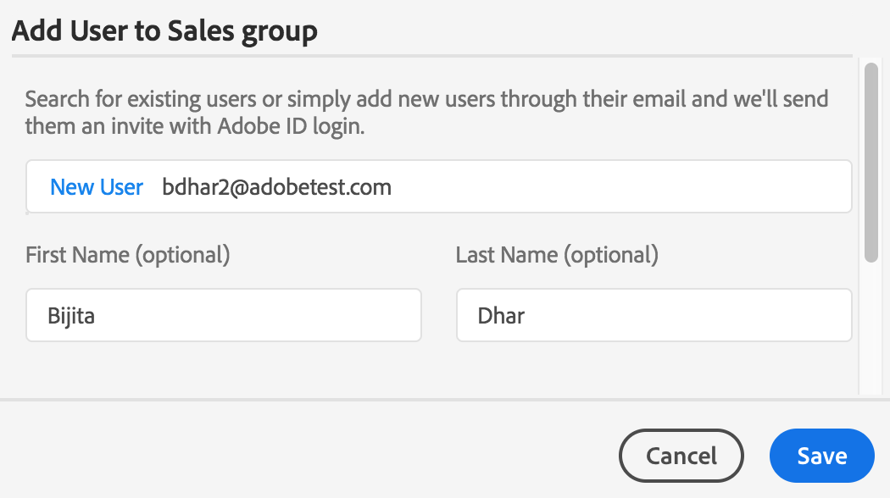

# Gestion des utilisateurs, des groupes et des rôles utilisateur {#manage-users-groups-and-user-roles}

Les administrateurs peuvent utiliser Adobe Admin Console pour créer des utilisateurs et des profils de produit Experience Manager Assets Brand Portal et gérer leurs rôles à l’aide de l’interface utilisateur de Brand Portal. Ce privilège n’est pas disponible pour les observateurs et les éditeurs.

Dans [[!UICONTROL Admin Console]](https://adminconsole.adobe.com/enterprise/overview), vous pouvez visualiser tous les produits associés à votre entreprise. Un produit peut être n’importe quelle solution Experience Cloud (Adobe Analytics, Adobe Target ou Experience Manager Assets Brand Portal, par exemple). Vous devez choisir le produit AEM Brand Portal et créer des profils de produit.

<!--
Comment Type: draft

<note type="note">

Product Profiles (formerly known as product configurations*). 

* The nomenclature has changed from product configurations to product profiles in the new Adobe Admin Console.

</note>
-->

Ces profils de produit sont synchronisés avec l’interface utilisateur de Brand Portal toutes les 8 heures et sont visibles sous la forme de groupes dans Brand Portal. Une fois que vous avez ajouté des utilisateurs, créé des profils de produit et ajouté des utilisateurs à ces derniers, vous pouvez attribuer des rôles aux utilisateurs et aux groupes dans Brand Portal.

>[!NOTE]
>
>Pour créer des groupes dans Brand Portal, dans [!UICONTROL Admin Console], utilisez **[!UICONTROL Produits > Profils de produit]** au lieu de la page **[!UICONTROL Utilisateur > Groupes d’utilisateurs]**. Dans Adobe [!UICONTROL Admin Console], les profils de produit servent à créer des groupes dans Brand Portal.

## Ajout d’un utilisateur {#add-a-user}

Si vous êtes administrateur de produit, utilisez Adobe [[!UICONTROL Admin Console]](https://adminconsole.adobe.com/enterprise/overview) pour créer des utilisateurs et les affecter à des profils de produit (*auparavant appelés configurations de produit*), qui s’affichent sous la forme de groupes dans Brand Portal. Vous pouvez utiliser des groupes pour effectuer des opérations en bloc comme gérer les rôles et partager des ressources.

>[!NOTE]
>
>Les nouveaux utilisateurs n’ayant pas accès à Brand Portal peuvent en demander l’accès dans l’écran de connexion de Brand Portal. Pour plus d’informations, voir [Demande d’accès à Brand Portal](../using/brand-portal.md#request-access-to-brand-portal). Une fois que vous avez reçu les notifications de demande d’accès dans votre zone de notification, cliquez sur la notification adéquate, puis sur **[!UICONTROL Autoriser l’accès]**. Vous pouvez également cliquer sur le lien figurant dans l’e-mail de demande d’accès reçu. Ensuite, pour ajouter un utilisateur par le biais d’[Adobe [!UICONTROL Admin Console]](https://adminconsole.adobe.com/enterprise/overview), suivez les étapes 4 à 7 de la procédure ci-dessous.

>[!NOTE]
>
>Vous pouvez vous connecter à [Adobe [!UICONTROL Admin Console]](https://adminconsole.adobe.com/enterprise/overview) directement ou à partir de Brand Portal. Si vous vous connectez directement, suivez les étapes 4 à 7 de la procédure d’ajout d’un utilisateur présentée ci-dessous.

1. Dans la barre d’outils AEM supérieure, cliquez sur le logo Adobe pour accéder aux outils d’administration.

   

1. Dans le panneau des outils d’administration, cliquez sur **[!UICONTROL Utilisateurs]**.

   

1. Dans la page [!UICONTROL Rôles utilisateur], cliquez sur l’onglet **[!UICONTROL Gestion]**, puis sur **[!UICONTROL Lancer Admin Console]**.

   

1. Dans Admin Console, effectuez l’une des opérations suivantes pour créer un utilisateur :

   * Dans la barre d’outils supérieure, cliquez sur **[!UICONTROL Aperçu]**. Sur la page [!UICONTROL Aperçu], cliquez sur **[!UICONTROL Affecter des utilisateurs]** depuis la carte du produit Brand Portal.

   

   * Dans la barre d’outils supérieure, cliquez sur **[!UICONTROL Utilisateurs]**. Dans la page [!UICONTROL Utilisateurs], l’option [!UICONTROL Utilisateurs] est sélectionnée par défaut dans le rail gauche. Cliquez sur **[!UICONTROL Ajouter un utilisateur]**.

   

1. Dans la boîte de dialogue Ajouter un utilisateur, saisissez l’e-mail de l’utilisateur que vous souhaitez ajouter ou sélectionnez l’utilisateur dans la liste des suggestions qui apparaît dès que vous commencez à taper.

   

1. Affectez l’utilisateur à au moins un profil de produit (auparavant appelé configurations de produit) afin qu’il puisse accéder à Brand Portal. Sélectionnez le profil de produit adéquat dans le champ **[!UICONTROL Sélectionnez un profil pour ce produit]**.
1. Cliquez sur **[!UICONTROL Enregistrer]**. Un e-mail de bienvenue est envoyé à l’utilisateur qui vient d’être ajouté. L’utilisateur invité peut cliquer sur le lien contenu dans l’e-mail de bienvenue pour accéder à Brand Portal. L’utilisateur peut se connecter à l’aide de l’ID de courrier électronique ([!UICONTROL Adobe ID], [!UICONTROL Enterprise ID] ou [!UICONTROL Federated ID]) configuré dans Admin Console. Pour plus d’informations, voir [Première connexion](../using/brand-portal-onboarding.md).

   >[!NOTE]
   >
   >Si un utilisateur ne parvient pas à se connecter à Brand Portal, l’administrateur de l’entreprise doit accéder à Adobe [!UICONTROL Admin Console] pour vérifier que l’utilisateur est présent et qu’il a été ajouté à au moins un profil de produit.

   Pour plus d’informations sur l’octroi de privilèges d’administrateur, voir [Octroi de privilèges d’administrateur aux utilisateurs](../using/brand-portal-adding-users.md#provideadministratorprivilegestousers).

## Ajout d’un profil de produit {#add-a-product-profile}

Dans [!UICONTROL Admin Console], les profils de produit (auparavant appelés configurations de produit) servent à créer des groupes dans Brand Portal afin d’effectuer des opérations en bloc comme gérer les rôles et partager des ressources dans Brand Portal. **Brand Portal** est le profil de produit disponible par défaut. Vous pouvez créer d’autres profils de produit et ajouter des utilisateurs à ces derniers.

>[!NOTE]
>
>Vous pouvez vous connecter à [[!UICONTROL Admin Console]](https://adminconsole.adobe.com/enterprise/overview) directement ou à partir de Brand Portal. Si vous vous connectez à [!UICONTROL Admin Console] directement, suivez les étapes 4 à 7 de la procédure ci-après pour ajouter un profil de produit.

1. Dans la barre d’outils AEM supérieure, cliquez sur le logo Adobe pour accéder aux outils d’administration.

   

1. Dans le panneau des outils d’administration, cliquez sur **[!UICONTROL Utilisateurs]**.

   

1. Dans la page [!UICONTROL Rôles utilisateur], cliquez sur l’onglet **[!UICONTROL Gestion]**, puis sur **[!UICONTROL Lancer Admin Console]**.

   

1. Dans la barre d’outils supérieure, cliquez sur **[!UICONTROL Produits]**.
1. Dans la page [!UICONTROL Produits], l’option [!UICONTROL Profils de produit] est sélectionnée par défaut. Cliquez sur **[!UICONTROL Nouveau profil]**.

   

1. Dans la page [!UICONTROL Créer un nouveau profil], indiquez le nom du profil, le nom d’affichage, la description du profil, puis choisissez si vous souhaitez informer les utilisateurs par e-mail lorsqu’ils sont ajoutés ou supprimés du profil.

   

1. Cliquez sur **[!UICONTROL Terminé]**. Le groupe de configuration de produit, par exemple **[!UICONTROL Groupe des ventes]**, est ajouté à Brand Portal.

   

## Ajout d’utilisateurs à un profil de produit {#add-users-to-a-product-profile}

Pour ajouter des utilisateurs à un groupe Brand Portal, ajoutez-les au profil de produit (appelé auparavant configuration de produit) correspondant dans [!UICONTROL Admin Console]. Vous pouvez ajouter des utilisateurs individuellement ou en bloc.

>[!NOTE]
>
>Vous pouvez vous connecter à [[!UICONTROL Admin Console]](https://adminconsole.adobe.com/enterprise/overview) directement ou à partir de Brand Portal. Si vous vous connectez à Admin Console directement, suivez les étapes 4 à 7 de la procédure ci-après pour ajouter des utilisateurs à un profil de produit.

1. Dans la barre d’outils supérieure, cliquez sur le logo Experience Manager pour accéder aux outils d’administration.

   

1. Dans le panneau des outils d’administration, cliquez sur **[!UICONTROL Utilisateurs]**.

   

1. Dans la page [!UICONTROL Rôles utilisateur], cliquez sur l’onglet **[!UICONTROL Gestion]**, puis sur **[!UICONTROL Lancer Admin Console]**.

   ![Lancement d’[!DNL Admin Console]](assets/launch_admin_console.png)

1. Dans la barre d’outils supérieure, cliquez sur **[!UICONTROL Produits]**.
1. Dans la page [!UICONTROL Produits], l’option [!UICONTROL Profils de produit] est sélectionnée par défaut. Ouvrez le profil de produit auquel vous souhaitez ajouter un utilisateur, par exemple [!UICONTROL Groupe des ventes].

   

1. Pour ajouter des utilisateurs individuels au profil de produit, procédez comme suit :

   * Cliquez sur **[!UICONTROL Ajouter un utilisateur]**.

   

   * Dans la page [!UICONTROL Ajouter un utilisateur au groupe des ventes], saisissez l’e-mail de l’utilisateur que vous souhaitez ajouter ou sélectionnez-le dans la liste des suggestions qui apparaît lorsque vous commencez à taper.

   

   * Cliquez sur **[!UICONTROL Enregistrer]**.

1. Pour ajouter des utilisateurs en bloc au profil de produit, procédez comme suit :

   * Sélectionnez les points de suspension **[!UICONTROL (…) > Ajouter utilisateurs par CSV]**.

   

   * Dans la page **[!UICONTROL Ajouter utilisateurs par CSV]**, téléchargez un modèle CSV ou glissez-déposez un fichier CSV.

   

   * Cliquez sur **[!UICONTROL Charger]**.
   Si vous avez ajouté des utilisateurs au profil de produit par défaut, c’est-à-dire Brand Portal, un e-mail de bienvenue est envoyé à l’adresse e-mail des utilisateurs ajoutés. Les utilisateurs invités peuvent accéder à Brand Portal en cliquant sur le lien contenu dans l’e-mail de bienvenue et en se connectant à l’aide d’un [!UICONTROL Adobe ID]. Pour plus d’informations, voir [Première connexion](../using/brand-portal-onboarding.md).

   Les utilisateurs ajoutés à un nouveau profil de produit ou à un profil de produit personnalisé ne reçoivent pas de notifications par e-mail.

## Octroi de privilèges d’administrateur aux utilisateurs {#provide-administrator-privileges-to-users}

Vous pouvez accorder à un utilisateur de Brand Portal le privilège d’administrateur système ou d’administrateur de produit. N’octroyez pas d’autres droits d’administration disponibles dans [!UICONTROL Admin Console], tels qu’administrateur de profil de produit, administrateur de groupe d’utilisateurs et administrateur de support. Pour en savoir plus sur ces rôles, voir [Rôles administratifs](https://helpx.adobe.com/fr/enterprise/using/admin-roles.html).

>[!NOTE]
>
>Vous pouvez vous connecter à [[!UICONTROL Admin Console]](https://adminconsole.adobe.com/enterprise/overview) directement ou à partir de Brand Portal. Si vous vous connectez à [!UICONTROL Admin Console] directement, suivez les étapes 4 à 8 de la procédure ci-après pour ajouter un utilisateur à un profil de produit.

1. Dans la barre d’outils AEM supérieure, cliquez sur le logo Adobe pour accéder aux outils d’administration.

   

1. Dans le panneau des outils d’administration, cliquez sur **[!UICONTROL Utilisateurs]**.

   

1. Dans la page [!UICONTROL Rôles utilisateur], cliquez sur l’onglet **[!UICONTROL Gestion]**, puis sur **[!UICONTROL Lancer Admin Console]**.

   

1. Dans la barre d’outils supérieure, cliquez sur **[!UICONTROL Utilisateurs]**.
1. Dans la page [!UICONTROL Utilisateurs], l’option [!UICONTROL Utilisateurs] est sélectionnée par défaut dans le rail gauche. Cliquez sur le nom de l’utilisateur à qui vous souhaitez accorder des privilèges d’administrateur.

   

1. Dans la page du profil utilisateur, recherchez la section **[!UICONTROL Droits d’administration]** dans la partie inférieure, puis sélectionnez les points de suspension **[!UICONTROL (…) > Modifier les droits de l’administrateur]**.
   

1. Dans la page [!UICONTROL Modifier l’administrateur], sélectionnez Administrateur système ou Administrateur de produit.

   

   >[!NOTE]
   >
   >Brand Portal ne prend en charge que les rôles Administrateur système et Administrateur de produit.
   >
   >Adobe recommande d’éviter l’utilisation du rôle Administrateur système, car il accorde des privilèges d’administrateur à l’échelle de l’entreprise pour tous les produits d’une entreprise. Par exemple, un administrateur système d’une entreprise qui comprend trois produits Marketing Cloud possède l’ensemble des privilèges pour les trois produits. Seul un administrateur système peut configurer Experience Manager Assets pour que les ressources puissent être publiées d’Experience Manager Assets sur Brand Portal. Pour plus d’informations, voir [Configuration d’Experience Manager Assets avec Brand Portal](../using/configure-aem-assets-with-brand-portal.md).
   >
   >En revanche, le rôle Administrateur de produit accorde des privilèges d’administrateur uniquement pour un produit spécifique. Si vous souhaitez appliquer un contrôle d’accès plus précis dans Brand Portal, utilisez le rôle Administrateur de produit et sélectionnez le produit Brand Portal.

   >[!NOTE]
   >
   >Brand Portal ne prend pas en charge les privilèges d’administrateur de profil de produit (auparavant appelé administrateur de configuration). Évitez d’attribuer des droits d’administrateur de profil de produit à un utilisateur.

1. Vérifiez la sélection du type d’administrateur, puis cliquez sur **[!UICONTROL Enregistrer]**.

   >[!NOTE]
   >
   >Pour retirer les privilèges d’administrateur d’un utilisateur, apportez les modifications nécessaires sur la page **[!UICONTROL Modifier l’administrateur]**, puis cliquez sur **[!UICONTROL Enregistrer]**.

## Gestion des rôles utilisateur {#manage-user-roles}

Un administrateur peut modifier les rôles des utilisateurs dans Brand Portal.

En plus du rôle Administrateur, Brand Portal prend en charge les rôles suivants :

* [!UICONTROL Observateur] : les utilisateurs disposant de ce rôle peuvent afficher les fichiers et dossiers qu’un administrateur partage avec eux. Les observateurs peuvent également rechercher et télécharger des ressources. Toutefois, ils ne peuvent pas partager de contenu (fichiers, dossiers et [!UICONTROL collections]) avec d’autres utilisateurs.
* [!UICONTROL Éditeur] : les utilisateurs disposant de ce rôle possèdent tous les privilèges d’un observateur. En complément, les éditeurs peuvent partager du contenu (dossiers, [!UICONTROL collections] et liens) avec d’autres utilisateurs.

1. Dans la barre d’outils AEM supérieure, cliquez sur le logo Adobe pour accéder aux outils d’administration.

   

1. Dans le panneau des outils d’administration, cliquez sur **[!UICONTROL Utilisateurs]**.

   

1. Dans la page [!UICONTROL Rôles utilisateur], l’onglet [!UICONTROL Utilisateurs] est sélectionné par défaut. Pour l’utilisateur dont vous souhaitez modifier le rôle, sélectionnez **[!UICONTROL Éditeur]** ou **[!UICONTROL Observateur]** dans la liste déroulante **[!UICONTROL Rôle]**.

   

   Pour modifier simultanément le rôle de plusieurs utilisateurs, sélectionnez les utilisateurs et le rôle adéquat dans la liste déroulante **[!UICONTROL Rôle]**.

   >[!NOTE]
   >
   >La liste [!UICONTROL Rôle] des utilisateurs Administrateur est désactivée. Vous ne pouvez pas sélectionner ces utilisateurs pour modifier leur rôle.

   >[!NOTE]
   >
   >Le rôle utilisateur est également désactivé si l’utilisateur est membre du groupe Éditeur. Pour retirer les privilèges d’édition d’un utilisateur, supprimez l’utilisateur du groupe Éditeur ou modifiez le rôle du groupe entier en Observateur.

1. Cliquez sur **[!UICONTROL Enregistrer]**. Le rôle est modifié pour l’utilisateur en question. Si vous avez sélectionné plusieurs utilisateurs, les rôles de tous les utilisateurs sont modifiés simultanément.

   >[!NOTE]
   >
   >Les modifications apportées aux autorisations utilisateur apparaissent dans la page **[!UICONTROL Rôles utilisateur]** uniquement après la reconnexion des utilisateurs à Brand Portal.

## Gestion des rôles et des privilèges des groupes {#manage-group-roles-and-privileges}

Un administrateur peut associer des privilèges spécifiques à un [groupe](../using/brand-portal-adding-users.md#main-pars-title-278567577) d’utilisateurs sur Brand Portal. L’onglet **[!UICONTROL Groupes]** de la page **[!UICONTROL Rôles utilisateur]** permet aux administrateurs :

* d’attribuer des rôles aux groupes d’utilisateurs ;
* restreindre les groupes d’utilisateurs au téléchargement des rendus originaux des fichiers images (.jpeg, .tiff, .png, .bmp, .gif, .pjpeg, x-portable-anymap, x-portable-bitmap, x-portable-graymap, x-portable-pixmap, x-rgb, x-xbitmap, x-xpixmap, x-icon, image/photoshop, image/x-photoshop, .psd, image/vnd.adobe.photoshop) à partir de Brand Portal.

>[!NOTE]
>
>Pour les ressources partagées sous forme de liens, l’autorisation d’accès aux rendus originaux des fichiers images s’applique selon les autorisations de l’utilisateur qui partage les ressources.

Pour modifier le rôle et le droit d’accès aux rendus originaux pour des membres de groupes spécifiques, procédez comme suit :

1. Sur la page **[!UICONTROL Rôles utilisateur]**, accédez à l’onglet **[!UICONTROL Groupes]**.
1. Sélectionnez les groupes dont vous souhaitez modifier les rôles.
1. Sélectionnez le rôle adéquat dans la liste déroulante **[!UICONTROL Rôle]**.

   Pour permettre aux membres d’un groupe d’avoir accès aux rendus originaux des fichiers images (.jpeg, .tiff, .png, .bmp, .gif, .pjpeg, x-portable-anymap, x-portable-bitmap, x-portable-graymap, x-portable-pixmap, x-rgb, x-xbitmap, x-xpixmap, x-icon, image/photoshop, image/x-photoshop, .psd, image/vnd.adobe.photoshop) qu’ils téléchargent à partir du portail ou d’un lien partagé, maintenez l’option **[!UICONTROL Accès à l’original]** sélectionnée pour ce groupe. Par défaut, l’option **[!UICONTROL Accès à l’original]** est sélectionnée pour tous les utilisateurs. Pour empêcher un groupe d’utilisateurs d’accéder aux rendus originaux, désélectionnez l’option correspondant à ce groupe.

   

   >[!NOTE]
   >
   >Si un utilisateur est ajouté à plusieurs groupes, et si l’un de ces groupes présente des restrictions, les restrictions s’appliquent à cet utilisateur.
   >
   >En outre, les restrictions pour accéder aux rendus originaux des fichiers images ne s’appliquent pas aux administrateurs, même s’ils sont des membres de groupes restreints.

1. Cliquez sur **[!UICONTROL Enregistrer]**. Le rôle est modifié pour les groupes correspondants.

   >[!NOTE]
   >
   >L’association utilisateur/groupe ou l’appartenance d’un utilisateur à un groupe est synchronisée dans Brand Portal toutes les 8 heures. Les modifications apportées aux rôles des utilisateurs ou des groupes sont prises en compte après l’exécution de la prochaine tâche de synchronisation.
