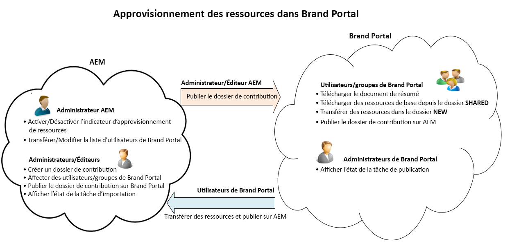
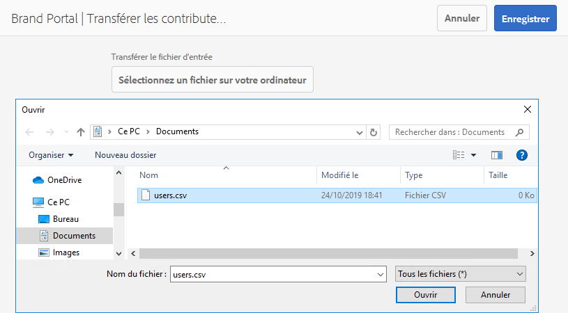

# Présentation de l’approvisionnement des ressources {#overview-asset-sourcing-in-bp}

L’**approvisionnement des ressources** permet aux utilisateurs d’Experience Manager Assets (administrateurs/non-administrateurs) de créer des dossiers avec une propriété **Contribution des ressources** supplémentaire, en s’assurant que les nouveaux dossiers s’ouvrent lorsque des utilisateurs de Brand Portal envoient des ressources. Cela déclenche automatiquement un workflow, ce qui crée deux sous-dossiers supplémentaires, appelés **SHARED** et **NEW**, dans le dossier **Contribution** nouvellement créé. L’administrateur définit les exigences en chargeant un résumé relatif aux types de ressources à ajouter au dossier de contribution. Ils chargent un ensemble de ressources de base dans le dossier **SHARED**, fournissant ainsi aux utilisateurs de Brand Portal les informations de référence nécessaires. L’administrateur peut alors octroyer aux utilisateurs actifs de Brand Portal l’accès au dossier de contribution avant de publier le nouveau dossier **Contribution** sur Brand Portal. Lorsque l’utilisateur a terminé d’ajouter du contenu dans le dossier **NEW**, il peut republier le dossier de contribution dans l’environnement de création Experience Manager. Notez que l’importation du nouveau contenu publié dans Experience Manager Assets et la prise en compte de cette opération peuvent prendre quelques minutes.

En outre, toutes les fonctionnalités existantes restent inchangées. Les utilisateurs de Brand Portal peuvent afficher, rechercher et télécharger des ressources à partir du dossier de contribution, ainsi que des autres dossiers autorisés. Quant aux administrateurs, ils peuvent partager le dossier de contribution de manière plus avancée, modifier les propriétés et ajouter des ressources aux collections.

>[!VIDEO](https://video.tv.adobe.com/v/33200/?captions=fre_fr&quality=12)

## Prérequis {#prerequisites}

* Instance Experience Manager Assets as a Cloud Service, Experience Manager Assets 6.5.2 ou version ultérieure.
* Vérifiez que votre instance d’Experience Manager Assets est configurée avec Brand Portal. Consultez [Configuration d’Experience Manager Assets avec Brand Portal](../using/configure-aem-assets-with-brand-portal.md).

<!--
* Ensure that your Brand Portal tenant is configured with one AEM Assets author instance.
-->

>[!NOTE]
>
>La fonctionnalité d’approvisionnement des ressources est activée par défaut dans Experience Manager Assets as a Cloud Service, Experience Manager Assets 6.5.9 et versions ultérieures.
>
>Les configurations existantes continuent de fonctionner sur les versions antérieures.

>[!NOTE]
>
>Il existe un problème connu dans Experience Manager Assets 6.5.4. Les utilisateurs de Brand Portal ne peuvent pas publier les ressources du dossier de contribution dans Experience Manager Assets lors de la mise à niveau vers Adobe Developer Console.
>
>Le problème a été corrigé dans la version 6.5.5 d’Experience Manager Assets. Vous pouvez mettre à niveau votre instance Experience Manager Assets vers le pack de services le plus récent et [mettre à niveau vos configurations](https://experienceleague.adobe.com/fr/docs/experience-manager-65/content/assets/brandportal/configure-aem-assets-with-brand-portal#upgrade-integration-65) sur Adobe Developer Console.

<!--

>For immediate fix on AEM 6.5.4, it is recommended to [download the hotfix](https://www.adobeaemcloud.com/content/marketplace/marketplaceProxy.html?packagePath=/content/companies/public/adobe/packages/cq650/hotfix/cq-6.5.0-hotfix-33041) and install on your author instance.
-->

<!--
## Configure Asset Sourcing {#configure-asset-sourcing}

**Asset Sourcing** is configured from within the AEM Assets author instance. The administrators can enable the Asset Sourcing feature flag configuration from the **AEM Web Console Configuration** and upload the active Brand Portal users list in **AEM Assets**.

>[!NOTE]
>
>Asset Sourcing is by default enabled on AEM Assets as a Cloud Service. The AEM administrator can directly upload the active Brand Portal users to allow them access to the Asset Sourcing feature.

>[!NOTE]
>
>Before you begin with the configuration, ensure that your AEM Assets instance is configured with Brand Portal. See, [Configure AEM Assets with Brand Portal](../using/configure-aem-assets-with-brand-portal.md). 

The following video demonstrates, how to configure Asset Sourcing on your AEM Assets author instance:

>[!VIDEO](https://video.tv.adobe.com/v/29771)
-->

<!--
### Enable Asset Sourcing {#enable-asset-sourcing}

AEM administrators can enable the Asset Sourcing feature flag from within the AEM Web Console Configuration (a.k.a Configuration Manager).

>[!NOTE]
>
>This step is not applicable for AEM Assets as a Cloud Service.

**To enable Asset Sourcing:**
1. Log in to your AEM Assets author instance and open Configuration Manager. 
Default URL: http:// localhost:4502/system/console/configMgr.
1. Search using the keyword **Asset Sourcing** to locate **[!UICONTROL Asset Sourcing Feature Flag Config]**.
1. Click **[!UICONTROL Asset Sourcing Feature Flag Config]** to open the configuration window.
1. Select the **[!UICONTROL feature.flag.active.status]** check box.
1. Click **[!UICONTROL Save]**.

-->

### Chargement de la liste des utilisateurs de Brand Portal {#upload-bp-user-list}

Les administrateurs Experience Manager Assets peuvent charger le fichier de configuration des utilisateurs Brand Portal (au format .csv) contenant la liste des utilisateurs actifs de Brand Portal dans Experience Manager Assets pour leur permettre d’accéder à la fonctionnalité d’approvisionnement des ressources.

Un dossier de contribution peut uniquement être partagé avec les utilisateurs actifs de Brand Portal définis dans la liste des utilisateurs. L’administrateur peut également ajouter de nouveaux utilisateurs dans le fichier de configuration et charger la liste modifiée des utilisateurs.

>[!NOTE]
>
>Vérifiez que votre instance d’Experience Manager Assets est configurée avec Brand Portal. Consultez [Configuration d’Experience Manager Assets avec Brand Portal](../using/configure-aem-assets-with-brand-portal.md).

>[!NOTE]
>
>Le format du fichier CSV est le même que celui pris en charge dans Admin Console pour l’importation d’utilisateurs en bloc. Vous devez indiquer vos nom, prénom et adresse e-mail.

Les administrateurs peuvent ajouter de nouveaux utilisateurs dans Admin Console. Accédez à [Gérer les utilisateurs](brand-portal-adding-users.md) pour plus d’informations. Après avoir ajouté des utilisateurs dans l’Admin Console, ces utilisateurs peuvent être ajoutés au fichier de configuration des utilisateurs de Brand Portal, puis recevoir l’autorisation d’accéder au dossier de contribution.

**Pour charger la liste des utilisateurs de Brand Portal, procédez comme suit**

1. Connectez-vous à votre instance Experience Manager Assets.
1. Dans le panneau [!UICONTROL Outils], accédez à **[!UICONTROL Assets]** > **[!UICONTROL Utilisateurs Brand Portal]**.

1. La fenêtre de chargement des contributeurs de Brand Portal s’affiche.
Naviguez depuis votre ordinateur local et téléchargez un fichier **de configuration (.csv)** contenant la liste des utilisateurs Brand Portal actifs.
1. Cliquez sur **[!UICONTROL Enregistrer]**.

   

Les administrateurs peuvent donner un accès à des utilisateurs spécifiques à partir de cette liste d’utilisateurs lors de la configuration d’un dossier de contribution. Seuls les utilisateurs affectés à un dossier de contribution ont accès au dossier de contribution et publient des ressources de Brand Portal vers Experience Manager Assets.

## Voir également {#reference-articles}

* [Configuration et publication d’un dossier de contribution dans Brand Portal](brand-portal-publish-contribution-folder-to-brand-portal.md)

* [Publication du dossier de contribution sur Experience Manager Assets](brand-portal-publish-contribution-folder-to-aem-assets.md)
