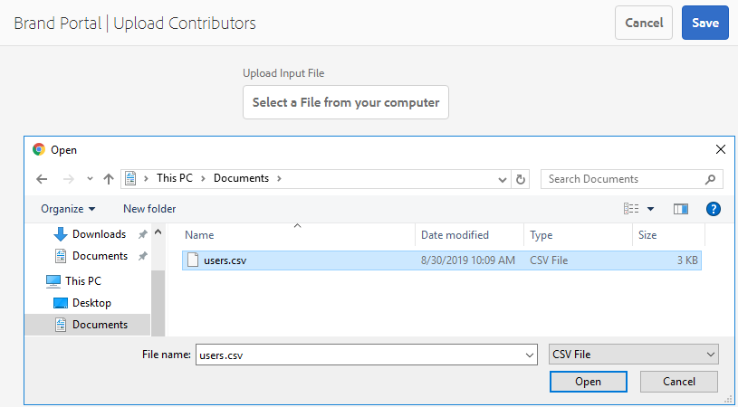

# Présentation de l’approvisionnement des ressources {#overview-asset-sourcing-in-bp}

L’**approvisionnement des ressources** permet aux utilisateurs d’AEM (administrateurs/non-administrateurs) de créer des dossiers avec une propriété **Contribution des ressources** supplémentaire, en s’assurant que les nouveaux dossiers s’ouvrent lorsque des utilisateurs de Brand Portal envoient des ressources. Cela déclenche automatiquement un workflow qui crée deux sous-dossiers supplémentaires, appelés **SHARED** et **NEW**, dans le dossier **Contribution** nouvellement créé. L’administrateur d’AEM définit ensuite les exigences en chargeant un résumé relatif aux types de ressources à ajouter au dossier de contribution, ainsi qu’un ensemble de ressources de base, dans le dossier **SHARED**, afin de s’assurer que les utilisateurs de Brand Portal disposent des informations de référence dont ils ont besoin. L’administrateur peut alors octroyer aux utilisateurs actifs de Brand Portal l’accès au dossier de contribution avant de publier le nouveau dossier **Contribution** sur Brand Portal. Dès que l’utilisateur a fini d’ajouter du contenu dans le dossier **NEW**, il peut republier le dossier de contribution dans l’environnement d’auteur AEM. Notez que l’importation du nouveau contenu publié dans AEM Assets et la prise en compte de cette opération peuvent prendre quelques minutes.

En outre, toutes les fonctionnalités existantes restent inchangées. Les utilisateurs de Brand Portal peuvent afficher, rechercher et télécharger des ressources à partir du dossier de contribution, ainsi que des autres dossiers autorisés. Quant aux administrateurs, ils peuvent partager le dossier de contribution de manière plus avancée, modifier les propriétés et ajouter des ressources aux collections.

## Conditions préalables {#prerequisites}

* AEM Assets en tant qu’instance Cloud Service, AEM Assets 6.5.2 ou ultérieure.
* Vérifiez que votre instance d’AEM Assets est configurée avec Brand Portal. Voir [Configuration d’AEM Assets avec Brand Portal](../using/configure-aem-assets-with-brand-portal.md).
* Assurez-vous que votre client Brand Portal est configuré avec une instance d’auteur AEM Assets.

>[!VIDEO](https://video.tv.adobe.com/v/29365/?quality=12)

>[!NOTE]
>
>Il existe un problème connu dans AEM Assets 6.5.4. Les utilisateurs du portail de marque ne peuvent pas publier les ressources du dossier de contribution à AEM Assets lors de la mise à niveau vers Adobe Developer Console.
>
>Le problème a été corrigé dans AEM 6.5.5. Vous pouvez mettre à niveau votre instance AEM Assets vers le Service Pack le plus récent, AEM 6.5.5, et [mettre à niveau vos configurations](https://docs.adobe.com/content/help/fr-FR/experience-manager-65/assets/brandportal/configure-aem-assets-with-brand-portal.html#upgrade-integration-65) sur Adobe Developer Console.
>
>Pour une solution immédiate sur AEM 6.5.4, il est recommandé de [télécharger le correctif](https://www.adobeaemcloud.com/content/marketplace/marketplaceProxy.html?packagePath=/content/companies/public/adobe/packages/cq650/hotfix/cq-6.5.0-hotfix-33041) et de l’installer sur votre instance d’auteur.

## Configuration de l’approvisionnement des ressources {#configure-asset-sourcing}

**La source de ressources** est configurée à partir de l’instance d’auteur AEM Assets. Les administrateurs peuvent activer la configuration de l’indicateur de la fonctionnalité Sources de ressources à partir de la **AEM configuration de la console Web** et télécharger la liste principale des utilisateurs du portail de marque dans **AEM Assets**.

>[!NOTE]
>
>L’approvisionnement en ressources est activé par défaut sur AEM Assets en tant que Cloud Service. L’administrateur AEM peut directement charger les utilisateurs principaux du portail de marques pour leur permettre d’accéder à la fonction d’origine des ressources.

>[!NOTE]
>
>Veillez à configurer l’instance d’AEM Assets à Brand Portal avant de commencer la configuration. Voir [Configuration d’AEM Assets avec Brand Portal](../using/configure-aem-assets-with-brand-portal.md).

La vidéo suivante montre comment configurer l’origine des ressources sur votre instance d’auteur AEM Assets :

>[!VIDEO](https://video.tv.adobe.com/v/29771)

### Activation de l’approvisionnement des ressources {#enable-asset-sourcing}

Les administrateurs AEM peuvent activer l’indicateur de fonction d’origine des ressources dans la configuration de la console Web AEM (ou Configuration Manager).

>[!NOTE]
>
>Cette étape ne s’applique pas à AEM Assets en tant que Cloud Service.

**Pour activer l’approvisionnement des ressources, procédez comme suit :**
1. Connectez-vous à votre instance d’auteur AEM Assets et ouvrez Configuration Manager.
URL par défaut : http:// localhost:4502/system/console/configMgr.
1. Recherchez **Ressource** à l&#39;aide du mot-clé Ressource **[!UICONTROL Fonction d&#39;approvisionnement]**.
1. Cliquez sur **[!UICONTROL Asset Sourcing Feature Flag Config]** pour ouvrir la fenêtre de configuration.
1. Cochez la case **[!UICONTROL feature.flag.active.status]**.
1. Cliquez sur **[!UICONTROL Enregistrer]**.

### Chargement de la liste des utilisateurs de Brand Portal {#upload-bp-user-list}

Les administrateurs d’AEM peuvent charger le fichier de configuration des utilisateurs de Brand Portal (.csv) contenant la liste des utilisateurs Brand Portal actifs dans AEM Assets. Un dossier de contribution peut uniquement être partagé avec les utilisateurs actifs de Brand Portal définis dans la liste des utilisateurs. L’administrateur peut également ajouter de nouveaux utilisateurs au fichier de configuration et télécharger la liste d’utilisateurs modifiée.

>[!NOTE]
>
>Le format du fichier CSV est identique à celui pris en charge dans le Admin Console pour l’importation en masse par l’utilisateur. Vous devez indiquer vos nom, prénom et adresse électronique.

Les administrateurs peuvent ajouter de nouveaux utilisateurs dans AEM Admin Console, voir [Gérer les utilisateurs](brand-portal-adding-users.md) pour des informations détaillées. Une fois des utilisateurs ajoutés dans Admin Console, ceux-ci peuvent être ajoutés au fichier de configuration des utilisateurs de Brand Portal, puis se voir attribuer l’autorisation d’accéder au dossier de contribution.

**Pour charger la liste des utilisateurs de Brand Portal, procédez comme suit :**
1. Connectez-vous à votre instance AEM Assets.
1. Dans le panneau **Outils**, accédez à **[!UICONTROL Ressources]** > **[!UICONTROL Utilisateurs du portail de marque]**.

1. La fenêtre de chargement des contributeurs de Brand Portal s’affiche.
Recherchez sur votre ordinateur local le **fichier de configuration (.csv)** contenant la liste des utilisateurs actifs de Brand Portal, puis chargez-le.
1. Cliquez sur **[!UICONTROL Enregistrer]**.

   

Les administrateurs peuvent fournir un accès à des utilisateurs spécifiques à partir de cette liste d’utilisateurs lors de la configuration d’un dossier de contributions. Seuls les utilisateurs affectés à un dossier de contributions auront accès au dossier de contributions et publieront des fichiers de Brand Portal vers AEM Assets.

## Voir également {#reference-articles}

* [Configuration et publication du dossier des contributions sur le portail de marque](brand-portal-publish-contribution-folder-to-brand-portal.md)

* [Publication du dossier de contribution sur AEM Assets](brand-portal-publish-contribution-folder-to-aem-assets.md)
