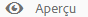
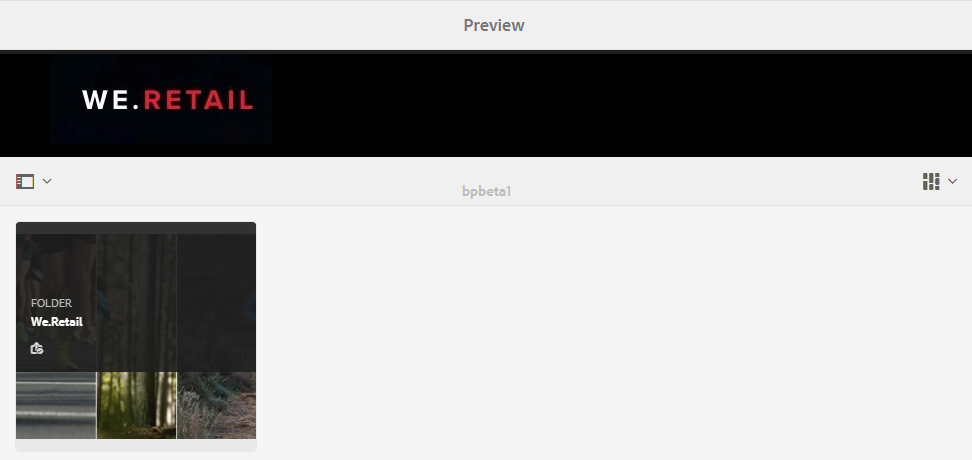

# Personnalisation du papier peint, de l’en-tête et des e-mails {#customize-wallpaper-header-and-email-message}

Les administrateurs de Brand Portal peuvent personnaliser de façon limitée l’interface s’affichant sur l’écran des utilisateurs. Vous pouvez choisir une image d’arrière-plan spécifique (papier peint) pour la page de connexion de Brand Portal. Vous pouvez également ajouter une image d’en-tête et personnaliser les e-mails de partage de ressources pour qu’ils correspondent à la marque du client.

## Personnalisation du papier peint de l’écran de connexion {#customize-the-login-screen-wallpaper}

En l’absence d’image de papier peint de marque personnalisée, un papier peint par défaut est affiché sur la page de connexion.

1. Dans la barre d’outils supérieure, cliquez sur le logo Experience Manager pour accéder aux outils d’administration.

   

1. Dans le panneau des outils d’administration, cliquez sur **[!UICONTROL Valorisation de marque]**.

   

1. Dans le rail gauche de la page **[!UICONTROL Configurer la valorisation de la marque]**, l’option **[!UICONTROL Papier peint]** est sélectionnée par défaut. L’image d’arrière-plan par défaut qui apparaît sur la page de connexion s’affiche.

   

1. Pour ajouter une nouvelle image d’arrière-plan, cliquez sur l’icône **[!UICONTROL Choisir l’image]** dans la barre d’outils supérieure.

   

   Utilisez l’une des méthodes suivantes :

   * Pour télécharger une image de votre ordinateur, cliquez sur **[!UICONTROL Télécharger]**. Accédez à l’image requise et téléchargez-la.
   * Pour utiliser une image Brand Portal existante, choisissez **[!UICONTROL Sélectionner une image existante]**. Sélectionnez une image à l’aide du sélecteur de ressource.

   

1. Spécifiez un texte et une description d’en-tête pour l’image d’arrière-plan. Pour enregistrer les modifications, cliquez sur **[!UICONTROL Enregistrer]** dans la barre d’outils supérieure.

1. Dans la barre d’outils supérieure, cliquez sur l’icône **[!UICONTROL Aperçu]** pour générer un aperçu de l’interface de Brand Portal avec l’image.

   

   

1. Pour activer ou désactiver le papier peint par défaut, effectuez les opérations suivantes sur la page **[!UICONTROL Configurer la valorisation de la marque > Papier peint]** :

   * Pour afficher l’image du papier peint par défaut dans la page de connexion de Brand Portal, cliquez sur l’option **[!UICONTROL Désactiver le papier peint]** de la barre d’outils supérieure. Un message confirme la désactivation de l’image personnalisée.

   

   * Pour restaurer l’image par défaut sur la page de connexion de Brand Portal, cliquez sur **[!UICONTROL Activer le papier peint]** dans la barre d’outils. Un message confirme la restauration de l’image.

   

   * Cliquez sur **[!UICONTROL Enregistrer]** pour enregistrer les modifications.

## Personnalisation de l’en-tête {#customize-the-header}

L’en-tête apparaît sur différentes pages de Brand Portal une fois que vous êtes connecté à Brand Portal.

1. Dans la barre d’outils supérieure, cliquez sur le logo Experience Manager pour accéder aux outils d’administration.

   

1. Dans le panneau des outils d’administration, cliquez sur **[!UICONTROL Valorisation de marque]**.

   

1. Pour personnaliser l’en-tête de page de l’interface de Brand Portal, dans la page **[!UICONTROL Configurer la valorisation de la marque]**, sélectionnez **[!UICONTROL Image d’en-tête]** dans le rail gauche. L’image d’en-tête par défaut s’affiche.

   

1. Pour charger une image d’en-tête, cliquez sur l’icône **[!UICONTROL Choisir l’image]** et sélectionnez **[!UICONTROL Télécharger]**.

   Pour utiliser une image Brand Portal existante, choisissez **[!UICONTROL Sélectionner une image existante]**.

   

   Sélectionnez une image à l’aide du sélecteur de ressource.

   

1. Pour inclure une URL dans l’image d’en-tête, spécifiez-la dans la zone **[!UICONTROL URL d’image]**. Vous pouvez spécifier des URL externes ou internes. Les liens internes peuvent aussi être des liens relatifs, par exemple,
   [!UICONTROL `/mediaportal.html/content/dam/mac/tenant_id/tags`].
Ce lien redirige les utilisateurs vers le dossier des balises.
Pour enregistrer les modifications, cliquez sur **[!UICONTROL Enregistrer]** dans la barre d’outils supérieure.

   

1. Dans la barre d’outils supérieure, cliquez sur l’icône **[!UICONTROL Aperçu]** pour générer un aperçu de l’interface Brand Portal avec l’image d’en-tête.

   
   

1. Pour activer ou désactiver l’image d’en-tête, effectuez les opérations suivantes sur la page **[!UICONTROL Configurer la valorisation de la marque > Image d’en-tête]** :

   * Pour empêcher une image d’en-tête d’apparaître sur les pages Brand Portal, cliquez sur **[!UICONTROL Désactiver l’en-tête]** dans la barre d’outils supérieure. Un message confirme la désactivation de l’image.

   

   * Pour que l’image d’en-tête réapparaisse sur les pages Brand Portal, cliquez sur **[!UICONTROL Activer l’en-tête]** dans la barre d’outils supérieure. Un message confirme l’activation de l’image.

   

   * Cliquez sur **[!UICONTROL Enregistrer]** pour enregistrer les modifications.

## Personnalisation des e-mails {#customize-the-email-messaging}

Lorsque des ressources sont partagées en tant que lien, les utilisateurs reçoivent un courrier électronique contenant le lien. Les administrateurs peuvent personnaliser les messages, c’est-à-dire le logo, la description et le pied de page de ces e-mails.

1. Dans la barre d’outils supérieure, cliquez sur le logo Experience Manager pour accéder aux outils d’administration.

   

1. Dans le panneau des outils d’administration, cliquez sur **[!UICONTROL Valorisation de marque]**.

   

1. Lorsque des ressources sont partagées en tant que liens ou téléchargées par courrier électronique, et que des **[!UICONTROL collections]** sont partagées, des notifications par courrier électronique sont envoyées aux utilisateurs. Pour personnaliser l’e-mail, dans la page **[!UICONTROL Configurer la valorisation de la marque]**, sélectionnez **[!UICONTROL Message électronique]** dans le rail gauche.

   

1. Pour ajouter un logo aux e-mails sortants, cliquez sur **[!UICONTROL Télécharger]** dans la barre d’outils supérieure.

1. Dans la section **[!UICONTROL Description]**, indiquez le texte de l’en-tête et du pied de page de l’e-mail. Pour enregistrer les modifications, cliquez sur **[!UICONTROL Enregistrer]** dans la barre d’outils supérieure.

   >[!NOTE]
   >
   >Si vous n’utilisez pas la taille recommandée pour le logo ou si le texte de l’en-tête et du pied de page dépasse le nombre de mots recommandé, le contenu de l’e-mail peut être tronqué.
