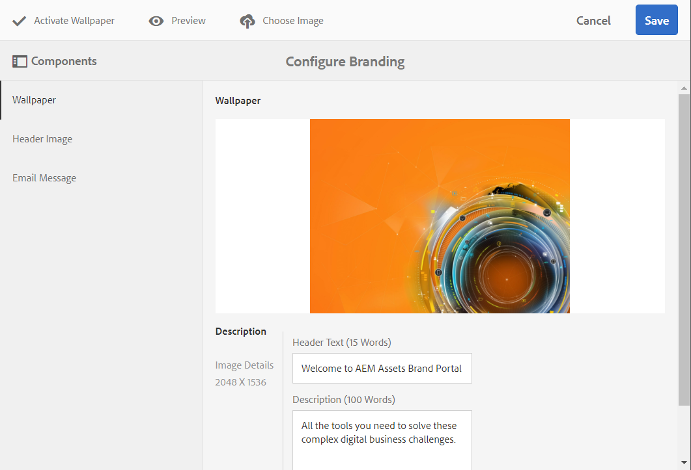
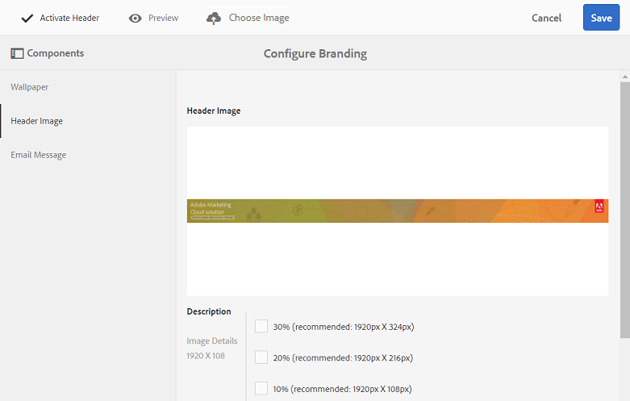

# Personnalisation du papier peint, de l’en-tête et des e-mails {#customize-wallpaper-header-and-email-message}

Les administrateurs de Brand Portal peuvent personnaliser de façon limitée l’interface s’affichant sur l’écran des utilisateurs. Vous pouvez choisir une image d’arrière-plan spécifique (papier peint) pour la page de connexion de Brand Portal. Vous pouvez également ajouter une image d’en-tête et personnaliser les e-mails de partage des ressources pour correspondre à la marque du client.

## Personnalisation du papier peint de l’écran de connexion {#customize-the-login-screen-wallpaper}

En l’absence d’image de papier peint de marque personnalisée, un papier peint par défaut est affiché sur la page de connexion.

1. Dans la barre d'outils AEM en haut, cliquez sur le logo Adobe pour accéder aux outils d'administration.

   

2. From the administrative tools panel, click **[!UICONTROL Branding]**.

   

3. On the left rail of the [!UICONTROL Configure Branding] page, [!UICONTROL Wallpaper] is selected by default. L’image d’arrière-plan par défaut qui apparaît sur la page de connexion s’affiche.

   

4. To add a new background image, click the **[!UICONTROL Choose Image]** icon from the toolbar at the top.

   

   Utilisez l’une des méthodes suivantes :

   * To upload an image from your computer, click **[!UICONTROL Upload]**. Accédez à l’image requise et téléchargez-la.
   * To use an existing Brand Portal image, click **[!UICONTROL Select from existing]**. Sélectionnez une image à l’aide du sélecteur de ressource.
   

5. Spécifiez un texte et une description d’en-tête pour l’image d’arrière-plan. To save the changes, click **[!UICONTROL Save]** from the toolbar at the top.

6. From the toolbar at the top, click the **[!UICONTROL Preview]** icon to generate a preview of the Brand Portal interface with the image.

   

   

7. To activate or deactivate the default wallpaper, do the following in the **[!UICONTROL Configure Branding &gt; Wallpaper]** page:

   * To display the default wallpaper image on the Brand Portal login page, click **[!UICONTROL Deactivate Wallpaper]** from the toolbar at the top. Un message confirme la désactivation de l’image personnalisée.
   

   * Pour restaurer l’image par défaut sur la page de connexion de Brand Portal, cliquez sur **[!UICONTROL Activer le papier peint]dans la barre d’outils.** Un message confirme la restauration de l’image.
   

   * Cliquez sur **[!UICONTROL Enregistrer]pour enregistrer les modifications.**

## Personnalisation de l’en-tête {#customize-the-header}

L'en-tête apparaît sur diverses pages du portail de marque une fois que vous vous êtes connecté à Brand Portal.

1. Dans la barre d'outils AEM en haut, cliquez sur le logo Adobe pour accéder aux outils d'administration.

   

2. From the administrative tools panel, click **[!UICONTROL Branding]**.

   

3. To customize the page header for the Brand Portal interface, on the [!UICONTROL Configure Branding] page, select **[!UICONTROL Header Image]** from the left rail. L’image d’en-tête par défaut s’affiche.

   

4. To upload a header image, click the **[!UICONTROL Choose Image]** icon and choose **[!UICONTROL Upload]**.

   To use an existing  Brand Portal image, choose **[!UICONTROL Select from existing]**.

   

   Sélectionnez une image à l’aide du sélecteur de ressource.

   

5. Pour inclure une URL dans l’image d’en-tête, spécifiez-la dans la zone [!UICONTROL URL d’image]. Vous pouvez spécifier des URL externes ou internes. Les liens internes peuvent également être des liens relatifs, par exemple
   [!UICONTROL `/mediaportal.html/content/dam/mac/tenant_id/tags`].
Ce lien redirige les utilisateurs vers le dossier des balises.
To save the changes, click **[!UICONTROL Save]** from the toolbar at the top.

   

6. From the toolbar at the top, click the **[!UICONTROL Preview]** icon to generate a preview of the  Brand Portal interface with the header image.

   
   

7. To activate or deactivate the header image, do the following in the **[!UICONTROL Configure Branding &gt; Header Image]** page:

   * To prevent a header image from appearing on  Brand Portal pages, click **[!UICONTROL Deactivate Header]** from the toolbar at the top. Un message confirme la désactivation de l’image.
   

   * To make the header image reappear on  Brand Portal pages, click **[!UICONTROL Activate Header]** from the toolbar at the top. Un message confirme l’activation de l’image.
   

   * Cliquez sur **[!UICONTROL Enregistrer]pour enregistrer les modifications.**

## Personnalisation des e-mails {#customize-the-email-messaging}

Lorsque des ressources sont partagées en tant que lien, l’utilisateur reçoit un e-mail contenant le lien. Les administrateurs peuvent personnaliser le logo, la description et le pied de page de ces e-mails.

1. Dans la barre d'outils AEM en haut, cliquez sur le logo Adobe pour accéder aux outils d'administration.

   

2. From the administrative tools panel, click **[!UICONTROL Branding]**.

   

3. When assets are shared as links or downloaded through emails, and when  [!UICONTROL collections] are shared, email notifications are sent to users. To customize the email message, on the [!UICONTROL Configure Branding] page, select **[!UICONTROL Email Message]** from the left rail.

   

4. Pour ajouter un logo aux e-mails sortants, cliquez sur **[!UICONTROL Télécharger]dans la barre d’outils supérieure.**

5. Dans la section [!UICONTROL Description], indiquez le texte de l’en-tête et du pied de page de l’e-mail. To save the changes, click **[!UICONTROL Save]** from the toolbar at the top.

   >[!NOTE]
   >
   >Si vous n'utilisez pas la taille recommandée pour le logo ou si le texte d'en-tête et de pied de page dépasse le nombre de mots recommandé, le contenu du message électronique peut s'afficher.
