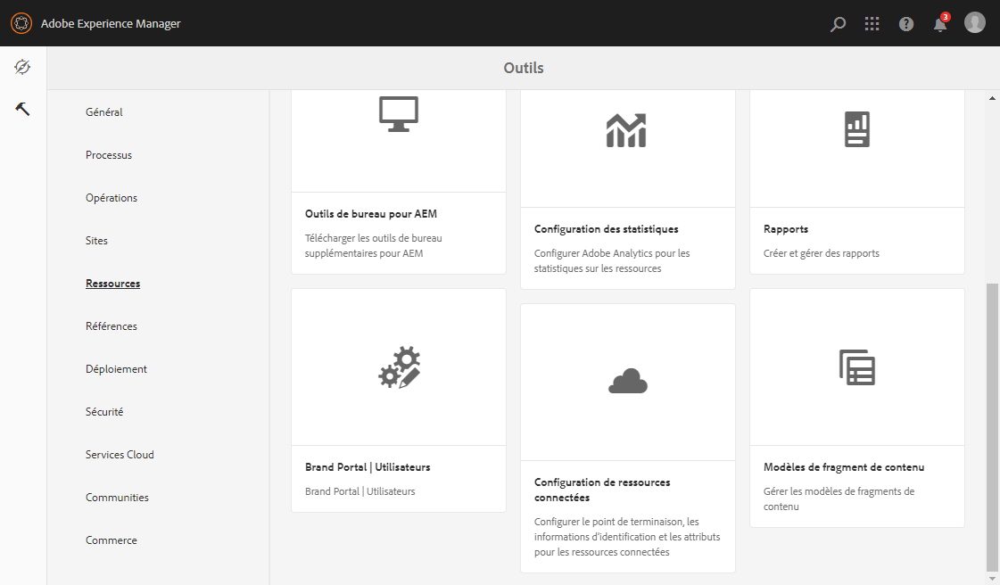

# Configuration de l&#39;approvisionnement des ressources {#configure-asset-sourcing}

Les administrateurs AEM peuvent configurer **l’approvisionnement des ressources** depuis l’instance d’auteur AEM. Ils activent la configuration du drapeau de la fonctionnalité d&#39;approvisionnement des ressources depuis la **configuration de la console Web AEM** et téléchargent la liste des utilisateurs Brand Portal actifs dans **AEM Assets**.

>[!NOTE]
>
>Veillez à intégrer l’instance AEM Assets à Brand Portal avant de lancer la configuration. Voir [Configuration de l’intégration d’AEM Assets dansà Brand Portal](https://helpx.adobe.com/experience-manager/6-5/assets/using/brand-portal-configuring-integration.html).

La vidéo suivante montre comment configurer l’approvisionnement des ressources sur votre instance d’auteur AEM :

>[!VIDEO](https://video.tv.adobe.com/v/29771)

## Activation de l’approvisionnement des ressources {#enable-asset-sourcing}

Les administrateurs d’AEM peuvent activer l’approvisionnement des ressources depuis Configuration de la console web AEM (ou Configuration Manager).

**Pour activer l’approvisionnement des ressources, procédez comme suit :**
1. Connectez-vous à votre instance d’auteur AEM et ouvrez Configuration Manager.
URL par défaut : http:// localhost:4502/system/console/configMgr
1. À l’aide du mot-clé **Approvisionnement des ressources**, recherchez la **[!UICONTROL configuration de l’indicateur de la fonctionnalité d’approvisionnement des ressources]**.
1. Cliquez sur **[!UICONTROL Configuration de l’indicateur de la fonctionnalité d’approvisionnement des ressources]**pour ouvrir la fenêtre de configuration.
1. Activez la case à cocher **[!UICONTROL feature.flag.active.status]**.
1. Cliquez sur **[!UICONTROL Enregistrer]**.

## Chargement de la liste des utilisateurs de Brand Portal {#upload-bp-user-list}

Les administrateurs d’AEM peuvent charger le fichier de configuration des utilisateurs de Brand Portal (.csv) contenant la liste des utilisateurs Brand Portal actifs dans AEM Assets. Un dossier de contribution peut uniquement être partagé avec les utilisateurs actifs de Brand Portal définis dans la liste des utilisateurs. L’administrateur peut également ajouter de nouveaux utilisateurs dans le fichier de configuration et charger la liste modifiée des utilisateurs.

>[!NOTE]
>
>Le format du fichier CSV est identique à celui pris en charge par la Console d’administration pour l’importation en masse par l’utilisateur. Vous devez indiquer vos nom, prénom et adresse électronique.

Il peut ajouter de nouveaux utilisateurs dans AEM Admin Console. Pour plus d’informations, voir [Gestion des utilisateurs](brand-portal-adding-users.md). Une fois des utilisateurs ajoutés dans Admin Console, ceux-ci peuvent être ajoutés au fichier de configuration des utilisateurs de Brand Portal, puis se voir attribuer l’autorisation d’accéder au dossier de contribution.

**Pour charger la liste des utilisateurs de Brand Portal, procédez comme suit :**
1. Connectez-vous à votre instance d’auteur AEM
URL par défaut : http:// localhost:4502/aem/start.html
1. Dans le panneau **Outils** , accédez à **[!UICONTROL Ressources > Utilisateurs Brand Portal]**.   
1. La fenêtre de chargement des contributeurs de Brand Portal s’affiche.
Recherchez sur votre ordinateur local le **fichier de configuration (.csv)** contenant la liste des utilisateurs actifs de Brand Portal, puis chargez-le.
1. Cliquez sur **[!UICONTROL Enregistrer]**.   

Les administrateurs peuvent donner un accès à des utilisateurs/groupes spécifiques à partir de cette liste d’utilisateurs lors de la configuration du dossier de contribution.

Pour plus d’informations, voir [Configuration du dossier de contribution](brand-portal-contribution-folder.md).
