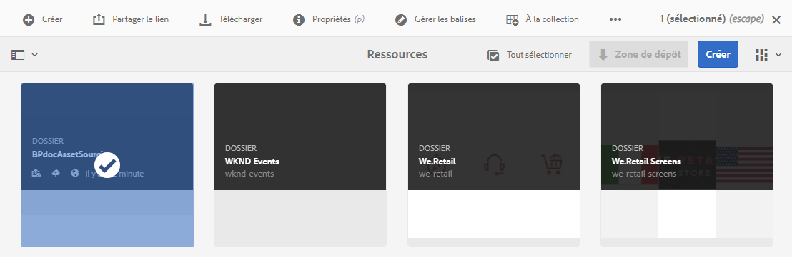
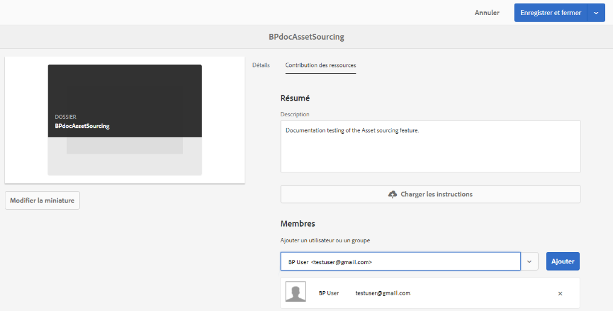

# Configuration des propriétés du dossier de contribution {#configure-contribution-folder-properties}

L’administrateur d’AEM effectue les activités ci-après lors de la configuration des propriétés d’un dossier de contribution.

* **Ajouter une description** : fournissez une description détaillée du dossier de contribution.
* **Charger les instructions** : téléchargez le document sur les exigences en matière de ressources contenant des informations relatives aux ressources.
* **Ajouter des contributeurs** : ajoutez des utilisateurs ou des groupes de Brand Portal pour leur accorder l’accès au dossier de contribution.

Les exigences en matière de ressources font référence aux détails fournis par les administrateurs pour aider les contributeurs (utilisateurs de Brand Portal) à comprendre le besoin et les exigences du dossier de contribution. L’administrateur charge un document sur les exigences en matière de ressources contenant un résumé sur le type de ressources à ajouter au dossier de contribution et des informations relatives aux ressources comme le but, le type d’images, la taille maximale, etc.

L’administrateur peut alors octroyer aux utilisateurs/groupes de Brand Portal l’accès au dossier de contribution avant de publier le nouveau dossier Contribution sur Brand Portal.

**Pour configurer les propriétés du dossier de contribution, procédez comme suit :**
1. Connectez-vous à votre instance d’auteur AEM
URL par défaut : http://localhost:4502/aem/start.html
1. Accédez à **[!UICONTROL Ressources > Fichiers]** et localisez le dossier de contribution.
1. Sélectionnez le dossier de contribution et cliquez sur **[!UICONTROL Propriétés]** . La fenêtre Propriétés du dossier s’affiche.
   
1. Accédez à l’onglet **[!UICONTROL Contribution des ressources]**.
1. Saisissez une **[!UICONTROL Description]** détaillée du dossier de contribution.
1. Cliquez sur **[!UICONTROL Upload Brief]**  (Charger un résumé) pour parcourir votre ordinateur local et charger un **document relatif aux exigences en matière de ressources**.
1. In **[!UICONTROL Add User or Group]**, search and **[!UICONTROL Add]** Brand Portal users with whom you want to share the contribution folder. Un dossier de contribution ne peut pas être affecté à des groupes.
Ces utilisateurs du portail de marque auront l’autorisation d’accéder au dossier de contribution et de télécharger du contenu depuis leur interface de portail de marque sans avoir à accéder à l’instance d’auteur AEM.

1. Cliquez sur **[!UICONTROL Enregistrer]**.
   

>[!NOTE]
>
>Les résultats de la recherche sont basés sur la liste des utilisateurs Brand Portal configurée dans AEM Assets. Vérifiez que vous disposez de la liste mise à jour des utilisateurs de Brand Portal. Voir [Chargement de la liste des utilisateurs de Brand Portal](brand-portal-configure-asset-sourcing.md).

