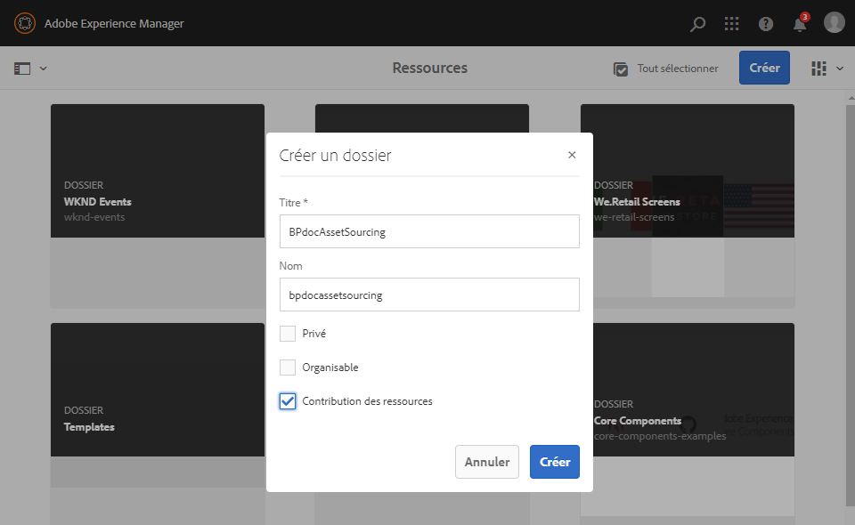
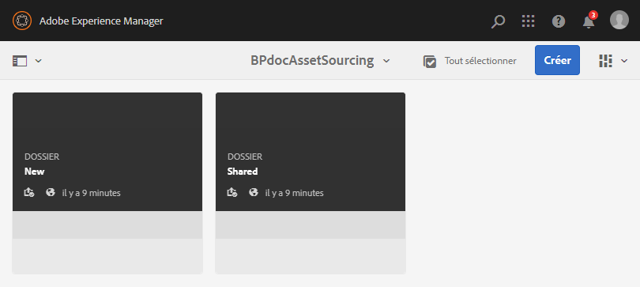

# Création d’un dossier de contribution {#create-contribution-folder}

Les administrateurs AEM et les utilisateurs non-administrateurs autorisés à créer un dossier peuvent créer un dossier Contribution dans AEM Assets.
Pour créer un dossier Contribution, créez un nouveau dossier de type Contribution des ressources, en vous assurant qu’il accepte l’envoi de ressources de la part des utilisateurs de Brand Portal.  Cela déclenche automatiquement un workflow qui crée deux sous-dossiers supplémentaires, SHARED et NEW, dans le dossier Contribution.

>[!NOTE]
>
>Vous pouvez créer plusieurs dossiers de contribution dans un dossier, mais pas dans un autre dossier de contribution.

Pour créer un dossier de contribution, procédez comme suit :
1. Connectez-vous à votre instance d’auteur AEM.

   L’URL par défaut est http:// localhost:4502/aem/start.html.

1. Accédez à **[!UICONTROL Ressources]** > **[!UICONTROL Fichiers]**. Tous les dossiers existants dans le référentiel AEM Assets sont répertoriés.

1. Cliquez sur **[!UICONTROL Créer]** pour créer un dossier. La boîte de dialogue **[!UICONTROL Créer un dossier]** apparaît.

1. Enter **[!UICONTROL Title]** and **[!UICONTROL Name]** of the folder and select the **[!UICONTROL Asset Contribution]** check box.
Il est recommandé d’utiliser dans le nom du dossier des lettres minuscules sans espace.

1. Cliquez sur **[!UICONTROL Créer]**. Le dossier de contribution est répertorié dans le référentiel AEM Assets.

   >[!NOTE]
   >
   >Un utilisateur non-administrateur peut créer et partager un dossier de contribution de ressources, mais il ne peut ni le modifier ni le supprimer.

   

1. Cliquez pour ouvrir le dossier de contribution. Vous pouvez voir deux sous-dossiers, **[!UICONTROL SHARED]** et **[!UICONTROL NEW]**, automatiquement créés dans le dossier de contribution.

   

Vous pouvez désormais [configurer les propriétés du dossier de contribution](brand-portal-configure-contribution-folder-properties.md).

