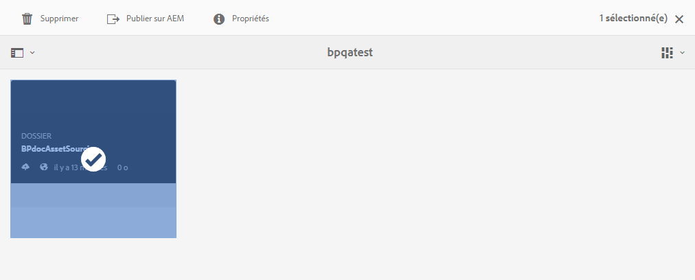
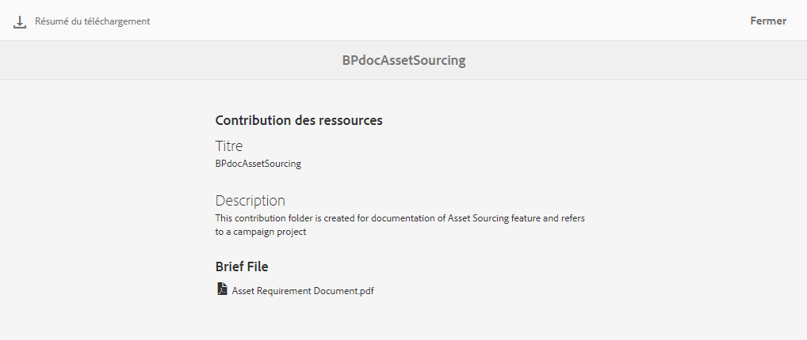

# Téléchargement des exigences en matière de ressources {#using-asset-souring-in-bp}

Les utilisateurs de Brand Portal reçoivent automatiquement des notifications Push/par courrier électronique lorsqu’un dossier de contribution est partagé par l’utilisateur d’AEM, ce qui leur permet de télécharger le document de résumé (exigences en matière de ressources) et les ressources de base (contenu de référence) depuis le dossier **SHARED** afin de s’assurer qu’ils comprennent les exigences en matière de ressources.

L’utilisateur de Brand Portal effectue les activités suivantes pour télécharger les exigences en matière de ressources :

* **Charger les instructions** : chargez le résumé (document sur les exigences en matière de ressources) joint au dossier de contribution qui contient des informations relatives aux ressources, telles que le type de ressources, le but, les formats pris en charge, la taille maximale des ressources, etc.
* **Télécharger des ressources de base** : téléchargez des ressources de base qui peuvent être utilisées pour comprendre les types de ressources requis. Les utilisateurs de Brand Portal peuvent utiliser ces ressources comme référence afin de créer des ressources à des fins de contribution.

Le tableau de bord de Brand Portal répertorie tous les dossiers existants auxquels l’utilisateur de Brand Portal est autorisé à accéder, ainsi que le dossier de contribution nouvellement partagé. Dans cet exemple, l’utilisateur de Brand Portal a uniquement accès au dossier de contribution nouvellement créé. Aucun autre dossier existant n’est partagé avec lui.

**Pour télécharger les exigences en matière de ressources, procédez comme suit :**

1. Connectez-vous à votre instance de Brand Portal.
1. Sélectionnez le dossier de contribution dans le tableau de bord de Brand Portal.
1. Cliquez sur **[!UICONTROL Propriétés]** . La fenêtre Propriété s’affiche. Elle contient les détails du dossier Contribution des ressources.
   
1. Cliquez sur **[!UICONTROL Download Brief]**  (Télécharger le résumé) pour télécharger sur votre ordinateur local le document sur les exigences en matière de ressources.
   
1. Retournez dans le tableau de bord de Brand Portal.
1. Cliquez pour ouvrir le dossier de contribution. Vous pouvez voir deux sous-dossiers, **[!UICONTROL SHARED]** et **[!UICONTROL NEW]**, à l’intérieur. Le dossier SHARED contient toutes les ressources de base (contenu de référence) partagées par les administrateurs.
1. Vous pouvez télécharger sur votre ordinateur local le dossier **[!UICONTROL SHARED]** contenant toutes les ressources de base.
Vous pouvez également ouvrir le dossier **[!UICONTROL SHARED]** et cliquer sur l’icône **Télécharger**  pour télécharger des ressources/dossiers distincts.
   

Passez en revue le résumé (document sur les exigences en matière de ressources) et reportez-vous aux ressources de base pour comprendre les exigences en matière de ressources. Vous pouvez maintenant créer des ressources à des fins de contribution et les charger dans le dossier de contribution. Voir [Chargement de ressources dans le dossier de contribution](brand-portal-upload-assets-to-contribution-folder.md).

