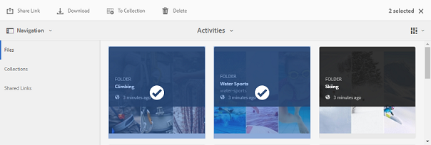
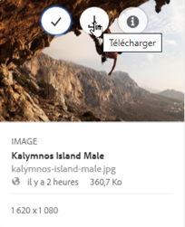
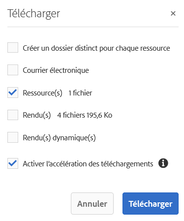
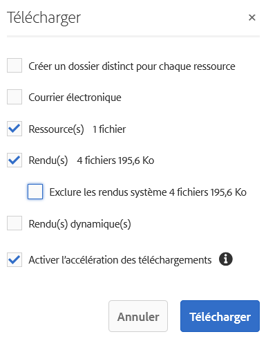
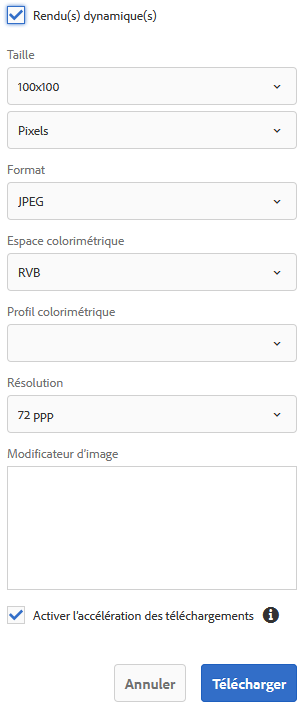

# Téléchargement de ressources {#download-assets}

<!-- Before update in Download experience - 26th Aug 2020 by Vishabh.
 All users can simultaneously download multiple assets and folders accessible to them from Brand Portal. This way, approved brand assets can be securely distributed for offline use. Read on to know how to download approved assets from Brand Portal, and what to expect from the [download performance](../using/brand-portal-download-assets.md#main-pars-header).
-->

Adobe Experience Manager Assets Brand Portal améliore l’expérience de téléchargement en permettant aux utilisateurs de télécharger simultanément plusieurs dossiers et ressources accessibles directement. Ainsi, les ressources de marque approuvées peuvent être distribuées en toute sécurité pour une utilisation en mode hors connexion. Lisez ce qui suit pour savoir comment télécharger des ressources approuvées à partir de Brand Portal et en savoir plus sur les [performances de téléchargement](../using/brand-portal-download-assets.md#expected-download-performance).

>[!NOTE]
>
>Installez IBM Aspera Connect 3.9.9 dans l’extension de votre navigateur avant de télécharger les ressources à partir de Brand Portal.

<!--
**Types of renditions in Brand Portal:**

* Original asset rendition

  It is the original binary of the asset uploaded in AEM Assets. 
  
  
* System renditions

  These are the thumbnail renditions which are automatically generated in AEM Assets based on the "DAM update asset" workflow. 
  
* Custom renditions

  These are the additional renditions that an asset might have and its dynamic renditions. Any user can create additional custom renditions, whereas, only the AEM administrator can create dynamic renditions of an image in AEM Assets. To know more, see [how to apply image presets or dynamic renditions](../using/brand-portal-image-presets.md).     
-->

## Configuration du téléchargement des ressources {#configure-download}

La configuration du téléchargement permet aux administrateurs de Brand Portal de définir l’ensemble de rendus disponibles pour les utilisateurs de Brand Portal lors du téléchargement des ressources. L’administrateur peut configurer les paramètres de **[!UICONTROL téléchargement]** des ressources depuis l’interface de Brand Portal.

Les configurations disponibles sont les suivantes :

* **[!UICONTROL Téléchargement rapide]**

   Autorise le téléchargement à grande vitesse des ressources. Pour en savoir plus, reportez-vous au [guide d’accélération des téléchargements depuis Brand Portal](../using/accelerated-download.md).

* **[!UICONTROL Rendus personnalisés]**

   Téléchargez des rendus personnalisés et/ou dynamiques des ressources.
Tous les rendus de ressources autres que les rendus de ressources d’origine et générés par le système sont appelés rendus personnalisés. Ils comprennent des rendus statiques et dynamiques disponibles pour les ressources. Un utilisateur peut créer un rendu statique personnalisé dans AEM Assets, alors que seul l’administrateur AEM peut créer des rendus dynamiques personnalisés. Pour en savoir plus, découvrez [comment appliquer des paramètres d’image prédéfinis ou des rendus dynamiques](../using/brand-portal-image-presets.md).

* **[!UICONTROL Rendus du système]**

   Téléchargez les rendus des ressources générés par le système. Il s’agit des miniatures qui sont automatiquement générées dans AEM Assets en fonction du workflow de mise à jour de ressource DAM.

Connectez-vous à votre client Brand Portal en tant qu’administrateur et accédez à **[!UICONTROL Outils]** > **[!UICONTROL Télécharger]**. Par défaut, la configuration **[!UICONTROL Téléchargement rapide]** est activée dans les **[!UICONTROL Paramètres de téléchargement]**.

Les administrateurs peuvent activer n’importe quelle combinaison pour configurer le processus de téléchargement des ressources.

En fonction de la configuration, le workflow de téléchargement reste le même pour les ressources uniques ou multiples, les dossiers contenant des ressources, les ressources qui sont ou non sous licence, ainsi que le téléchargement de ressources à l’aide du lien de partage.

* Si les configurations **[!UICONTROL Rendus personnalisés]** et **[!UICONTROL Rendus du système]** sont désactivées, les rendus originaux des ressources sont téléchargés sans boîte de dialogue supplémentaire.

<!--
If all the three download configurations are turned-off, or only the **[!UICONTROL Fast Download]** configuration is enabled, the original assets are directly downloaded on your local system with no additional step required.
Test.. 
-->

* Si l’une des configurations **[!UICONTROL Rendus personnalisés]** ou **[!UICONTROL Rendus du système]** est activée, une boîte de dialogue **[!UICONTROL Téléchargement]** supplémentaire s’affiche, dans laquelle vous pouvez choisir de télécharger la ressource d’origine avec ses rendus ou de ne télécharger que des rendus spécifiques.

>[!NOTE]
>
>Seuls les administrateurs peuvent télécharger les ressources expirées. Pour plus d’informations sur les ressources arrivées à expiration, voir [Gestion des droits numériques des ressources](../using/manage-digital-rights-of-assets.md).

## Étapes de téléchargement des ressources   {#steps-to-download-assets}

Vous trouverez ci-dessous la procédure à suivre pour télécharger des ressources ou des dossiers contenant des ressources à partir de Brand Portal :

1. Dans l’interface de Brand Portal, effectuez l’une des opérations suivantes :

   * Sélectionnez les dossiers ou les ressources que vous souhaitez télécharger. Dans la barre d’outils supérieure, cliquez sur l’icône **[!UICONTROL Télécharger]**.

      

   * Pour télécharger une ressource ou un dossier spécifique, survolez-le avec le pointeur et cliquez sur l’icône **[!UICONTROL Télécharger]** disponible dans les miniatures d’action rapide.

      

      >[!NOTE]
      >
      >Si vous téléchargez les ressources pour la première fois et qu’IBM Aspera Connect n’est pas installé dans votre navigateur, vous êtes invité à installer l’accélérateur de téléchargement Aspera.

      >[!NOTE]
      >
      >Si les ressources que vous téléchargez comprennent également des ressources sous licence, vous êtes redirigé vers la page **[!UICONTROL Gestion des droits d’auteur]**. Dans cette page, sélectionnez les ressources, cliquez d&#39;abord sur **[!UICONTROL Accepter]**, puis sur **[!UICONTROL Télécharger]**. Si vous choisissez de ne pas accepter, les ressources sous licence ne sont pas téléchargées.
      > 
      >Dans le cas des ressources protégées par une licence, un [contrat de licence leur est associé](https://helpx.adobe.com/fr/experience-manager/6-5/assets/using/drm.html#DigitalRightsManagementinAssets) en définissant la [propriété de métadonnées](https://helpx.adobe.com/fr/experience-manager/6-5/assets/using/drm.html#DigitalRightsManagementinAssets) appropriée dans Experience Manager Assets.

      

      <!--
     >>[!NOTE]
     >
     >Ensure to select all the required asset renditions while downloading them from the asset details page, and click **[!UICONTROL Download]**. The selected renditions are downloaded to your local machine.
     > 
     >Once you download, the **[!UICONTROL Download]** button is disabled to avoid creating duplicate copies of the downloaded renditions. To download more (missing or another copy of renditions), refresh the browser to re-enable the download button.
     >
     -->

      Si l’une des configurations **[!UICONTROL Rendus personnalisés]** ou **[!UICONTROL Rendus du système]** est activée dans les **[!UICONTROL Paramètres de téléchargement]**, la boîte de dialogue **[!UICONTROL Télécharger]** s’affiche avec la case **[!UICONTROL Ressources(s)]** cochée par défaut. Si la configuration **[!UICONTROL Téléchargement rapide]** est activée, la case **[!UICONTROL Activer l’accélération des téléchargements]** est cochée par défaut.

      

      >[!NOTE]
      >
      >Si les ressources téléchargées sont des fichiers images et que vous cochez uniquement la case **[!UICONTROL Ressource(s)]** de la boîte de dialogue **[!UICONTROL Télécharger]**, sans être [autorisé par l’administrateur à accéder aux rendus originaux des fichiers images](../using/brand-portal-adding-users.md#main-pars-procedure-202029708), aucun fichier image n’est téléchargé, et un avis vous indique que l’administrateur a restreint votre accès aux rendus originaux.

      

1. Pour télécharger les rendus en plus des ressources d’origine, cochez la case **[!UICONTROL Rendu(s)]**. Toutefois, si vous souhaitez télécharger les rendus générés par le système avec les rendus personnalisés, décochez la case **[!UICONTROL Exclure les rendus du système]**.

   

   * Pour télécharger uniquement les rendus, décochez la case **[!UICONTROL Ressource(s)]**.

      >[!NOTE]
      >
      >Par défaut, seules les ressources sont téléchargées. Toutefois, les rendus originaux des fichiers images ne sont pas téléchargés si vous n’êtes pas [autorisé par l’administrateur à y accéder](../using/brand-portal-adding-users.md#main-pars-procedure-202029708).

   * Pour partager les ressources sélectionnées avec d’autres utilisateurs par le biais d’un lien, cochez la case **[!UICONTROL Email]**. Une notification par email est envoyée aux utilisateurs avec le lien de téléchargement. Pour savoir comment télécharger des ressources à partir de liens partagés, voir [Téléchargement de ressources à partir de liens partagés](../using/brand-portal-link-share.md#main-pars-header-1703469193).

      

      >[!NOTE]
      >
      >Le lien de téléchargement figurant dans l’email de notification expire après 45 jours.
      >
      >Les administrateurs peuvent personnaliser les emails, à savoir le logo, la description et le pied de page, à l’aide de la fonctionnalité [Valorisation de marque](../using/brand-portal-branding.md).

   * Vous pouvez sélectionner un paramètre prédéfini d’image ou créer un rendu dynamique personnalisé à partir de la boîte de dialogue **[!UICONTROL Télécharger]**.

      Pour appliquer un [paramètre prédéfini d’image personnalisé à la ressource et ses rendus](../using/brand-portal-image-presets.md#applyimagepresetswhendownloadingimages), cochez la case **[!UICONTROL Rendu(s) dynamique(s)]**. Spécifiez les propriétés de paramètre prédéfini d’image (par exemple, la taille, le format, l’espace colorimétrique, la résolution et le modificateur d’image) à appliquer au paramètre prédéfini personnalisé lors du téléchargement de la ressource et de ses rendus. Pour télécharger uniquement les rendus dynamiques, désélectionnez la case **[!UICONTROL Ressource(s)]**.

      

      >[!NOTE]
      >
      >Brand Portal prend en charge la configuration de Dynamic Media dans les modes hybride et Scene 7.
      >
      >(*Si l’instance (d’auteur) AEM est en cours d’exécution en mode **hybride Dynamic Media***.)      >Pour prévisualiser ou télécharger les rendus dynamiques d’une ressource, vérifiez que Dynamic Media est activé et que le rendu Pyramid TIFF de la ressource existe au niveau de l’instance d’auteur AEM Assets à partir de laquelle les ressources ont été publiées. Lorsqu’une ressource est publiée sur Brand Portal, son rendu Pyramid TIFF l’est également.

   * Pour conserver la hiérarchie des dossiers de Brand Portal lors du téléchargement des ressources, cochez la case **[!UICONTROL Créer un dossier distinct pour chaque ressource]**. Par défaut, la hiérarchie des dossiers de Brand Portal est ignorée, et toutes les ressources sont téléchargées dans un dossier de votre système local.

1. Cliquez sur **[!UICONTROL Télécharger]**.

   Les ressources, et les rendus s’ils sont sélectionnés, sont téléchargés en tant que fichier ZIP dans votre dossier local. Cependant, aucun fichier ZIP n’est créé lorsqu’une seule ressource est téléchargée sans aucun des rendus.

   Si vous n’êtes pas [autorisé par l’administrateur à accéder aux rendus d’origine](../using/brand-portal-adding-users.md#main-pars-procedure-202029708), les rendus d’origine des ressources sélectionnées ne sont pas téléchargés.

   >[!NOTE]
   >
   >Les ressources téléchargées individuellement sont visibles dans le rapport sur les ressources téléchargées. Toutefois, si un dossier contenant des ressources est téléchargé, le dossier et les ressources ne sont pas affichés dans le rapport sur les ressources téléchargées.

## Performances de téléchargement attendues {#expected-download-performance}

L’expérience de téléchargement de fichier peut varier pour les utilisateurs situés à différents emplacements, en fonction de facteurs tels que la connexion Internet locale et la latence du serveur. Les performances de téléchargement prévues pour un fichier de 2 Go observées à différents emplacements de clients sont les suivantes, avec le serveur Brand Portal situé en Oregon aux États-Unis :

| Emplacement du client | Latence entre le client et le serveur | Vitesse de téléchargement prévue | Durée de téléchargement d’un fichier de 2 Go |
|-------------------------|-----------------------------------|-------------------------|------------------------------------|
| Ouest des États-Unis (Californie du Nord) | 18 millisecondes | 7,68 Mo/s. | 4 minutes |
| Ouest des États-Unis (Oregon) | 42 millisecondes | 3,84 Mo/s. | 9 minutes |
| Est des États-Unis (Virginie du Nord) | 85 millisecondes | 1,61 Mo/s. | 21 minutes |
| Asie-Pacifique (Tokyo) | 124 millisecondes | 1,13 Mo/s. | 30 minutes |
| Noida | 275 millisecondes | 0,5 Mo/s. | 68 minutes |
| Sydney | 175 millisecondes | 0,49 Mo/s. | 69 minutes |
| Londres | 179 millisecondes | 0,32 Mo/s. | 106 minutes |
| Singapour | 196 millisecondes | 0,5 Mo/s. | 68 minutes |

>[!NOTE]
>
>Les données citées sont observées dans les situations de test et peuvent varier pour des utilisateurs à des emplacements différents avec une latence et une bande passante différentes.

