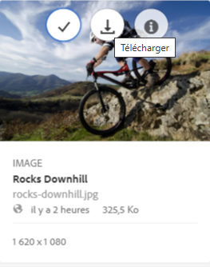

# Téléchargement de ressources depuis Brand Portal {#download-assets-from-bp}

<!-- Before update in Download experience - 26th Aug 2020 comment by Vishabh.
 All users can simultaneously download multiple assets and folders accessible to them from Brand Portal. This way, approved brand assets can be securely distributed for offline use. Read on to know how to download approved assets from Brand Portal, and what to expect from the [download performance](../using/brand-portal-download-assets.md#main-pars-header).
-->

Adobe Experience Manager Assets Brand Portal améliore l’expérience de téléchargement en permettant aux utilisateurs de télécharger simultanément plusieurs dossiers et ressources accessibles directement. Ainsi, les ressources de marque approuvées peuvent être distribuées en toute sécurité pour une utilisation en mode hors connexion. Lisez ce qui suit pour savoir comment télécharger des ressources approuvées à partir de Brand Portal et en savoir plus sur les [performances de téléchargement](../using/brand-portal-download-assets.md#expected-download-performance).

>[!NOTE]
>
>Dans la version 2020.10.0 de Brand Portal (et ultérieures), le paramètre **[!UICONTROL Téléchargement rapide]** est activé par défaut, ce qui active l’utilisation d’IBM Aspera Connect pour accélérer le téléchargement des ressources. [Installez IBM Aspera Connect 3.9.9](https://www.ibm.com/docs/en/aspera-connect/3.9.9) dans l’extension de votre navigateur avant de télécharger les ressources à partir de Brand Portal. Pour plus d’informations, reportez-vous au [guide d’accélération des téléchargements depuis Brand Portal](../using/accelerated-download.md).
>
>Si vous ne souhaitez pas utiliser IBM Aspera Connect et préférez poursuivre un processus de téléchargement normal, contactez l’administrateur de Brand Portal pour désactiver le paramètre **[!UICONTROL Téléchargement rapide]**.

## Configuration du téléchargement des ressources {#configure-download}

Les administrateurs de Brand Portal peuvent configurer les paramètres de téléchargement des ressources et des groupes d’utilisateurs et les autorisations pour les utilisateurs de Brand Portal, ce qui leur permet d’accéder aux rendus de ressources et de les télécharger à partir de l’interface de Brand Portal.

>[!NOTE]
>
>Les paramètres de téléchargement appliqués à l’interface utilisateur facilitent la mise en libre-service des utilisateurs de Brand Portal pour configurer et télécharger facilement les rendus de ressources. Cela ne limite pas le téléchargement des fichiers au niveau de la couche d’application. Par exemple, les utilisateurs peuvent toujours accéder aux rendus de fichiers et les télécharger avec le chemin d’accès URL complet.

L’accès aux rendus et le téléchargement des rendus de ressources à partir de l’interface de Brand Portal sont définis par les configurations suivantes :

* Activation des paramètres de téléchargement
* Configuration des paramètres des groupes d’utilisateurs

### Activation des paramètres de téléchargement {#enable-download-settings}

Les administrateurs peuvent activer les **[!UICONTROL Paramètres de téléchargement]** des ressources pour définir quels rendus sont téléchargeables pour les utilisateurs de Brand Portal.

Les paramètres disponibles sont les suivants :

* **[!UICONTROL Téléchargement rapide]**

   Il permet d’accélérer le téléchargement des ressources à l’aide d’IBM Aspera Connect. Par défaut, le paramètre **[!UICONTROL Téléchargement rapide]** est activé dans les **[!UICONTROL Paramètres de téléchargement]**.

* **[!UICONTROL Rendus personnalisés]**

   Permet de télécharger des rendus personnalisés ou dynamiques des ressources.

   Tous les rendus de ressources autres que les rendus de ressources d’origine et générés par le système sont appelés rendus personnalisés. Ils comprennent des rendus statiques et dynamiques disponibles pour les ressources. Un utilisateur peut créer un rendu statique personnalisé dans AEM Assets, alors que seul l’administrateur AEM peut créer des rendus dynamiques personnalisés. Pour plus d’informations, consultez [comment appliquer des paramètres d’image prédéfinis ou des rendus dynamiques](../using/brand-portal-image-presets.md).

* **[!UICONTROL Rendus du système]**

   Permet de télécharger les rendus des ressources générés par le système.

   Il s’agit des miniatures qui sont automatiquement générées dans AEM Assets en fonction du workflow de mise à jour de ressource DAM.

* **[!UICONTROL Téléchargement de ressources]**

   Permet de télécharger les rendus dans un dossier distinct pour chaque ressource. Ce paramètre s’applique aux dossiers, aux collections et aux téléchargements en masse de ressources (plus de 20 ressources).

Connectez-vous à votre client Brand Portal en tant qu’administrateur et accédez à **[!UICONTROL Outils]** > **[!UICONTROL Télécharger]**.

Les administrateurs peuvent activer toutes les combinaisons de paramètres nécessaires pour que les utilisateurs de Brand Portal puissent accéder aux rendus et les télécharger.

>[!NOTE]
>
>Seuls les administrateurs peuvent télécharger les ressources expirées. Pour plus d’informations sur les ressources arrivées à expiration, voir [Gestion des droits numériques des ressources](../using/manage-digital-rights-of-assets.md).

### Configuration des paramètres des groupes d’utilisateurs {#configure-user-group-settings}

Outre les **[!UICONTROL Paramètres de téléchargement]**, les administrateurs de Brand Portal peuvent configurer les paramètres des différents groupes d’utilisateurs pour qu’ils puissent ou non afficher ou télécharger les ressources d’origine et leurs rendus.

Connectez-vous à votre client Brand Portal en tant qu’administrateur et accédez à **[!UICONTROL Outils]** > **[!UICONTROL Utilisateurs]**. Dans la page **[!UICONTROL Rôles utilisateur]**, accédez à l’onglet **[!UICONTROL Groupes]** pour configurer la vue ou les paramètres de téléchargement des groupes d’utilisateurs.

>[!NOTE]
>
>Si un utilisateur est ajouté à plusieurs groupes, et si l’un de ces groupes présente des restrictions, les restrictions s’appliquent à cet utilisateur.

En fonction de la configuration, le workflow de téléchargement reste le même pour les ressources uniques ou multiples, les dossiers contenant des ressources, les ressources qui sont ou non sous licence, ainsi que le téléchargement de ressources à l’aide du lien de partage.

Le tableau suivant montre si un utilisateur a accès aux rendus en fonction des [configurations de téléchargement](#configure-download) :

| **Paramètres de téléchargement : rendus personnalisés** | **Paramètres de téléchargement : rendus du système** | **Paramètres des groupes d’utilisateurs : télécharger l’original** | **Paramètres des groupes d’utilisateurs : télécharger des rendus** | **Résultat** |
|---|---|---|---|---|
| ACTIVÉ | ACTIVÉ | ACTIVÉ | ACTIVÉ | Afficher et télécharger tous les rendus |
| ACTIVÉ | ACTIVÉ | DÉSACTIVÉ | DÉSACTIVÉ | Afficher la ressource originale |
| DÉSACTIVÉ | DÉSACTIVÉ | ACTIVÉ | ACTIVÉ | Afficher et télécharger la ressource d’origine |
| ACTIVÉ | DÉSACTIVÉ | ACTIVÉ | ACTIVÉ | Afficher et télécharger les ressources d’origine et les rendus personnalisés |
| DÉSACTIVÉ | ACTIVÉ | ACTIVÉ | ACTIVÉ | Afficher et télécharger les ressources d’origine et les rendus du système |
| ACTIVÉ | DÉSACTIVÉ | DÉSACTIVÉ | DÉSACTIVÉ | Afficher la ressource originale |
| DÉSACTIVÉ | ACTIVÉ | DÉSACTIVÉ | DÉSACTIVÉ | Afficher la ressource originale |
| DÉSACTIVÉ | DÉSACTIVÉ | DÉSACTIVÉ | ACTIVÉ | Afficher la ressource originale |
| DÉSACTIVÉ | DÉSACTIVÉ | ACTIVÉ | DÉSACTIVÉ | Afficher et télécharger la ressource d’origine |
| DÉSACTIVÉ | DÉSACTIVÉ | DÉSACTIVÉ | DÉSACTIVÉ | Afficher la ressource originale |

## Téléchargement de ressources {#download-assets}

Les utilisateurs de Brand Portal peuvent télécharger plusieurs ressources, dossiers contenant des ressources et collections depuis l’interface de Brand Portal.

>[!NOTE]
>
>Contactez l’administrateur de Brand Portal si vous n’êtes pas autorisé à accéder aux rendus des ressources ou à les télécharger.

Si l’utilisateur a accès à des rendus, la boîte de dialogue **[!UICONTROL Télécharger]** améliorée apparaît avec les fonctionnalités suivantes :
* afficher tous les rendus disponibles de toutes les ressources dans la liste de téléchargement ;
* exclure les rendus des ressources qui ne sont pas nécessaires pour le téléchargement ;
* appliquer le même jeu de rendus à tous les types de ressource similaires en un seul clic ;
* appliquer différents ensembles de rendus pour différents types de ressources ;
* Créez un dossier distinct pour chaque ressource.
* télécharger les ressources sélectionnées et leurs rendus.

>[!NOTE]
>
>La boîte de dialogue **[!UICONTROL Télécharger]** apparaît uniquement si **[!UICONTROL Rendus personnalisés]** et (ou) **[!UICONTROL Rendus du système]** sont activés dans **[!UICONTROL Paramètres de téléchargement]**.

### Étapes de téléchargement des ressources {#bulk-download}

Vous trouverez ci-dessous la procédure à suivre pour télécharger des ressources ou des dossiers contenant des ressources à partir de l’interface de Brand Portal :

1. Connectez-vous à votre client Brand Portal. Par défaut, la vue **[!UICONTROL Fichiers]** s’ouvre et contient toutes les ressources et dossiers publiés.

   Utilisez l’une des méthodes suivantes :

   * Sélectionnez les ressources ou les dossiers que vous souhaitez télécharger. Dans la barre d’outils supérieure, cliquez sur l’icône **[!UICONTROL Télécharger]**.

      

   * Pour télécharger des rendus de ressource spécifiques pour une ressource, survolez celle-ci avec le pointeur et cliquez sur l’icône **[!UICONTROL Télécharger]** disponible dans les miniatures d’action rapide.

      

      >[!NOTE]
      >
      >Si vous téléchargez les ressources pour la première fois et qu’IBM Aspera Connect n’est pas installé dans votre navigateur, vous êtes invité à [installer l’accélérateur de téléchargement Aspera](https://www.ibm.com/docs/en/aspera-connect/3.9.9).

      >[!NOTE]
      >
      >Si les ressources que vous téléchargez comprennent également des ressources sous licence, vous êtes redirigé vers la page **[!UICONTROL Gestion des droits d’auteur]**. Dans cette page, sélectionnez les ressources, cliquez d’abord sur **[!UICONTROL Accepter]**, puis sur **[!UICONTROL Télécharger]**. Si vous choisissez de ne pas accepter, les ressources sous licence ne sont pas téléchargées.
      > 
      >Dans le cas des ressources protégées par une licence, un [contrat de licence leur est associé](https://helpx.adobe.com/fr/experience-manager/6-5/assets/using/drm.html#DigitalRightsManagementinAssets) en définissant la [propriété de métadonnées](https://helpx.adobe.com/experience-manager/6-5/assets/using/drm.html#DigitalRightsManagementinAssets) appropriée dans Experience Manager Assets.

      

1. La boîte de dialogue **[!UICONTROL Télécharger]** qui répertorie toutes les ressources sélectionnées s’ouvre.

   Cliquez sur une ressource pour afficher les rendus disponibles et cochez les cases correspondant aux rendus à télécharger.

   Vous pouvez sélectionner ou exclure manuellement les rendus de ressources individuelles ou cliquer sur l’icône **Appliquer** pour sélectionner le même ensemble de rendus à télécharger pour des types de ressources similaires (tous les fichiers image, dans cet exemple). Dans la boîte de dialogue **[!UICONTROL Appliquer tout]**, cliquez sur **[!UICONTROL Terminé]** pour appliquer la règle à toutes les ressources similaires.

   

   Vous pouvez également supprimer une ressource de la liste de téléchargement (si nécessaire) en cliquant sur l’icône **Supprimer**.

   

   Pour conserver la hiérarchie des dossiers de Brand Portal lors du téléchargement des ressources, cochez la case **[!UICONTROL Créer un dossier distinct pour chaque ressource]**.

   Le bouton de téléchargement indique le nombre d’éléments sélectionnés. Une fois les règles appliquées, cliquez sur **[!UICONTROL Télécharger les éléments]**.

   

1. Par défaut le paramètre **[!UICONTROL Téléchargement rapide]** est activé dans les **[!UICONTROL Paramètres de téléchargement]**. Par conséquent, une zone de confirmation s’affiche pour permettre un téléchargement accéléré à l’aide d’IBM Aspera Connect.

   Pour continuer à utiliser le **[!UICONTROL Téléchargement rapide]**, cliquez sur **[!UICONTROL Autoriser]**. Tous les rendus sélectionnés sont téléchargés dans un dossier zip à l’aide d’IBM Aspera Connect.

   Si vous ne souhaitez pas utiliser IBM Aspera Connect, cliquez sur **[!UICONTROL Refuser]**. Si le **[!UICONTROL téléchargement rapide]** est refusé ou échoue, le système renvoie un message d’erreur. Cliquez sur le bouton **[!UICONTROL Téléchargement normal]** pour continuer à télécharger les ressources.

>[!NOTE]
>
>Si le paramètre **[!UICONTROL Téléchargement rapide]** est désactivé par l’administrateur, les rendus sélectionnés sont directement téléchargés dans un dossier zip sans utiliser IBM Aspera Connect.

>[!NOTE]
>
>Si le paramètre **[!UICONTROL Téléchargement de ressources]** est activé dans les **[!UICONTROL Paramètres de téléchargement]**, les rendus de ressources sont téléchargés dans un dossier distinct pour chaque ressource du dossier zip.
>  
>Si les ressources sont téléchargées à partir d’un lien partagé, les rendus de ressources sont téléchargés dans un dossier distinct pour chaque ressource dans le dossier zip.
>
>Si un dossier, une collection ou plus de 20 ressources sont sélectionnés pour le téléchargement, la boîte de dialogue **[!UICONTROL Télécharger]** est ignorée et tous les rendus accessibles à l’utilisateur, à l’exception des rendus dynamiques, sont téléchargés dans un dossier zip.

>[!NOTE]
>
>Brand Portal prend en charge la configuration de Dynamic Media dans les modes hybride et Scene7.
>
>(*Si l’instance (d’auteur) AEM est en cours d’exécution en mode **hybride Dynamic Media***.)
>
>Pour prévisualiser ou télécharger les rendus dynamiques d’une ressource, vérifiez que Dynamic Media est activé et que le rendu Pyramid TIFF de la ressource existe au niveau de l’instance d’auteur AEM Assets à partir de laquelle les ressources ont été publiées. Lorsqu’une ressource est publiée sur Brand Portal, son rendu Pyramid TIFF l’est également.

Si vous n’êtes pas [autorisé par l’administrateur à accéder aux rendus d’origine](../using/brand-portal-adding-users.md#main-pars-procedure-202029708), les rendus d’origine des ressources sélectionnées ne sont pas téléchargés.

<!-- This issue has been resolved, check with engineering.
>[!NOTE]
>
>Once you have downloaded the asset renditions, the **[!UICONTROL Download]** button is disabled to avoid creating duplicate copies of the renditions. To download more (missing or another copy of renditions), refresh the browser to re-enable the download button.
-->

### Téléchargement de ressources à partir de la page des détails des ressources {#download-assets-from-asset-details-page}

Outre le workflow de téléchargement, il existe une autre méthode pour télécharger des rendus pour des ressources individuelles directement à partir de la page des détails de la ressource.

Les utilisateurs peuvent prévisualiser différents rendus, sélectionner des rendus spécifiques et les télécharger directement depuis le panneau **[!UICONTROL Rendus]** de la page des détails de la ressource sans avoir à ouvrir la boîte de dialogue **[!UICONTROL Télécharger]**.

Vous trouverez ci-dessous la procédure à suivre pour télécharger des rendus de ressources à partir de la page des détails de la ressource :

1. Connectez-vous à votre client de Brand Portal et cliquez sur la ressource pour ouvrir la page des détails de celle-ci.
1. Cliquez sur l’icône de recouvrement située à gauche et cliquez sur **[!UICONTROL Rendus]**.

   

1. Le panneau **[!UICONTROL Rendus]** répertorie tous les rendus de ressources accessibles en fonction des [configurations de téléchargement](#configure-download) de ressources.

   Sélectionnez les rendus spécifiques que vous voulez télécharger, puis cliquez sur **[!UICONTROL Télécharger les éléments]**.

   

1. Par défaut le paramètre **[!UICONTROL Téléchargement rapide]** est activé dans les **[!UICONTROL Paramètres de téléchargement]**. Par conséquent, une zone de confirmation s’affiche pour permettre un téléchargement accéléré à l’aide d’IBM Aspera Connect.

   Pour continuer à utiliser le **[!UICONTROL Téléchargement rapide]**, cliquez sur **[!UICONTROL Autoriser]**. Tous les rendus sélectionnés sont téléchargés dans un dossier zip à l’aide d’IBM Aspera Connect.

   Si vous refusez d’utiliser le **[!UICONTROL téléchargement rapide]**, le système renvoie un message d’erreur. Cliquez sur le bouton **[!UICONTROL Téléchargement normal]** pour continuer à télécharger les ressources.

>[!NOTE]
>
>Si le paramètre **[!UICONTROL Téléchargement rapide]** est désactivé par l’administrateur, les rendus sélectionnés sont directement téléchargés dans un dossier zip sans utiliser IBM Aspera Connect.

>[!NOTE]
>
>Les ressources téléchargées individuellement sont visibles dans le rapport sur les ressources téléchargées. Toutefois, si un dossier contenant des ressources est téléchargé, le dossier et les ressources ne sont pas affichés dans le rapport sur les ressources téléchargées.

<!--
>[!NOTE]
>
>Assets that are individually downloaded are visible in the assets download report. However, if a folder containing assets is downloaded, the folder and assets are not displayed in the assets download report.
-->

<!-- Backup of content before updating the new feature docs.
## Configure asset download {#configure-download}

The download configuration allows the Brand Portal administrators to define the set of renditions available to the Brand Portal users for downloading the assets. The administrator can configure the asset **[!UICONTROL Download]** settings from the Brand Portal interface. 

The available configurations are:

* **[!UICONTROL Fast Download]** 

  Enables high-speed download of the assets. To know more, see [guide to accelerate downloads from Brand Portal](../using/accelerated-download.md).

* **[!UICONTROL Custom Renditions]** 
  
  Download custom and (or) dynamic renditions of the assets. 
  All the asset renditions other than the original asset and system-generated renditions are called as custom renditions. It includes static as well as dynamic renditions available for the asset. Any user can create a custom static rendition in AEM Assets, whereas, only the AEM administrator can create custom dynamic renditions. To know more, see [how to apply image presets or dynamic renditions](../using/brand-portal-image-presets.md)

* **[!UICONTROL System Renditions]** 

  Download system-generated renditions of the assets. These are the thumbnails which are automatically generated in AEM Assets based on the "DAM update asset" workflow. 

Log in to your Brand Portal tenant as an administrator and navigate to **[!UICONTROL Tools]** > **[!UICONTROL Download]**. By default, the **[!UICONTROL Fast Download]** configuration is enabled in the **[!UICONTROL Download Settings]**. 

The administrators can enable any combination to configure the asset download process.

Based on the configuration, the download workflow remains constant for stand-alone assets, multiple assets, folders containing assets, licensed or unlicensed assets, and downloading assets using share link. 

* If both **[!UICONTROL Custom Renditions]** and **[!UICONTROL System Renditions]** configurations are turned-off, the original renditions of the assets are downloaded without any additional dialog being presented to the users.    

* If any of the **[!UICONTROL Custom Renditions]** or **[!UICONTROL System Renditions]** configuration is enabled, an additional **[!UICONTROL Download]** dialog box appears wherein you can choose whether to download the original asset along with its renditions, or download only specific renditions. 

>[!NOTE]
>
>Only the administrators can download the expired assets. For more information about expired assets, see [manage digital rights of assets](../using/manage-digital-rights-of-assets.md).

## Steps to download assets {#steps-to-download-assets}

Following are the steps to download assets or folders containing assets from Brand Portal:

1. From the Brand Portal interface, do one of the following:

   * Select the folders or assets you want to download. From the toolbar at the top, click the **[!UICONTROL Download]** icon.

     

   * To download a specific asset or folder, hover the pointer over the asset or folder and click the **[!UICONTROL Download]** icon available in the quick action thumbnails.

     

     >[!NOTE]
     >
     >If you are downloading the assets for the first time and do not have IBM Aspera Connect installed in your browser, it will prompt you to install the Aspera download accelerator. 

     >[!NOTE]
     >
     >If the assets you are downloading also include licensed assets, you are redirected to the **[!UICONTROL Copyright Management]** page. In this page, select the assets, click **[!UICONTROL Agree]**, and then click **[!UICONTROL Download]**. If you choose to disagree, licensed assets are not downloaded. 
     > 
     >License-protected assets have [license agreement attached](https://helpx.adobe.com/experience-manager/6-5/assets/using/drm.html#DigitalRightsManagementinAssets) to them, which is done by setting asset's [metadata property](https://helpx.adobe.com/experience-manager/6-5/assets/using/drm.html#DigitalRightsManagementinAssets) in Experience Manager Assets.

     

     
     >[!NOTE]
     >
     >Ensure to select all the required asset renditions while downloading them from the asset details page, and click **[!UICONTROL Download]**. The selected renditions are downloaded to your local machine.
     > 
     >Once you download, the **[!UICONTROL Download]** button is disabled to avoid creating duplicate copies of the downloaded renditions. To download more (missing or another copy of renditions), refresh the browser to re-enable the download button.

     If any of the **[!UICONTROL Custom Renditions]** or **[!UICONTROL System Renditions]** configuration is enabled in the **[!UICONTROL Download Settings]**, the **[!UICONTROL Download]** dialog appears with the **[!UICONTROL Asset(s)]** check box selected by default. If the **[!UICONTROL Fast Download]** configuration is enabled, the **[!UICONTROL Enable download acceleration]** check box is selected by default.

     

     >[!NOTE]
     >
     >If the downloading assets are image files, and you select only the **[!UICONTROL Asset(s)]** check box in the **[!UICONTROL Download]** dialog but are not [authorized by the administrator to have access to the original renditions of image files](../using/brand-portal-adding-users.md#main-pars-procedure-202029708) then no image files are downloaded and a notification appears, stating that you have been restricted by the administrator to access original renditions.

     

1. To download the renditions in addition to the original assets, select the **[!UICONTROL Rendition(s)]** check box. However, if you want to download the system-generated renditions along with the custom renditions, clear the **[!UICONTROL Exclude System Renditions]** check box.

   

   * To download only the renditions, clear the **[!UICONTROL Asset(s)]** check box.

     >[!NOTE]
     >
     >By default, only the assets are downloaded. However, original renditions of image files are not downloaded if you are not [authorized by the administrator to have access to the original renditions of image files](../using/brand-portal-adding-users.md#main-pars-procedure-202029708).

    * To share the selected assets with other users through a link, select the **[!UICONTROL Email]** check box. An email notification is sent to the users with the download link. To know how to download assets from shared links, see [downloading assets from shared links](../using/brand-portal-link-share.md#main-pars-header-1703469193).  

      

      >[!NOTE]
      >
      >The download link on email notification expires after 45 days.
      >
      >The administrators can customize email messages, that is, logo, description, and footer, using the [Branding](../using/brand-portal-branding.md) feature.

    * You can select a predefined image preset or create a custom dynamic rendition from the **[!UICONTROL Download]** dialog box. 

      To apply a [custom image preset to the asset and its renditions](../using/brand-portal-image-presets.md#applyimagepresetswhendownloadingimages), select the **[!UICONTROL Dynamic Rendition(s)]** check box. Specify the image preset properties (such as size, format, color space, resolution, and image modifier) to apply the custom image preset while downloading the asset and its renditions. To download only the dynamic renditions, clear the **[!UICONTROL Asset(s)]** check box.

      

      >[!NOTE]
      >
      >Brand Portal supports configuring Dynamic Media in both - Hybird and Scene 7 mode. 
      >
      >(*If AEM author instance is running on **Dynamic Media Hybrid mode***)
      >
      >To preview or download dynamic renditions of an asset, ensure that the dynamic media is enabled and the asset's Pyramid tiff rendition exists at the AEM Assets author instance from where the assets have been published. When an asset is published to Brand Portal, its Pyramid tiff rendition is also published.
      
  
    * To preserve the Brand Portal folder hierarchy while downloading assets, select the **[!UICONTROL Create separate folder for each asset]** check box. By default, the Brand Portal folder hierarchy is ignored and all the assets are downloaded in one folder in your local system.

1. Click **[!UICONTROL Download]**.

   The assets (and renditions if selected) are downloaded as a zip file to your local folder. However, no zip file is created if a single asset is downloaded without any of the renditions. 

   If you are not [authorized by the administrator to have access to the original renditions](../using/brand-portal-adding-users.md#main-pars-procedure-202029708), the original renditions of the selected assets are not downloaded. 

   >[!NOTE]
   >
   >Assets that are individually downloaded are visible in the assets download report. However, if a folder containing assets is downloaded, the folder and assets are not displayed in the assets download report.
-->

## Performances de téléchargement attendues {#expected-download-performance}

L’expérience de téléchargement de fichier peut varier pour les utilisateurs situés à différents emplacements, en fonction de facteurs tels que la connexion Internet locale et la latence du serveur. Les performances de téléchargement prévues pour un fichier de 2 Go observées à différents emplacements de clients sont les suivantes, avec le serveur Brand Portal situé en Oregon aux États-Unis :

| Emplacement du client | Latence entre le client et le serveur | Vitesse de téléchargement prévue | Durée de téléchargement d’un fichier de 2 Go |
|-------------------------|-----------------------------------|-------------------------|------------------------------------|
| Ouest des États-Unis (Californie du Nord) | 18 millisecondes | 7,68 Mo/s. | 4 minutes |
| Ouest des États-Unis (Oregon) | 42 millisecondes | 3,84 Mo/s. | 9 minutes |
| Est des États-Unis (Virginie du Nord) | 85 millisecondes | 1,61 Mo/s. | 21 minutes |
| Asie-Pacifique (Tokyo) | 124 millisecondes | 1,13 Mo/s. | 30 minutes |
| Noida | 275 millisecondes | 0,5 Mo/s. | 68 minutes |
| Sydney | 175 millisecondes | 0,49 Mo/s. | 69 minutes |
| Londres | 179 millisecondes | 0,32 Mo/s. | 106 minutes |
| Singapour | 196 millisecondes | 0,5 Mo/s. | 68 minutes |

>[!NOTE]
>
>Les données citées sont observées dans les situations de test et peuvent varier pour des utilisateurs à des emplacements différents avec une latence et une bande passante différentes.
