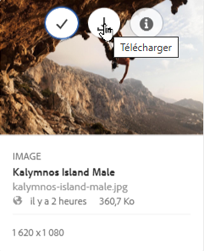
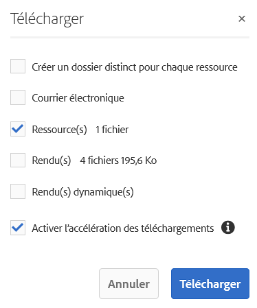
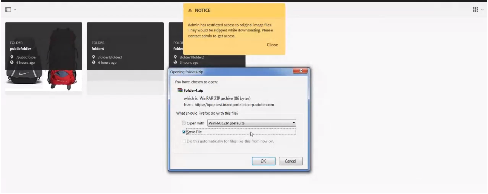
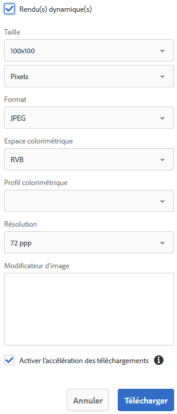

# Téléchargement de ressources {#download-assets}

<!-- Before update in Download experience - 26th Aug 2020 by Vishabh.
 All users can simultaneously download multiple assets and folders accessible to them from Brand Portal. This way, approved brand assets can be securely distributed for offline use. Read on to know how to download approved assets from Brand Portal, and what to expect from the [download performance](../using/brand-portal-download-users.md#main-pars-header).
-->

Le portail de la marque Adobe Experience Manager Assets améliore l’expérience de téléchargement en permettant aux utilisateurs de télécharger simultanément plusieurs fichiers et dossiers accessibles à partir du portail de la marque. Ainsi, les ressources de marque approuvées peuvent être distribuées en toute sécurité pour une utilisation en mode hors connexion. Lisez ce qui suit pour savoir comment télécharger des ressources approuvées à partir de Brand Portal et en savoir plus sur les [performances de téléchargement](../using/brand-portal-download-users.md#expected-download-performance).

>[!NOTE]
>
>Installez IBM Aspera Connect 3.9.9 dans l’extension de votre navigateur avant de télécharger les ressources à partir de Brand Portal.

<!--
**Types of renditions in Brand Portal:**

* Original asset rendition

  It is the original binary of the asset uploaded in AEM Assets. 
  
  
* System renditions

  These are the thumbnail renditions which are automatically generated in AEM Assets based on the "DAM update asset" workflow. 
  
* Custom renditions

  These are the additional renditions that an asset might have and its dynamic renditions. Any user can create additional custom renditions, whereas, only the AEM administrator can create dynamic renditions of an image in AEM Assets. To know more, see [how to apply image presets or dynamic renditions](../using/brand-portal-image-presets.md).     
-->

## Configuration du téléchargement de fichier {#configure-download}

La configuration du téléchargement permet aux administrateurs du portail des marques de définir l’ensemble de rendus disponibles pour les utilisateurs du portail des marques pour le téléchargement des ressources. L’administrateur peut configurer les paramètres de **[!UICONTROL téléchargement]** des ressources depuis l’interface du portail de la marque.

Les configurations disponibles sont les suivantes :

* **[!UICONTROL Téléchargement rapide]**

   Permet le téléchargement à grande vitesse des ressources. Pour en savoir plus, reportez-vous au [guide pour accélérer les téléchargements depuis le portail](../using/accelerated-download.md)de la marque.

* **[!UICONTROL Rendus personnalisés]**

   Téléchargez des rendus personnalisés et (ou) dynamiques des ressources.
Tous les rendus de ressources autres que l’actif d’origine et les rendus générés par le système sont appelés en tant que rendus personnalisés. Il comprend des rendus statiques et dynamiques disponibles pour la ressource. Tout utilisateur peut créer un rendu statique personnalisé en AEM Assets, alors que seul l’administrateur AEM peut créer des rendus dynamiques personnalisés. Pour en savoir plus, voir [comment appliquer des paramètres d’image prédéfinis ou des rendus dynamiques](../using/brand-portal-image-presets.md)

* **[!UICONTROL Rendus du système]**

   Téléchargez les rendus des ressources générés par le système. Il s’agit des miniatures qui sont automatiquement générées dans AEM Assets en fonction du flux de travaux &quot;DAM update asset&quot;.

Connectez-vous à votre client du portail de marques en tant qu’administrateur et accédez à **[!UICONTROL Outils]** > **[!UICONTROL Télécharger]**. Par défaut, la configuration du téléchargement **** rapide est activée dans les paramètres **[!UICONTROL de]** téléchargement.

Les administrateurs peuvent activer n’importe quelle combinaison pour configurer le processus de téléchargement des ressources.

En fonction de la configuration, le processus de téléchargement reste constant pour les ressources autonomes, les fichiers multiples, les dossiers contenant des ressources, les ressources sous licence ou non, et le téléchargement des ressources à l’aide du lien de partage.

* Si les configurations Rendus **** personnalisés et Rendus **** système sont désactivées, les rendus originaux des ressources sont téléchargés sans que des boîtes de dialogue supplémentaires ne soient présentées aux utilisateurs.

<!--
If all the three download configurations are turned-off, or only the **[!UICONTROL Fast Download]** configuration is enabled, the original assets are directly downloaded on your local system with no additional step required.
Test.. 
-->

* Si l’une des configurations de rendus **** personnalisés ou de rendus **** système est activée, une boîte de dialogue de **[!UICONTROL téléchargement]** supplémentaire s’affiche, dans laquelle vous pouvez choisir de télécharger la ressource d’origine avec ses rendus ou de ne télécharger que des rendus spécifiques.

>[!NOTE]
>
>Seuls les administrateurs peuvent télécharger les fichiers expirés. For more information about expired assets, see [manage digital rights of assets](../using/manage-digital-rights-of-assets.md).

## Étapes de téléchargement des ressources     {#steps-to-download-assets}

Vous trouverez ci-dessous la procédure à suivre pour télécharger des fichiers ou des dossiers contenant des fichiers à partir du portail de marque :

1. Dans l’interface de Brand Portal, effectuez l’une des opérations suivantes :

   * Sélectionnez les dossiers ou les ressources que vous souhaitez télécharger. Dans la barre d’outils supérieure, cliquez sur l’icône **[!UICONTROL Télécharger]**.

      

   * Pour télécharger un fichier ou un dossier spécifique, placez le pointeur sur le fichier ou le dossier et cliquez sur l’icône **[!UICONTROL Télécharger]** disponible dans les miniatures d’action rapide.

      

      >[!NOTE]
      >
      >Si vous téléchargez les ressources pour la première fois et si IBM Aspera Connect n’est pas installé dans votre navigateur, vous serez invité à installer l’accélérateur de téléchargement Aspera.

      >[!NOTE]
      >
      >Si les ressources que vous téléchargez comprennent également des ressources sous licence, vous êtes redirigé vers la page **[!UICONTROL Gestion des droits d’auteur]**. Dans cette page, sélectionnez les ressources, cliquez d&#39;abord sur **[!UICONTROL Accepter]**, puis sur **[!UICONTROL Télécharger]**. Si vous choisissez de ne pas accepter, les ressources sous licence ne sont pas téléchargées.
      > 
      >License-protected assets have [license agreement attached](https://helpx.adobe.com/fr/experience-manager/6-5/assets/using/drm.html#DigitalRightsManagementinAssets) to them, which is done by setting asset&#39;s [metadata property](https://helpx.adobe.com/fr/experience-manager/6-5/assets/using/drm.html#DigitalRightsManagementinAssets) in Experience Manager Assets.

      

      Si l’une des configurations de rendus **** personnalisés ou de rendus **** système est activée dans les paramètres **[!UICONTROL de]** téléchargement, la boîte de dialogue **[!UICONTROL Télécharger s’affiche avec la case à cocher Ressources(s)activée par défaut.]****** Si la configuration Téléchargement **** rapide est activée, la case à cocher **[!UICONTROL Activer l’accélération]** de téléchargement est cochée par défaut.

      

      >[!NOTE]
      >
      >If the downloading assets are image files, and you select only the **[!UICONTROL Asset(s)]** check box in the **[!UICONTROL Download]** dialog but are not [authorized by the administrator to have access to the original renditions of image files](../using/brand-portal-adding-users.md#main-pars-procedure-202029708) then no image files are downloaded and a notification appears, stating that you have been restricted by the administrator to access original renditions.

      

1. Pour télécharger les rendus en plus des ressources d’origine, cochez la case **[!UICONTROL Rendu(s)]** . Toutefois, si vous souhaitez télécharger les rendus générés par le système avec les rendus personnalisés, désactivez la case à cocher **[!UICONTROL Exclure les rendus]** système.

   

   * Pour télécharger uniquement les rendus, désactivez la case à cocher **[!UICONTROL Fichiers]** .

      >[!NOTE]
      >
      >Par défaut, seules les ressources sont téléchargées. Toutefois, les rendus originaux des fichiers images ne sont pas téléchargés si vous n’êtes pas [autorisé par l’administrateur à y accéder](../using/brand-portal-adding-users.md#main-pars-procedure-202029708).

   * Pour partager les fichiers sélectionnés avec d’autres utilisateurs par le biais d’un lien, cochez la case **[!UICONTROL Courriel]** . Une notification par courrier électronique est envoyée aux utilisateurs avec le lien de téléchargement. To know how to download assets from shared links, see [downloading assets from shared links](../using/brand-portal-link-share.md#main-pars-header-1703469193).

      

      >[!NOTE]
      >
      >Le lien de téléchargement sur la notification par courrier électronique expire après 45 jours.
      >
      >The administrators can customize email messages, that is, logo, description, and footer, using the [Branding](../using/brand-portal-branding.md) feature.

   * Vous pouvez sélectionner un paramètre d’image prédéfini prédéfini ou créer un rendu dynamique personnalisé à partir de la boîte de dialogue **[!UICONTROL Télécharger]** .

      To apply a [custom image preset to the asset and its renditions](../using/brand-portal-image-presets.md#applyimagepresetswhendownloadingimages), select the **[!UICONTROL Dynamic Rendition(s)]** check box. Spécifiez les propriétés des paramètres d’image prédéfinis (telles que la taille, le format, l’espace colorimétrique, la résolution et le modificateur d’image) pour appliquer le paramètre d’image prédéfini personnalisé lors du téléchargement du fichier et de ses rendus. Pour télécharger uniquement les rendus dynamiques, désactivez la case à cocher **[!UICONTROL Fichiers]** .

      

      >[!NOTE]
      >
      >Le portail de marque prend en charge la configuration de Contenu multimédia dynamique en mode Hybird et Scene7.
      >
      >(*If AEM (Author) instance is running on **Dynamic Media Hybrid mode***)      >Pour prévisualisation ou télécharger des rendus dynamiques d’un fichier, assurez-vous que le média dynamique est activé et que le rendu de l’élément pyramidal existe sur l’instance d’auteur AEM Assets à partir de laquelle les ressources ont été publiées. Lorsqu’une ressource est publiée sur Brand Portal, son rendu Pyramid tiff l’est également.

   * To preserve the Brand Portal folder hierarchy while downloading assets, select the **[!UICONTROL Create separate folder for each asset]** check box. Par défaut, la hiérarchie des dossiers du portail des marques est ignorée et tous les fichiers sont téléchargés dans un dossier de votre système local.

1. Cliquez sur **[!UICONTROL Télécharger]**.

   Les fichiers (et les rendus, le cas échéant) sont téléchargés sous la forme d’un fichier zip dans votre dossier local. Cependant, aucun fichier zip n’est créé si un fichier unique est téléchargé sans aucun rendu.

   Si vous n’êtes pas [autorisé par l’administrateur à accéder aux rendus](../using/brand-portal-adding-users.md#main-pars-procedure-202029708)d’origine, les rendus d’origine des ressources sélectionnées ne sont pas téléchargés.

   >[!NOTE]
   >
   >Les ressources téléchargées individuellement sont visibles dans le rapport de téléchargement des ressources. Cependant, si un dossier contenant des ressources est téléchargé, le dossier et les ressources ne s’affichent pas dans le rapport de téléchargement des ressources.

## Performances de téléchargement attendues {#expected-download-performance}

L’expérience de téléchargement de fichier peut varier pour les utilisateurs situés à différents emplacements, en fonction de facteurs tels que la connexion Internet locale et la latence du serveur. Les performances de téléchargement attendues pour les fichiers de 2 Go observés à différents emplacements clients sont les suivantes, avec le serveur Brand Portal à Oregon aux États-Unis :

| Emplacement du client | Latence entre le client et le serveur | Vitesse de téléchargement prévue | Durée de téléchargement d’un fichier de 2 Go |
|-------------------------|-----------------------------------|-------------------------|------------------------------------|
| Ouest des États-Unis (Californie du Nord) | 18 millisecondes | 7,68 Mo/s. | 4 minutes |
| Ouest des États-Unis (Oregon) | 42 millisecondes | 3,84 Mo/s. | 9 minutes |
| Est des États-Unis (Virginie du Nord) | 85 millisecondes | 1,61 Mo/s. | 21 minutes |
| Asie-Pacifique (Tokyo) | 124 millisecondes | 1,13 Mo/s. | 30 minutes |
| Noida | 275 millisecondes | 0,5 Mo/s. | 68 minutes |
| Sydney | 175 millisecondes | 0,49 Mo/s. | 69 minutes |
| Londres | 179 millisecondes | 0,32 Mo/s. | 106 minutes |
| Singapour | 196 millisecondes | 0,5 Mo/s. | 68 minutes |

>[!NOTE]
>
>Les données citées sont observées dans des conditions de test, qui peuvent varier pour les utilisateurs à différents endroits où la latence et la bande passante varient.

