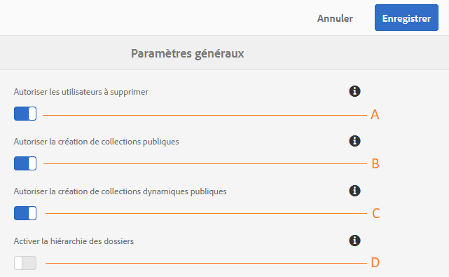

# Administration des configurations générales du client {#administer-general-tenant-configurations}

AEM Assets Brand Portal permet aux organisations de configurer les fonctionnalités suivantes pour des clients spécifiques :

* Suppression des ressources par les administrateurs
* Création de collections publiques par des utilisateurs non administrateurs
* Création de collections dynamiques publiques par des utilisateurs non administrateurs
* Hiérarchie parente des dossiers partagés visible pour les utilisateurs non-administrateurs

Ces fonctionnalités sont proposées sous la forme de configurations de **[!UICONTROL Paramètres généraux]** dans le panneau des outils d’administration.

**A** Configuration autorisant les administrateurs à supprimer des ressources de Brand Portal. (activée par défaut).

**B** Configuration autorisant les utilisateurs non administrateurs à créer des collections publiques. (activée par défaut).

**C** Configuration autorisant les utilisateurs non administrateurs à créer des collections dynamiques publiques. (activée par défaut).

**D** Configuration pour afficher la hiérarchie des dossiers (de la racine) des dossiers partagés aux utilisateurs non administrateurs (éditeurs, visionneuses, utilisateurs invités). (désactivée par défaut).

## Activation/désactivation des configurations générales    {#enable-disable-general-configurations}

Pour activer/désactiver chacune de ces configurations :

1. Connectez-vous avec les privilèges d’administrateur.
1. Sélectionnez le logo AEM pour accéder aux outils d’administration dans la barre d’outils supérieure.
1. À partir du panneau des outils d’administration, sélectionnez **[!UICONTROL Général]** pour ouvrir la page **[!UICONTROL Paramètres généraux]**.
1. Utilisez le commutateur respectif pour activer/désactiver chacune des configurations générales.
1. **[!UICONTROL Enregistrez]** les modifications.
1. Déconnectez-vous pour que les modifications soient appliquées.

## Autorisation de la suppression des ressources de Brand Portal par les utilisateurs administrateurs  {#allow-admin-users-to-delete-assets-from-brand-portal}

**[!UICONTROL La configuration Autoriser les utilisateurs à supprimer]** permet aux organisations d’autoriser les utilisateurs avec les privilèges d’administrateur à supprimer des ressources et des dossiers de Brand Portal, ou de les en restreindre.

## Autorisation de la création de collections publiques par les utilisateurs non administrateurs {#allow-public-collections-creation-by-non-admins}

La configuration [[!UICONTROL Autoriser la création de collections publiques]](../using/brand-portal-share-collection.md#main-pars-text-1915052376) contrôle si les utilisateurs non administrateurs peuvent créer des collections publiques sur Brand Portal. La configuration est activée par défaut. En la désactivant, les organisations peuvent éviter d’avoir de nombreuses collections publiques sur leur portail afin d’économiser l’espace du système.

## Autorisation de la création de collections dynamiques publiques par les utilisateurs non administrateurs {#allow-public-smart-collections-creation-by-non-admins}

La configuration [[!UICONTROL Autoriser la création de collections dynamiques publiques]](../using/brand-portal-searching.md#main-pars-header-500620467) contrôle si les non administrateurs peuvent enregistrer leurs recherches sous la forme de collections dynamiques et les rendre publiques pour ce client. La configuration est activée par défaut. En la désactivant, les organisations peuvent éviter la création d’un nombre très important de collections dynamiques publiques par les utilisateurs non-administrateurs sur le Brand Portal de l’organisation.

<!-- 
## Allow download acceleration {#allow-download-acceleration}

[[!UICONTROL Allow download acceleration]](../using/accelerated-download.md) configuration lets the organizations to allow accelerated downloads of assets from Brand Portal and shared links, by integrating with IBM Aspera Connect that is an install-on-demand application. The application uses proprietary technology to remove TCP overheads.
-->

## Activation de la hiérarchie de dossiers    {#enable-folder-hierarchy}

La configuration [[!UICONTROL Activer la hiérarchie de dossiers]](../using/brand-portal-sharing-folders.md#non-admin-user-access-to-shared-folders) permet aux administrateurs de contrôler la façon dont, une fois connectés, les utilisateurs non-administrateurs (éditeurs, observateurs et utilisateurs invités) voient les dossiers partagés.
