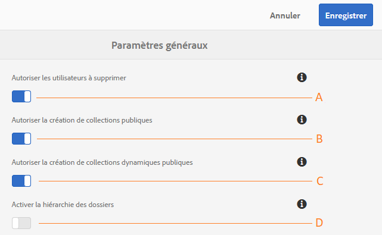

# Administration des configurations générales du client {#administer-general-tenant-configurations}

Experience Manager Assets Brand Portal permet aux organisations de configurer les fonctionnalités suivantes pour des clients spécifiques :

* Suppression des ressources par les administrateurs
* Création de collections publiques par des utilisateurs non administrateurs
* Création de collections dynamiques publiques par des utilisateurs non administrateurs
* La hiérarchie parente des dossiers partagés est visible par les utilisateurs non-administrateurs

Ces configurations ont été fournies en tant que configurations **[!UICONTROL Paramètres généraux]** dans le panneau des outils d’administration.

**A** - Configuration pour permettre aux administrateurs de supprimer des ressources de Brand Portal. (activée par défaut).

**B** - Configuration pour permettre aux utilisateurs non-administrateurs de créer des collections publiques. (activée par défaut).

**C** - Configuration pour permettre aux utilisateurs non-administrateurs de créer des collections dynamiques publiques. (activée par défaut).

**D** - Configuration pour afficher la hiérarchie de dossiers (à partir de la racine) des dossiers partagés aux utilisateurs non-administrateurs (éditeurs, observateurs, utilisateurs invités). (désactivée par défaut).

## Activation ou désactivation des configurations générales {#enable-disable-general-configurations}

Pour activer ou désactiver chacune de ces configurations :

1. Connectez-vous avec des droits d’administrateur.
1. Sélectionnez le logo Experience Manager pour accéder aux outils d’administration dans la barre d’outils supérieure.
1. À partir du panneau des outils d’administration, sélectionnez **[!UICONTROL Général]** pour ouvrir la page **[!UICONTROL Paramètres généraux]**.
1. Utilisez le bouton (bascule) correspondant pour activer ou désactiver l’une des configurations générales.
1. **[!UICONTROL Enregistrez]** les modifications.
1. Déconnectez-vous afin que les modifications puissent prendre effet.

## Autorisation de la suppression des ressources de Brand Portal par les utilisateurs administrateurs {#allow-admin-users-to-delete-assets-from-brand-portal}

La configuration **[!UICONTROL Autoriser les utilisateurs à supprimer]** permet aux organisations d’autoriser les utilisateurs avec les privilèges d’administrateur à supprimer des ressources et des dossiers de Brand Portal, ou de les en restreindre.

## Autorisation de la création de collections publiques par les utilisateurs non-administrateurs {#allow-public-collections-creation-by-non-admins}

La configuration [[!UICONTROL Autoriser la création de collections publiques]](../using/brand-portal-share-collection.md#main-pars-text-1915052376) contrôle si les utilisateurs non-administrateurs peuvent créer des collections publiques sur Brand Portal. La configuration est activée par défaut. En désactivant la configuration, les entreprises peuvent éviter d’avoir de nombreuses collections publiques sur leur portail afin d’économiser de l’espace système.

## Autorisation de la création de collections dynamiques publiques par les utilisateurs non administrateurs {#allow-public-smart-collections-creation-by-non-admins}

La configuration [[!UICONTROL Autoriser la création de collections dynamiques publiques]](../using/brand-portal-searching.md#main-pars-header-500620467) contrôle si les non-administrateurs peuvent enregistrer leurs recherches sous la forme de collections dynamiques et les rendre publiques pour ce client. La configuration est activée par défaut. En désactivant la configuration, les organisations peuvent éviter qu’un grand nombre de collections dynamiques publiques soient créées par des utilisateurs non administrateurs sur le Brand Portal de l’organisation.

<!-- 
## Allow download acceleration {#allow-download-acceleration}

[[!UICONTROL Allow download acceleration]](../using/accelerated-download.md) configuration lets the organizations to allow accelerated downloads of assets from Brand Portal and shared links, by integrating with IBM Aspera Connect that is an install-on-demand application. The application uses proprietary technology to remove TCP overheads.
-->

## Activer la hiérarchie de dossiers {#enable-folder-hierarchy}

La configuration [[!UICONTROL Activer la hiérarchie de dossiers]](../using/brand-portal-sharing-folders.md#non-admin-user-access-to-shared-folders) permet aux administrateurs de contrôler la façon dont, une fois connectés, les utilisateurs non-administrateurs (éditeurs, observateurs et utilisateurs invités) voient les dossiers partagés.
