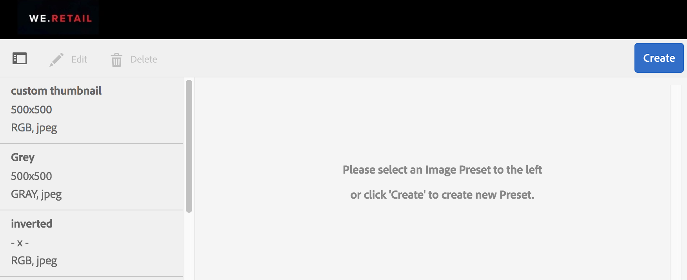
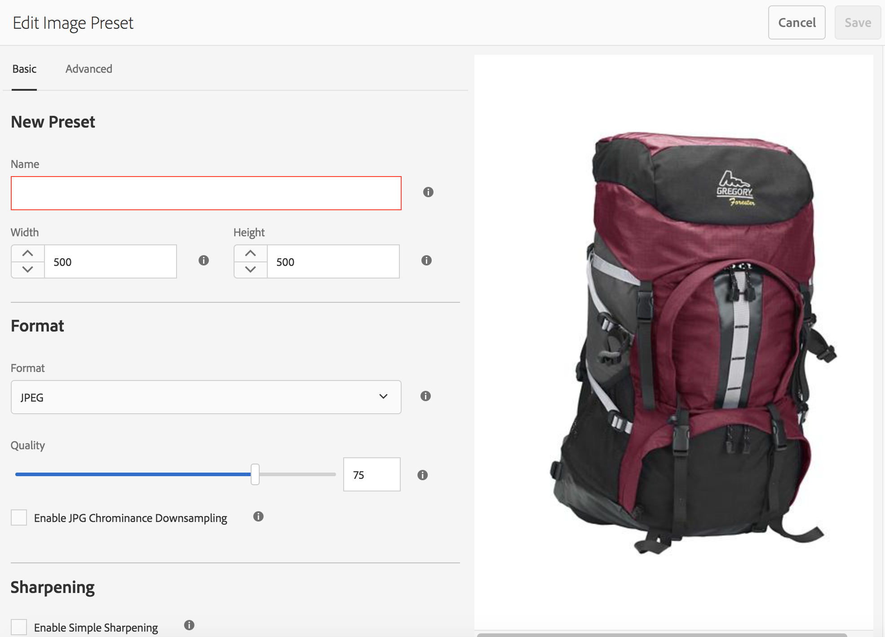
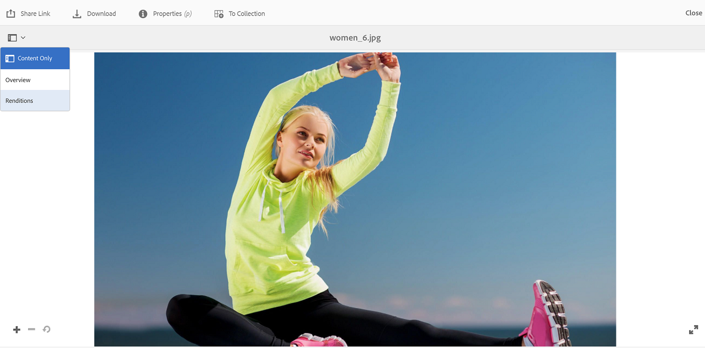
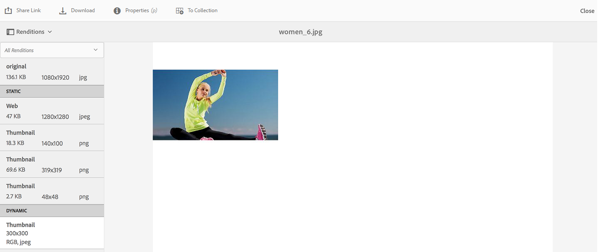
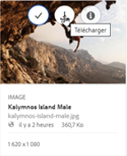
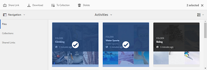
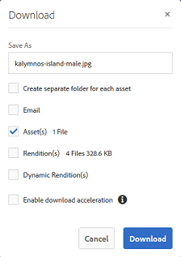
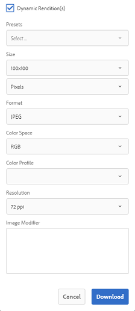

# Application de paramètres d’image prédéfinis ou de rendus dynamiques {#apply-image-presets-or-dynamic-renditions}

Tout comme une macro, un paramètre d’image prédéfini est un ensemble prédéfini de commandes de dimensionnement et de formatage enregistrées sous un nom. Les paramètres d’image prédéfinis permettent à Experience Manager Assets Brand Portal de diffuser dynamiquement des images ayant des tailles, des propriétés et des formats différents.

Un paramètre d’image prédéfini est utilisé pour générer des rendus dynamiques d’images qui peuvent être prévisualisés et téléchargés. Lors de la prévisualisation d’images et de leurs rendus, vous pouvez choisir un paramètre prédéfini pour reformater les images selon les spécifications définies par l’administrateur.

(*Si l’instance d’auteur Experience Manager Assets est en cours d’exécution en **mode hybride Dynamic Media***). Pour afficher les rendus dynamiques d’une ressource dans Brand Portal, assurez-vous que son rendu Pyramid TIFF existe au niveau de l’instance de création Experience Manager Assets à partir de laquelle vous publiez sur Brand Portal. Lorsque vous publiez une ressource, son rendu PTIFF est également publié sur Brand Portal.

>[!NOTE]
>
>Lors du téléchargement des images et de leurs rendus, il n’existe aucune option permettant de choisir parmi les paramètres prédéfinis existants. Vous pouvez plutôt spécifier les propriétés d’un paramètre d’image prédéfini personnalisé. Pour plus d’informations, voir [Application de paramètres d’image prédéfinis lors du téléchargement des images](../using/brand-portal-image-presets.md#main-pars-text-1403412644).

Pour plus d’informations sur les paramètres requis lors de la création de paramètres d’image prédéfinis, voir [Gestion des paramètres d’image prédéfinis](../using/brand-portal-image-presets.md).

## Création d’un paramètre d’image prédéfini {#create-an-image-preset}

Les administrateurs et administratrices Experience Manager Assets peuvent créer des paramètres d’image prédéfinis qui apparaissent comme des rendus dynamiques sur la page des détails des ressources. Vous pouvez créer entièrement un paramètre d’image prédéfini ou enregistrer un paramètre prédéfini existant en lui attribuant un nouveau nom. Lors de la création d’un paramètre d’image prédéfini, choisissez une taille pour la diffusion d’images et les commandes de formatage. Lorsqu’une image est diffusée en vue d’être affichée, son aspect est optimisé selon les commandes sélectionnées.

>[!NOTE]
>
>Les rendus dynamiques d’une image sont créés à l’aide de son fichier Pyramid TIFF. Si le TIFF Pyramid n’est disponible pour aucune ressource, les rendus dynamiques de cette ressource ne peuvent pas être récupérés dans Brand Portal.
>
>Si l’instance de création Experience Manager Assets est en cours d’exécution en **mode hybride Dynamic Media**, les rendus Pyramid TIFF des ressources d’image sont créés et enregistrés dans le référentiel Experience Manager Assets.
>
>Cependant, si une instance de création Experience Manager Assets est en cours d’exécution en **mode Dynamic Media Scene7**, les rendus Pyramid TIFF des ressources d’image existent sur le serveur Scene7.
>
>Lorsque ces ressources sont publiées sur Brand Portal, les paramètres d’image prédéfinis sont appliqués et les rendus dynamiques sont affichés.

1. Dans la barre d’outils supérieure, cliquez sur le logo Experience Manager pour accéder aux outils d’administration.

1. Dans le panneau des outils d’administration, cliquez sur **[!UICONTROL Paramètres d’image prédéfinis]**.

   

1. Dans la page des paramètres d’image prédéfinis, cliquez sur **[!UICONTROL Créer]**.

   

1. Dans la page **[!UICONTROL Modifier le paramètre d’image prédéfini]**, saisissez les valeurs adéquates dans les onglets **[!UICONTROL De base]** et **[!UICONTROL Avancé]**, notamment un nom. Les paramètres prédéfinis s’affichent dans le volet de gauche et peuvent être utilisés à la volée avec d’autres ressources.

   

   >[!NOTE]
   >
   >Vous pouvez également utiliser la page **[!UICONTROL Modifier le paramètre d’image prédéfini]** pour modifier les propriétés d’un paramètre d’image prédéfini existant. Pour modifier un paramètre d’image prédéfini, sélectionnez-le dans la page des paramètres d’image prédéfinis, puis cliquez sur **[!UICONTROL Modifier]**.

1. Cliquez sur **[!UICONTROL Enregistrer]**. Le paramètre d’image prédéfini est créé et affiché dans la page des paramètres d’image prédéfinis.
1. Pour supprimer un paramètre d’image prédéfini, sélectionnez-le dans la page des paramètres d’image prédéfinis et cliquez sur **[!UICONTROL Supprimer]**. Dans la page de confirmation, cliquez sur **[!UICONTROL Supprimer]** pour confirmer la suppression. Le paramètre d’image prédéfini est supprimé de la page des paramètres d’image prédéfinis.

## Application de paramètres d’image prédéfinis lors de la prévisualisation d’images {#apply-image-presets-when-previewing-images}

Lorsque vous prévisualisez des images et leurs rendus, choisissez parmi les paramètres prédéfinis existants pour reformater les images selon les spécifications définies par l’administrateur.

1. Dans l’interface de Brand Portal, cliquez sur l’image pour l’ouvrir.
1. Cliquez sur l’icône de recouvrement située à gauche, puis sélectionnez **[!UICONTROL Rendus]**.

   

1. Dans la liste **[!UICONTROL Rendus]**, sélectionnez le rendu dynamique adéquat, par exemple **[!UICONTROL Miniature]**. L’image d’aperçu est rendue selon le rendu que vous avez sélectionné.

   

## Application de paramètres d’image prédéfinis lors du téléchargement d’images {#apply-image-presets-when-downloading-images}

Lorsque vous téléchargez des images et leurs rendus à partir de Brand Portal, vous ne pouvez pas effectuer de choix parmi les paramètres d’image prédéfinis existants. Vous pouvez toutefois personnaliser les propriétés des paramètres d’image prédéfinis en fonction du reformatage souhaité des images.

1. Dans l’interface de Brand Portal, effectuez l’une des opérations suivantes :

   * Pointez sur l’image à télécharger. Dans les miniatures d’action rapide disponibles, cliquez sur l’icône **[!UICONTROL Télécharger]**.

   

   * Sélectionnez l’image à télécharger. Dans la barre d’outils supérieure, cliquez sur l’icône **[!UICONTROL Télécharger]**.

   

1. Dans la boîte de dialogue **[!UICONTROL Télécharger]**, sélectionnez les options requises selon que vous souhaitez télécharger la ressource avec ou sans ses rendus.

   

1. Pour télécharger les rendus dynamiques de la ressource, sélectionnez l’option **[!UICONTROL Rendus dynamiques]**.
1. Personnalisez les propriétés des paramètres prédéfinis d’image pour reformater l’image et ses rendus de manière dynamique pendant le téléchargement. Spécifiez la taille, le format, l’espace colorimétrique, la résolution et le modificateur d’image.

   

1. Cliquez sur **[!UICONTROL Télécharger]**. Les rendus dynamiques personnalisés sont téléchargés dans un fichier ZIP avec l’image et les rendus que vous avez choisis de télécharger. Cependant, aucun fichier zip n’est créé si une seule ressource est téléchargée, ce qui garantit un téléchargement rapide.
