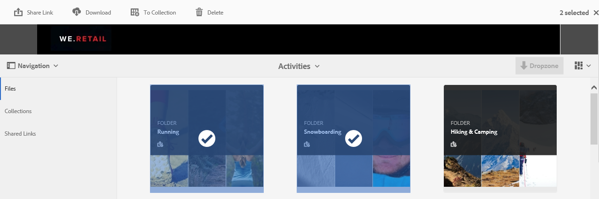

# Gestion de la collection Lightbox {#manage-the-lightbox-collection}

**[!UICONTROL Lightbox]** est un type spécial de collection fournissant un accès aisé aux ressources. Chaque utilisateur dispose d’une **[!UICONTROL Lightbox]** exclusive qui est automatiquement créée lorsqu’il se connecte pour la première fois à Brand Portal. La collection **[!UICONTROL Lightbox]** ne peut pas être supprimée.

## Ajout de ressources à Lightbox {#add-assets-to-lightbox}

Pour ajouter des ressources à **[!UICONTROL Lightbox]**, procédez comme suit :

1. Accédez à l’emplacement où se trouvent les ressources à ajouter à **[!UICONTROL Lightbox]** et sélectionnez-les.

   

1. Dans la barre d’outils supérieure, cliquez sur l’icône **Ajouter à la collection** .

   

1. Dans la page **[!UICONTROL Ajouter à la collection]**, la collection **[!UICONTROL Lightbox]** est sélectionnée par défaut.

   Cliquez sur **[!UICONTROL Ajouter]**. Les ressources sélectionnées sont ajoutées à **[!UICONTROL Lightbox]**.

   

1. Pour passer en revue les ressources ajoutées à **[!UICONTROL Lightbox]**, cliquez sur **[!UICONTROL Collections]** dans le rail de gauche, puis cliquez sur la collection **[!UICONTROL Lightbox]**.

   

   Les ressources ajoutées à **[!UICONTROL Lightbox]** apparaissent dans la page **[!UICONTROL Lightbox]**.

   

## Suppression de ressources de Lightbox {#remove-assets-from-lightbox}

1. Pour passer en revue les ressources dans [!UICONTROL Lightbox], cliquez sur **[!UICONTROL Collections]** dans le rail de gauche, puis cliquez sur la collection [!UICONTROL Lightbox].

   

1. Sélectionnez le dossier à supprimer de la collection, puis cliquez sur **[!UICONTROL Supprimer]** dans la barre d’outils supérieure.

   

1. Dans la boîte de message d’avertissement, cliquez sur **[!UICONTROL Supprimer]** pour confirmer la suppression.

Le dossier est supprimé de la collection **[!UICONTROL Lightbox]**.
