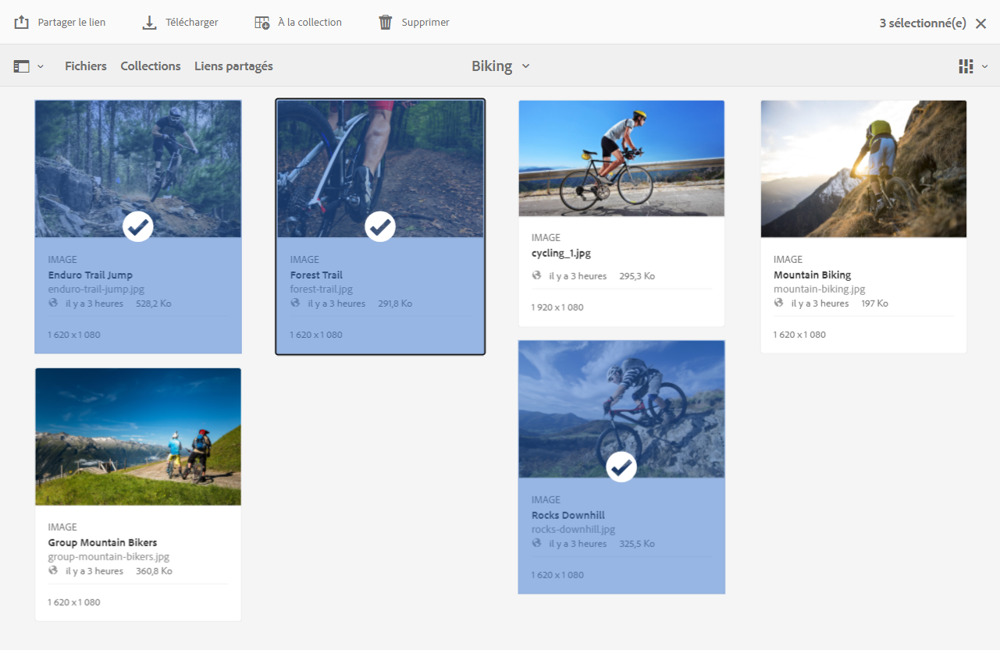
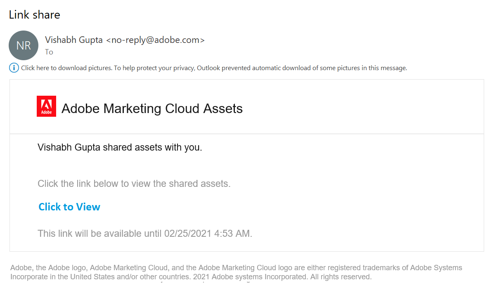
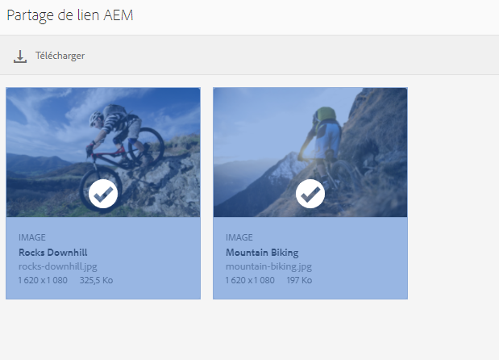
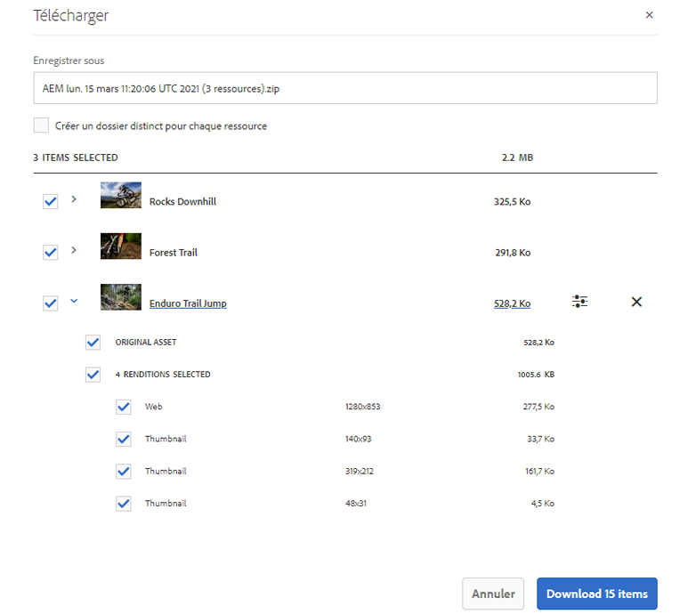
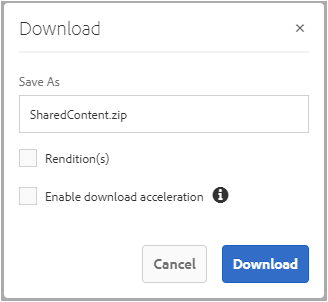
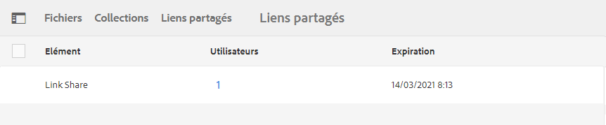
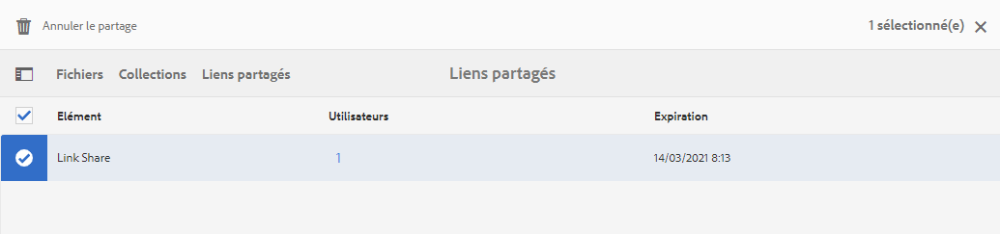

# Partage de ressources en tant que lien {#share-assets-as-a-link}

Les administrateurs d’Adobe Experience Manager Assets Brand Portal peuvent partager des liens de plusieurs ressources avec des utilisateurs internes autorisés et des tiers, notamment des partenaires et des fournisseurs. Les éditeurs peuvent uniquement afficher et partager les ressources partagées avec eux.

Le partage des ressources par le biais d’un lien est un moyen pratique pour mettre les ressources à la disposition de tiers externes sans qu’ils aient besoin de se connecter à Brand Portal.

<!-- Link sharing access is restricted to editors and administrators. 
-->

Pour plus d’informations, voir [Gestion des utilisateurs, des groupes et des rôles utilisateur](../using/brand-portal-adding-users.md#manage-user-roles).

Vous trouverez ci-dessous la procédure à suivre pour partager des ressources sous forme de lien :

1. Connectez-vous à votre client Brand Portal. Par défaut, la vue **[!UICONTROL Fichiers]** s’ouvre et contient toutes les ressources et dossiers publiés.

1. Sélectionnez les ressources ou les dossiers que vous souhaitez partager, ou accédez à la vue **[!UICONTROL Collections]** pour partager les collections que vous avez créées.

   

1. Dans la barre d’outils supérieure, cliquez sur l’icône **[!UICONTROL Partager le lien]**.

   La boîte de dialogue **[!UICONTROL Partage de lien]** s’affiche.

   

   * Dans la zone d’email, saisissez l’adresse email de l’utilisateur avec lequel vous souhaitez partager le lien. Vous pouvez partager le lien avec plusieurs utilisateurs. Si l’utilisateur appartient à votre organisation, sélectionnez son e-mail dans la liste déroulante de suggestions qui s’affiche. Si l’utilisateur est externe à votre organisation, saisissez l’e-mail complet et appuyez sur **[!UICONTROL Entrée]** pour l’ajouter à la liste des utilisateurs.

      

   * Dans la zone **[!UICONTROL Objet]**, indiquez l’objet de la ressource que vous souhaitez partager.
   * Dans la zone **[!UICONTROL Message]**, vous pouvez, au besoin, saisir un message.
   * Dans le champ **[!UICONTROL Expiration]**, spécifiez la date et l’heure d’expiration du lien à l’aide du sélecteur de date. Par défaut, la date d’expiration est définie sur 7 jours à compter de la date à laquelle vous partagez le lien.
   * Cochez la case **[!UICONTROL Autoriser le téléchargement du fichier d’origine]** pour permettre aux destinataires de télécharger le rendu d’origine.

   Les ressources partagées via le lien arrivent à expiration une fois que la date et l’heure spécifiées dans le champ **[!UICONTROL Expiration]** ont été atteintes. Pour plus d’informations sur le comportement des ressources arrivées à expiration et les modifications des activités possibles en fonction des rôles utilisateur dans Brand Portal, voir [Gestion des droits numériques des ressources](../using/manage-digital-rights-of-assets.md#asset-expiration).

   >[!NOTE]
   >
   >Le délai d’expiration par défaut du lien est de 7 jours. Le lien doit être envoyé par email aux utilisateurs à l’aide de la boîte de dialogue **[!UICONTROL Partage de lien]**, ne copiez pas et ne partagez pas le lien séparément.

1. Cliquez sur **[!UICONTROL Partager]**. Un message confirme le partage du lien avec les utilisateurs. Les utilisateurs reçoivent un email contenant le lien partagé.

   

   >[!NOTE]
   >
   >Les administrateurs peuvent personnaliser les e-mails, à savoir le logo, la description et le pied de page avec la fonction [Valorisation de la marque](../using/brand-portal-branding.md).

## Téléchargement de ressources à partir de liens partagés {#download-assets-from-shared-links}

Cliquez sur le lien de l’email pour accéder à la ressource partagée. La page Partage de lien AEM s’ouvre.

Pour télécharger les ressources partagées :

1. Cliquez sur les ressources ou sur les dossiers, puis sur l’icône **[!UICONTROL Télécharger]** dans la barre d’outils.

   

   >[!NOTE]
   >
   >Vous pouvez actuellement générer un aperçu et une miniature uniquement pour certaines ressources, selon le format de fichier. Pour plus d’informations sur les formats de fichiers pris en charge, voir [Prise en charge des aperçus et des miniatures pour les formats de ressource](#preview-thumbnail-support).

1. La boîte de dialogue **[!UICONTROL Télécharger]** s’affiche.

   

1. Par défaut, le paramètre **[!UICONTROL Téléchargement rapide]** est activé dans les **[!UICONTROL Paramètres de téléchargement]**. Par conséquent, une zone de confirmation s’affiche pour poursuivre le téléchargement à l’aide d’IBM Aspera Connect.

   Pour continuer à utiliser le **[!UICONTROL Téléchargement rapide]**, cliquez sur **[!UICONTROL Autoriser]**.

   Tous les rendus sélectionnés sont téléchargés dans un dossier zip contenant un dossier distinct pour chaque ressource.

   >[!NOTE]
   >
   >Un dossier distinct est créé pour chaque ressource lors du téléchargement des ressources à partir d’un lien partagé.
   >
   >Si un dossier, une collection ou plus de 20 ressources sont sélectionnés pour le téléchargement, la boîte de dialogue **[!UICONTROL Télécharger]** est ignorée et tous les rendus accessibles à l’utilisateur, à l’exception des rendus dynamiques, sont téléchargés dans un dossier zip contenant un dossier séparé pour chaque ressource.

   >[!NOTE]
   >
   >Les rendus originaux ne sont pas téléchargés à l’aide du lien partagé si l’utilisateur qui a partagé les ressources sous forme de lien n’est pas [autorisé par l’administrateur à accéder aux rendus originaux](../using/brand-portal-adding-users.md#manage-group-roles-and-privileges).

>[!NOTE]
>
>Brand Portal limite le téléchargement des ressources dont la taille est supérieure à **1** Go par taille de fichier à l’aide du partage de lien.

<!--
1. The **[!UICONTROL Download]** dialog box appears.

   

    * To speed up the download of asset files shared as the link, select **[!UICONTROL Enable download acceleration]** option and [follow the wizard](../using/accelerated-download.md#download-workflow-using-file-accelerator). To know more about the fast download of assets on Brand Portal refer [Guide to accelerate downloads from Brand Portal](../using/accelerated-download.md).
    
1. To download the renditions of assets in addition to the assets from the shared link, select **[!UICONTROL Rendition(s)]** option. When you do so, **[!UICONTROL Exclude System Renditions]** option appears that is selected by default. This prevents the download of out-of-the-box renditions along with approved assets or their custom renditions.

   However, to allow auto-generated renditions to download along with custom renditions, deselect the **[!UICONTROL Exclude System Renditions]** option.

   >[!NOTE]
   >
   >Original renditions are not downloaded using the shared link if the user who shared the assets as a link is not [authorized by the administrator to have access to the original renditions](../using/brand-portal-adding-users.md#manage-group-roles-and-privileges).

   

1. Click **[!UICONTROL Download]**. The assets (and renditions if selected) are downloaded as a ZIP file to your local folder. However, no zip file is created if a single asset is downloaded without any of the renditions, thereby ensuring speedy download.

-->

## Prise en charge des aperçus et des miniatures pour les formats de ressource {#preview-thumbnail-support}

Le tableau suivant répertorie les formats de ressource pour lesquels Brand Portal prend en charge les miniatures et les aperçus :

| Format de ressource | Prise en charge des miniatures | Prise en charge des aperçus |
|--------------|-------------------|-----------------|
| PNG | ✓ | ✓ |
| GIF | ✓ | ✓ |
| TIFF | ✓ | ✕ |
| JPEG | ✓ | ✓ |
| BMP | ✓ | ✕ |
| PNM* | N/A | N/A |
| PGM* | N/A | N/A |
| PBM* | N/A | N/A |
| PPM* | N/A | N/A |
| PSD | ✓ | ✕ |
| EPS | N/A | ✕ |
| DNG | ✓ | ✕ |
| PICT | ✓ | ✕ |
| PSB* | ✓ | ✕ |
| JPG | ✓ | ✓ |
| AI | ✓ | ✕ |
| DOC | ✕ | ✕ |
| DOCX | ✕ | ✕ |
| ODT* | ✕ | ✕ |
| PDF | ✓ | ✕ |
| HTML | ✕ | ✕ |
| RTF | ✕ | ✕ |
| TXT | ✓ | ✕ |
| XLS | ✕ | ✕ |
| XLSX | ✕ | ✕ |
| ODS | ✕ | ✕ |
| PPT | ✓ | ✕ |
| PPTX | ✕ | ✕ |
| ODP | ✕ | ✕ |
| INDD | ✓ | ✕ |
| PS | ✕ | ✕ |
| QXP | ✕ | ✕ |
| EPUB | ✓ | ✕ |
| AAC | ✕ | ✕ |
| MIDI | ✕ | ✕ |
| 3GP | ✕ | ✕ |
| MP3 | ✕ | ✕ |
| MP4 | ✕ | ✕ |
| OGA | ✕ | ✕ |
| OGG | ✕ | ✕ |
| RA | ✕ | ✕ |
| WAV | ✕ | ✕ |
| WMA | ✕ | ✕ |
| DVI | ✕ | ✕ |
| FLV | ✕ | ✕ |
| M4V | ✕ | ✕ |
| MPG | ✕ | ✕ |
| OGV | ✕ | ✕ |
| MOV | ✕ | ✕ |
| WMV | ✕ | ✕ |
| SWF | ✕ | ✕ |
| TGZ | N/A | ✕ |
| JAR | ✓ | ✕ |
| RAR | N/A | ✕ |
| TAR | N/A | ✕ |
| ZIP | ✓ | ✕ |

La légende suivante explique les symboles utilisés dans le tableau :

| Symbole | Signification |
|---|---|
| ✓ | Ce format de fichier prend en charge cette fonctionnalité. |
| ✕ | Ce format de fichier ne prend pas en charge cette fonctionnalité. |
| N/A | Cette fonctionnalité ne s’applique pas à ce format de fichier. |
| * | Cette fonctionnalité requiert la prise en charge d’un module complémentaire pour ce format de fichier sur une instance de création AEM, mais pas sur Brand Portal une fois que les ressources ont été publiées sur Brand Portal. |

## Annulation du partage des ressources partagées en tant que lien {#unshare-assets-shared-as-a-link}

Pour annuler le partage des ressources partagées auparavant en tant que lien, procédez comme suit :

1. Lorsque vous vous connectez à Brand Portal, la vue **[!UICONTROL Fichier]** s’ouvre par défaut. Pour afficher les ressources que vous avez partagées en tant que liens, accédez à la vue **[!UICONTROL Liens partagés]**.

1. Passez en revue les liens que vous avez partagés dans la liste affichée.

   

1. Pour annuler le partage d’un lien de la liste, sélectionnez-le et cliquez sur l’icône **[!UICONTROL Annuler le partage]** de la barre d’outils située en haut de l’écran.

   

   >[!NOTE]
   >
   >L’affichage des liens partagés est spécifique à l’utilisateur. Cette fonctionnalité n’affiche pas tous les liens partagés par tous les utilisateurs d’un client.

1. Dans la boîte de message d’avertissement, cliquez sur **[!UICONTROL Continuer]** pour confirmer l’annulation du partage. L’entrée du lien est supprimée de la liste des liens partagés.
