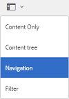

# Partage de ressources en tant que lien {#share-assets-as-a-link}

Les administrateurs d’AEM Assets Brand Portal peuvent partager des liens de plusieurs ressources avec des utilisateurs internes autorisés et des tiers, notamment des partenaires et des fournisseurs. Les éditeurs peuvent uniquement afficher et partager les ressources partagées avec eux.

Le partage des ressources par le biais d’un lien est un moyen pratique pour mettre les ressources à la disposition de tiers externes sans qu’ils aient besoin de se connecter à Brand Portal.

Le partage de liens est réservé aux éditeurs et aux administrateurs. Pour plus d’informations, voir [Gestion des utilisateurs, des groupes et des rôles utilisateur](../using/brand-portal-adding-users.md#manage-user-roles).

>[!NOTE]
>
>La fonctionnalité de partage de lien de Brand Portal permet de télécharger jusqu’à 5 Go de fichiers compressés.

Pour partager des ressources sous forme de lien, procédez comme suit :

1. Cliquez sur l’icône de recouvrement située à gauche, puis sélectionnez **[!UICONTROL Navigation]**.

   

1. Dans le rail latéral gauche, cliquez sur **[!UICONTROL Fichiers]** pour partager des dossiers ou des images. Pour partager des collections, cliquez sur **[!UICONTROL Collections]**.

   

1. Sélectionnez les dossiers ou les collections à partager en tant que lien.

   

1. Dans la barre d’outils supérieure, cliquez sur l’icône **[!UICONTROL Partager le lien]**.

   La boîte de dialogue **[!UICONTROL Partage de lien]** s’affiche.

   

   >[!NOTE]
   >
   >Le champ **[!UICONTROL Partager le lien]** affiche un lien de ressource automatiquement créé. Le délai d’expiration par défaut du lien est de 7 jours. Vous pouvez copier ce lien et le partager séparément avec des utilisateurs. Vous pouvez aussi le partager depuis la boîte de dialogue **[!UICONTROL Partage de lien]**.

1. Dans la zone d’e-mail, saisissez l’e-mail de l’utilisateur avec lequel vous souhaitez partager le lien. Vous pouvez partager le lien avec plusieurs utilisateurs.

   Si l’utilisateur appartient à votre organisation, sélectionnez son e-mail dans la liste déroulante de suggestions qui s’affiche. Si l’utilisateur est externe à votre organisation, saisissez l’e-mail complet et appuyez sur **[!UICONTROL Entrée]** pour l’&#39;ajouter à la liste des utilisateurs.

   

1. Dans la zone **[!UICONTROL Objet]**, indiquez l’objet de la ressource que vous souhaitez partager.
1. Dans la zone **[!UICONTROL Message]**, vous pouvez, au besoin, saisir un message.
1. Dans le champ **[!UICONTROL Expiration]**, spécifiez la date et l’heure d’expiration du lien à l’aide du sélecteur de date. Par défaut, la date d’expiration est définie sur 7 jours à compter de la date à laquelle vous partagez le lien.

   Les ressources partagées via le lien arrivent à expiration une fois que la date et l’heure spécifiées dans le champ **[!UICONTROL Expiration]** ont été atteintes. Pour plus d’informations sur le comportement des ressources arrivées à expiration et les modifications des activités possibles en fonction des rôles utilisateur dans Brand Portal, voir [Gestion des droits numériques des ressources](../using/manage-digital-rights-of-assets.md#asset-expiration).

1. Cliquez sur **[!UICONTROL Partager]**. Un message confirme le partage du lien avec les utilisateurs. Les utilisateurs reçoivent un e-mail contenant le lien.

   

   >[!NOTE]
   >
   >Les administrateurs peuvent personnaliser les e-mails, à savoir le logo, la description et le pied de page avec la fonction [Valorisation de la marque](../using/brand-portal-branding.md).

## Téléchargement de ressources à partir de liens partagés {#download-assets-from-shared-links}

Cliquez sur le lien de l’e-mail pour afficher la ressource partagée. La page Partage de lien AEM s’ouvre.

Pour télécharger les ressources partagées :

1. Cliquez sur les ressources, puis sur l’icône **[!UICONTROL Télécharger]** de la barre d’outils.

   

   >[!NOTE]
   >
   >Vous pouvez actuellement générer un aperçu et une miniature uniquement pour certaines ressources, selon le format de fichier. Pour plus d’informations sur les formats de fichiers pris en charge, voir [Prise en charge des aperçus et des miniatures pour les formats de ressource](#preview-thumbnail-support).

   >[!NOTE]
   >
   >Si les ressources que vous téléchargez comprennent également des ressources sous licence, vous êtes redirigé vers la page **[!UICONTROL Gestion des droits d’auteur]**. Dans cette page, sélectionnez les ressources sous licence, cliquez sur **[!UICONTROL Accepter]**, puis cliquez sur **[!UICONTROL Télécharger]**. Si vous choisissez de ne pas accepter, seules les ressources sans licence sont téléchargées.\
   >Les ressources protégées par licence sont [accompagnées d’un accord de licence](https://helpx.adobe.com/fr/experience-manager/6-5/assets/using/drm.html#DigitalRightsManagementinAssets) grâce à la définition de la [propriété des métadonnées](https://helpx.adobe.com/fr/experience-manager/6-5/assets/using/drm.html#DigitalRightsManagementinAssets) des ressources dans [!DNL AEM Assets].

   

   La boîte de dialogue **[!UICONTROL Téléchargement]** s’affiche.

   

   * Pour accélérer le téléchargement des fichiers de ressources partagés sous forme de lien, sélectionnez l’option **[!UICONTROL Autoriser l’accélération des téléchargements]** et [suivez l’assistant](../using/accelerated-download.md#download-workflow-using-file-accelerator). Pour en savoir plus sur le téléchargement rapide des ressources sur Brand Portal, consultez le [Guide d’accélération des téléchargements à partir de Brand Portal](../using/accelerated-download.md).

1. Pour télécharger les rendus des ressources en plus des ressources à partir du lien partagé, sélectionnez l’option **[!UICONTROL Rendu(s)]**. Lorsque vous procédez de la sorte, l’option **[!UICONTROL Exclure les rendus système]** qui apparaît est sélectionnée par défaut. Cela empêche le téléchargement des rendus prêts à l’emploi avec les ressources approuvées ou leurs rendus personnalisés.

   Toutefois, pour permettre le téléchargement des rendus auto-générés avec les rendus personnalisés, désélectionnez l’option **[!UICONTROL Exclure les rendus système]**.

   >[!NOTE]
   >
   >Les rendus originaux ne sont pas téléchargés à l’aide du lien partagé si l’utilisateur qui a partagé les ressources sous forme de lien n’est pas [autorisé par l’administrateur à accéder aux rendus originaux](../using/brand-portal-adding-users.md#manage-group-roles-and-privileges).

   

1. Appuyez/cliquez sur **[!UICONTROL Télécharger]**. Les ressources, et les rendus s’ils sont sélectionnés, sont téléchargés en tant que fichier ZIP dans votre dossier local. Cependant, aucun fichier ZIP n’est créé lorsqu’une seule ressource est téléchargée sans aucun des rendus, assurant ainsi un téléchargement rapide.

>[!NOTE]
>
>Brand Portal limite le téléchargement des ressources dont la taille de fichier est supérieure à 5 Go.

## Prise en charge des aperçus et des miniatures pour les formats de ressource {#preview-thumbnail-support}

Le tableau suivant répertorie les formats de ressource pour lesquels Brand Portal prend en charge les miniatures et les aperçus :

| Format de ressource | Prise en charge des miniatures | Prise en charge des aperçus |
|--------------|-------------------|-----------------|
| PNG | ✓ | ✓ |
| GIF | ✓ | ✓ |
| TIFF | ✓ | ✕ |
| JPEG | ✓ | ✓ |
| BMP | ✓ | ✕ |
| PNM* | N/A | N/A |
| PGM* | N/A | N/A |
| PBM* | N/A | N/A |
| PPM* | N/A | N/A |
| PSD | ✓ | ✕ |
| EPS | N/A | ✕ |
| DNG | ✓ | ✕ |
| PICT | ✓ | ✕ |
| PSB* | ✓ | ✕ |
| JPG | ✓ | ✓ |
| AI | ✓ | ✕ |
| DOC | ✕ | ✕ |
| DOCX | ✕ | ✕ |
| ODT* | ✕ | ✕ |
| PDF | ✓ | ✕ |
| HTML | ✕ | ✕ |
| RTF | ✕ | ✕ |
| TXT | ✓ | ✕ |
| XLS | ✕ | ✕ |
| XLSX | ✕ | ✕ |
| ODS | ✕ | ✕ |
| PPT | ✓ | ✕ |
| PPTX | ✕ | ✕ |
| ODP | ✕ | ✕ |
| INDD | ✓ | ✕ |
| PS | ✕ | ✕ |
| QXP | ✕ | ✕ |
| EPUB | ✓ | ✕ |
| AAC | ✕ | ✕ |
| MIDI | ✕ | ✕ |
| 3GP | ✕ | ✕ |
| MP3 | ✕ | ✕ |
| MP4 | ✕ | ✕ |
| OGA | ✕ | ✕ |
| OGG | ✕ | ✕ |
| RA | ✕ | ✕ |
| WAV | ✕ | ✕ |
| WMA | ✕ | ✕ |
| DVI | ✕ | ✕ |
| FLV | ✕ | ✕ |
| M4V | ✕ | ✕ |
| MPG | ✕ | ✕ |
| OGV | ✕ | ✕ |
| MOV | ✕ | ✕ |
| WMV | ✕ | ✕ |
| SWF | ✕ | ✕ |
| TGZ | N/A | ✕ |
| JAR | ✓ | ✕ |
| RAR | N/A | ✕ |
| TAR | N/A | ✕ |
| ZIP | ✓ | ✕ |

La légende suivante explique les symboles utilisés dans le tableau :

| Symbole | Signification |
|---|---|
| ✓ | Ce format de fichier prend en charge cette fonctionnalité. |
| ✕ | Ce format de fichier ne prend pas en charge cette fonctionnalité. |
| N/A | Cette fonctionnalité ne s’applique pas à ce format de fichier. |
| * | Cette fonctionnalité requiert la prise en charge d’un module complémentaire pour ce format de fichier sur une instance de création AEM, mais pas sur Brand Portal une fois que les ressources ont été publiées sur Brand Portal. |

## Annulation du partage des ressources partagées en tant que lien {#unshare-assets-shared-as-a-link}

Pour annuler le partage des ressources partagées auparavant en tant que lien, procédez comme suit :

1. Pour afficher les ressources que vous avez partagées en tant que liens, cliquez sur l’icône de recouvrement à gauche, puis sélectionnez **[!UICONTROL Navigation]**.

   

1. Dans le rail latéral, cliquez sur **[!UICONTROL Liens partagés]**.

   

1. Passez en revue les liens que vous avez partagés dans la liste affichée.
1. Pour annuler le partage d’un lien à partir de la liste, sélectionnez-le et cliquez sur l&#39;icône de la corbeille en regard de l’entrée du lien ou sur l’icône **[!UICONTROL Annuler le partage]** dans la barre d’outils supérieure.

   

   >[!NOTE]
   >
   >L’affichage des liens partagés est spécifique à l’utilisateur. Cette fonctionnalité n’affiche pas tous les liens partagés par tous les utilisateurs d’un client.

1. Dans la boîte de message d’avertissement, cliquez sur **[!UICONTROL Continuer]** pour confirmer l’annulation du partage. L’entrée du lien est supprimée de la liste des liens partagés.
