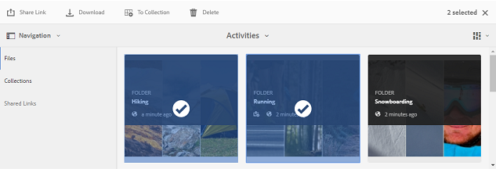
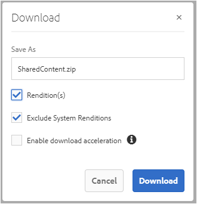

# Partage de ressources en tant que lien {#share-assets-as-a-link}

[!DNL AEM Assets Brand Portal] Les administrateurs peuvent partager des liens de plusieurs ressources avec des utilisateurs internes autorisés et des entités externes, notamment des partenaires et des fournisseurs. Les éditeurs peuvent uniquement afficher et partager les ressources partagées avec eux.

Sharing assets through a link is a convenient way of making them available to external parties as the receivers do not have to log in to [!DNL Brand Portal] to access the assets.

L’accès au partage de liens est limité aux éditeurs et aux administrateurs. For more information, see [Managing users, groups, and user roles](../using/brand-portal-adding-users.md#manage-user-roles).

>[!NOTE]
>
>Upto 5GB of zip download is allowed using link share feature on [!DNL brand portal].

Pour partager des ressources sous forme de lien, procédez comme suit :

1. Cliquez sur l’icône de recouvrement située à gauche, puis sélectionnez **Navigation**.

   

2. From the siderail on the left, click **Files** to share folders or images. To share collections, click **[!UICONTROL Collections]**.

   

3. Sélectionnez les dossiers ou les collections à partager en tant que lien.

   

4. From the toolbar at the top, click the **Share Link** icon.

   The **Link Sharing** dialog box appears.

   

   >[!NOTE]
   >
   >The **Share Link** field displays an automatically created asset link. Le délai d’expiration par défaut du lien est de 7 jours. Vous pouvez copier ce lien et le partager séparément avec des utilisateurs. Vous pouvez aussi le partager depuis la boîte de dialogue **Partage de lien**.

5. Dans la zone d’e-mail, saisissez l’e-mail de l’utilisateur avec lequel vous souhaitez partager le lien. Vous pouvez partager le lien avec plusieurs utilisateurs.

   Si l’utilisateur appartient à votre organisation, sélectionnez son e-mail dans la liste déroulante de suggestions qui s’affiche. En cas d’utilisateur externe, saisissez l’e-mail complet et appuyez sur **Entrée**. L’e-mail est ajouté à la liste des utilisateurs.

   

6. In the **Subject** box, type a subject for the asset you want to share.
7. In the **Message** box, type a message if necessary.
8. In the **Expiration** field, use the date picker to specify an expiration date and time for the link. Par défaut, la date d’expiration est définie sur 7 jours à compter de la date à laquelle vous partagez le lien.

   The assets shared through the link expire after crossing the date and time specified in the **Expiration** field. For information about the behavior of expired assets and changes in the permissible activities based on user roles in [!DNL Brand Portal], see [Manage digital rights of assets](../using/manage-digital-rights-of-assets.md#asset-expiration).

9. Cliquez sur **Partager**. Un message confirme le partage du lien avec les utilisateurs. Les utilisateurs reçoivent un e-mail contenant le lien.

   

   >[!NOTE]
   >
   >Les administrateurs peuvent personnaliser la messagerie électronique, ce qui inclut la personnalisation du logo, la description et le pied de page avec [la fonction de marque](../using/brand-portal-branding.md) .

## Téléchargement de ressources à partir de liens partagés {#download-assets-from-shared-links}

Cliquez sur le lien dans le courrier électronique, pour afficher la ressource partagée. The [!DNL AEM] Link Share page opens.

Pour télécharger les ressources partagées :

1. Click the assets and then click **Download** icon from the toolbar.

   

   >[!NOTE]
   >
   >Actuellement, vous pouvez générer un aperçu et une miniature uniquement pour certains fichiers, selon le format du fichier. Pour plus d’informations sur les formats de fichiers pris en charge, voir [Prise en charge des aperçus et des miniatures pour les formats de ressource](#preview-thumbnail-support).

   >[!NOTE]
   >
   >Si les ressources que vous téléchargez comprennent également des ressources sous licence, vous êtes redirigé vers la page **Gestion des droits d’auteur**. In this page, select the licensed assets, click **Agree**, and then click **Download**. Si vous choisissez de ne pas accepter, seules les ressources sans licence sont téléchargées.\
   >License-protected assets have [license agreement attached](https://helpx.adobe.com/experience-manager/6-5/assets/using/drm.html#DigitalRightsManagementinAssets) to them, which is done by setting asset's [metadata property](https://helpx.adobe.com/experience-manager/6-5/assets/using/drm.html#DigitalRightsManagementinAssets) in [!DNL AEM Assets].

   

   The **Download** dialog box appears.
   

   * To speed up the download of asset files shared as the link, select **Enable download acceleration** option and [follow the wizard](../using/accelerated-download.md#download-workflow-using-file-accelerator). To know more about the fast download of assets on [!DNL Brand Portal] refer [Guide to accelerate downloads from [!DNL Brand Portal]](../using/accelerated-download.md).

2. To download the renditions of assets in addition to the assets from the shared link, select **Rendition(s)** option. When you do so, **Exclude System Renditions** option appears that is selected by default. Cela empêche le téléchargement des rendus prêts à l’emploi avec les ressources approuvées ou leurs rendus personnalisés.

   However, to allow auto-generated renditions to download along with custom renditions, deselect the **Exclude System Renditions** option.

   >[!NOTE]
   >
   >Original renditions are not downloaded using the shared link if the user who shared the assets as a link is not [authorized by the administrator to have access to the original renditions](../using/brand-portal-adding-users.md#manage-group-roles-and-privileges).

   

3. Tap/ click **Download**. Les ressources (et les rendus s’ils sont sélectionnés) sont téléchargés en tant que fichier ZIP dans votre dossier local. Cependant, aucun fichier ZIP n’est créé lorsqu’une seule ressource est téléchargée sans aucun des rendus, assurant ainsi un téléchargement rapide.

>[!NOTE]
>
>[!DNL Brand Portal] limite le téléchargement des ressources dont la taille est supérieure à 5 Go par taille de fichier.

## Prise en charge des aperçus et des miniatures pour les formats de ressource {#preview-thumbnail-support}

The following matrix lists the asset formats for which [!DNL Brand Portal] supports thumbnail and preview:

| Format de ressource | Prise en charge des miniatures | Prise en charge des aperçus |
|--------------|-------------------|-----------------|
| PNG | ✓ | ✓ |
| GIF | ✓ | ✓ |
| TIFF | ✓ | ✕ |
| JPEG | ✓ | ✓ |
| BMP | ✓ | ✕ |
| PNM* | s.o. | N/A |
| PGM* | N/A | N/A |
| PBM* | N/A | N/A |
| PPM* | N/A | N/A |
| PSD | ✓ | ✕ |
| EPS | N/A | ✕ |
| DNG | ✓ | ✕ |
| PICT | ✓ | ✕ |
| PSB* | ✓ | ✕ |
| JPG | ✓ | ✓ |
| AI | ✓ | ✕ |
| DOC | ✕ | ✕ |
| DOCX | ✕ | ✕ |
| ODT* | ✕ | ✕ |
| PDF | ✓ | ✕ |
| HTML | ✕ | ✕ |
| RTF | ✕ | ✕ |
| TXT | ✓ | ✕ |
| XLS | ✕ | ✕ |
| XLSX | ✕ | ✕ |
| ODS | ✕ | ✕ |
| PPT | ✓ | ✕ |
| PPTX | ✕ | ✕ |
| ODP | ✕ | ✕ |
| INDD | ✓ | ✕ |
| PS | ✕ | ✕ |
| QXP | ✕ | ✕ |
| EPUB | ✓ | ✕ |
| AAC | ✕ | ✕ |
| MIDI | ✕ | ✕ |
| 3GP | ✕ | ✕ |
| MP3 | ✕ | ✕ |
| MP4 | ✕ | ✕ |
| OGA | ✕ | ✕ |
| OGG | ✕ | ✕ |
| RA | ✕ | ✕ |
| WAV | ✕ | ✕ |
| WMA | ✕ | ✕ |
| DVI | ✕ | ✕ |
| FLV | ✕ | ✕ |
| M4V | ✕ | ✕ |
| MPG | ✕ | ✕ |
| OGV | ✕ | ✕ |
| MOV | ✕ | ✕ |
| WMV | ✕ | ✕ |
| SWF | ✕ | ✕ |
| TGZ | N/A | ✕ |
| JAR | ✓ | ✕ |
| RAR | N/A | ✕ |
| TAR | N/A | ✕ |
| ZIP | ✓ | ✕ |

La légende suivante explique les symboles utilisés dans le tableau :

| Symbole | Signification |
|---|---|
| ✓ | Ce format de fichier prend en charge cette fonctionnalité |
| ✕ | Ce format de fichier ne prend pas en charge cette fonctionnalité. |
| s.o. | Cette fonctionnalité ne s’applique pas à ce format de fichier. |
| * | This feature requires add-on support for this file format on [!DNL AEM] author instance but not on [!DNL Brand Portal] after assets are published to [!DNL Brand Portal] |

## Annulation du partage des ressources partagées en tant que lien {#unshare-assets-shared-as-a-link}

Pour annuler le partage des ressources partagées auparavant en tant que lien, procédez comme suit :

1. To view the assets you shared as links, click the overlay icon on the left, and choose **Navigation**.

   

2. From the siderail, click **Shared Links**.

   

3. Passez en revue les liens que vous avez partagés dans la liste affichée.
4. To unshare a link from the list, select it and click the bin icon next to the link entry, or the **Unshare** icon from the toolbar at the top.

   

   >[!NOTE]
   >
   >L’affichage des liens partagés est spécifique à l’utilisateur. Cette fonctionnalité n’affiche pas tous les liens partagés par tous les utilisateurs d’un client.

5. In the warning message box, click **Continue** to confirm unshare. L’entrée du lien est supprimée de la liste des liens partagés.
