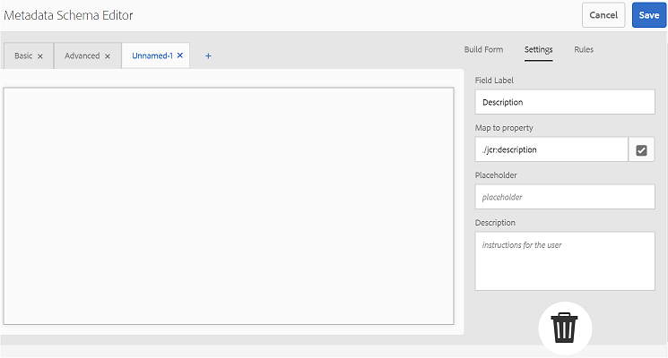

# Utilisation du formulaire de schéma de métadonnées {#use-the-metadata-schema-form}

Un schéma de métadonnées décrit la présentation de la page Propriétés et des propriétés de métadonnées affichées pour les ressources qui utilisent ce schéma en particulier. Le schéma que vous appliquez à une ressource détermine les champs de métadonnées qui s’affichent sur sa page Propriétés.

The **[!UICONTROL Properties]** page for each asset includes default metadata properties depending upon the MIME type of the asset. Les administrateurs peuvent utiliser l'éditeur de schéma de métadonnées pour modifier les schémas existants ou ajouter des schémas de métadonnées personnalisés. AEM Assets Brand Portal fournit des formulaires par défaut pour les ressources de différents types MIME. Vous pouvez toutefois ajouter des formulaires personnalisés pour ces ressources.

## Ajout d’un formulaire de schéma de métadonnées {#add-a-metadata-schema-form}

Pour créer un formulaire de schéma de métadonnées, procédez comme suit :

1. Dans la barre d'outils AEM en haut, cliquez sur le logo Adobe pour accéder aux outils d'administration.

   

2. Dans le panneau des outils d’administration, cliquez sur **[!UICONTROL Schémas de métadonnées]**.

   

3. On the **[!UICONTROL Metadata Schema Forms]** page, click **[!UICONTROL Create]**.

   

4. In the **[!UICONTROL Create Schema Form]** dialog box, specify the title of the Schema form, and then click **[!UICONTROL Create]** to complete the form creation process.

   

## Modification d’un formulaire de schéma de métadonnées {#edit-a-metadata-schema-form}

Vous pouvez modifier un formulaire de schéma de métadonnées existant ou nouvellement ajouté. Le formulaire de schéma de métadonnées comporte le contenu dérivé de son parent, notamment les éléments d’onglet et de formulaire dans les onglets. Vous pouvez mapper ou configurer ces éléments de formulaire dans un champ au sein d’un nœud de métadonnées.

Vous pouvez ajouter des onglets ou des éléments de formulaire au formulaire de schéma de métadonnées. Les onglets et les éléments de formulaire dérivés (du parent) sont verrouillés. Vous ne pouvez pas les modifier au niveau enfant.

Pour modifier un formulaire de schéma de métadonnées, procédez comme suit :

1. Dans la barre d'outils AEM en haut, cliquez sur le logo Adobe pour accéder aux outils d'administration.

   

2. Dans le panneau des outils d’administration, cliquez sur **[!UICONTROL Schémas de métadonnées]**.
3. From the **[!UICONTROL Metadata Schema Forms]** page, select a schema form to edit its properties, for example, **[!UICONTROL collection]**.

   

   >[!NOTE]
   >
   >Les modèles non modifiés affichent un symbole de verrouillage avant leur apparition. Si vous personnalisez l’un des modèles, le symbole représentant un cadenas disparaît devant le modèle.

4. Dans la barre d’outils supérieure, cliquez sur **[!UICONTROL Modifier]**.

   La page **[!UICONTROL Éditeur de schéma de métadonnées]** s’ouvre avec l’onglet **[!UICONTROL De base]affiché à gauche et l’onglet** Créer le formulaire] affiché à droite.**[!UICONTROL **

5. In the **[!UICONTROL Metadata Schema Editor]** page, customize the **[!UICONTROL Properties]** page of the asset by dragging one or more components from a list of component types in the **[!UICONTROL Build Form]** tab to the **[!UICONTROL Basic]** tab.

   

6. To configure a component, select it and modify its properties in the **[!UICONTROL Settings]** tab.

### Composants de l’onglet Créer le formulaire {#components-in-the-build-form-tab}

The **[!UICONTROL Build Form]** tab lists items that you can use in your schema form. The **[!UICONTROL Settings]** tab provides the attributes of each item that you select in the **[!UICONTROL Build Form]** tab. The following table lists the form items available in the **[!UICONTROL Build Form]** tab:

| Nom du composant | Description |
|---------------------|--------------------------------------------------------------------------------------------------------------------------------------------------------------------------------------------------------------------------------------------------------------------------------------------|
| [!UICONTROL En-tête de section] | Permet d’ajouter un en-tête de section pour une liste de composants communs. |
| [!UICONTROL Une seule ligne de texte] | Permet d’ajouter une propriété d’une seule ligne de texte. Il est stocké sous forme de chaîne. |
| [!UICONTROL Multi-valeur] | Permet d’ajouter une propriété de texte à plusieurs valeurs. Il est stocké sous forme de table de chaînes. |
| [!UICONTROL Nombre] | Permet d’ajouter un composant de nombre. |
| [!UICONTROL Date] | Permet d’ajouter un composant de date. |
| [!UICONTROL Liste déroulante] | Permet d’ajouter une liste déroulante. |
| [!UICONTROL Balises standard] | Permet d’ajouter une balise. **Remarque :** Les administrateurs doivent peut-être modifier la valeur de chemin, par exemple, `/etc/tags/mac/<tenant_id>/<custom_tag_namespace>`s'ils publient le formulaire de schéma de métadonnées à partir d'AEM, où le chemin d'accès n'inclut pas les informations du client, `/etc/tags/<custom_tag_namespace>`par exemple. |
| [!UICONTROL Balises intelligentes] | Balises détectées automatiquement si vous avez acheté et configuré le module complémentaire des balises intelligentes AEM. |
| [!UICONTROL Champ masqué] | Permet d’ajouter un champ masqué. Il est envoyé en tant que paramètre POST lorsque la ressource est enregistrée. |
| [!UICONTROL Ressource référencée par] | Ajoutez ce composant pour afficher la liste des ressources référencées par la ressource. |
| [!UICONTROL Référencement des ressources] | Ajoutez ce composant pour afficher la liste des ressources qui référencent la ressource. |
| [!UICONTROL Évaluation des ressources] | Évaluation moyenne d’une ressource ajoutée à partir d’AEM Assets avant sa publication sur Brand Portal. |
| [!UICONTROL Métadonnées contextuelles] | Ajoutez ce composant pour contrôler l’affichage des autres onglets de métadonnées dans la page Propriétés des ressources. |

>[!NOTE]
>
>Do not use **[!UICONTROL Product References]**, as it is not functional.

#### Modification du composant de métadonnées {#edit-the-metadata-component}

Pour modifier les propriétés d'un composant de métadonnées dans le formulaire, cliquez sur le composant et modifiez ses propriétés dans l'onglet **[!UICONTROL Paramètres].**

* **[!UICONTROL Libellé du champ]**: Nom de la propriété de métadonnées affichée sur la page Propriétés du fichier.

* **[!UICONTROL Associer à la propriété]** : La valeur de cette propriété fournit le chemin ou nom relatif du nœud de ressource où elle est enregistrée dans le référentiel CRX. Elle commence par « **./** », car elle indique que le chemin se trouve sous le nœud de la ressource.

Les valeurs admises pour cette propriété sont les suivantes :

-- [!UICONTROL `./jcr:content/metadata/dc:title`]: Stores the value at the asset's metadata node as the property [!UICONTROL `dc:title`].

-- [!UICONTROL `./jcr:created`]: Displays the jcr property at the asset's node. Si vous configurez ces propriétés sur les propriétés d'affichage, nous vous recommandons de les marquer comme Désactiver, car elles sont protégées. Sinon, l'erreur « Impossible de modifier les ressources » se produit lorsque vous enregistrez les propriétés du fichier.

* **[!UICONTROL Espace réservé]** : Utilisez cette propriété pour fournir à l’utilisateur des informations utiles concernant la propriété des métadonnées.
* **[!UICONTROL Obligatoire]** : Utilisez cette propriété pour marquer une propriété de métadonnées comme étant obligatoire dans la page Propriétés.
* **[!UICONTROL Désactiver la modification]** : Utilisez cette propriété pour rendre une propriété de métadonnées non modifiable dans la page Propriétés.
* **[!UICONTROL Afficher le champ vide en lecture seule]** : Utilisez cette propriété pour afficher une propriété de métadonnées dans la page Propriétés même si elle ne possède pas de valeur. Par défaut, lorsqu’une propriété de métadonnées ne possède pas de valeur, elle n’est pas répertoriée dans la page Propriétés.
* **[!UICONTROL Description]** : utilisez cette propriété pour ajouter une brève description du composant de métadonnées.
* **[!UICONTROL Icône Supprimer]** : cliquez sur cette icône pour supprimer un composant du formulaire de schéma.

>[!NOTE]
>
>Tous les champs de métadonnées sont en lecture seule dans le formulaire Éditeur de schéma d’une ressource. Les métadonnées de la ressource doivent être modifiées dans AEM Assets avant que la ressource ne soit publiée sur Brand Portal.

#### Ajout ou suppression d’un onglet dans le formulaire de schéma {#add-or-delete-a-tab-in-the-schema-form}

The default schema form includes the **[!UICONTROL Basic]** and **[!UICONTROL Advanced]** tabs. L’éditeur de schéma vous permet d’ajouter ou de supprimer un onglet.

* Pour ajouter un nouvel onglet dans un formulaire de schéma, cliquez **[!UICONTROL sur +]**. Par défaut, le nouvel onglet porte le nom « Sans nom -1 ». Vous pouvez modifier le nom à partir de l'onglet **[!UICONTROL Paramètres]** .

* Pour supprimer un onglet, cliquez **[!UICONTROL sur x]**. Cliquez sur **[!UICONTROL Enregistrer]pour enregistrer les modifications.**

## Application d’un schéma de métadonnées à un dossier {#apply-a-metadata-schema-to-a-folder}

Brand Portal permet de personnaliser et de contrôler le schéma de métadonnées afin que la page [!UICONTROL Propriétés] d’une ressource n’affiche que les informations spécifiques que vous souhaitez montrer. Pour contrôler les métadonnées affichées dans la page [!UICONTROL Propriétés], supprimez les métadonnées requises du formulaire de schéma de métadonnées et appliquez-les au dossier spécifique.

Pour appliquer un formulaire de schéma de métadonnées à un dossier, procédez comme suit :

1. Dans la barre d'outils AEM en haut, cliquez sur le logo Adobe pour accéder aux outils d'administration.

   

2. Dans le panneau des outils d’administration, cliquez sur **[!UICONTROL Schémas de métadonnées]**.

3. From the **[!UICONTROL Metadata Schema Forms]** page, select the schema form that you want to apply to an asset, for example, [!UICONTROL clothing].

   

4. From the toolbar at the top, click **[!UICONTROL Apply to Folder(s)]**.

5. From the **[!UICONTROL Select Folder(s)]** page, navigate to the folder to which you want to apply the **[!UICONTROL clothing]** metadata schema, for example, **[!UICONTROL Gloves]**.

   

6. Cliquez sur **[!UICONTROL Appliquer]pour appliquer le formulaire de schéma de métadonnées au dossier.**

   Les métadonnées disponibles dans le formulaire de schéma de métadonnées **[!UICONTROL clothing]** sont appliquées au dossier **[!UICONTROL Gloves]et visibles dans la page** Propriétés] du dossier.**[!UICONTROL **

   

>[!NOTE]
>
>Si vous appliquez un schéma qui comporte des schémas imbriqués à un dossier contenant des fichiers vidéo, les propriétés de métadonnées des fichiers vidéo peuvent ne pas s’afficher correctement. Pour veiller à ce que les propriétés de métadonnées s’affichent correctement, supprimez les schémas imbriqués et appliquez uniquement le schéma parent au dossier.

## Suppression d’un formulaire de schéma de métadonnées {#delete-a-metadata-schema-form}

Brand Portal vous permet uniquement de supprimer des formulaires de schéma personnalisés. Il ne vous permet pas de supprimer les formulaires/modèles de schéma par défaut. Cependant, vous pouvez supprimer les modifications personnalisées dans ces formulaires.

Pour supprimer un formulaire, sélectionnez-le, puis cliquez sur l’icône **[!UICONTROL Supprimer].**

>[!NOTE]
>
>Après avoir supprimé les modifications personnalisées apportées à un formulaire par défaut, le symbole représentant un **[!UICONTROL cadenas]réapparaît devant celui-ci dans l’interface Schéma de métadonnées pour indiquer que l’état par défaut du formulaire a été rétabli.**

## Formulaires de schéma pour les types MIME {#schema-forms-for-mime-types}

### Ajout de formulaires pour les types MIME {#adding-new-forms-for-mime-types}

En plus des formulaires par défaut, vous pouvez ajouter des formulaires personnalisés pour des ressources avec des types MIME différents ou créer un formulaire sous le type de formulaire adéquat. For example, to add a new template for the **[!UICONTROL image/png]** subtype, create the form under the "image" forms. Le titre du formulaire de schéma est le nom du sous-type. Dans ce cas, le titre est « png ».

#### Utilisation d’un modèle de schéma existant pour divers types MIME {#using-an-existing-schema-template-for-various-mime-types}

You can use an existing template for a different MIME type. For example, use the **image/jpeg** form for assets of MIME type **image/png**.

Dans ce cas, créez un nœud dans [!UICONTROL `/etc/dam/metadataeditor/mimetypemappings`] le référentiel CRX. Indiquez un nom pour le nœud et définissez les propriétés suivantes :

| **Nom** | **Type** | **Valeur** |
|---|---|---|
| exposedmimetype | String | image/jpeg |
| mimetypes | String[] | image/png |

* **exposedmimetype**: Nom du formulaire existant à mapper
* **mimetypes**: Liste des types MIME qui utilisent le formulaire défini dans l'attribut **exposedmimetype**

Brand Portal mappe les types MIME et les formulaires de schéma suivants :

| **Formulaire de schéma** | **Types MIME** |
|---|---|
| image/jpeg | image/pjpeg |
| image/tiff | image/x-tiff |
| application/pdf | application/postscript |
| application/x-ImageSet | Multipart/Related; type=application/x-ImageSet |
| application/x-SpinSet | Multipart/Related; type=application/x-SpinSet |
| application/x-MixedMediaSet | Multipart/Related; type=application/x-MixedMediaSet |
| video/quicktime | video/x-quicktime |
| video/mpeg4 | video/mp4 |
| video/avi | video/avi, video/msvideo, video/x-msvideo |
| video/wmv | video/x-ms-wmv |
| video/flv | video/x-flv |

Voici la liste des propriétés de métadonnées par défaut :

* jcr:content/metadata/cq:tags
* jcr:content/metadata/dc:format
* jcr:content/metadata/dam:status
* jcr:content/metadata/videoCodec
* jcr:content/metadata/audioCodec
* jcr:content/metadata/dc:title
* jcr:content/metadata/dc:description
* jcr:content/metadata/xmpMM:InstanceID
* jcr:content/metadata/xmpMM:DocumentID
* jcr:content/metadata/dam:sha1
* jcr:content/metadata/dam:solutionContext
* jcr:content/metadata/videoBitrate
* jcr:content/metadata/audioBitrate
* jcr:content/usages/usedBy
* jcr:content/jcr:lastModified
* jcr:content/metadata/prism:expirationDate
* jcr:content/onTime
* jcr:content/offTime
* jcr:content/metadata/dam:size
* jcr:content/metadata/tiff:ImageWidth
* jcr:content/metadata/tiff:ImageLength
