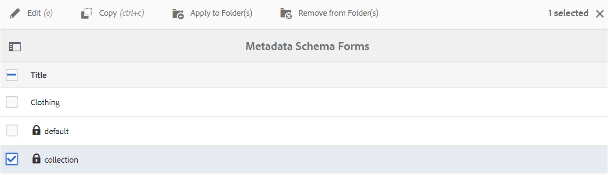

# Utilisation du formulaire de schéma de métadonnées {#use-the-metadata-schema-form}

Un schéma de métadonnées décrit la disposition de la page Propriétés et des propriétés de métadonnées affichées pour les ressources qui utilisent ce schéma en particulier. Le schéma que vous appliquez à une ressource détermine les champs de métadonnées qui s’affichent sur sa page Propriétés.

La page **[!UICONTROL Propriétés]** de chaque ressource comprend des propriétés de métadonnées par défaut selon le type MIME de la ressource. Les administrateurs peuvent utiliser l’éditeur de schéma de métadonnées pour modifier des schémas existants ou ajouter des schémas de métadonnées personnalisés. Experience Manager Assets Brand Portal fournit des formulaires par défaut pour les ressources de différents types MIME. Vous pouvez toutefois ajouter des formulaires personnalisés pour ces ressources.

## Ajout d’un formulaire de schéma de métadonnées {#add-a-metadata-schema-form}

Pour créer un formulaire de schéma de métadonnées, procédez comme suit :

1. Dans la barre d’outils supérieure, cliquez sur le logo du Experience Manager pour accéder aux outils d’administration.

   

1. Dans le panneau des outils d’administration, cliquez sur **[!UICONTROL Schémas de métadonnées]**.

   

1. Dans la page **[!UICONTROL Formulaires de schéma de métadonnées]**, cliquez sur **[!UICONTROL Créer]**.

   

1. Dans la boîte de dialogue **[!UICONTROL Créer un formulaire de schéma]**, indiquez le titre du formulaire de schéma, puis cliquez sur **[!UICONTROL Créer]** pour terminer la création du formulaire.

   

## Modification d’un formulaire de schéma de métadonnées {#edit-a-metadata-schema-form}

Vous pouvez modifier un formulaire de schéma de métadonnées existant ou nouvellement ajouté. Le formulaire de schéma de métadonnées comporte le contenu dérivé de son parent, notamment les éléments d’onglet et de formulaire dans les onglets. Vous pouvez mapper ou configurer ces éléments de formulaire dans un champ au sein d’un nœud de métadonnées.

Vous pouvez ajouter des onglets ou des éléments de formulaire au formulaire de schéma de métadonnées. Les onglets et les éléments de formulaire dérivés (du parent) sont verrouillés. Vous ne pouvez pas les modifier au niveau enfant.

Pour modifier un formulaire de schéma de métadonnées, procédez comme suit :

1. Dans la barre d’outils supérieure, cliquez sur le logo du Experience Manager pour accéder aux outils d’administration.

   

1. Dans le panneau des outils d’administration, cliquez sur **[!UICONTROL Schémas de métadonnées]**.
1. Dans la page **[!UICONTROL Formulaires de schéma de métadonnées]**, sélectionnez un formulaire de schéma pour modifier ses propriétés, par exemple, **[!UICONTROL collection]**.

   

   >[!NOTE]
   >
   >Un symbole représentant un cadenas est affiché devant les modèles non modifiés. Si vous personnalisez l’un des modèles, le symbole représentant un cadenas disparaît devant le modèle.

1. Dans la barre d’outils supérieure, cliquez sur **[!UICONTROL Modifier]**.

   La page **[!UICONTROL Éditeur de schéma de métadonnées]** s’ouvre avec l’onglet **[!UICONTROL De base]** affiché à gauche et l’onglet **[!UICONTROL Créer le formulaire]** affiché à droite.

1. Sur la page **[!UICONTROL Éditeur de schéma de métadonnées]**, personnalisez la page **[!UICONTROL Propriétés]** de la ressource en faisant glisser un ou plusieurs composants de la liste des types de composants dans le sous-onglet **[!UICONTROL Créer le formulaire]** vers l’onglet **[!UICONTROL De base]**.

   

1. Pour configurer un composant, sélectionnez-le et modifiez ses propriétés dans l’onglet **[!UICONTROL Paramètres]**.

### Composants de l’onglet Créer le formulaire {#components-in-the-build-form-tab}

L’onglet **[!UICONTROL Créer le formulaire]** répertorie les éléments que vous pouvez utiliser dans votre formulaire de schéma. L’onglet **[!UICONTROL Paramètres]** contient les attributs de chaque élément sélectionné dans l’onglet **[!UICONTROL Créer le formulaire]**. Le tableau suivant répertorie les éléments de formulaire disponibles dans l’onglet **[!UICONTROL Créer le formulaire]** :

| Nom du composant | Description |
|---------------------|--------------------------------------------------------------------------------------------------------------------------------------------------------------------------------------------------------------------------------------------------------------------------------------------|
| **[!UICONTROL En-tête de section]** | Permet d’ajouter un en-tête de section pour une liste de composants communs. |
| **[!UICONTROL Une seule ligne de texte]** | Permet d’ajouter une propriété d’une seule ligne de texte. Il est stocké sous la forme d’une chaîne. |
| **[!UICONTROL Texte à plusieurs valeurs]** | Permet d’ajouter une propriété de texte à plusieurs valeurs. Il est stocké sous la forme d’une table de chaînes. |
| **[!UICONTROL Nombre]** | Permet d’ajouter un composant de nombre. |
| **[!UICONTROL Date]** | Permet d’ajouter un composant de date. |
| **[!UICONTROL Liste déroulante]** | Permet d’ajouter une liste déroulante. |
| **[!UICONTROL Balises standard]** | Permet d’ajouter une balise. **Remarque :** Les administrateurs doivent peut-être modifier la valeur de chemin, par exemple  `/etc/tags/mac/<tenant_id>/<custom_tag_namespace>`, s’ils publient le formulaire de schéma de métadonnées à partir de ressources Experience Manager, où le chemin d’accès n’inclut pas les informations du client, par exemple  `/etc/tags/<custom_tag_namespace>`. |
| **[!UICONTROL Balises intelligentes]** | Balises détectées automatiquement si vous avez acheté et configuré le module complémentaire de balises intelligentes Experience Manager Assets. |
| **[!UICONTROL Champ masqué]** | Permet d’ajouter un champ masqué. Il est envoyé en tant que paramètre POST lorsque la ressource est enregistrée. |
| **[!UICONTROL Ressource référencée par]** | Ajoutez ce composant pour afficher la liste des ressources référencées par la ressource. |
| **[!UICONTROL Référencement des ressources]** | Ajoutez ce composant pour afficher la liste des ressources qui référencent la ressource. |
| **[!UICONTROL Évaluation des ressources]** | Évaluation moyenne d’une ressource ajoutée à partir de ressources du Experience Manager avant sa publication sur Brand Portal. |
| **[!UICONTROL Métadonnées contextuelles]** | Ajoutez ce composant pour contrôler l’affichage des autres onglets de métadonnées dans la page Propriétés des ressources. |

>[!NOTE]
>
>N’utilisez pas **[!UICONTROL Références de produit]**, car cela n’est pas fonctionnel.

#### Modification du composant de métadonnées {#edit-the-metadata-component}

Pour modifier les propriétés d’un composant de métadonnées dans le formulaire, cliquez sur le composant et modifiez ses propriétés dans l’onglet **[!UICONTROL Paramètres]**.

* **[!UICONTROL Libellé du champ]** : nom de la propriété de métadonnées affiché dans la page Propriétés de la ressource.

* **[!UICONTROL Associer à la propriété]** : la valeur de cette propriété fournit le chemin ou nom relatif du nœud de ressource où elle est enregistrée dans le référentiel CRX. Elle commence par « **./** », car elle indique que le chemin se trouve sous le nœud de la ressource.

Les valeurs admises pour cette propriété sont les suivantes :

-- `./jcr:content/metadata/dc:title` : stocke la valeur dans le nœud de métadonnées de la ressource en tant que propriété [!UICONTROL `dc:title`].

-- `./jcr:created` : affiche la propriété JCR au niveau du nœud de la ressource. Si vous configurez ces propriétés dans Afficher les propriétés, nous vous recommandons de les marquer avec l’état Désactiver la modification, car elles sont protégées. Dans le cas contraire, l’erreur « Échec de modification des ressources » est générée lorsque vous enregistrez les propriétés de la ressource.

* **[!UICONTROL Espace réservé]** : utilisez cette propriété pour fournir à l’utilisateur des informations utiles concernant la propriété des métadonnées.
* **[!UICONTROL Obligatoire]** : utilisez cette propriété pour marquer une propriété de métadonnées comme étant obligatoire sur la page Propriétés.
* **[!UICONTROL Désactiver la modification]** : utilisez cette propriété pour rendre une propriété de métadonnées non modifiable sur la page Propriétés.
* **[!UICONTROL Afficher le champ vide en lecture seule]** : utilisez cette propriété pour afficher une propriété de métadonnées sur la page Propriétés même si elle ne possède pas de valeur. Par défaut, lorsqu’une propriété de métadonnées ne possède pas de valeur, elle n’est pas répertoriée dans la page Propriétés.
* **[!UICONTROL Description]** : utilisez cette propriété pour ajouter une brève description pour le composant de métadonnées.
* **[!UICONTROL Icône Supprimer]** : cliquez sur cette icône pour supprimer un composant du formulaire de schéma.

>[!NOTE]
>
>Tous les champs de métadonnées sont en lecture seule dans le formulaire Éditeur de schéma d’une ressource. Les métadonnées de la ressource doivent être modifiées dans les ressources Experience Manager avant qu’une ressource ne soit publiée dans Brand Portal.

#### Ajout ou suppression d’un onglet dans le formulaire de schéma {#add-or-delete-a-tab-in-the-schema-form}

Le formulaire de schéma par défaut contient les onglets **[!UICONTROL De base]** et **[!UICONTROL Avancé]**. L’éditeur de schéma vous permet d’ajouter ou de supprimer un onglet.

* Pour ajouter un nouvel onglet dans un formulaire de schéma, cliquez sur **[!UICONTROL +]**. Par défaut, le nouvel onglet porte le nom « Sans nom -1 ». Vous pouvez modifier le nom à partir de l’onglet **[!UICONTROL Paramètres]**.

* Pour supprimer un onglet, cliquez sur **[!UICONTROL x]**. Cliquez sur **[!UICONTROL Enregistrer]** pour enregistrer les modifications.

## Application d’un schéma de métadonnées à un dossier {#apply-a-metadata-schema-to-a-folder}

Brand Portal permet de personnaliser et de contrôler le schéma de métadonnées afin que la page **[!UICONTROL Propriétés]** d’une ressource n’affiche que les informations spécifiques que vous souhaitez montrer. Pour contrôler les métadonnées affichées dans la page **[!UICONTROL Propriétés]**, supprimez les métadonnées requises du formulaire de schéma de métadonnées et appliquez-les au dossier spécifique.

Pour appliquer un formulaire de schéma de métadonnées à un dossier, procédez comme suit :

1. Dans la barre d’outils supérieure, cliquez sur le logo du Experience Manager pour accéder aux outils d’administration.

   

1. Dans le panneau des outils d’administration, cliquez sur **[!UICONTROL Schémas de métadonnées]**.

1. Dans la page **[!UICONTROL Formulaires de schéma de métadonnées]**, sélectionnez le formulaire de schéma que vous souhaitez appliquer à une ressource, par exemple **[!UICONTROL vêtements]**.

   

1. Dans la barre d’outils supérieure, cliquez sur **[!UICONTROL Appliquer au(x) dossier(s)]**.

1. Dans la page **[!UICONTROL Sélectionner le(s) dossier(s)]**, accédez au dossier auquel vous souhaitez appliquer le schéma de métadonnées **[!UICONTROL vêtements]**, par exemple **[!UICONTROL gants]**.

   

1. Cliquez sur **[!UICONTROL Appliquer]** pour appliquer le formulaire de schéma de métadonnées au dossier.

   Les métadonnées disponibles dans le formulaire de schéma de métadonnées **[!UICONTROL vêtements]** sont appliquées au dossier **[!UICONTROL Gants]** et visibles dans la page **[!UICONTROL Propriétés]** du dossier.

   

>[!NOTE]
>
>Si vous appliquez un schéma qui comporte des schémas imbriqués à un dossier contenant des fichiers vidéo, les propriétés de métadonnées des fichiers vidéo peuvent ne pas s’afficher correctement. Pour veiller à ce que les propriétés de métadonnées s’affichent correctement, supprimez les schémas imbriqués et appliquez uniquement le schéma parent au dossier.

## Suppression d’un formulaire de schéma de métadonnées {#delete-a-metadata-schema-form}

Brand Portal vous permet uniquement de supprimer des formulaires de schéma personnalisés. Il ne vous permet pas de supprimer les formulaires/modèles de schéma par défaut. Cependant, vous pouvez supprimer toutes les modifications personnalisées dans ces formulaires.

Pour supprimer un formulaire, sélectionnez-le puis cliquez sur l’icône **[!UICONTROL Supprimer]**.

>[!NOTE]
>
>Après avoir supprimé les modifications personnalisées apportées à un formulaire par défaut, le symbole représentant un **[!UICONTROL cadenas]** réapparaît devant le nom de ce formulaire dans l’interface Schéma de métadonnées pour indiquer que l’état par défaut du formulaire a été rétabli.

## Formulaires de schéma pour les types MIME {#schema-forms-for-mime-types}

### Ajout de formulaires pour les types MIME {#adding-new-forms-for-mime-types}

En plus des formulaires par défaut, vous pouvez ajouter des formulaires personnalisés pour des ressources avec des types MIME différents ou créer un formulaire sous le type de formulaire adéquat. Par exemple, pour ajouter un modèle pour le sous-type **[!UICONTROL image/png]**, créez le formulaire sous les formulaires « image ». Le titre du formulaire de schéma est le nom du sous-type. Dans ce cas, le titre est « png ».

#### Utilisation d’un modèle de schéma existant pour divers types MIME {#using-an-existing-schema-template-for-various-mime-types}

Vous pouvez utiliser un modèle existant pour un autre type MIME. Utilisez par exemple le formulaire **image/jpeg** pour les ressources du type MIME **image/png**.

Dans ce cas, créez un nœud sous [!UICONTROL `/etc/dam/metadataeditor/mimetypemappings`] dans le référentiel CRX. Indiquez un nom pour le nœud et définissez les propriétés suivantes :

| **Nom** | **Type** | **Valeur** |
|---|---|---|
| exposedmimetype | Chaîne | image/jpeg |
| mimetypes | Chaîne[] | image/png |

* **exposedmimetype** : nom du formulaire existant à mapper.
* **mimetypes** : liste des types MIME qui utilisent le formulaire défini dans l’attribut **exposedmimetype**.

Brand Portal mappe les types MIME et les formulaires de schéma suivants :

| **Formulaire de schéma** | **Types MIME** |
|---|---|
| image/jpeg | image/pjpeg |
| image/tiff | image/x-tiff |
| application/pdf | application/postscript |
| application/x-ImageSet | Multipart/Related; type=application/x-ImageSet |
| application/x-SpinSet | Multipart/Related; type=application/x-SpinSet |
| application/x-MixedMediaSet | Multipart/Related; type=application/x-MixedMediaSet |
| video/quicktime | video/x-quicktime |
| video/mpeg4 | video/mp4 |
| video/avi | video/avi, video/msvideo, video/x-msvideo |
| video/wmv | video/x-ms-wmv |
| video/flv | video/x-flv |

Voici la liste des propriétés de métadonnées par défaut :

* jcr:content/metadata/cq:tags
* jcr:content/metadata/dc:format
* jcr:content/metadata/dam:status
* jcr:content/metadata/videoCodec
* jcr:content/metadata/audioCodec
* jcr:content/metadata/dc:title
* jcr:content/metadata/dc:description
* jcr:content/metadata/xmpMM:InstanceID
* jcr:content/metadata/xmpMM:DocumentID
* jcr:content/metadata/dam:sha1
* jcr:content/metadata/dam:solutionContext
* jcr:content/metadata/videoBitrate
* jcr:content/metadata/audioBitrate
* jcr:content/usages/usedBy
* jcr:content/jcr:lastModified
* jcr:content/metadata/prism:expirationDate
* jcr:content/onTime
* jcr:content/offTime
* jcr:content/metadata/dam:size
* jcr:content/metadata/tiff:ImageWidth
* jcr:content/metadata/tiff:ImageLength
