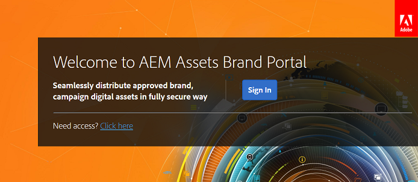

# Première connexion {#first-time-login-experience}

La première connexion est identique pour tous les nouveaux utilisateurs d’AEM Assets Brand Portal, y compris les administrateurs. Une fois que l’administrateur vous a ajouté au compte Brand Portal de l’entreprise, vous n’avez pas besoin d’accepter d’invitations ; vous êtes automatiquement ajouté. Vous recevez un e-mail de bienvenue contenant un lien vers le compte Brand Portal de l’entreprise.

After an Administrator adds new users, they need not accept invitations to get added to the Brand Portal account, they are added automatically.

To log in to Brand Portal for the first time, do the following:

1. Ouvrez l’e-mail de bienvenue et cliquez sur **[!UICONTROL Commencer]**.

2. Dans la page d’inscription, indiquez les informations vous concernant (prénom, nom, mot de passe et pays/région).
   >[!NOTE]
   >
   >Si vous êtes déjà un utilisateur d’Adobe Marketing Cloud, une page de connexion s’affiche au lieu de la page d’inscription. Pour vous connecter à Adobe Marketing Cloud, saisissez votre Adobe ID et votre mot de passe.

   >[!NOTE]
   >
   >Si votre entreprise utilise des Enterprise ID, vous êtes redirigé vers la page de connexion Enterprise au lieu de cette page de connexion. Pour plus d’informations, voir [ID d’entreprise, connexion et aide de compte](https://helpx.adobe.com/in/enterprise/kb/enterprise-id-faq.html).

3. Click **[!UICONTROL Continue]** to proceed to your organization's Brand Portal page.
4. Dans la page de connexion de Brand Portal, cliquez sur **[!UICONTROL Se connecter]pour vous connecter à Brand Portal.**

   

   >[!NOTE]
   >
   >Vous ne pouvez pas accéder au portail de marque si vous n’êtes associé à aucun profil de produit. Pour vous connecter à Brand Portal, vous devez être associé à au moins un profil de produits AEM.
