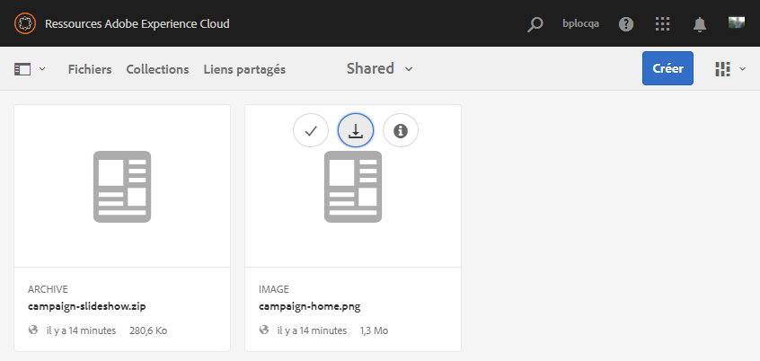
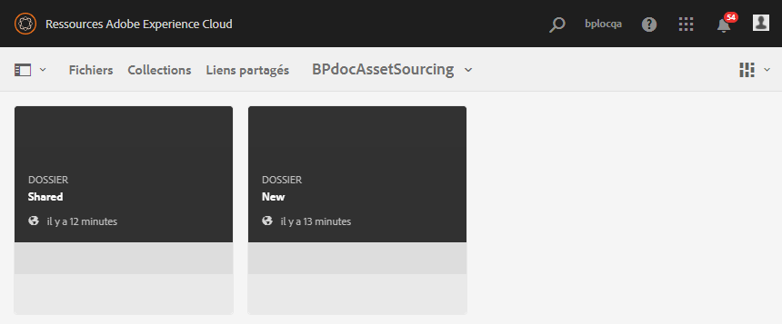
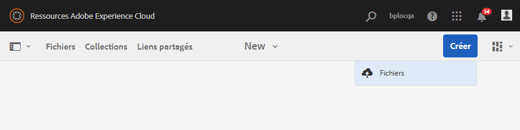
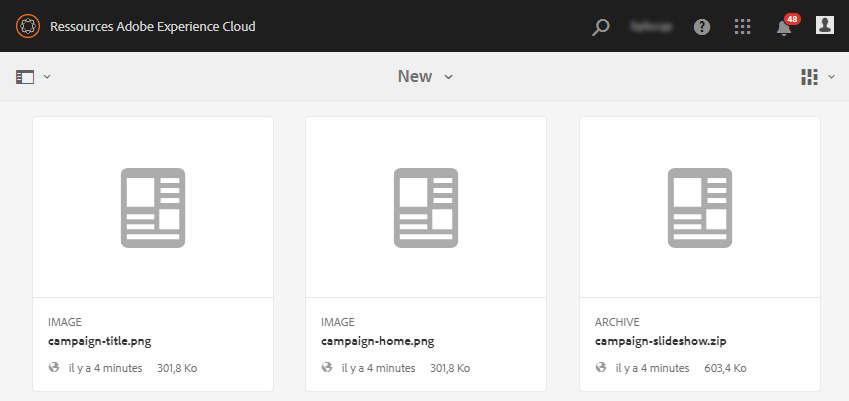
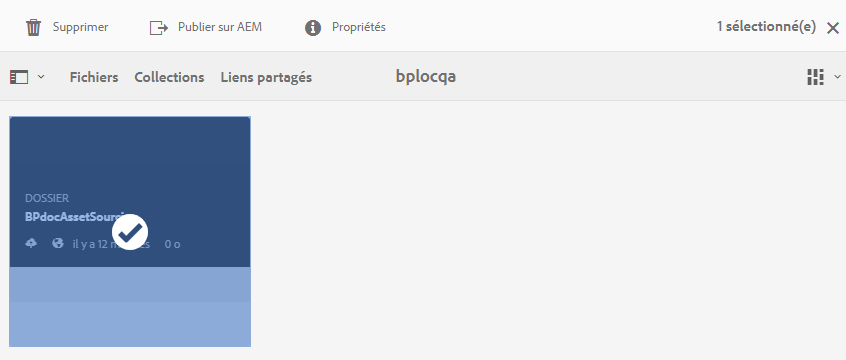
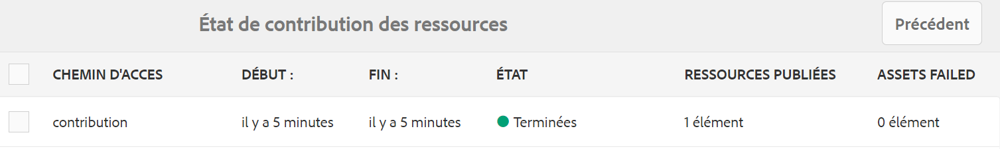
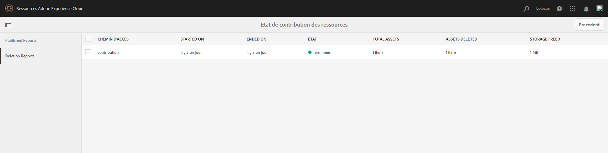
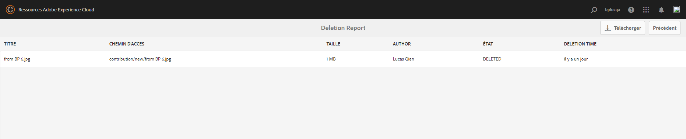

# Publication du dossier de contribution sur Experience Manager Assets {#using-asset-souring-in-bp}

Les utilisateurs de Brand Portal qui disposent des autorisations adéquates peuvent charger plusieurs ressources ou dossiers contenant plusieurs ressources vers le dossier de contribution. Notez toutefois que les utilisateurs de Brand Portal peuvent charger des ressources uniquement vers le dossier **NEW**. Le dossier **SHARED** est destiné à la distribution des ressources de base (contenu de référence) qui peuvent être utilisées par les utilisateurs de Brand Portal lors de la création de ressources à des fins de contribution.

L’utilisateur de Brand Portal autorisé à accéder au dossier de contribution peut effectuer les activités suivantes :

* [Téléchargement des exigences en matière de ressources](#download-asset-requirements)
* [Chargement de nouvelles ressources dans le dossier de contribution](#uplad-new-assets-to-contribution-folder)
* [Publication du dossier de contribution sur Experience Manager Assets](#publish-contribution-folder-to-aem)

## Téléchargement des exigences en matière de ressources {#download-asset-requirements}

Les utilisateurs de Brand Portal reçoivent automatiquement des notifications Push/par e-mail lorsqu’un dossier de contribution est partagé par l’utilisateur d’Experience Manager Assets, ce qui leur permet de télécharger le document de résumé (exigences en matière de ressources) et les ressources de base (contenu de référence) depuis le dossier **SHARED** afin de s’assurer qu’ils comprennent les exigences en matière de ressources.

L’utilisateur de Brand Portal effectue les activités suivantes pour télécharger les exigences en matière de ressources :

* **Télécharger le résumé** : chargez le résumé (document sur les exigences en matière de ressources) joint au dossier de contribution qui contient des informations relatives aux ressources, telles que le type de ressources, le but, les formats pris en charge, la taille maximale des ressources, etc.
* **Télécharger des ressources de base** : téléchargez des ressources de base qui peuvent être utilisées pour comprendre les types de ressources requis. Les utilisateurs de Brand Portal peuvent utiliser ces ressources comme référence afin de créer des ressources à des fins de contribution.

Le tableau de bord de Brand Portal répertorie tous les dossiers existants auxquels l’utilisateur de Brand Portal est autorisé à accéder, ainsi que le dossier de contribution nouvellement partagé. Dans cet exemple, l’utilisateur de Brand Portal a uniquement accès au dossier de contribution nouvellement créé. Aucun autre dossier existant n’est partagé avec lui.

**Pour télécharger les exigences en matière de ressources, procédez comme suit :**

1. Connectez-vous à votre instance Brand Portal.
1. Sélectionnez le dossier de contribution dans le tableau de bord de Brand Portal.
1. Cliquez sur **[!UICONTROL Propriétés]**. La fenêtre Propriété contenant les détails du dossier de contribution s’affiche.

   

   

1. Cliquez sur l’option **[!UICONTROL Télécharger le résumé]** pour télécharger sur votre ordinateur local le document sur les exigences en matière de ressources.

   

1. Retournez dans le tableau de bord de Brand Portal.
1. Cliquez pour ouvrir le dossier de contribution. Vous pouvez voir deux sous-dossiers, **[!UICONTROL SHARED]** et **[!UICONTROL NEW]**, à l’intérieur. Le dossier SHARED contient toutes les ressources de base (contenu de référence) partagées par les administrateurs.
1. Vous pouvez télécharger sur votre ordinateur local le dossier **[!UICONTROL SHARED]** contenant toutes les ressources de base.
Vous pouvez également ouvrir le dossier **[!UICONTROL SHARED]** et cliquer sur l’icône **Télécharger** pour télécharger des fichiers/dossiers distincts.

   

   

Passez en revue le résumé (document sur les exigences en matière de ressources) et reportez-vous aux ressources de base pour comprendre les exigences en matière de ressources. Vous pouvez maintenant créer des ressources à des fins de contribution et les charger dans le dossier de contribution..

## Chargement de ressources dans le dossier de contribution {#upload-new-assets-to-contribution-folder}

Après avoir passé en revue les exigences relatives aux ressources, les utilisateurs de Brand Portal peuvent créer des ressources pour la contribution et les charger dans le dossier NEW du dossier de contribution. Un utilisateur peut charger plusieurs ressources dans un dossier de contribution. Cependant, un seul dossier peut être créé à la fois.

>[!NOTE]
>
>Les utilisateurs de Brand Portal peuvent charger des ressources (taille maximale de **2** Go par fichier) dans le dossier NEW.
>
>La limite maximale de chargement pour tout client Brand Portal est de **10** Go. Elle est appliquée de manière cumulative à tous les dossiers de contribution.
>
>Les ressources chargées dans Brand Portal ne sont pas traitées pour les rendus et ne contiennent pas d’aperçus.

>[!NOTE]
>
>Il est recommandé de libérer l’espace de chargement après avoir publié le dossier de contribution dans Experience Manager Assets afin qu’il soit accessible aux autres utilisateurs de Brand Portal pour les contributions.
>
>S’il est nécessaire d’étendre la limite de chargement de votre client Brand Portal au-delà de **10** Go, contactez le service clientèle en spécifiant la limite requise.

**Pour charger de nouvelles ressources :**

1. Connectez-vous à votre instance Brand Portal.
Le tableau de bord de Brand Portal répertorie tous les dossiers existants auxquels l’utilisateur de Brand Portal est autorisé à accéder, ainsi que le dossier de contribution nouvellement partagé.

1. Sélectionnez le dossier de contribution et cliquez dessus pour l’ouvrir. Le dossier de contribution contient deux sous-dossiers : **[!UICONTROL SHARED]** et **[!UICONTROL NEW]**.

1. Cliquez sur le dossier **[!UICONTROL NEW]**.

   

1. Cliquez sur **[!UICONTROL Créer]** > **[!UICONTROL Fichiers]** afin de charger des fichiers distincts ou un dossier (.zip) contenant plusieurs ressources.

   

1. Parcourez les ressources (fichiers/dossiers) et chargez-les dans le dossier **[!UICONTROL NEW]**.

   

Après avoir chargé tous les fichiers ou dossiers dans le dossier NEW, publiez le dossier de contribution dans Experience Manager Assets.

## Publication du dossier de contribution sur Experience Manager Assets {#publish-contribution-folder-to-aem}

Les utilisateurs de Brand Portal peuvent publier le dossier de contribution sur Experience Manager Assets sans avoir besoin d’accéder à l’instance d’auteur Experience Manager Assets.

Vérifiez que vous avez respecté les exigences en matière de ressources et chargez les ressources nouvellement créées dans le dossier **NEW** au sein du dossier de contribution.

**Pour publier le dossier de contribution, procédez comme suit :**

1. Connectez-vous à votre instance Brand Portal.

1. Sélectionnez le dossier de contribution dans le tableau de bord de Brand Portal.
1. Cliquez sur **[!UICONTROL Publier sur AEM]**.

   

   

Une notification Pulse/par e-mail est envoyée à l’utilisateur et aux administrateurs de Brand Portal à différentes étapes du workflow de publication :

1. **Placé en file d’attente** : une notification est envoyée à l’utilisateur et aux administrateurs de Brand Portal lorsqu’un processus de publication se déclenche dans Brand Portal.

1. **Terminé** : une notification est envoyée à l’utilisateur et aux administrateurs de Brand Portal lorsque le dossier de contribution est publié dans Experience Manager Assets.

Après avoir publié les ressources nouvellement créées dans Experience Manager Assets, les utilisateurs de Brand Portal peuvent les supprimer du dossier NEW. En revanche, l’administrateur de Brand Portal peut supprimer les ressources des dossiers NEW et SHARED.

Une fois l’objectif de création du dossier de contribution atteint, l’administrateur de Brand Portal peut le supprimer afin de libérer l’espace de chargement pour d’autres utilisateurs.

## État de la tâche de publication {#publishing-job-status}

Les administrateurs peuvent utiliser deux rapports pour afficher l’état des dossiers de contribution des ressources publiés de Brand Portal vers Experience Manager Assets.

* Dans le Brand Portal, accédez à **[!UICONTROL Outils]** > **[!UICONTROL État de contribution des ressources]**. Ce rapport reflète l’état de toutes les tâches de publication à différentes étapes du processus de publication.

  

* Dans Experience Manager Assets (On-Premise ou Managed Service), accédez à **[!UICONTROL Ressources]** > **[!UICONTROL Tâches]**. Ce rapport reflète l’état final (Réussite ou Erreur) de toutes les tâches de publication.

  

* Dans Experience Manager Assets as a Cloud Service, accédez à **[!UICONTROL Ressources]** > **[!UICONTROL Tâches]**.

  Vous pouvez également accéder directement à **[!UICONTROL Tâches]** à partir de la navigation globale.

  Ce rapport reflète l’état final (Succès ou Erreur) de toutes les tâches de publication, y compris de l’importation de ressources de Brand Portal vers Experience Manager Assets as a Cloud Service.

  

<!--
>[!NOTE]
>
>Currently, no report is generated in AEM Assets as a Cloud Service for the Asset Sourcing workflow. 
-->

## Suppression automatique des ressources publiées dans Experience Manager Assets à partir du dossier Contribution {#automatically-delete-published-assets-from-contribution-folder}

Brand Portal exécute désormais des tâches automatiques toutes les douze heures afin d’analyser tous les dossiers de contribution publiés sur AEM. Par conséquent, vous n’avez pas besoin de supprimer manuellement les ressources du dossier Contribution pour que la taille du dossier reste inférieure à la [limite de seuil](#upload-new-assets-to-contribution-folder). Vous pouvez également surveiller le statut des tâches de suppression automatiquement exécutées au cours des sept derniers jours. Le rapport relatif à une tâche fournit les détails suivants :

* Heure de début de la tâche.
* Heure de fin de la tâche.
* Statut de la tâche.
* Total des ressources incluses dans une tâche.
* Nombre total de ressources supprimées dans une tâche.
* Stockage total mis à disposition suite à l’exécution de la tâche.

  

Vous pouvez également afficher plus de détails sur chaque ressource incluse dans une tâche de suppression. Des détails tels que le titre, la taille, l’auteur, le statut de suppression et la durée de suppression de la ressource sont inclus dans le rapport.

>[!NOTE]
>
> * Les clients peuvent demander au service clientèle d’Adobe de désactiver et de réactiver la fonctionnalité de suppression automatique ou de modifier la fréquence d’exécution de celle-ci.
> * Cette fonctionnalité est disponible avec Experience Manager 6.5.13.0 et versions ultérieures.

### Afficher et télécharger des rapports de suppression {#view-delete-jobs}

Pour afficher et télécharger des rapports pour une tâche de suppression :

1. Rendez-vous dans le Brand Portal et cliquez sur l’option **[!UICONTROL Outils]** > **[!UICONTROL Statut de la contribution des ressources]** > **[!UICONTROL Rapports de suppression]**.

1. Sélectionnez une tâche et cliquez sur **[!UICONTROL Affichage]** pour afficher le rapport.

   Affichez les détails de chaque ressource incluse dans une tâche de suppression. Des détails tels que le titre, la taille, l’auteur, le statut de suppression et la durée de suppression de la ressource sont inclus dans le rapport. Cliquez sur **[!UICONTROL Télécharger]** pour télécharger le rapport de la tâche au format CSV.

   Le statut de suppression d’une ressource du rapport peut avoir les valeurs suivantes :

   * **Supprimée** - La ressource a été supprimée du dossier Contribution.

   * **Introuvable** - Brand Portal n’a pas pu trouver la ressource dans le dossier Contribution. La ressource a déjà été supprimée manuellement du dossier.

   * **Ignorée** - Brand Portal a ignoré la suppression de la ressource, car une nouvelle version de cette ressource est disponible dans le dossier Contribution, qui n’a pas encore été publiée dans Experience Manager.

   * **Échec** - Brand Portal n’a pas réussi à supprimer la ressource. Vous disposez de trois tentatives de suppression d’une ressource avec un statut de suppression `Failed`. Si la ressource échoue lors de la troisième tentative de suppression, vous devez la supprimer manuellement.

### Supprimer un rapport

Brand Portal vous permet également de sélectionner un ou plusieurs rapports et de les supprimer manuellement.

Pour supprimer un rapport :

1. Cliquez sur l’option **[!UICONTROL Outils]** > **[!UICONTROL Statut de la contribution des ressources]** > **[!UICONTROL Rapports de suppression]**.

1. Sélectionnez un ou plusieurs rapports, puis cliquez sur **[!UICONTROL Supprimer]**.

