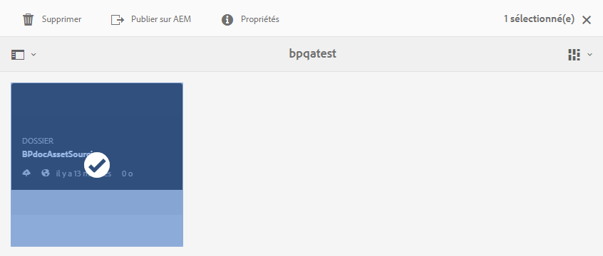

# Publication du dossier de contribution sur AEM Assets {#publish-contribution-folder-to-aem}

Les utilisateurs de Brand Portal peuvent publier le dossier de contribution sur AEM Assets sans avoir besoin d’accéder à l’instance d’auteur AEM.

Vérifiez que vous avez respecté les [exigences en matière de ressources](brand-portal-download-asset-requirements.md) et chargez les ressources nouvellement créées dans le dossier **NEW** au sein du dossier de contribution. Voir [Chargement de ressources dans le dossier de contribution](brand-portal-upload-assets-to-contribution-folder.md).

**Pour publier le dossier de contribution, procédez comme suit :**

1. Connectez-vous à votre instance de Brand Portal.
1. Sélectionnez le dossier de contribution dans le tableau de bord de Brand Portal.
1. Cliquez sur **[!UICONTROL Publier sur AEM]**.
   

Une notification Push/par courrier électronique est envoyée à l’administrateur et à l’utilisateur de Brand Portal et AEM à différentes étapes de la publication :
1. **En file d’attente** : lorsque le workflow de publication se déclenche dans Brand Portal, le dossier de contribution est publié de Brand Portal sur AEM.
1. **En cours** : lorsque AEM Assets commence à importer le dossier de contribution.
1. **Terminé** : lorsque l’action de publication est terminée, le dossier de contribution est importé dans AEM Assets.

