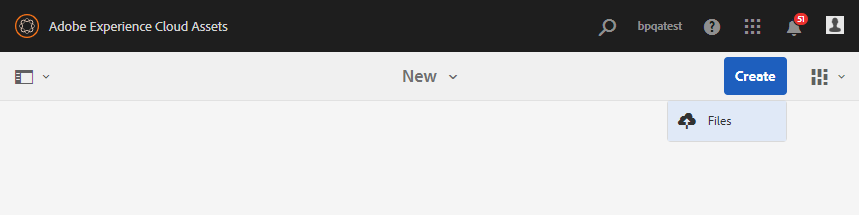

# Publication du dossier de contribution sur AEM Assets {#using-asset-souring-in-bp}

Les utilisateurs de Brand Portal qui disposent des autorisations adéquates peuvent charger plusieurs ressources ou dossiers contenant plusieurs ressources vers le dossier de contribution. Notez toutefois que les utilisateurs de Brand Portal peuvent charger des ressources uniquement vers le dossier **NEW**. Le dossier **SHARED** est destiné à la distribution des ressources de base (contenu de référence) qui peuvent être utilisées par les utilisateurs de Brand Portal lors de la création de ressources à des fins de contribution.

L’utilisateur de Brand Portal autorisé à accéder au dossier de contribution peut effectuer les activités suivantes :

* [Téléchargement des exigences en matière de ressources](#download-asset-requirements)
* [Chargement de nouvelles ressources dans le dossier de contribution](#uplad-new-assets-to-contribution-folder)
* [Publication du dossier de contribution sur AEM Assets](#publish-contribution-folder-to-aem)

## Téléchargement des exigences en matière de ressources {#download-asset-requirements}

Les utilisateurs de Brand Portal reçoivent automatiquement des notifications Push/par courrier électronique lorsqu’un dossier de contribution est partagé par l’utilisateur d’AEM, ce qui leur permet de télécharger le document de résumé (exigences en matière de ressources) et les ressources de base (contenu de référence) depuis le dossier **SHARED** afin de s’assurer qu’ils comprennent les exigences en matière de ressources.

L’utilisateur de Brand Portal effectue les activités suivantes pour télécharger les exigences en matière de ressources :

* **Charger les instructions** : chargez le résumé (document sur les exigences en matière de ressources) joint au dossier de contribution qui contient des informations relatives aux ressources, telles que le type de ressources, le but, les formats pris en charge, la taille maximale des ressources, etc.
* **Télécharger des ressources de base** : téléchargez des ressources de base qui peuvent être utilisées pour comprendre les types de ressources requis. Les utilisateurs de Brand Portal peuvent utiliser ces ressources comme référence afin de créer des ressources à des fins de contribution.

Le tableau de bord de Brand Portal répertorie tous les dossiers existants auxquels l’utilisateur de Brand Portal est autorisé à accéder, ainsi que le dossier de contribution nouvellement partagé. Dans cet exemple, l’utilisateur de Brand Portal a uniquement accès au dossier de contribution nouvellement créé. Aucun autre dossier existant n’est partagé avec lui.

**Pour télécharger les exigences en matière de ressources, procédez comme suit :**

1. Connectez-vous à votre instance Brand Portal.
1. Sélectionnez le dossier de contribution dans le tableau de bord de Brand Portal.
1. Cliquez sur **[!UICONTROL Propriétés]** . La fenêtre Propriété s’affiche. Elle contient les détails du dossier Contribution des ressources.
   
1. Cliquez sur **[!UICONTROL Download Brief]**  (Télécharger le résumé) pour télécharger sur votre ordinateur local le document sur les exigences en matière de ressources.
   
1. Retournez dans le tableau de bord de Brand Portal.
1. Cliquez pour ouvrir le dossier de contribution. Vous pouvez voir deux sous-dossiers, **[!UICONTROL SHARED]** et **[!UICONTROL NEW]**, à l’intérieur. Le dossier SHARED contient toutes les ressources de base (contenu de référence) partagées par les administrateurs.
1. Vous pouvez télécharger sur votre ordinateur local le dossier **[!UICONTROL SHARED]** contenant toutes les ressources de base.
Vous pouvez également ouvrir le dossier **[!UICONTROL SHARED]** et cliquer sur l’icône **Télécharger**  pour télécharger des ressources/dossiers distincts.
   

Passez en revue le résumé (document sur les exigences en matière de ressources) et reportez-vous aux ressources de base pour comprendre les exigences en matière de ressources. Vous pouvez maintenant créer des ressources à des fins de contribution et les charger dans le dossier de contribution..

## Chargement de ressources dans le dossier de contribution {#uplad-new-assets-to-contribution-folder}

Après avoir examiné les exigences relatives aux ressources, les utilisateurs du portail de marque peuvent créer de nouvelles ressources pour contribution et les télécharger dans le dossier NEW du dossier de contribution.

>[!NOTE]
>
>Les utilisateurs de Brand Portal peuvent charger des ressources uniquement vers le dossier NEW.
>
>La limite de chargement maximale pour tout client Brand Portal est de **10** Go ; elle est appliquée de manière cumulative à tous les dossiers de contribution.

>[!NOTE]
>
>Il est recommandé de libérer l’espace de chargement après avoir publié le dossier de contribution dans AEM Assets afin qu’il soit accessible aux autres utilisateurs de Brand Portal pour les contributions.
>
>S’il est nécessaire d’étendre la limite de chargement de votre client Brand Portal au-delà de **10** Go, contactez l’assistance Adobe en spécifiant la limite requise.

**Pour charger de nouvelles ressources :**

1. Connectez-vous à votre instance Brand Portal.
Le tableau de bord de Brand Portal répertorie tous les dossiers existants auxquels l’utilisateur de Brand Portal est autorisé à accéder, ainsi que le dossier de contribution nouvellement partagé.

1. Sélectionnez le dossier de contribution et cliquez dessus pour l’ouvrir. Le dossier de contribution contient deux sous-dossiers : **[!UICONTROL SHARED]** (PARTAGÉ) et **[!UICONTROL NEW]** (NOUVEAU).

1. Cliquez sur le dossier **[!UICONTROL NEW]**.

   

1. Cliquez sur **[!UICONTROL Créer]** > **[!UICONTROL Fichiers]** afin de charger des fichiers distincts ou un dossier (.zip) contenant plusieurs ressources.

   

1. Parcourez les ressources (fichiers/dossiers) et chargez-les dans le dossier **[!UICONTROL NEW]**.

   

Après avoir chargé tous les fichiers ou dossiers dans le dossier NEW, publiez le dossier de contribution dans AEM Assets.

## Publication du dossier de contribution sur AEM Assets {#publish-contribution-folder-to-aem}

Les utilisateurs de Brand Portal peuvent publier le dossier de contribution sur AEM Assets sans avoir besoin d’accéder à l’instance d’auteur AEM.

Vérifiez que vous avez respecté les exigences en matière de ressources et chargez les ressources nouvellement créées dans le dossier **NEW** au sein du dossier de contribution.

**Pour publier le dossier de contribution, procédez comme suit :**

1. Connectez-vous à votre instance Brand Portal.

1. Sélectionnez le dossier de contribution dans le tableau de bord de Brand Portal.
1. Cliquez sur **[!UICONTROL Publier sur AEM]**.

   

   

Une notification Pulse/par e-mail est envoyée à l’utilisateur et aux administrateurs de Brand Portal à différentes étapes du workflow de publication :
1. **En file d&#39;attente** : une notification est envoyée à l&#39;utilisateur et aux administrateurs de Brand Portal lorsqu&#39;un processus de publication se déclenche dans Brand Portal.

1. **Terminé** : une notification est envoyée à l&#39;utilisateur et aux administrateurs de Brand Portal lorsque le dossier de contribution est publié avec succès dans AEM Assets.

Après avoir publié les ressources nouvellement créées dans AEM Assets, les utilisateurs de Brand Portal peuvent les supprimer du dossier NEW. En revanche, l’administrateur de Brand Portal peut supprimer les ressources des dossiers NEW et SHARED.

Une fois l’objectif de création du dossier de contribution atteint, l’administrateur de Brand Portal peut le supprimer afin de libérer l’espace de chargement pour d’autres utilisateurs.

**Statut de la tâche de publication**

Les administrateurs peuvent utiliser deux rapports pour vue de l’état des dossiers de contribution des ressources publiés de Brand Portal à AEM Assets.

* Dans le portail de la marque, accédez à **[!UICONTROL Outils]** > **[!UICONTROL État de la contribution de l’actif]**. Ce rapport reflète l’état de toutes les tâches de publication à différentes étapes du processus de publication.

   

* Dans l’instance d’auteur AEM Assets, accédez à **[!UICONTROL Outils]** > **[!UICONTROL Tâches]**. Ce rapport reflète l’état final (Réussite ou Erreur) de toutes les tâches de publication.

   

>[!NOTE]
>
>L’interface utilisateur d’AEM Assets en tant que Cloud Service peut présenter une légère différence, mais le flux de travail reste inchangé.

