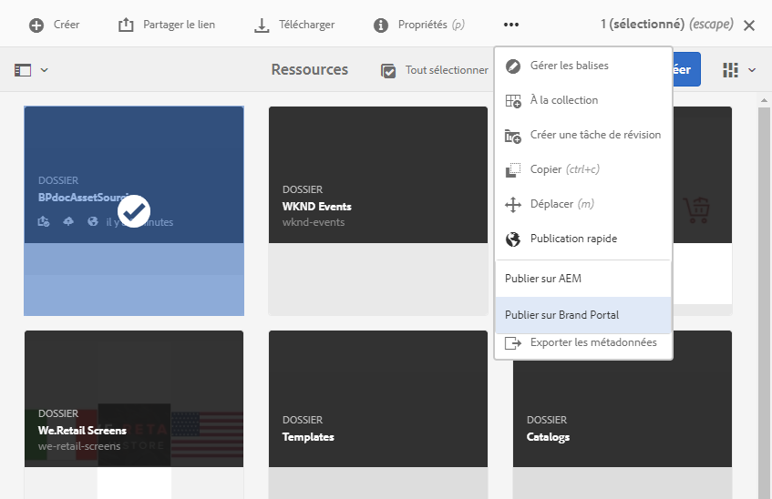

# Publication du dossier de contribution sur Brand Portal {#publish-contribution-folder-to-brand-portal}

Une fois le [dossier de contribution configuré](brand-portal-configure-contribution-folder-properties.md), l’utilisateur d’AEM (administrateur/non-administrateur) peut le publier d’AEM Assets sur Brand Portal. Les utilisateurs du portail de marque autorisés à accéder au dossier de contribution recevront une notification par courrier électronique ou par pulsation à la fin de l’action de publication.

**Pour publier le dossier de contribution, procédez comme suit :**

1. Connectez-vous à votre instance d’auteur AEM.
URL par défaut : http://localhost:4502/aem/start.html
1. Accédez à **[!UICONTROL Ressources > Fichiers]** et localisez le dossier de contribution dans lequel vous souhaitez publier du contenu sur Brand Portal.
1. Sélectionnez le dossier de contribution et cliquez sur **[!UICONTROL Publication rapide > Publier sur Brand Portal]**.

   

   Vous recevrez un message de réussite une fois que le dossier de contribution sera publié sur Brand Portal.

Une notification Push/par courrier électronique est envoyée aux utilisateurs de Brand Portal affectés au dossier de contribution. Les utilisateurs de Brand Portal peuvent accéder au dossier de contribution et commencer la contribution. Voir [Chargement de ressources dans le dossier de contribution](brand-portal-upload-assets-to-contribution-folder.md).