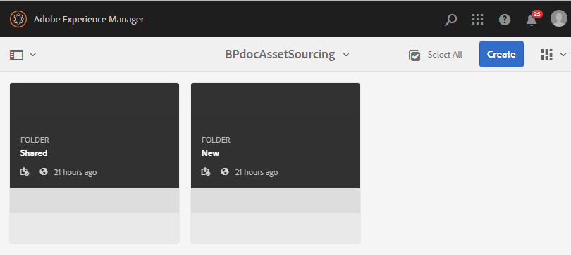

# Configuration du dossier de contribution dans Experience Manager Assets {#configure-contribution-folder}

Pour l’approvisionnement collaboratif des ressources, les utilisateurs Experience Manager Assets (administrateurs et non-administrateurs autorisés) peuvent créer des dossiers de type **Contribution des ressources**, en s’assurant que les nouveaux dossiers s’ouvrent lorsque des utilisateurs Brand Portal envoient des ressources.  Cela déclenche automatiquement un workflow qui crée deux sous-dossiers supplémentaires, appelés **SHARED** et **NEW**, dans le dossier **Contribution** nouvellement créé.

L’utilisateur de ressources Experience Manager définit ensuite les exigences en chargeant un résumé relatif aux types de ressources à ajouter au dossier de contribution, ainsi qu’un ensemble de ressources de base, dans le dossier **SHARED** afin de s’assurer que les utilisateurs de Brand Portal disposent des informations dont ils ont besoin. L’administrateur peut alors octroyer aux utilisateurs actifs de Brand Portal l’accès au dossier de contribution avant de publier le nouveau dossier Contribution sur Brand Portal.

La vidéo suivante explique comment configurer un dossier Contribution dans les ressources Experience Manager :

>[!VIDEO](https://video.tv.adobe.com/v/30547)

L’utilisateur Assets Experience Manager effectue les activités suivantes lors de la configuration d’un dossier de contribution :

* [Création d’un dossier de contribution](#create-contribution-folder)
* [Téléchargement des exigences relatives aux ressources et affectation des contributeurs](#configure-contribution-folder-properties)
* [Chargement de ressources de base](#uplad-new-assets-to-contribution-folder)
* [Publication du dossier de contribution à partir de ressources du Experience Manager sur Brand Portal](#publish-contribution-folder-to-brand-portal)

## Création d’un dossier de contribution {#create-contribution-folder}

Les administrateurs de ressources Experience Manager et les utilisateurs non-administrateurs autorisés à créer un dossier peuvent créer un dossier de contribution dans Ressources Experience Manager.
Pour créer un dossier de contribution, créez un dossier de type Contribution des ressources, en vous assurant qu’il accepte l’envoi de ressources de la part des utilisateurs de Brand Portal.  Cela déclenche automatiquement un workflow qui crée deux sous-dossiers supplémentaires, SHARED et NEW, dans le dossier de contribution.

>[!NOTE]
>
>Vous pouvez créer plusieurs dossiers de contribution dans un dossier. Ne créez pas de dossier de contribution à l’intérieur d’un autre dossier de contribution.

Vous pouvez configurer les propriétés du dossier de contribution séparément ainsi que lors de sa création. Dans cet exemple, nous configurons les propriétés séparément.

**Pour créer un dossier de contribution, procédez comme suit :**

1. Connectez-vous à votre instance Assets Experience Manager.

1. Accédez à **[!UICONTROL Ressources]** > **[!UICONTROL Fichiers]**. Il répertorie tous les dossiers existants dans le référentiel Assets Experience Manager.

1. Cliquez sur **[!UICONTROL Créer]** pour créer un dossier. La boîte de dialogue **[!UICONTROL Créer un dossier]** apparaît.

1. Spécifiez le **[!UICONTROL Titre]** et le **[!UICONTROL Nom]** du dossier et cochez la case **[!UICONTROL Contribution des ressources]**.
Il est recommandé d’utiliser dans le nom du dossier des lettres minuscules sans espace.

1. Cliquez sur **[!UICONTROL Créer]**. Le dossier de contribution est répertorié dans le référentiel de ressources du Experience Manager.

   >[!NOTE]
   >
   >Un utilisateur non-administrateur peut créer et partager un dossier de contribution de ressources, mais il ne peut ni le modifier ni le supprimer.

   

1. Cliquez pour ouvrir le dossier de contribution. Vous pouvez voir deux sous-dossiers, **[!UICONTROL SHARED]** et **[!UICONTROL NEW]**, automatiquement créés dans le dossier de contribution.

   

## Configuration des propriétés du dossier de contribution {#configure-contribution-folder-properties}

L’administrateur de ressources Experience Manager effectue les activités suivantes lors de la configuration des propriétés d’un dossier de contribution.

* **Ajouter une description** : fournissez une description détaillée du dossier de contribution.
* **Charger les instructions** : chargez le document sur les exigences en matière de ressources contenant des informations relatives aux ressources.
* **Ajouter des contributeurs** : ajoutez des utilisateurs de Brand Portal pour leur accorder l’accès au dossier de contribution.

Les exigences en matière de ressources font référence aux détails fournis par les administrateurs pour aider les contributeurs (utilisateurs de Brand Portal) à comprendre le besoin et les exigences du dossier de contribution. L’administrateur charge un document sur les exigences en matière de ressources contenant un résumé sur le type de ressources à ajouter au dossier de contribution et des informations relatives aux ressources comme le but, le type d’images, la taille maximale, etc.

**Pour configurer les propriétés du dossier de contribution, procédez comme suit :**

1. Connectez-vous à votre instance Assets Experience Manager.

1. Accédez à **[!UICONTROL Ressources > Fichiers]** et localisez le dossier de contribution.
1. Sélectionnez le dossier de contribution et cliquez sur **[!UICONTROL Propriétés]** pour ouvrir la fenêtre Propriétés du dossier.

   

   

1. Accédez à l’onglet **[!UICONTROL Contribution des ressources]**.
1. Saisissez une **[!UICONTROL Description]** détaillée du dossier de contribution.
1. Cliquez sur **[!UICONTROL Charger les instructions]** pour parcourir votre ordinateur local et charger un **document relatif aux exigences en matière de ressources**.

   

1. Dans le champ **[!UICONTROL Ajouter un utilisateur]**, ajoutez les utilisateurs de Brand Portal avec lesquels vous souhaitez partager le dossier de contribution. Ces utilisateurs peuvent accéder au dossier de contribution et y charger du contenu à l’aide de l’interface de Brand Portal.
1. Cliquez sur **[!UICONTROL Enregistrer]**.

   

>[!NOTE]
>
>Les résultats de la recherche sont basés sur la liste des utilisateurs Brand Portal configurée dans Experience Manager Assets. Vérifiez que vous disposez de la liste mise à jour des utilisateurs de Brand Portal.

## Chargement de ressources dans le dossier de contribution {#uplad-new-assets-to-contribution-folder}

Les utilisateurs de Brand Portal peuvent télécharger les exigences en matière de ressources pour comprendre le besoin en termes de contribution.
Ils peuvent alors créer des ressources à des fins de contribution et les charger dans le dossier NEW au sein du dossier de contribution.

>[!NOTE]
>
>Les utilisateurs de Brand Portal peuvent charger des ressources uniquement vers le dossier NEW.
>
>La limite de chargement maximale pour tout client Brand Portal est de **10** Go ; elle est appliquée de manière cumulative à tous les dossiers de contribution.

Après avoir publié les ressources nouvellement créées dans Experience Manager Assets, les utilisateurs de Brand Portal peuvent les supprimer du dossier NEW . En revanche, l’administrateur de Brand Portal peut supprimer les ressources des dossiers NEW et SHARED.

Une fois l’objectif de création du dossier de contribution atteint, l’administrateur de Brand Portal peut le supprimer afin de libérer l’espace de chargement pour d’autres utilisateurs.

>[!NOTE]
>
>Il est recommandé de libérer l’espace de chargement après la publication du dossier de contribution dans Ressources Experience Manager afin qu’il soit disponible pour les autres utilisateurs de Brand Portal à des fins de contribution.
>
>S’il est nécessaire d’étendre la limite de chargement de votre client Brand Portal au-delà de **10** Go, contactez le service clientèle en spécifiant les exigences.

**Pour charger de nouvelles ressources :**

1. Connectez-vous à votre instance Brand Portal.
Le tableau de bord de Brand Portal répertorie tous les dossiers existants auxquels l’utilisateur de Brand Portal est autorisé à accéder, ainsi que le dossier de contribution nouvellement partagé.

1. Sélectionnez le dossier de contribution et cliquez dessus pour l’ouvrir. Le dossier de contribution contient deux sous-dossiers : **[!UICONTROL SHARED]** et **[!UICONTROL NEW]**.

1. Cliquez sur le dossier **[!UICONTROL NEW]**.

   

1. Cliquez sur **[!UICONTROL Créer]** > **[!UICONTROL Fichiers]** afin de charger des fichiers distincts ou un dossier (.zip) contenant plusieurs ressources.

   

1. Parcourez les ressources (fichiers/dossiers) et chargez-les dans le dossier **[!UICONTROL NEW]**.

   

Après avoir transféré toutes les ressources ou tous les dossiers dans le dossier NEW , publiez le dossier de contribution dans Ressources du Experience Manager.

## Publication du dossier de contribution sur Brand Portal {#publish-contribution-folder-to-brand-portal}

Une fois le dossier de contribution configuré, l’utilisateur Ressources du Experience Manager (administrateur/non-administrateur) peut le publier depuis Ressources du Experience Manager vers Brand Portal. Les utilisateurs de Brand Portal autorisés à accéder au dossier de contribution recevront une notification Push ou par email à la fin de l’action de publication.

**Pour publier le dossier de contribution, procédez comme suit :**

1. Connectez-vous à votre instance Assets Experience Manager.

1. Accédez à **[!UICONTROL Ressources > Fichiers]** et localisez le dossier de contribution dans lequel vous souhaitez publier du contenu sur Brand Portal.
1. Sélectionnez le dossier de contribution et cliquez sur **[!UICONTROL Publication rapide]** > **[!UICONTROL Publier sur Brand Portal]**.

   

   Vous recevrez un message de réussite une fois que le dossier de contribution sera publié sur Brand Portal.

Une notification Push/par courrier électronique est envoyée aux utilisateurs de Brand Portal affectés au dossier de contribution. Les utilisateurs de Brand Portal peuvent accéder au dossier de contribution et commencer la contribution. Voir [Chargement de ressources dans le dossier de contribution et publication dans Experience Manager Assets](brand-portal-publish-contribution-folder-to-aem-assets.md).
