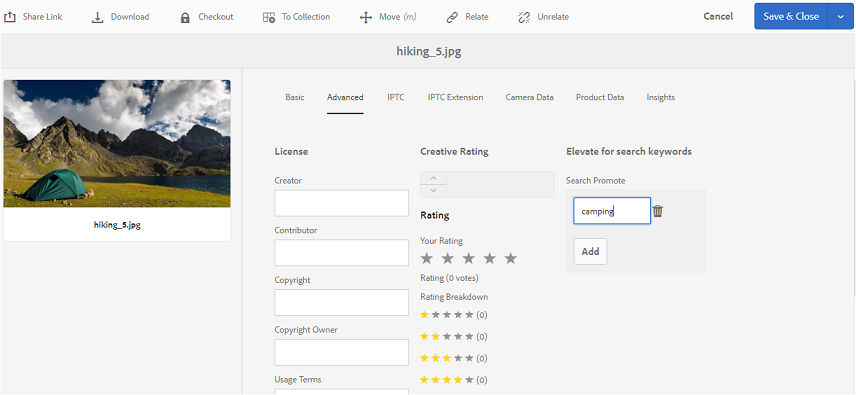

# Publication de balises sur Brand Portal {#publish-tags-to-brand-portal}

Découvrez comment publier des balises à partir d’Experience Manager Assets sur Brand Portal.

Les balises sont utiles pour organiser les ressources et améliorer la capacité de recherche des ressources auxquelles elles sont associées. Les balises peuvent être considérées comme des mots-clés ou des libellés (métadonnées) associés à des ressources et permettant de trouver rapidement des ressources à l’issue d’une recherche. Pour savoir comment affecter des balises à des ressources dans Experience Manager Assets, reportez-vous à [Utilisation des balises pour organiser les ressources](https://experienceleague.adobe.com/en/docs/experience-manager-65/content/assets/managing/organize-assets).

Les balises (liées aux ressources et aux collections dans AEM) sont automatiquement publiées sur Brand Portal quand les ressources (et les collections) associées à des balises sont publiées sur Brand Portal. Les balises publiées sont utiles pour retrouver les ressources associées.

>[!NOTE]
>
>Adobe recommande de publier exclusivement les balises dans Brand Portal avant de publier les ressources (et collections) auxquelles les balises sont associées. Cette approche accélère la publication des ressources (et des collections) dans Brand Portal.

## Gérer les balises {#manage-tags}

Vous pouvez utiliser les balises préexistantes pour joindre une ressource ou créer des balises à partir de la console Balises AEM (**[!UICONTROL Outils | Balisage | Balises AEM]**). Dans les deux scénarios, vous devez d’abord publier les balises dans Brand Portal, puis les associer aux ressources appropriées.

Pour créer des balises sur AEM, publier les balises sur Brand Portal et associer les balises aux ressources (ou collections) appropriées, procédez comme suit :

1. **Créer des balises**
Connectez-vous à une instance d’auteur AEM avec les droits d’administrateur et accédez à la console **[!UICONTROL AEM Tags]** à partir d’une navigation globale :

   1. Sélectionnez **[!UICONTROL Outils]**.

   1. Sélectionnez **[!UICONTROL Général]**.

   1. Sélectionnez **[!UICONTROL Balisage]**.

1. Sélectionnez **[!UICONTROL Créer]** puis sélectionnez l’option **[!UICONTROL Créer une balise]**.
1. Précisez les paramètres suivants :

   * **[!UICONTROL Titre]**
     *(obligatoire)* Titre affiché pour la balise.
   * **[!UICONTROL Name]**
     *(obligatoire)* Nom de la balise. Si aucun nom n’est spécifié, un nom de nœud valide est créé à partir du titre. Voir [ID de balise](https://experienceleague.adobe.com/en/docs/experience-manager-65/content/implementing/developing/platform/tagging/framework).
   * **Description**
     *(facultative)* Description de la balise.
   * **Chemin de la balise**
Chemin JCR de la balise.

1. Sélectionner **[!UICONTROL Envoyer]** pour créer la balise.

   Après avoir créé une balise sur une instance AEM, vous pouvez la joindre à une ressource (à l’aide de la section Propriétés ou de la section Gérer les balises de cette ressource).

1. **Publiez la balise sur Brand Portal**.

   Accédez à la console **[!UICONTROL AEM Tags]** ([!UICONTROL Outils | Balisage | AEM Tags]), sélectionnez la balise souhaitée et Publier sur Brand Portal.

1. **Joignez la balise à une ressource (ou collection)**.

   Sélectionnez une ressource (ou une collection) et joignez la balise de votre choix à l’aide de la section Propriétés ou Gérer les balises de cette ressource. Pour en savoir plus sur l’attribution de balises à des ressources dans AEM Assets, accédez à [Utilisation des balises pour organiser les ressources](https://experienceleague.adobe.com/en/docs/experience-manager-65/content/assets/managing/organize-assets).

1. **Publiez les ressources (ou les collections) sur Brand Portal**.\
   Quand vous publiez une ressource (ou collection) sur Brand Portal, la balise jointe est également disponible sur Brand Portal.

   Pour afficher la balise jointe sur la ressource (ou collection) correspondante dans Brand Portal, connectez-vous à Brand Portal, puis sélectionnez la ressource. Sous la section Propriétés , vous pouvez voir la balise jointe.

## Rechercher une promotion {#search-promote}

AEM Assets Brand Portal vous permet d’utiliser des ressources spécifiques comme résultats principaux pour les recherches basées sur une balise de mot-clé.

Pour promouvoir une ressource pour un mot-clé de recherche, suivez ces étapes :

1. Ouvrez la page **[!UICONTROL Propriétés]** d’une ressource sur l’instance de création AEM.
1. Accédez à l’onglet **[!UICONTROL Avancé]**.
1. Dans la section **[!UICONTROL Promouvoir la recherche]** de la section **[!UICONTROL Élever pour les mots-clés de recherche]**, sélectionnez **[!UICONTROL Ajouter]** pour ajouter les mots-clés ou les balises de recherche.

   

1. Enregistrez les modifications.
1. Publiez la ressource dans Brand Portal.
1. Connectez-vous à Brand Portal. Affichez l’onglet **[!UICONTROL Avancé]** dans la section **[!UICONTROL Propriétés]** de la ressource.
Notez que le mot-clé **[!UICONTROL Rechercher une promotion]** est également visible dans les propriétés de cette ressource.
