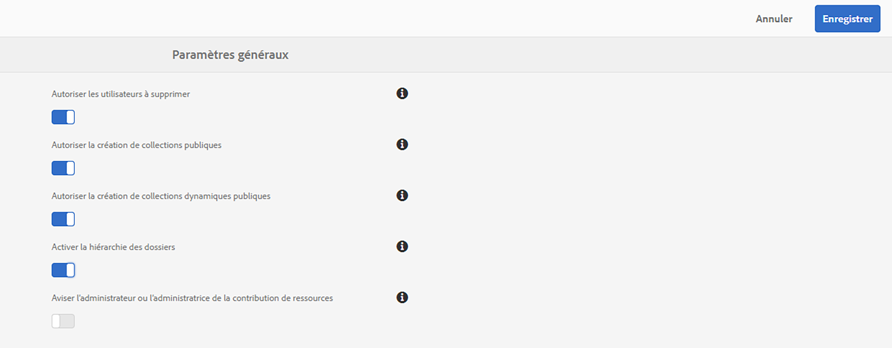

# Notes de mise à jour {#release-notes}

Découvrez les nouvelles fonctionnalités, les améliorations, les problèmes critiques résolus et les problèmes connus de la version d’Adobe Experience Manager Assets Brand Portal 2024.10.0.

## Informations sur la version {#release-information}

| Produit | Adobe Experience Manager Assets Brand Portal |
|---|---|
| Version | 2024.10.0 |
| Date | Octobre 2024 |

## Présentation {#overview}

Adobe Experience Manager (AEM) Assets Brand Portal permet d’acquérir, de contrôler et de distribuer facilement et en toute sécurité des ressources de création approuvées destinées à des tiers externes et aux collaborateurs de l’entreprise sur différents appareils. Brand Portal améliore l’efficacité du partage des ressources, accélère la mise sur le marché des ressources et réduit les risques de non-conformité et d’accès non autorisé. Brand Portal permet aux utilisateurs de parcourir, rechercher, prévisualiser, télécharger et exporter des ressources dans des formats approuvés par l’entreprise, à tout moment et en tout lieu.

## Nouveautés de la version 2024.10.0 {#whats-new-in-2024.10.0}

### Problèmes critiques résolus {#critical-issues-fixed}

#### Correctifs {#bug-fixes}

Cette version comprend les correctifs suivants :

* Les notifications électroniques d’approvisionnement des événements d’importation ne sont pas envoyées.
* Lors de l’utilisation du filtre de recherche, Brand Portal affiche les dossiers en double dans la fenêtre Filtre de recherche.
* Le téléchargement de collections contenant des ressources sans licence dont le nom contient des caractères spéciaux ne fonctionne pas.
* Lors de l’accès à l’ [!UICONTROL éditeur de formulaire de recherche], les libellés ne sont pas localisés.
* Les libellés ne sont pas localisés dans la fenêtre de partage de lien.
* Impossible de télécharger la vidéo dont le nom contient des caractères spéciaux.
* La publication et l’annulation de la publication des ressources de [!DNL Adobe Experience Manager Assets] vers Brand Portal ne fonctionnent pas correctement.
* Impossible de lire les vidéos téléchargées depuis Brand Portal.

## Versions précédentes

### Version de février 2024 {#feb-2024}

**Correctifs et améliorations de bogues**

Cette version comprend les correctifs suivants :

* Impossible de télécharger les ressources numériques protégées par DRM dans la langue turque.
* Impossible d’ouvrir et de télécharger les rapports existants contenant des ressources avec un titre multiligne.
* Lorsque vous téléchargez des ressources à l’aide du bouton [!UICONTROL Télécharger] de la barre d’actions, un maximum de 1 000 ressources sont téléchargées.
* Nom incorrect des ressources de type PSD lors de l’affichage dans l’arborescence de contenu.
* L’option [!UICONTROL Supprimer le rendu] ne fonctionne pas sur la page des détails de la ressource.
* Alignement incorrect du titre et de la taille des ressources dans la fenêtre contextuelle de téléchargement.
* Lors de la création d’un rapport, les libellés ne sont pas localisés.
* Les administrateurs et les administratrices de l’assistance étaient appelés administrateurs et administratrices dans Brand Portal.

### Version d’octobre 2023 {#oct-2023}

**Correctifs et améliorations**
Les améliorations suivantes ont été apportées à cette version :

* Amélioration des performances lors de la navigation dans les [!UICONTROL Collections].

* Améliorations des résultats de recherche lors d’une recherche partielle à l’aide du champ OmniSearch.

Cette version comprend les correctifs suivants :

* Impossible d’enregistrer les prédicats [!UICONTROL Date] et [!UICONTROL Options] dans la [!UICONTROL Collecte dynamique].

* Le format [!UICONTROL Date et heure] est incohérent lorsque vous utilisez des paramètres régionaux autres que l’anglais.

* Lors de la recherche de ressources, le bouton [!UICONTROL Supprimer] est manquant.

* Si le champ [!UICONTROL Titre] contient des symboles multioctets dans [!UICONTROL Partage de liens], le rapport ne peut pas être téléchargé.

* Lors de l’affichage d’un document de type PDF, les info-bulles et les libellés ne sont pas localisés.

### Version d’août 2023 {#aug-2023}

**Correctifs et améliorations**
Les améliorations suivantes ont été apportées à cette version :

* Améliorations des performances lors du chargement des ressources sur la fenêtre contextuelle [!UICONTROL Télécharger].
* Lorsque vous téléchargez une ressource ou son rendu, le téléchargement s’effectue dans le format du type de fichier d’origine et non sous forme de fichier zip.

Cette version comprend les correctifs suivants :

* Les balises et libellés longs ne s’affichent pas correctement pour les filtres de recherche.
* Impossible d’afficher les noms des rendus longs dans la boîte de dialogue Télécharger .
* Impossible de prévisualiser les ressources vidéo en mode Carte.

### Version de mai 2023 {#may-2023}

**Correctifs**
Cette version comprend les correctifs des problèmes critiques suivants :

* Si une erreur se produit lors du téléchargement d’une ressource à partir d’un lien partagé, les libellés `Notice` et `Close` de l’invite d’erreur ne sont pas localisés.
* Brand Portal affiche le message d’erreur **Champs d’en-tête trop grands dans la demande** lors de l’accès aux filtres de recherche à l’aide du volet `Filter`.

**Problèmes connus**
Cette version présente les problèmes connus suivants :

* Localisation partielle du contenu du rapport d’approvisionnement des ressources.
* Peu de champs du profil utilisateur ne sont pas modifiables dans le profil utilisateur.

### Version de février 2023 {#feb-2023}

**Correctifs**

Cette version comprend des correctifs pour les problèmes critiques suivants :

* La photo de profil ne peut pas être mise à jour dans Brand Portal.
* Le volet de l’arborescence de contenu n’est pas redimensionnable. Si le nom de fichier dépasse la largeur par défaut de l’arborescence de contenu, vous ne pouvez pas faire glisser cette dernière horizontalement et verticalement. Par conséquent, les noms de fichiers plus longs ne sont pas lisibles.
* Les résultats de la recherche sont incohérents pour le même prédicat de propriété utilisé deux fois dans les formulaires de recherche.
* Le texte des pages de connexion intermédiaires n’est pas localisé pour toutes les langues.

**Améliorations**

Les améliorations suivantes ont été apportées à cette version :

* Une nouvelle visionneuse PDF moderne est désormais disponible pour un aperçu amélioré des ressources PDF.
* Vous pouvez maintenant choisir d’activer ou de désactiver les notifications d’approvisionnement des ressources pour les administrateurs et les administratrices. Accédez à [!UICONTROL Paramètres généraux], puis activez ou désactivez [!UICONTROL `Notify Administrator of asset contribution`].

  

* Une utilisatrice ou un utilisateur sans autorisation ne peut pas demander l’accès à Brand Portal si le demande d’accès est désactivée.
* Seules les organisations configurées pour Brand Portal sont visibles dans la liste du sélecteur de profil.

**Problèmes connus**

Cette version présente les problèmes connus suivants :

* Localisation partielle du contenu du rapport d’approvisionnement des ressources.
* Peu de champs du profil utilisateur ne sont pas modifiables dans le profil utilisateur.

### Version d’octobre 2022 {#oct-2022}

**Problèmes critiques résolus**

Cette version comprend des correctifs pour les problèmes critiques suivants :

* Temps de réponse lent lors de la copie de fichiers volumineux de Brand Portal vers un outil tiers.
* Lorsque vous cochez la case Nombre de rendus, les cases permettant de sélectionner des rendus individuels sont désactivées.
* Temps de réponse lent pour la recherche.

>[!IMPORTANT]
>
>Les notifications push dans AEM Assets Brand Portal vont cesser à partir du 1er décembre 2022. Au lieu des notifications Pulse, vous continuez à recevoir des notifications par e-mail pour les événements suivants :
>
>* Partage de ressources par lien
>* Processus de demande d’accès
>* Partage du dossier de contribution
>* Lancement de l’export vers AEM
>* Exportation vers AEM terminée
>

### Version d’août 2022 {#aug-2022}

**Problèmes critiques résolus**

Cette version comprend des correctifs pour les problèmes critiques suivants :

* Lorsque NUI ne traite pas une ressource dans Experience Manager, Brand Portal affiche un statut d’importation de ressource inexact.
* Lorsque l’action de prévisualisation échoue, aucune notification n’est envoyée pour signaler l’échec.
* La valeur inexacte de la propriété `totalUploadedSize` pour chaque ressource est corrigée.
* Lorsque vous cliquez sur **Télécharger tous les éléments** et qu’un grand nombre de rendus sont disponibles pour une ressource, Brand Portal télécharge un fichier .ZIP non valide.
* La traduction de certaines chaînes est tronquée dans l’interface utilisateur de Brand Portal.

### Version de mai 2022 {#may-2022}

**Nouvelles fonctionnalités**

Brand Portal exécute désormais des tâches automatiques toutes les douze heures afin de supprimer toutes les ressources Brand Portal publiées sur AEM. Par conséquent, vous n’avez pas besoin de supprimer manuellement les ressources du dossier Contribution pour que la taille du dossier reste inférieure à la limite de seuil.

**Problèmes critiques résolus**

Cette version comprend des correctifs pour les problèmes critiques suivants :

* Lorsque vous téléchargez un dossier ou une collection contenant des ressources avec des balises de couleur, un fichier XML est également téléchargé.
* Lorsque vous téléchargez une vidéo qui comprend des rendus, Brand Portal crée un fichier .ZIP non valide.
* Lorsque vous créez des paramètres prédéfinis et des ressources sur AEM auteur, puis que vous les publiez dans Brand Portal, vous pouvez sélectionner des rendus dynamiques lors du téléchargement des ressources. Cependant, vous ne pouvez pas extraire le fichier .ZIP téléchargé. Ce problème empêche l’accès au contenu téléchargé.
* Problèmes lors du téléchargement de ressources vidéo à partir de certains dossiers disponibles dans Brand Portal.
* Lorsque vous partagez l’URL du dossier Contribution à l’aide d’un e-mail, les rôles Observateur et Éditeur rencontrent des problèmes lors de l’accès à leur dossier parent à l’aide du chemin de navigation.
* L’approvisionnement du rapport publié affiche une heure de début de tâche incorrecte.

### Version de février 2022 {#feb-2022}

**Nouvelles fonctionnalités**

* Le délai d’expiration de la session pour les utilisateurs invités est passé de 2 heures à 15 minutes.
* L’option supplémentaire **[!UICONTROL Afficher les pages]** a été supprimée pour les fichiers PDF de plusieurs pages, car l’utilisateur peut désormais afficher les pages PDF à partir du lecteur Adobe Document Cloud.
* Les utilisateurs ne peuvent pas rechercher, parcourir ou ouvrir des dossiers. L’interface utilisateur renvoie le message dʼerreur suivant : `Failed to load data`.
* Le panneau **[!UICONTROL Rendus]** ne répertorie pas tous les rendus statiques des ressources publiées sur Brand Portal.
* Le panneau **[!UICONTROL Rendus]** répertorie les rendus de recadrage intelligent de la ressource. Cependant, l’utilisateur ne peut ni prévisualiser ni télécharger les rendus de recadrage intelligent.
* La boîte de dialogue de téléchargement répertorie les rendus de recadrage intelligent de la ressource sélectionnée. Cependant, l’utilisateur ne peut pas télécharger les rendus de recadrage intelligent.
* Lors du téléchargement d’une ressource, un utilisateur non administrateur obtient uniquement le rendu dʼorigine de la ressource. Les rendus système et personnalisés ne sont pas téléchargés.
* Lors de l’application du filtre de recherche pour télécharger une ressource, le bouton `Download` est désactivé dans la boîte de dialogue de téléchargement et ne permet pas à l’utilisateur de télécharger la ressource.
* Si les balises `Smart Tags` et/ou `Color Tags` sont activées, la boîte de dialogue de téléchargement répertorie les fichiers `json` comme des rendus et télécharge ces fichiers `json` dans le dossier zip archivé.
* Les utilisateurs anonymes ne peuvent pas télécharger de ressources à l’aide d’un lien partagé, car le lien redirige vers la page de connexion de Brand Portal.
* Le système ne reflète pas la valeur correcte pour le nombre d’utilisateurs simultanés actifs.

<!--
### New Features {#new-features}

This release includes the following new features:

* AEM Assets as a Cloud Service is now entitled to have a pre-configured Brand Portal instance. The Cloud Manager user can activate Brand Portal on the AEM Assets as a Cloud Service instance.

* Asset Sourcing feature is now available on AEM Assets as a Cloud Service. It allows the Brand Portal users to upload assets to the permitted contribution folders and publish the contribution folder from Brand Portal to AEM Assets as a Cloud Service instance. 

* An additional **[!UICONTROL Asset Download]** setting has been introduced under the **[!UICONTROL Download Settings]**. It creates a separate folder for each asset while downloading the folders, collections, or bulk download of assets. 
-->
<!-- 
* The **[!UICONTROL Download]** dialog is revamped in a list view with additional options to exclude the renditions which are not required, apply the same set of rules for similar asset types, and download the selected asset renditions.
-->

<!--
* The new **[!UICONTROL Download]** dialog now appears with all the renditions of the selected assets or folders containing assets in a list view, wherein the Brand Portal users can apply same set of renditions for similar asset types and download the selected asset renditions. 
-->

<!-- 
* Navigation to the **[!UICONTROL Files]**, **[!UICONTROL Collections]**, and **[!UICONTROL Shared Links]** is now possible from all the Brand Portal pages in one-click.  

* The **[!UICONTROL Renditions]** panel in the asset details page now allows the Brand Portal users to select the original asset and (or) specific asset renditions, and directly download them from the **[!UICONTROL Renditions]** panel without having to open the **[!UICONTROL Download]** dialog.
-->

<!--
Brand Portal users can exclude specific renditions which are not required and directly download the original asset and its renditions from the **[!UICONTROL Renditions]** panel on the asset details page. 
-->

<!-- 
* In addition to the existing **[!UICONTROL Download]** configurations, the Brand Portal administrators can also [configure permissions for different group of users]() to view and (or) download the original asset and its renditions from the asset details page. These configurations will define who can access and (or) download the asset renditions.
-->

<!--
### Enhancements {#enhancements}

Brand Portal 2021.08.0 is an internal release that introduces Business profiles for enterprise and teams customers to give organizations better control over their assets. 

This release includes the following enhancements:

* The users now have organization-specific entitlement on the new and migrated organizations. If a user is entitled to multiple organizations, the user has to select the organization at the time of login.

* The new users that are added in Admin Console must **Join Team** to get entitled to the organization. 

>[!NOTE]
>
>Business profiles are currently applicable for the new organizations that are created after August 16, 2021. 
>
>Until your organization is migrated, you can continue to use Adobe ID, Enterprise ID, or Federated ID types to access the organization.   
-->

<!-- 
* For folder download, a separate folder is created for each asset using share link irrespective of the **[!UICONTROL Download Settings]**. 
* The Brand Portal **[!UICONTROL Usage Report]** has been modified to reflect only the active Brand Portal users.
-->

<!--
* The threshold of session timeout for the guest users has been reduced from 2 hours to 15 minutes.
* The additional **[!UICONTROL View pages]** option has been removed for multi-page PDFs as the user can now view the PDF pages from the Adobe Document Cloud Viewer.

* The users are unable to search, navigate, or open folders. The user interface reflects the error message: `Failed to load data`. 
* The **[!UICONTROL Renditions]** panel does not list all the static renditions of the assets that are published to Brand Portal.
* The **[!UICONTROL Renditions]** panel lists the smart crop renditions of the asset, however, the user cannot preview or download the smart crop renditions.
* The download dialog lists the smart crop renditions of the selected asset, however, the user cannot download the smart crop renditions. 
* A non-admin user is getting only the original asset rendition when downloading an asset. The system and custom renditions are not downloaded.  
* When applying search filter to download an asset, the `Download` button is disabled in the download dialog and does not allows the user to download the asset.
* If `Smart Tags` and (or) `Color Tags` are enabled, the download dialog lists the `json` files as renditions and downloads these `json` files in the archived zip folder.
* The anonymous users are unable to download assets using a shared link because the link redirects to the Brand Portal login page. 
* The system is not reflecting the correct value for the number of active concurrent users.
-->

<!--
### New features {#new-features}

Brand Portal now executes automatic jobs every twelve hours to delete all Brand Portal assets that are published to AEM. As a result, you do not need to delete the assets in the Contribution folder manually to keep the folder size below the threshold limit. See [What's new in Experience Manager Assets Brand Portal](whats-new.md).
-->

<!--
This release includes fixes to the following critical issues:

* When you download a folder or a collection that includes assets with color tags, an XML file gets downloaded as well.

* When you download a video that includes renditions, Brand Portal creates an invalid .ZIP file.

* When you create presets and assets on AEM author and publish them to Brand Portal and then select dynamic renditions while downloading the assets, you cannot extract the downloaded .ZIP file.

* Issues while downloading video assets from certain folders available on Brand Portal.

* When you share the Contribution folder's URL using an email, Viewer and Editor roles face issues while accessing its parent folder using the breadcrumb.

* Sourcing published report displays an incorrect job start time.
>
 
<!--
* Asset Sourcing email notifications are not delivered for some organizations. 

* Video files with extension `.mov` are not running on Brand Portal. 

* In the **[!UICONTROL Smart Collections]** dropdown list, only ten saved collections are visible. 
-->
<!--
* *_deleted tenants are listed as valid tenant which fails during the execution of TenantCustomizers/TenantUpdates where tenant id is returned as /etc/tenants/`<nodename>`.
-->

<!--
In case only the original assets are downloaded, the asset reflects its own extension and does not open until the extension is manually changed to zip. 
* The user interface of the collection folder does not respond on clicking the navigation arrow. 
* **[!UICONTROL Create]** button is visible in the **[!UICONTROL Column]** view even when the folders are empty.
* **[!UICONTROL Omni search]** fails with a 414 error message (Request-URI Too Long) if the dispatcher is bypassed while accessing the Brand Portal instance.
* An empty zip folder is downloaded if the asset contains a comma (`,`) in the file name.
* The viewer users get the option to add users to the collection they have created. 
* Inconsistent behavior is experienced when an asset (thumbnail or web rendition) is downloaded using share link.

See [what's new in Brand Portal 2021.02.0](whats-new.md).
-->

<!--
### Known Issues {#known-issues}

This release includes the following known issue:

* Search on the **[!UICONTROL Asset Reports]** shows processing on the product interface with no search result.
* The video DM encodes are not visible to the non-admin users on the asset details page.
* The alignment of the size of individual asset renditions and total download size is distorted in the Download dialog.
-->

<!--
* Download Settings configuration to configure asset download from Brand Portal. Fast download, custom renditions, and system renditions are the available configurations. 
-->

<!--
* Document Viewer has been introduced to enhance the PDF viewing experience. New options are available for viewing the PDF files in Brand Portal.

* Advances in the asset download process which improves the Brand Portal user experience while [downloading assets from Brand Portal](brand-portal-download-assets.md). Brand Portal administrators can configure **[!UICONTROL Fast Download]**, **[!UICONTROL Custom Renditions]**, and **[!UICONTROL System Renditions]** from the **[!UICONTROL Download]** settings. 

For details, see [what's new in Brand Portal 6.4.7](whats-new.md). 

### Critical Issues Fixed {#critical-issues-fixed-647}

This release includes fixes to the following critical issues:

* The viewer users are not permitted to share link for collections but the option to share is visible to them on the product interface.

* The **[!UICONTROL Download]** button on the options bar does not list all the licensed assets of the selected folder.

* The search takes longer to show the results for certain keywords.

* The **[!UICONTROL Agree]** and **[!UICONTROL Disagree]** check boxes does not appear on bulk selection of licensed and unlicensed assets during download.

* Filter-based search shows processing on the product interface with no search result. 

* The assets do not download from share link if the shared folder contains numerous and large assets.

### Known Issues {#known-issues-647}

This release includes the following known issues:

* If multiple assets are selected, license text does not appear on clicking Terms and Conditions on the license agreement page during download using share link.   

-->

## Langues {#languages}

L’interface utilisateur de Brand Portal est disponible dans les langues suivantes :

* Anglais
* Allemand
* Français
* Espagnol
* Italien
* Portugais brésilien
* Japonais
* Chinois simplifié
* Coréen

## Plates-formes certifiées {#certified-platforms}

Pour voir quelles plates-formes sont certifiées pour cette version de Brand Portal, vérifiez la colonne **Prise en charge de l’IU optimisée pour les écrans tactiles** dans la section **Navigateurs pris en charge pour l’interface utilisateur de création** de la section [Exigences techniques](https://experienceleague.adobe.com/fr/docs/experience-manager-65/content/implementing/deploying/introduction/technical-requirements).

## Liens {#links}

* [Page du produit Adobe Experience Manager sur adobe.com](https://business.adobe.com/fr/products/experience-manager/adobe-experience-manager.html)
* [Documentation Assets Brand Portal](https://experienceleague.adobe.com/en/docs/experience-manager-brand-portal/using/home)

## Assistance technique et accès au produit (sites à accès limité) {#product-access-and-support-restricted-sites}

Ces sites sont réservés aux clients. Si vous êtes client ou cliente et avez besoin d’un accès, contactez votre gestionnaire de compte Adobe.

<!--
* [https://daycare.day.com](https://daycare.day.com) 
-->

<!--
* [Customer Support]()
-->
