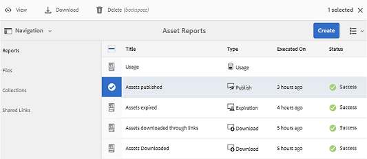

# Utilisation des rapports {#work-with-reports}

La fonctionnalité de création de rapports de Brand Portal permet d’évaluer l’utilisation de Brand Portal et la façon dont les utilisateurs internes et externes interagissent avec les ressources approuvées. Les administrateurs peuvent afficher le rapport Utilisation de Brand Portal, qui est toujours disponible sur la page Rapports de ressources. Toutefois, les rapports concernant les connexions d’utilisateurs et les ressources téléchargées, expirées, publiées et partagées par des liens peuvent être générés et affichés à partir de la page Rapports de ressources. Ces rapports s’avèrent utiles pour analyser le déploiement des ressources et permettent d’obtenir des indicateurs clés de réussite pour mesurer l’adoption des ressources approuvées au sein et en dehors de l’organisation.

L’interface de gestion des rapports est intuitive et contient des options et commandes précises pour accéder aux rapports enregistrés. Vous pouvez consulter, télécharger ou supprimer des rapports à partir de la page Rapports de ressources, dans laquelle tous les rapports générés auparavant sont répertoriés.

## Affichage des rapports {#view-reports}

Pour afficher un rapport, procédez comme suit :

1. Dans la barre d’outils supérieure, appuyez/cliquez sur le logo AEM pour accéder aux outils d’administration.

   

1. Dans le panneau des outils d’administration, cliquez sur **[!UICONTROL Créer/gérer des rapports]** pour ouvrir la page **[!UICONTROL Rapports de ressources]**.

   

1. Accédez au rapport **[!UICONTROL Utilisation]** et à d’autres rapports générés depuis la page Rapports de ressources.

   >[!NOTE]
   >
   >Le rapport Utilisation figure par défaut dans Brand Portal. Il ne peut pas être créé ni supprimé. Vous pouvez toutefois créer, télécharger et supprimer les rapports Téléchargement, Expiration, Publication, Partage de lien et Connexions des utilisateurs.

   Pour afficher un rapport, appuyez/cliquez sur le lien du rapport. Vous pouvez également sélectionner le rapport et appuyez/cliquez sur l’icône Afficher de la barre d’outils.

   Le rapport **[!UICONTROL Utilisation]** affiche des informations sur le nombre d’utilisateurs de Brand Portal actuels, l’espace de stockage occupé par toutes les ressources et le nombre total des ressources dans Brand Portal. Il affiche également la capacité autorisée pour chacune de ces mesures.

   

   Le rapport **[!UICONTROL Connexions des utilisateurs]** fournit des informations concernant les utilisateurs qui se sont connectés à Brand Portal. Le rapport affiche les noms d’affichage, les adresses e-mail, les rôles (administrateur, observateur, éditeur et invité), les groupes, la dernière connexion, l’état d’activité et le nombre de connexions de chaque utilisateur à partir du déploiement de Brand Portal 6.4.2 jusqu’au moment de la génération du rapport.

   

   Le rapport **[!UICONTROL Téléchargement]** détaille toutes les ressources téléchargées pendant une période et une plage horaire spécifiques.

   

   >[!NOTE]
   >
   >Le rapport **[!UICONTROL Téléchargement]** de ressources affiche uniquement les ressources qui ont été sélectionnées et téléchargées individuellement à partir de Brand Portal. Si un utilisateur a téléchargé un dossier contenant des ressources, le rapport n’affiche pas le dossier ou les ressources qu’il contient.

   Le rapport **[!UICONTROL Expiration]** répertorie toutes les ressources qui sont arrivées à expiration pendant une période spécifique.

   

   Le rapport **[!UICONTROL Publication]** répertorie et donne des informations sur toutes les ressources qui sont publiées d’AEM sur Brand Portal dans une période spécifiée.

   

   >[!NOTE]
   >
   >Le rapport Publication n’affiche pas d’informations sur les fragments de contenu, car ils ne peuvent pas être publiés sur Brand Portal.

   Le rapport **[!UICONTROL Partage de liens]** répertorie toutes les ressources partagées à travers des liens à partir de l’interface de Brand Portal pendant une période spécifique. Le rapport indique également quand la ressource a été partagée par un lien, par quel utilisateur, quand le lien expire, ainsi que le nombre de liens partagés pour le client (et les utilisateurs avec lesquels le lien de la ressources a été partagé). Les colonnes du rapport Partage de liens ne sont pas personnalisables.

   

   >[!NOTE]
   >
   >Le rapport Partage de liens n’affiche pas les utilisateurs qui ont accès à une ressource partagée par le biais du lien ou qui ont téléchargé la ressource via le lien.
   >
   >
   >Pour effectuer le suivi des téléchargements réalisés par l’intermédiaire du lien partagé, vous devez générer le rapport de téléchargement après avoir sélectionné l’option **[!UICONTROL Uniquement les téléchargements via partage de lien]** sur la page **[!UICONTROL Créer un rapport]**. L&#39;utilisateur (Téléchargé par) devient anonyme dans ce cas.

## Génération de rapports {#generate-reports}

Les administrateurs peuvent générer et gérer les rapports standard ci-après. Une fois générés, ils sont enregistrés pour être [accessibles](../using/brand-portal-reports.md#main-pars-header) ultérieurement.

* Connexions des utilisateurs
* Téléchargement
* Expiration
* Publication 
* Partage de liens

L’affichage des colonnes des rapports Téléchargement, Expiration et Publication peut être personnalisé. Pour générer un rapport, procédez comme suit :

1. Dans la barre d’outils supérieure, appuyez/cliquez sur le logo AEM pour accéder aux outils d’administration.

   

1. Dans le panneau des outils d’administration, appuyez/cliquez sur **[!UICONTROL Créer/gérer des rapports]** pour ouvrir la page **[!UICONTROL Rapports de ressources]**.

   

1. Sur la page Rapports de ressources, appuyez/cliquez sur **[!UICONTROL Créer]**.
1. Dans la page **[!UICONTROL Créer un rapport]**, sélectionnez un rapport à créer, puis appuyez/cliquez sur **[!UICONTROL Suivant]**.

   

1. Configurez les détails du rapport. Indiquez le titre, la description, la structure de dossiers (où le rapport doit s’exécuter et générer des statistiques) et la période pour les rapports **[!UICONTROL Téléchargement]**, **[!UICONTROL Expiration]** et **[!UICONTROL Publication]**.

   

   Quant au rapport **[!UICONTROL Partage de liens]**, il n’a besoin que d’un titre, d’une description et d’une période.

   

   >[!NOTE]
   >
   >Dans le titre du rapport, les caractères spéciaux # et % sont remplacés par un trait d’union (-) lors de la génération du rapport.

1. Appuyez/cliquez sur **[!UICONTROL Suivant]** pour configurer les colonnes des rapports Téléchargement, Expiration et Publication.
1. Cochez ou décochez les cases pertinentes selon vos besoins. Par exemple, pour afficher le nom des utilisateurs (qui ont téléchargé des ressources) dans le rapport **[!UICONTROL Téléchargement]**, sélectionnez **[!UICONTROL Téléchargé par]**. L’image suivante montre comment sélectionner les colonnes par défaut dans le rapport Téléchargement.

   

   Vous pouvez également ajouter des colonnes personnalisées à ces rapports pour adapter l’affichage des données à vos besoins.

   Pour ajouter des colonnes personnalisées aux rapports Téléchargement, Publication et Expiration, procédez comme suit :

   1. Pour afficher une colonne personnalisée, appuyez/cliquez sur **[!UICONTROL Ajouter]** dans [!UICONTROL Colonnes personnalisées].
   1. Indiquez le nom de la colonne dans le champ **[!UICONTROL Nom de la colonne]**.
   1. Sélectionnez la propriété à laquelle la colonne doit être associée à l’aide du sélecteur de propriété.

      
Vous pouvez également saisir le chemin d’accès dans le champ de chemin d’accès à la propriété.

      

      Pour ajouter d’autres colonnes personnalisées, appuyez/cliquez sur **Ajouter** et répétez les étapes 2 et 3.

1. Cliquez/appuyez sur **[!UICONTROL Créer]**. Un message indique que la génération du rapport a été lancée.

## Téléchargement de rapports {#download-reports}

Pour enregistrer et télécharger un rapport en tant que fichier .csv, effectuez l’une des opérations suivantes :

* Sélectionnez un rapport sur la page Rapports de ressources, puis appuyez/cliquez sur **[!UICONTROL Télécharger]** dans la barre d’outils supérieure.

* Dans la page Rapports de ressources, ouvrez un rapport. Sélectionnez l’option **[!UICONTROL Télécharger]** en haut de la page du rapport.

## Suppression de rapports {#delete-reports}

Pour supprimer un rapport existant, sélectionnez-le sur la page **[!UICONTROL Rapports de ressources]** et appuyez/cliquez sur **[!UICONTROL Supprimer]** dans la barre d’outils supérieure.

>[!NOTE]
>
>Le rapport **[!UICONTROL Utilisation]** ne peut pas être supprimé.
