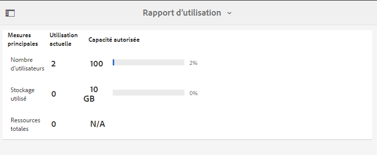
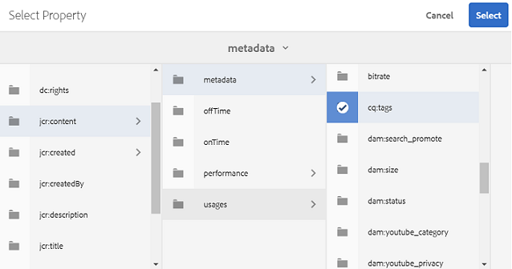

# Utilisation des rapports {#work-with-reports}

La fonctionnalité de création de rapports de Brand Portal permet d’évaluer l’utilisation de Brand Portal et la façon dont les utilisateurs internes et externes interagissent avec les ressources approuvées. Les administrateurs peuvent afficher le rapport Utilisation de Brand Portal, qui est toujours disponible sur la page Rapports de ressources . Cependant, les rapports pour les connexions des utilisateurs et les ressources téléchargées, expirées, publiées et partagées par des liens peuvent être générés et affichés à partir de la page Rapports de ressources . Ces rapports s’avèrent utiles pour analyser le déploiement des ressources et permettent d’obtenir des indicateurs clés de réussite pour mesurer l’adoption des ressources approuvées au sein et en dehors de l’organisation.

L’interface de gestion des rapports est intuitive et contient des options et commandes précises pour accéder aux rapports enregistrés. Vous pouvez consulter, télécharger ou supprimer des rapports à partir de la page Rapports de ressources, dans laquelle tous les rapports générés auparavant sont répertoriés.

## Affichage des rapports {#view-reports}

Pour afficher un rapport, procédez comme suit :

1. Dans la barre d’outils supérieure, cliquez sur le logo Experience Manager pour accéder aux outils d’administration.

   

1. Dans le panneau des outils d’administration, cliquez sur **[!UICONTROL Créer/gérer des rapports]** pour ouvrir la page **[!UICONTROL Rapports de ressources]**.

   

1. Accédez au rapport **[!UICONTROL Utilisation]** et aux autres rapports générés à partir de la page Rapports de ressources.

   >[!NOTE]
   >
   >Le rapport d’utilisation est un rapport par défaut généré dans Brand Portal. Il ne peut pas être créé ni supprimé. Cependant, vous pouvez créer, télécharger et supprimer les rapports Téléchargement, Expiration, Publish, `Link Share` et Connexions des utilisateurs.

   Pour afficher un rapport, cliquez sur son lien. Vous pouvez également sélectionner le rapport, puis cliquer sur l’icône Afficher de la barre d’outils.

   Le **[!UICONTROL rapport d’utilisation]** affiche des informations sur le nombre d’utilisateurs Brand Portal actifs, l’espace de stockage occupé par toutes les ressources et le nombre total de ressources dans Brand Portal. Les utilisateurs Brand Portal qui ne sont affectés à aucun profil de produit dans l’Admin Console sont considérés comme des utilisateurs inactifs et ne sont pas reflétés dans le **[!UICONTROL rapport d’utilisation]**.
Il affiche également la capacité autorisée pour chacune de ces mesures.

   

   Le rapport **[!UICONTROL Connexions des utilisateurs]** fournit des informations sur les utilisateurs qui se sont connectés à Brand Portal. Le rapport affiche les noms d’affichage, les e-mails, les personnages (administrateur, observateur, éditeur, invité), les groupes, la dernière connexion, l’état d’activité et le nombre de connexions de chaque utilisateur à partir du déploiement de Brand Portal 6.4.2 jusqu’au moment de la génération du rapport.

   

   Le rapport **[!UICONTROL Télécharger]** détaille toutes les ressources téléchargées pendant une période et une plage horaire spécifiques.

   

   >[!NOTE]
   >
   >Le rapport **[!UICONTROL Télécharger]** de ressources affiche uniquement les ressources qui ont été sélectionnées et téléchargées individuellement à partir de Brand Portal. Si un utilisateur a téléchargé un dossier contenant des ressources, le rapport n’affiche pas le dossier ou les ressources qu’il contient.

   Le rapport **[!UICONTROL Expiration]** répertorie et détaille toutes les ressources qui ont expiré au cours d’une période spécifique.

   

   Le rapport **[!UICONTROL Publication]** répertorie et donne des informations sur toutes les ressources qui sont publiées d’Experience Manager Assets sur Brand Portal dans une période spécifiée.

   

   >[!NOTE]
   >
   >Le rapport Publication n’affiche pas d’informations sur les fragments de contenu, car ils ne peuvent pas être publiés sur Brand Portal.

   Le rapport **[!UICONTROL Partage de liens]** répertorie toutes les ressources partagées par le biais de liens à partir de l’interface de Brand Portal pendant une période spécifique. Le rapport détaille le moment où la ressource a été partagée via un lien, que l’utilisateur a partagé, ainsi que la date d’expiration du lien. Il indique également le nombre de liens partagés pour le client et les utilisateurs. Les colonnes du rapport Partage de liens ne sont pas personnalisables.

   

   >[!NOTE]
   >
   >Le rapport Partage de liens n’affiche pas les utilisateurs qui ont accès à la ressource partagée par le biais du lien ou qui ont téléchargé la ressource via le lien.
   >
   >Pour effectuer le suivi des téléchargements par le biais du lien partagé, vous devez générer un rapport de téléchargement après avoir sélectionné l’option **[!UICONTROL Uniquement les téléchargements avec partage de lien]** sur la page **[!UICONTROL Créer un rapport]**. Cependant, l’utilisateur (téléchargé par) est anonyme dans ce cas.

## Génération de rapports {#generate-reports}

Les administrateurs peuvent générer et gérer les rapports standard suivants. Après la génération, les rapports sont enregistrés pour [accès ultérieur](../using/brand-portal-reports.md#main-pars-header).

* Connexions des utilisateurs
* Téléchargement
* Expiration
* Publication
* Partage de liens

L’affichage des colonnes des rapports Téléchargement, Expiration et Publication peut être personnalisé. Pour générer un rapport, procédez comme suit :

1. Dans la barre d’outils supérieure, cliquez sur le logo Experience Manager pour accéder aux outils d’administration.

1. Dans le panneau des outils d’administration, cliquez sur **[!UICONTROL Créer/gérer des rapports]** pour ouvrir la page **[!UICONTROL Rapports de ressources]**.

   

1. Sur la page Rapports de ressources, cliquez sur **[!UICONTROL Créer]**.
1. Sur la page **[!UICONTROL Créer un rapport]** , sélectionnez un rapport à créer, puis cliquez sur **[!UICONTROL Suivant]**.

   

1. Configurez les détails du rapport. Indiquez le titre, la description, la structure de dossiers (où le rapport doit s’exécuter et générer des statistiques) et la période pour les rapports **[!UICONTROL Téléchargement]**, **[!UICONTROL Expiration]** et **[!UICONTROL Publish]**.

   

   Le rapport **[!UICONTROL Partage de liens]** n’a besoin que du titre, de la description et des paramètres de période.

   

   >[!NOTE]
   >
   >La génération du rapport remplace les caractères spéciaux `#` et `%` dans le titre par un trait d’union (-).

1. Cliquez sur **[!UICONTROL Suivant]** pour configurer les colonnes des rapports Téléchargement, Expiration et Publish.
1. Cochez ou décochez les cases pertinentes selon vos besoins. Par exemple, pour afficher les noms des utilisateurs (qui ont téléchargé des ressources) dans le rapport **[!UICONTROL Téléchargement]**, sélectionnez **[!UICONTROL Téléchargé par]**. L’image suivante illustre la sélection des colonnes par défaut dans le rapport Téléchargement .

   

   Vous pouvez également ajouter des colonnes personnalisées à ces rapports afin d’afficher plus de données selon vos besoins.

   Pour ajouter des colonnes personnalisées au rapport Téléchargement, Publish ou Expiration, procédez comme suit :

   1. Pour afficher une colonne personnalisée, cliquez sur **[!UICONTROL Ajouter]** dans [!UICONTROL Colonnes personnalisées].
   1. Indiquez le nom de la colonne dans le champ **[!UICONTROL Nom de la colonne]**.
   1. Sélectionnez la propriété à laquelle la colonne doit être mappée à l’aide d’un sélecteur de propriétés.

      
Vous pouvez également saisir le chemin d’accès dans le champ de chemin d’accès à la propriété.

      

      Pour ajouter d’autres colonnes personnalisées, cliquez sur **Ajouter** et répétez les étapes 2 et 3.

1. Cliquez sur **[!UICONTROL Créer]**. Un message indique que la génération du rapport a été lancée.

## Téléchargement de rapports {#download-reports}

Pour enregistrer et télécharger un rapport sous la forme d’un fichier .csv, effectuez l’une des opérations suivantes :

* Sélectionnez un rapport sur la page Rapports de ressources, puis cliquez sur **[!UICONTROL Télécharger]** dans la barre d’outils supérieure.

* Dans la page Rapports de ressources, ouvrez un rapport. Sélectionnez l’option **[!UICONTROL Télécharger]** en haut de la page du rapport.

## Suppression de rapports {#delete-reports}

Pour supprimer un rapport existant, sélectionnez-le sur la page **[!UICONTROL Rapports de ressources]** et cliquez sur **[!UICONTROL Supprimer]** dans la barre d’outils supérieure.

>[!NOTE]
>
>Le rapport **[!UICONTROL Utilisation]** ne peut pas être supprimé.
