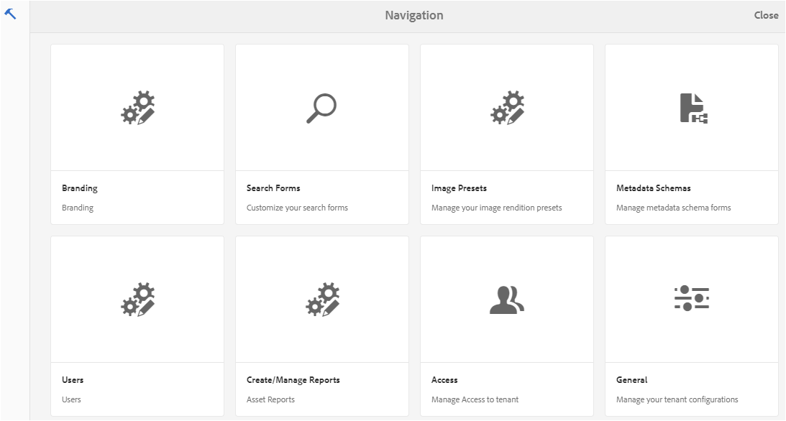
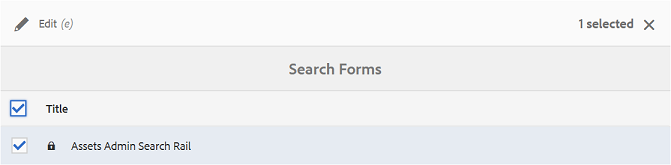
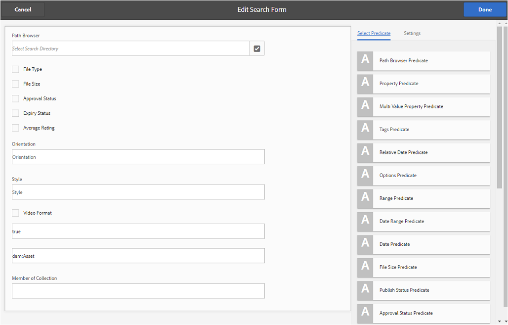
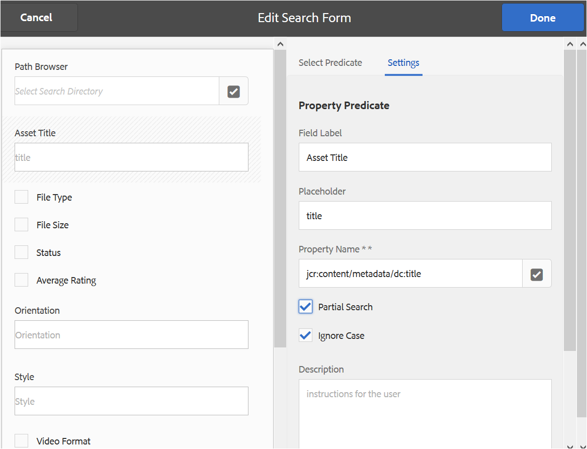
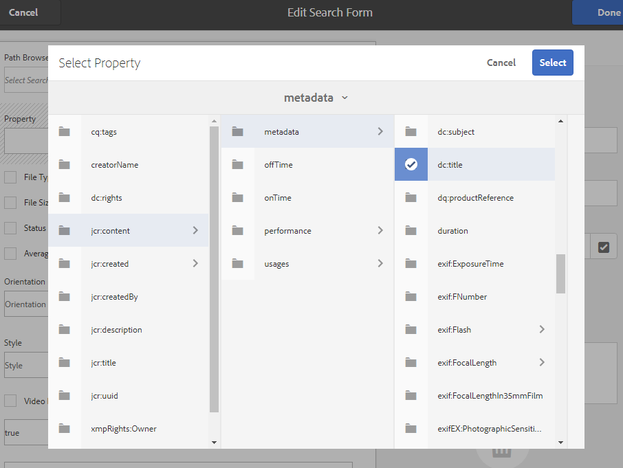
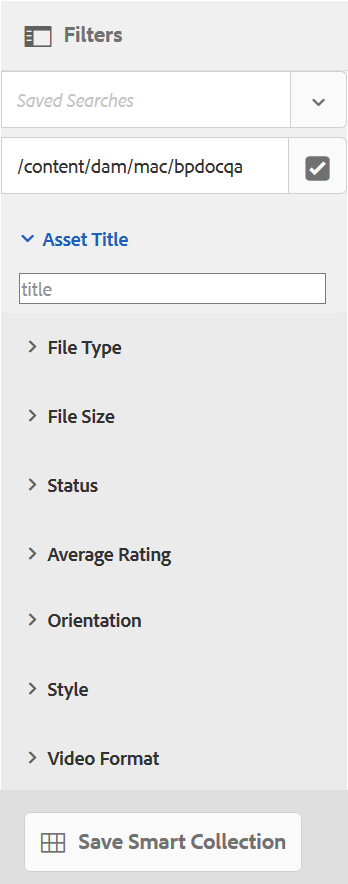
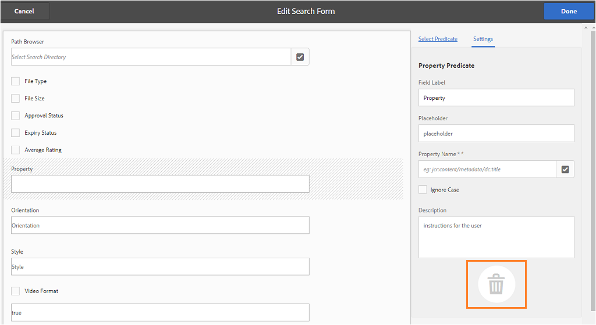
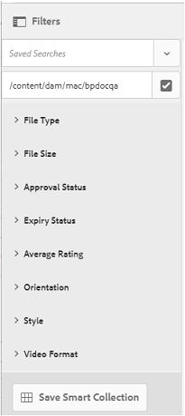

# Utilisation des facettes de recherche personnalisée {#use-custom-search-facets}

Les administrateurs peuvent ajouter des prédicats de recherche au panneau [!UICONTROL Filtres] pour personnaliser les recherches et rendre la fonction de recherche polyvalente.

Brand Portal prend en charge la [recherche à facettes](../using/brand-portal-searching.md#search-using-facets-in-filters-panel) pour les recherches granulaires de ressources de marque approuvées, rendue possible grâce au panneau [**Filtres**](../using/brand-portal-searching.md#search-using-facets-in-filters-panel). Les facettes de recherche sont disponibles dans le panneau Filtres via **[!UICONTROL Formulaire de recherche]** dans les outils d’administration. Un formulaire de recherche par défaut nommé Rail de recherche d’administrateurs de ressources existe dans la page Forms de recherche des outils d’administration. Toutefois, les administrateurs peuvent personnaliser le panneau Filtres par défaut. Ils peuvent modifier le formulaire de recherche par défaut (rail de recherche d’administrateurs de ressources) en ajoutant, modifiant ou supprimant des prédicats de recherche, ce qui rend la fonctionnalité de recherche polyvalente.

Vous pouvez utiliser différents prédicats de recherche pour personnaliser le panneau **[!UICONTROL Filtres]**. Ajoutez par exemple le prédicat Propriété pour rechercher des ressources qui correspondent à une seule propriété spécifiée dans ce prédicat. Ajoutez le prédicat Options pour rechercher les ressources correspondant à une ou plusieurs valeurs que vous indiquez pour une propriété spécifique. Ajoutez le prédicat Période pour rechercher les ressources créées au cours d’une période donnée.

>[!NOTE]
>
>Experience Manager Assets permet aux entreprises de [publier les formulaires de recherche personnalisés sur Brand Portal à partir de l’instance de création AEM](../using/publish-schema-search-facets-presets.md#publish-search-facets-to-brand-portal), au lieu de recréer le même formulaire sur Brand Portal.

## Ajoutez un prédicat de recherche au panneau Filtres {#add-a-search-predicate}

1. Pour accéder aux outils d’administration, cliquez sur le logo Experience Manager dans la barre d’outils supérieure.

   

1. Dans le panneau des outils d’administration, cliquez sur **[!UICONTROL Formulaires de recherche]**.

   

1. Dans la page **[!UICONTROL Formulaires de recherche]**, sélectionnez **[!UICONTROL Rail de recherche d’administrateurs de ressources]**.

   

1. Dans la barre d’outils qui s’affiche en haut, cliquez sur **[!UICONTROL Modifier]** pour ouvrir le formulaire de recherche et le modifier.

   

1. Sur la page [!UICONTROL Modifier le formulaire de recherche], faites glisser un prédicat de l’onglet [!UICONTROL Sélectionner le prédicat] vers le volet principal. Faites glisser, par exemple, **[!UICONTROL Prédicat de la propriété]**.

   Le champ **[!UICONTROL Propriété]** apparaît dans le volet principal et l’onglet **[!UICONTROL Paramètres]** à droite affiche les prédicats de propriété.

   

   >[!NOTE]
   >
   >Le libellé d’en-tête de l’onglet **[!UICONTROL Paramètres]** identifie le type de prédicat que vous sélectionnez.

1. Dans l’onglet **[!UICONTROL Paramètres]**, saisissez un libellé, un texte d’espace réservé et une description pour le prédicat de propriété.

   * Sélectionnez **[!UICONTROL Recherche partielle]** si vous souhaitez autoriser la recherche par expression partielle (et la recherche par caractères génériques) de ressources en fonction des valeurs de propriétés spécifiées. Par défaut, le prédicat prend en charge la recherche en texte intégral.
   * Sélectionnez **[!UICONTROL Ignorer la casse]** si vous souhaitez que la recherche de ressources en fonction des valeurs de propriétés ne soit pas sensible à la casse. Par défaut, la recherche de valeurs de propriété dans le filtre de recherche respecte la casse.

   >[!NOTE]
   >
   >Lorsque vous cochez la case **[!UICONTROL Recherche partielle]**, l’option **[!UICONTROL Ignorer la casse]** est sélectionnée par défaut.

1. Dans le champ **[!UICONTROL Nom de la propriété]**, ouvrez le sélecteur de propriétés et sélectionnez la propriété en fonction de laquelle la recherche est effectuée. Sinon, saisissez un nom de propriété. Par exemple, saisissez `jcr :content/metadata/dc:title` ou `./jcr:content/metadata/dc:title`.

   >[!NOTE]
   >
   >Dans Brand Portal, toutes les propriétés de chaînes (à l’exception de celles commençant par `xmp`) dans `jcrcontent/metadata` de `dam:asset` sont indexées par défaut. Par défaut, toutes les autres propriétés personnalisées de tout type ne sont pas indexées.
   >
   >Toute propriété indexée peut être utilisée lors de la création d’un prédicat de propriété. Si une propriété non indexée est configurée, la requête de recherche sur une telle propriété peut ne pas donner de résultat de recherche.

   

1. Pour enregistrer les paramètres, cliquez sur **[!UICONTROL Terminé]**.
1. Dans l’interface utilisateur d’[!UICONTROL Assets], cliquez sur l’icône de recouvrement, puis sélectionnez **[!UICONTROL Filtrer]** pour accéder au panneau **[!UICONTROL Filtres]**. Le prédicat **[!UICONTROL Propriété]** est ajouté au panneau.

   

1. Dans la zone de texte **[!UICONTROL Propriété]**, saisissez le titre de la ressource à rechercher. Par exemple, « Adobe ». Lorsque vous effectuez une recherche, les ressources dont le titre correspond à « Adobe » sont affichées dans les résultats de la recherche.

## Liste des prédicats de recherche {#list-of-search-predicates}

Tout comme vous ajoutez un prédicat **[!UICONTROL Propriété]**, vous pouvez ajouter les prédicats suivants au panneau **[!UICONTROL Filtres]** :

| **Nom du prédicat** | **Description** | **Propriétés** |
|-------|-------|----------|
| **[!UICONTROL Explorateur de chemins d’accès]** | Prédicat de recherche permettant de rechercher des ressources à un emplacement particulier. **Remarque :** *Pour un utilisateur connecté, l’explorateur de chemins d’accès sur le filtre affiche uniquement la structure de contenu des dossiers (et de leurs ancêtres) partagés avec l’utilisateur.*   Les utilisateurs administrateurs peuvent rechercher des ressources dans n’importe quel dossier en accédant à ce dossier à l’aide de l’explorateur de chemins d’accès.   En revanche, les utilisateurs non-administrateurs peuvent rechercher des ressources dans un dossier (qui leur est accessible) en accédant à ce dossier dans l’explorateur de chemins d’accès. | <ul><li>Étiquette du champ</li><li>Chemin d’accès</li><li>Description</li></ul> |
| **[!UICONTROL Propriété]** | Recherche des ressources en fonction d’une propriété de métadonnées spécifique. **Remarque :** *Lorsque vous cochez la case Recherche partielle, l’option Ignorer la casse est sélectionnée par défaut*. | <ul><li>Étiquette du champ</li><li>Espace réservé</li><li>Nom de propriété</li><li>Recherche partielle</li><li>Ignorer la casse</li><li> Description</li></ul> |
| **[!UICONTROL Propriété Plusieurs valeurs]** | Similaire à un prédicat de propriété mais autorise plusieurs valeurs d’entrée, séparées par un délimiteur (la valeur par défaut est une virgule). Les ressources correspondant à l’une des valeurs d’entrée sont renvoyées dans les résultats. | <ul><li>Étiquette du champ</li><li>Espace réservé</li><li>Nom de propriété</li><li>Prise en charge des délimiteurs</li><li>Ignorer la casse</li><li>Description</li></ul> |
| **[!UICONTROL Balises]** | Prédicat de recherche permettant de rechercher des ressources en fonction de balises. Vous pouvez configurer la propriété de chemin d’accès pour renseigner les différentes balises dans la liste de balises. Il se peut que les administrateurs doivent modifier la valeur du chemin d’accès, par exemple, [!UICONTROL /`etc/tags/mac/<tenant_id>/<custom_tag_namespace>`]. Cela est nécessaire s’ils publient le formulaire de recherche à partir d’AEM, où le chemin d’accès n’inclut pas les informations du client, par exemple [!UICONTROL `/etc/tags/<custom_tag_namespace>`]. | <ul><li>Étiquette du champ</li><li>Nom de propriété</li><li>Chemin d’accès</li><li>Description</li></ul> |
| **[!UICONTROL Chemin]** | Prédicat de recherche permettant de rechercher des ressources à un emplacement particulier. | <ul><li>Étiquette du champ</li><li>Chemin d’accès</li><li>Description</li></ul> |
| **[!UICONTROL Date relative]** | Prédicat de recherche permettant de rechercher des ressources en fonction de la date relative de leur création. | <ul><li>Étiquette du champ</li><li>Nom de propriété</li><li>Date relative</li></ul> |
| **[!UICONTROL Étendue]** | Prédicat de recherche permettant de rechercher des ressources comprises dans une plage spécifiée de valeurs de propriété. Dans le panneau Filtres, vous pouvez spécifier les valeurs de propriété minimale et maximale de la période concernée. | <ul><li>Étiquette du champ</li><li>Nom de propriété</li><li>Description</li></ul> |
| **[!UICONTROL Période]** | Prédicat de recherche permettant de rechercher une propriété de date dans des ressources créées dans une plage spécifiée. Dans le panneau Filtres, vous pouvez spécifier les dates de début et de fin. | <ul><li>Étiquette du champ</li><li>Espace réservé</li><li>Nom de propriété</li><li>Texte de la plage (De)</li><li>Texte de la plage (À)</li><li>Description</li></ul> |
| **[!UICONTROL Date]** | Prédicat de recherche permettant de rechercher à l’aide d’un curseur des ressources selon une propriété de date. | <ul><li>Étiquette du champ</li><li>Nom de propriété</li><li>Description</li></ul> |
| **[!UICONTROL Taille de fichier]** | Prédicat de recherche permettant de rechercher des ressources en fonction de leur taille. | <ul><li>Étiquette du champ</li><li>Nom de propriété</li><li>Chemin d’accès</li><li>Description</li></ul> |
| **[!UICONTROL Dernière modification de la ressource]** | Prédicat de recherche permettant de rechercher des ressources en fonction de la date de dernière modification. | <ul><li>Étiquette du champ</li><li>Nom de propriété</li><li>Description</li></ul> |
| **[!UICONTROL État d’approbation]** | Prédicat de recherche permettant de rechercher des ressources en fonction de la propriété de métadonnées d’approbation. Le nom de propriété par défaut est **`dam:status`**. | <ul><li>Étiquette du champ</li><li>Nom de propriété</li><li>Description</li></ul> |
| **[!UICONTROL État d’extraction]** | Prédicat de recherche permettant de rechercher des ressources en fonction du statut d’extraction d’une ressource lors de sa publication à partir d’AEM Assets. | <ul><li>Étiquette du champ</li><li>Nom de propriété</li><li>Description</li></ul> |
| **[!UICONTROL Extraits par]** | Prédicat de recherche permettant de rechercher des ressources en fonction de l’utilisateur qui a extrait la ressource. | <ul><li>Étiquette du champ</li><li>Nom de propriété</li><li>Description</li></ul> |
| **[!UICONTROL État d’expiration]** | Prédicat de recherche permettant de rechercher des ressources en fonction du statut d’expiration. | <ul><li>Étiquette du champ</li><li>Nom de propriété</li><li>Description</li></ul> |
| **[!UICONTROL Membre de la collection]** | Prédicat de recherche permettant de rechercher des ressources en fonction de l’appartenance d’une ressource à une collection. | Description |
| **[!UICONTROL Masqué]** | Ce prédicat n’est pas explicitement visible par les utilisateurs finaux et est utilisé pour toute contrainte masquée, généralement pour restreindre le type de résultats de recherche à **`dam:Asset`**. | <ul><li>Étiquette du champ</li><li>Nom de propriété</li><li>Description</li></ul> |

>[!NOTE]
>
>* N’utilisez pas le **[!UICONTROL prédicat d’options]**, le **[!UICONTROL prédicat de statut de publication]** ni le **[!UICONTROL prédicat d’évaluation]**, car ils ne sont pas fonctionnels dans Brand Portal.
>* Le prédicat de type de dossier `(nt:folder type)` n’est pas pris en charge sur Brand Portal et peut entraîner des problèmes de performance. S’il est présent dans un formulaire de recherche personnalisé publié, il peut être supprimé en modifiant le formulaire de recherche.

## Suppression d’un prédicat de recherche {#delete-a-search-predicate}

Pour supprimer un prédicat de recherche, procédez de la manière suivante :

1. Cliquez sur le logo Adobe pour accéder aux outils d’administration.

   

1. Dans le panneau des outils d’administration, cliquez sur **[!UICONTROL Formulaires de recherche]**.

   

1. Dans la page **[!UICONTROL Formulaires de recherche]**, sélectionnez **[!UICONTROL Rail de recherche d’administrateurs de ressources]**.

   

1. Dans la barre d’outils qui s’affiche en haut, cliquez sur **[!UICONTROL Modifier]** pour ouvrir le formulaire de recherche et le modifier.

   

1. Dans la page [!UICONTROL Modifier le formulaire de recherche], dans le panneau principal, sélectionnez le prédicat à supprimer. Sélectionnez, par exemple, **[!UICONTROL Prédicat de la propriété]**.

   L’onglet **[!UICONTROL Paramètres]** à droite affiche les champs de prédicat de propriété.

1. Pour supprimer un prédicat de propriété, cliquez sur l’icône représentant une corbeille. Dans la boîte de dialogue **[!UICONTROL Supprimer le champ]**, cliquez sur **[!UICONTROL Supprimer]** pour confirmer l’action de suppression.

   Le champ **[!UICONTROL Prédicat de propriété]** est supprimé du panneau principal et l’onglet **[!UICONTROL Paramètres]** devient vide.

   

1. Pour enregistrer les modifications, cliquez sur **[!UICONTROL Terminé]** dans la barre d’outils.
1. Dans l’interface utilisateur d’**[!UICONTROL Assets]**, cliquez sur l’icône de recouvrement, puis sélectionnez **[!UICONTROL Filtrer]** pour accéder au panneau **[!UICONTROL Filtres]**. Le prédicat **[!UICONTROL Propriété]** est supprimé du panneau.

   
