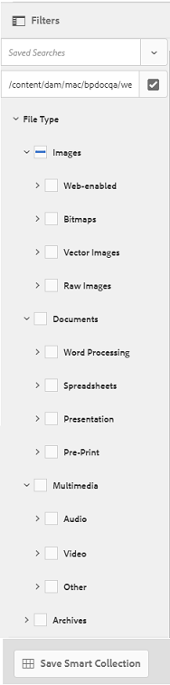
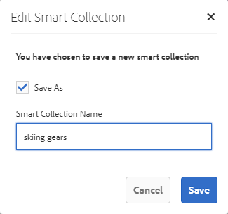

# Recherche de ressources sur Brand Portal {#search-assets-on-brand-portal}

La fonctionnalité de recherche de Brand Portal vous permet de rechercher rapidement des ressources appropriées à l’aide de l’omni-recherche et de la recherche de facettes qui utilise des filtres pour vous aider à affiner davantage votre recherche. Vous pouvez rechercher des ressources au niveau des fichiers ou des dossiers et enregistrer vos résultats de recherche sous forme de collections dynamiques.

>[!NOTE]
>
>Brand Portal ne prend pas en charge la recherche de collections à l’aide de l’omni-recherche.
>
>Cependant, vous pouvez utiliser les [filtres de recherche pour obtenir la liste des collections pertinentes](#search-collection).

## Recherche de ressources à l’aide de l’omni-recherche {#search-assets-using-omnisearch}

Pour rechercher des ressources sur Brand Portal :

1. Dans la barre d’outils, cliquez sur l’icône **[!UICONTROL Rechercher]** ou appuyez sur la touche **[!UICONTROL /]** (barre oblique) pour lancer l’omni-recherche.

   

1. Dans la zone de recherche, saisissez un mot-clé pour les ressources à rechercher.

   

   >[!NOTE]
   >
   >* Au moins 3 caractères sont requis dans Omni-recherche pour que les suggestions de recherche s’affichent.
   >* Lorsque vous recherchez `mountain biking`, l’omni-recherche renvoie toutes les ressources des résultats de recherche pour lesquelles `mountain` et `biking` sont disponibles dans les champs de métadonnées. (par exemple, `mountain` dans le champ `Title` et `biking` dans le champ `Description`). Les deux termes doivent être disponibles dans les champs de métadonnées pour s’afficher dans les résultats de la recherche. Cependant, l’omni-recherche renvoie la ressource dans les résultats de recherche même si un seul des deux termes est disponible dans le champ de métadonnées Balises intelligentes . Supposons, par exemple, qu’une ressource ait `mountain` comme balise intelligente, mais qu’elle ne possède pas `biking` dans un autre champ de métadonnées. Ensuite, vous recherchez `mountain biking`. L’omni-recherche renvoie toujours la ressource dans les résultats de recherche. Ce workflow permet de s’assurer que les ressources comportant des balises pertinentes ne sont pas manquantes.

1. Sélectionnez l’une des suggestions associées qui apparaissent dans la liste déroulante pour accéder rapidement aux ressources appropriées.

   

   *Recherche de ressources à l’aide de l’omni-recherche*

Pour en savoir plus sur le comportement de recherche avec les ressources balisées intelligentes, accédez à [Comprendre les résultats de recherche et le comportement](https://experienceleague.adobe.com/fr/docs/experience-manager-65/content/assets/using/search-assets).

## Recherche à l’aide des facettes du panneau Filtres {#search-using-facets-in-filters-panel}

Les facettes de recherche du panneau Filtres ajoutent de la granularité à votre expérience de recherche et rendent la fonctionnalité de recherche plus efficace. Elles utilisent plusieurs dimensions (prédicats) qui vous permettent d’effectuer des recherches complexes. Vous pouvez facilement descendre dans la hiérarchie jusqu’au niveau de détail souhaité pour effectuer une recherche plus précise.

Par exemple, si vous recherchez une image, vous pouvez choisir si vous souhaitez une bitmap ou une image vectorielle. Vous pouvez préciser davantage la portée de la recherche en spécifiant le type MIME de l’image dans la facette de recherche Type de fichier . De même, lors de la recherche de documents, vous pouvez spécifier le format, par exemple PDF ou MS® Word.

Le panneau **[!UICONTROL Filtres]** comprend quelques facettes standard, telles que - **[!UICONTROL Explorateur de chemins]**, **[!UICONTROL Type de fichier]**, **[!UICONTROL Taille de fichier]**, **[!UICONTROL État]** et **[!UICONTROL Orientation]**.
Cependant, vous pouvez [ajouter des facettes de recherche personnalisées](../using/brand-portal-search-facets.md) ou en supprimer certaines dans le panneau **[!UICONTROL Filtres]**. Il vous suffit de modifier les prédicats dans le formulaire de recherche sous-jacent. Consultez la liste des [prédicats de recherche disponibles et utilisables sur Brand Portal](../using/brand-portal-search-facets.md#list-of-search-predicates).

Pour appliquer des filtres à votre recherche avec les [facettes de recherche](../using/brand-portal-search-facets.md) disponibles :

1. Cliquez sur l’icône de recouvrement, puis sélectionnez **[!UICONTROL Filtrer]**.

   

1. Dans le panneau **[!UICONTROL Filtres]** à gauche, sélectionnez les options adéquates pour appliquer les filtres correspondants.
Par exemple, utilisez les filtres standard suivants :

   * **[!UICONTROL Explorateur de chemins d’accès]** pour rechercher des ressources dans un répertoire donné. Le chemin de recherche par défaut du prédicat pour l’Explorateur de chemins d’accès est `/content/dam/mac/<tenant-id>/`, mais il peut être configuré en modifiant le formulaire de recherche par défaut.

   >[!NOTE]
   >
   >Pour les utilisateurs non-administrateurs, le [!UICONTROL Explorateur de chemins d’accès] du panneau [!UICONTROL Filtre] affiche uniquement la structure de contenu des dossiers (et de leurs ancêtres) partagés avec eux.\
   >Pour les utilisateurs administrateurs, l’Explorateur de chemins d’accès permet d’accéder à n’importe quel dossier de Brand Portal.

   * **[!UICONTROL Type de fichier]** pour spécifier le type (image, document, fichier multimédia, archive) du fichier de ressource que vous recherchez. En outre, vous pouvez réduire l’étendue de votre recherche. Par exemple, spécifiez le type MIME (TIFF, Bitmap, Images GIMP) de l’image ou le format (PDF ou MS® Word) des documents.
   * **[!UICONTROL Taille de fichier]** pour rechercher des ressources en fonction de leur taille. Vous pouvez spécifier les limites inférieure et supérieure de la plage de tailles afin d’affiner votre recherche et déterminer l’unité de mesure à rechercher.
   * **[!UICONTROL État]** pour rechercher des ressources en fonction de leur état comme l’Approbation (approuvée, modifications requises, rejetée, en attente) et l’Expiration.
   * **[!UICONTROL Évaluation moyenne]** pour rechercher des ressources en fonction de leur évaluation.
   * **[!UICONTROL Orientation]** pour rechercher des ressources en fonction de leur orientation (horizontale, verticale, carré).
   * **[!UICONTROL Style]** pour rechercher des ressources en fonction de leur style (couleur, monochrome).
   * **[!UICONTROL Format vidéo]** pour rechercher des ressources vidéo en fonction de leur format (DVI, Flash, MPEG4, MPEG, OGG Theora, QuickTime, Windows Media, WebM).

   Vous pouvez utiliser des [facettes de recherche personnalisées](../using/brand-portal-search-facets.md) dans le panneau Filtres en modifiant le formulaire de recherche sous-jacent.

   * **[!UICONTROL Prédicat de propriété]** s’il est utilisé dans le formulaire de recherche, vous permet de rechercher des ressources qui correspondent à une propriété de métadonnées à laquelle le prédicat est mappé.\
     Par exemple, si l’attribut Propriété est mappé sur `jcr:content/metadata/dc:title`, vous pouvez rechercher des fichiers en fonction de leur titre.\
     [!UICONTROL Prédicat de propriété] prend en charge les recherches de texte pour les éléments suivants :

     **Expressions partielles**
Pour autoriser la recherche de ressources à l’aide d’expressions partielles dans le prédicat de propriété, cochez la case **[!UICONTROL Recherche partielle]** dans le formulaire de recherche. Cette méthode vous permet de rechercher les ressources souhaitées, même si vous ne spécifiez pas les mots ou expressions exacts utilisés dans les métadonnées de la ressource.

     >[!NOTE]
     >
     > Brand Portal prend en charge les champs suivants concernant la recherche partielle :
     >
     >* `jcr:content/metadata/dc:title`
     >* `jcr:content/jcr:title`
     >* `jcr:content/metadata/dc:format`

     Vous pouvez :
      * Indiquez un mot apparaissant dans l’expression recherchée dans la facette du panneau Filtres. Par exemple, si vous recherchez le terme **climb** (et que le prédicat de propriété est mappé sur la propriété `dc:title`), toutes les ressources ayant le mot **climb** dans l’expression de leur titre sont renvoyées.
      * Spécifiez une partie du mot apparaissant dans l’expression recherchée, ainsi qu’un caractère générique (&#42;) pour remplir les trous.
Par exemple, la recherche de :
         * **climb&#42;** renvoie toutes les ressources ayant des mots commençant par les caractères « climb » dans leur titre.
         * **&#42;climb** renvoie toutes les ressources ayant des mots se terminant par « climb » dans leur titre.
         * **&#42;climb&#42;** renvoie toutes les ressources ayant des mots comprenant les caractères « climb » dans leur titre.

     **Texte non sensible à la casse**
Vous pouvez autoriser la recherche non sensible à la casse dans le prédicat de propriété. Activez simplement la case à cocher **[!UICONTROL Ignorer la casse]** dans le formulaire de recherche. Par défaut, la recherche de texte dans le prédicat de propriété est sensible à la casse.

   >[!NOTE]
   >
   >Lorsque vous cochez la case **[!UICONTROL Recherche partielle]**, l’option **[!UICONTROL Ignorer la casse]** est sélectionnée par défaut.

   

   Les résultats de la recherche sont affichés en fonction des filtres appliqués, ainsi que du nombre de résultats de la recherche.

   

   Résultat de la recherche de ressources avec le nombre de résultats de la recherche.

1. Vous pouvez facilement accéder à un élément du résultat de recherche et revenir à ce même résultat à l’aide du bouton Précédent de votre navigateur sans avoir à relancer la requête de recherche.

## Enregistrement d’une recherche en tant que collection dynamique {#save-your-searches-as-smart-collection}

Vous pouvez enregistrer les paramètres de recherche en tant que collection dynamique pour pouvoir répéter rapidement la même recherche sans avoir à rétablir les mêmes paramètres ultérieurement. Cependant, vous ne pouvez pas appliquer de filtres de recherche dans une collection.

Pour enregistrer les paramètres de recherche comme collection dynamique :

1. Cliquez sur **[!UICONTROL Enregistrer la collection dynamique]** et donnez un nom à la collection dynamique.

   Pour rendre la collection dynamique accessible à tous les utilisateurs, cochez la case **[!UICONTROL Public]**. Un message confirme que la collection dynamique a été créée et ajoutée à la liste de vos recherches enregistrées.

   >[!NOTE]
   >
   >Vous pouvez empêcher les utilisateurs non-administrateurs de rendre des collections dynamiques publiques afin d’éviter qu’un grand nombre de collections dynamiques publiques ne soient créées par les utilisateurs non-administrateurs dans Brand Portal de l’organisation. Les organisations peuvent désactiver la configuration **[!UICONTROL Autoriser la création de collections dynamiques publiques]** dans les paramètres **[!UICONTROL Général]** disponibles dans le panneau des outils d’administration.

   

1. Pour enregistrer la collection dynamique sous un autre nom et cocher ou décocher la case **[!UICONTROL Public]**, cliquez sur **[!UICONTROL Modif. collecte dynam.]**.

   

1. Dans la boîte de dialogue **[!UICONTROL Modifier la collecte dynamique]**, sélectionnez **[!UICONTROL Enregistrer sous]** et saisissez le nom de la collection dynamique. Cliquez sur **[!UICONTROL Enregistrer]**.

   

## Recherche de collections {#search-collection}

L’omni-recherche n’est pas prise en charge pour les collections. Cependant, vous pouvez appliquer des filtres de recherche pour répertorier les collections pertinentes à partir de l’interface [!UICONTROL Collections].

À partir de l’interface [!UICONTROL Collections], cliquez sur l’icône de recouvrement pour ouvrir le panneau de filtrage dans le rail de gauche. Appliquez un ou plusieurs filtres de recherche à partir des filtres disponibles (`modified date`, `access type`, et `tags`). Cela permet de répertorier l’ensemble des collections les plus pertinentes en fonction des filtres appliqués.

