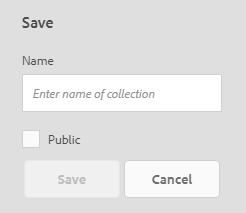

# Recherche de ressources sur Brand Portal {#search-assets-on-brand-portal}

La fonctionnalité de recherche de Brand Portal vous permet de rechercher rapidement les ressources appropriées au moyen de  l’omni-recherche, et la recherche facettée qui utilise des filtres vous aident à affiner encore davantage votre recherche. Vous pouvez également enregistrer vos recherches sous la forme de collections dynamiques pour une utilisation ultérieure.

## Recherche de ressources à l’aide de l’omni-recherche {#search-assets-using-omnisearch}

To search for assets on Brand Portal:

1. From the toolbar, click the **[!UICONTROL Search]** icon, or press the "**[!UICONTROL /]**" key to launch Omnisearch.

   

1. Dans la zone de recherche, saisissez un mot-clé pour les ressources à rechercher.

   

   >[!NOTE]
   >
   >Pour que des suggestions de recherche s’affichent, au moins 3 caractères sont nécessaires dans l’omni-recherche.

1. Pour accéder rapidement aux ressources qui vous intéressent, choisissez l'une des suggestions associées qui apparaissent dans la liste déroulante.

   

   *Recherche de ressources à l’aide de l’omni-recherche*

## Recherche à l’aide des facettes du panneau Filtres   {#search-using-facets-in-filters-panel}

Les facettes de recherche du panneau Filtres ajoutent de la granularité à votre expérience de recherche et optimisent la fonctionnalité de recherche. Elles utilisent plusieurs dimensions (prédicats) qui vous permettent d’effectuer des recherches complexes. Vous pouvez facilement descendre dans la hiérarchie jusqu’au niveau de détail souhaité pour effectuer une recherche plus précise.

Par exemple, si vous recherchez une image, vous pouvez indiquer si vous souhaitez une image bitmap ou vectorielle. Vous pouvez réduire davantage la portée de la recherche en spécifiant le type MIME de l’image dans la facette de recherche Type de fichier. De même, lors de la recherche de documents, vous pouvez spécifier le format, par exemple PDF ou MS Word.

The [!UICONTROL Filters] panel includes a few standard facets, such as- [!UICONTROL Path Browser], [!UICONTROL File Type], [!UICONTROL File Size], [!UICONTROL Status], and [!UICONTROL Orientation]. Vous pouvez toutefois [ajouter des facettes de recherche personnalisées](../using/brand-portal-search-facets.md) ou supprimer des facettes de recherche spécifiques du panneau [!UICONTROL Filtres] en ajoutant ou en supprimant des prédicats dans le formulaire de recherche sous-jacent. Consultez la liste des [prédicats de recherche disponibles et utilisables sur Brand Portal](../using/brand-portal-search-facets.md#list-of-search-predicates).

Pour appliquer des filtres à votre recherche avec les [facettes de recherche](../using/brand-portal-search-facets.md) disponibles :

1. Cliquez sur l’icône de recouvrement, puis sélectionnez **[!UICONTROL Filtrer]**.

   

2. Dans le panneau **[!UICONTROL Filtres]à gauche, sélectionnez les options adéquates pour appliquer les filtres correspondants.**
Par exemple, utilisez les filtres standard suivants :

   * **[!UICONTROL Explorateur de chemins d’accès]** pour rechercher des ressources dans un répertoire donné. The default search path of the predicate for Path Browser is **[!UICONTROL /content/dam/mac/&lt;tenant-id&gt;/]**, which can be configured by editing the default search form.
   >[!NOTE]
   >
   >To non-admin users, [!UICONTROL Path Browser] in [!UICONTROL Filter] panel shows only the content structure of the folders (and their ancestor folders) shared with them.\
   >Pour les administrateurs, le navigateur de chemins permet de naviguer jusqu’à n’importe quel dossier du portail de marque.

   * **[!UICONTROL Type de fichier]** pour spécifier le type (image, document, fichier multimédia, archive) du fichier de ressource que vous recherchez. En outre, vous pouvez réduire l’étendue de votre recherche. Par exemple, spécifiez le type MIME (Tiff, Bitmap, Images GIMP) de l’image ou le format (PDF ou MS Word) des documents.
   * **[!UICONTROL Taille de fichier]** pour rechercher des ressources en fonction de leur taille. Vous pouvez spécifier les limites inférieure et supérieure de la plage de tailles afin d’affiner votre recherche et déterminer l’unité de mesure à rechercher.
   * **[!UICONTROL État]** pour rechercher des ressources en fonction de leur état comme l'Approbation (approuvée, modifications requises, rejetée, en attente) et l'Expiration.
   * **[!UICONTROL EÉvaluation moyenne]** pour rechercher des ressources en fonction de leur évaluation.
   * **[!UICONTROL Orientation]** pour rechercher des ressources en fonction de leur orientation (horizontale, verticale, carré).
   * **[!UICONTROL Style]** pour rechercher des ressources en fonction de leur style (couleur, monochrome).
   * **[!UICONTROL Format vidéo]** pour rechercher des ressources vidéo en fonction de leur format (DVI, Flash, MPEG4, MPEG, OGG Theora, QuickTime, Windows Media, WebM).
   Vous pouvez utiliser des [facettes de recherche personnalisées](../using/brand-portal-search-facets.md) dans le panneau Filtres en modifiant le formulaire de recherche sous-jacent.

   * **[!UICONTROL S’il est utilisé dans le formulaire de recherche, le prédicat de propriété]** permet de rechercher des ressources qui correspondent à une propriété de métadonnées sur laquelle est mappée le prédicat.\
      For example, if Property Predicate is mapped to [!UICONTROL `jcr:content /metadata/dc:title`], you can search assets based on their title.\
      The [!UICONTROL Property Predicate] supports text searches for:

      les **Expressions partielles**
Pour permettre la recherche de ressources à l’aide d’'expressions partielles dans le prédicat de propriété, cochez la case **[!UICONTROL Recherche partielle]dans le formulaire de recherche.**\
      Vous pouvez ainsi rechercher les ressources souhaitées même si vous ne spécifiez pas les mots/expressions exacts utilisés dans les métadonnées de la ressource.\
      Vous pouvez :
* Spécifier un mot apparaissant dans l’expression recherchée dans la facette du panneau Filtres. Par exemple, si vous recherchez le terme **climb** (et que le prédicat de propriété est mappé sur la propriété [!UICONTROL `dc:title`]), toutes les ressources ayant le mot **climb** dans l’expression de leur titre sont renvoyées.
* Spécifier une partie du mot apparaissant dans l’expression recherchée, ainsi qu’un caractère générique (*) pour remplir les trous.
Par exemple, la recherche de :
      **climb*** renvoie toutes les ressources ayant des mots commençant par les caractères « climb » dans l’expression de leur titre.
      ***climb** renvoie toutes les ressources ayant des mots se terminant par « climb » dans l’expression de leur titre.
      ***climb*** renvoie toutes les ressources ayant des mots comprenant les caractères « climb » dans l’expression de leur titre.\
      **Texte insensible à la casse**  
Pour autoriser une recherche insensible à la casse dans le prédicat de propriété, cochez la case **[!UICONTROL Ignorer la casse] dans le formulaire de recherche.** Par défaut, la recherche de texte sur le prédicat de propriété est sensible à la casse.
   >[!NOTE]
   >
   >Lorsque vous cochez la case **[!UICONTROL Recherche partielle]**, l’option [!UICONTROL Ignorer la casse] est sélectionnée par défaut.

   

   Les résultats de la recherche sont affichés en fonction des filtres appliqués, avec le nombre de résultats.

   

   Résultat de la recherche de ressources avec le nombre de résultats

3. Vous pouvez facilement accéder à un élément du résultat de recherche et revenir à ce même résultat à l’aide du bouton Précédent de votre navigateur sans avoir à relancer la requête de recherche.

## Enregistrement d’une recherche en tant que collection dynamique{#save-your-searches-as-smart-collection}

Vous pouvez enregistrer les paramètres d’une recherche en tant que collection dynamique pour pouvoir la répéter rapidement sans avoir à redéfinir les mêmes paramètres.

Pour enregistrer les paramètres de recherche comme collection dynamique :

1. Appuyez/cliquez sur **[!UICONTROL Enregistrer la collection dynamique]et donnez-lui un nom.**

   Pour rendre la collection dynamique accessible à tous les utilisateurs, cochez **[!UICONTROL Public]**. Un message confirme que la collection dynamique a été créée et ajoutée à la liste de vos recherches enregistrées.

   >[!NOTE]
   >
   >Vous pouvez empêcher les utilisateurs non-administrateurs de rendre des collections dynamiques publiques pour éviter que le Brand Portal de l’organisation présente un nombre très important de collections dynamiques publiques créées par les utilisateurs non-administrateurs. Les organisations peuvent désactiver la configuration **Autoriser la création de collections dynamiques publiques** dans **[!UICONTROL Paramètres généraux]au niveau du panneau des outils d’administration.**

   

2. To save the smart collection in a different name, and select or clear the **[!UICONTROL Public]** checkbox, click **[!UICONTROL Edit Smart Collection]**.

   

3. Dans la boîte de dialogue **[!UICONTROL Modif. collecte dynam.]**, sélectionnez **Enregistrer sous]et saisissez le nom de la collection dynamique.[!UICONTROL ** Cliquez sur **[!UICONTROL Enregistrer]**.

   
