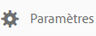

# Partage de collections sur Brand Portal {#share-collections-bp}

Les administrateurs d’AEM Assets Brand Portal peuvent partager et annuler le partage d’une collection, dynamique ou non, avec les utilisateurs autorisés. Les éditeurs peuvent uniquement visualiser et partager les collections créées par eux et partagées avec eux, ainsi que les collections publiques. Cependant, les éditeurs ne peuvent pas modifier le statut d’une collection publique en non publique.

>[!NOTE]
>
>Les éditeurs ne peuvent pas modifier le statut d’une collection publique en non publique et, par conséquent, la case à cocher **[!UICONTROL Collection publique]** n’est pas disponible dans la boîte de dialogue **[!UICONTROL Paramètres de la collection]**.

## Partage d’une collection {#share-collection}

Pour partager une collection, procédez comme suit :

1. Cliquez sur l’icône de recouvrement située à gauche, puis sélectionnez **[!UICONTROL Navigation]**.

   

1. Dans le rail latéral gauche, cliquez sur **[!UICONTROL Collections]**.

   

1. Dans la console **[!UICONTROL Collections]**, effectuez l’une des opérations suivantes :

   * Placez le pointeur sur la collection que vous souhaitez partager. Dans les miniatures d’action rapide disponibles pour la collection, cliquez sur l’icône **[!UICONTROL Paramètres]**.
   

   * Sélectionnez la collection que vous souhaitez partager. Dans la barre d’outils supérieure, cliquez sur **[!UICONTROL Paramètres]**.
   

1. Dans la boîte de dialogue [!UICONTROL Paramètres de la collection], sélectionnez les utilisateurs ou les groupes avec qui vous voulez partager la collection et choisissez le rôle d’un utilisateur ou d’un groupe de façon à ce qu’il corresponde à son rôle global. Par exemple, affectez le rôle Éditeur à un éditeur global ou le rôle Observateur à un observateur global.

   Ou bien, pour que la collection soit disponible pour tous les utilisateurs, quel que soit le groupe auquel ils appartiennent et leur rôle, rendez-la publique en cochant la case **[!UICONTROL Collection publique]**.

   >[!NOTE]
   >
   >Les utilisateurs qui ne sont pas administrateurs peuvent toutefois ne pas être autorisés à créer des collections publiques, afin de limiter le nombre de collections publiques et gagner ainsi de l’espace sur le système. Les organisations peuvent désactiver la configuration **[!UICONTROL Autoriser la création de collections publiques]** dans [!UICONTROL Paramètres généraux] au niveau du panneau des outils d’administration.

   

   Les éditeurs ne peuvent pas modifier le statut d’une collection publique en non publique et, par conséquent, la case à cocher **[!UICONTROL Collection publique]** n’est pas disponible dans la boîte de dialogue **[!UICONTROL Paramètres de la collection]**.

   

1. Sélectionnez **[!UICONTROL Ajouter]**, puis **[!UICONTROL Enregistrer]**. La collection est partagée avec les utilisateurs sélectionnés.

   >[!NOTE]
   >
   >Le rôle d’un utilisateur détermine l’accès aux ressources et aux dossiers d’une collection. Si un utilisateur n’a pas accès aux ressources, une collection vide est partagée avec celui-ci. Le rôle d’un utilisateur détermine aussi les actions disponibles pour les collections.

## Annulation du partage d’une collection   {#unshare-a-collection}

Pour annuler le partage d’une collection précédemment partagée, procédez comme suit :

1. Dans la console **[!UICONTROL Collections]**, sélectionnez la collection pour laquelle vous souhaitez annuler le partage.

   Dans la barre d’outils, cliquez sur **[!UICONTROL Paramètres]**.

   

1. Dans la boîte de dialogue **[!UICONTROL Paramètres de la collection]**, sous **[!UICONTROL Membres]**, cliquez sur le symbole **[!UICONTROL x]** situé en regard des utilisateurs ou des groupes pour les supprimer de la liste des utilisateurs avec lesquels vous avez partagé la collection.

   

1. Dans la boîte de message d’avertissement, cliquez sur **[!UICONTROL Confirmer]** pour confirmer l’annulation du partage.

   Cliquez sur **[!UICONTROL Enregistrer]**.

1. Connectez-vous à Brand Portal avec les informations d’identification de l’utilisateur que vous avez supprimé de la liste de partage. La collection est supprimée de la console **[!UICONTROL Collections]**.
