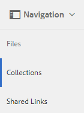

# Partage de collections {#share-collections}

Une collection représente un groupe de ressources connexes stockées ensemble dans Adobe Experience Manager Assets Brand Portal. Les utilisateurs peuvent créer des collections dynamiques en [appliquant l’omni-recherche ou la recherche de facettes pour filtrer les ressources](brand-portal-searching.md) associées, les stocker ensemble pour y accéder facilement et les partager ensuite avec d’autres utilisateurs de Brand Portal.

<!--The administrators can share and unshare a collection with the authorized Brand Portal users. Editors and viewers can view and share the collections created by them, shared with them, and public collections.-->

Les collections sont partagées en tant que lien par courrier électronique. Toute personne ayant accès au lien de partage peut ouvrir la collection. Cependant, les emails partagés peuvent être transférés à n&#39;importe qui. En outre, les [liens partagés](https://experienceleague.adobe.com/en/docs/experience-manager-brand-portal/using/share/brand-portal-link-share) sont temporaires et accessibles pendant une durée limitée uniquement. Les utilisateurs et les utilisatrices peuvent également être invités en tant que membres permanents des collections. Il existe les types d’utilisateurs et d’utilisatrices suivants pour les collections :

* **Les administrateurs et les administratrices** peuvent partager et annuler le partage d’une collection avec les utilisateurs et les utilisatrices autorisés de Brand Portal. Ils peuvent inviter d’autres utilisateurs à rejoindre une collection spécifique et définir leur rôle dans cette collection. En outre, les administrateurs et administratrices peuvent créer des collections publiques.

* Les **éditeurs et éditrices** sont autorisés à créer et partager des collections. Ils peuvent inviter d’autres utilisateurs à rejoindre une collection spécifique et définir leur rôle dans cette collection. En outre, les éditeurs et éditrices peuvent également partager des collections s’ils ont été invités à la collection en tant qu’éditeur, éditrice ou propriétaire.

* Les **observateurs et observatrices** peuvent créer des collections privées uniquement. Ils ne peuvent pas partager une collection, même lorsqu’ils ont été invités en tant que propriétaires.

>[!NOTE]
>
>Les éditeurs ne peuvent pas modifier le statut d’une collection publique en non publique et, par conséquent, la case à cocher **[!UICONTROL Collection publique]** n’est pas disponible dans la boîte de dialogue **[!UICONTROL Paramètres de la collection]**.

## Partage d’une collection {#share-collection}

Vous trouverez ci-dessous la procédure à suivre pour partager une collection avec les utilisateurs autorisés de Brand Portal :

1. Connectez-vous à votre client Brand Portal. Par défaut, la vue **[!UICONTROL Fichiers]** s’ouvre et contient toutes les ressources et dossiers publiés.

1. Dans les icônes de navigation rapide en haut, cliquez sur **[!UICONTROL Collections]**.

1. Dans la console **[!UICONTROL Collections]**, effectuez l’une des opérations suivantes :

   * Placez le pointeur sur la collection que vous souhaitez partager. Dans les miniatures d’action rapide disponibles pour la collection, cliquez sur l’icône **[!UICONTROL Paramètres]**.

     

   * Sélectionnez la collection que vous souhaitez partager. Dans la barre d’outils supérieure, cliquez sur **[!UICONTROL Paramètres]**.

     

1. Dans la boîte de dialogue **[!UICONTROL Paramètres de la collection]**, sélectionnez les utilisateurs avec qui vous voulez partager la collection et choisissez le rôle d’utilisateur pour qu’il corresponde à leur rôle global. Par exemple, affectez le rôle Éditeur à un éditeur global ou le rôle Observateur à un observateur global.

   Pour que la collection soit disponible pour tous les utilisateurs, quel que soit le groupe auquel ils appartiennent et leur rôle, vous pouvez également la rendre publique en activant la case à cocher **[!UICONTROL Collection publique]**.

   >[!NOTE]
   >
   >Les utilisateurs qui ne sont pas administrateurs peuvent toutefois ne pas être autorisés à créer des collections publiques, afin de limiter le nombre de collections publiques et gagner ainsi de l’espace sur le système. Les entreprises peuvent désactiver la configuration **[!UICONTROL Autoriser la création de collections publiques]** dans **[!UICONTROL Paramètres généraux]** au niveau du panneau des outils d’administration.

   

   Les éditeurs ne peuvent pas modifier une collection publique en collection non publique et, par conséquent, n’ont pas de case à cocher **[!UICONTROL Collection publique]** disponible dans la boîte de dialogue **[!UICONTROL Paramètres de la collection]**.

   

1. Cliquez sur le bouton **[!UICONTROL Ajouter]** pour ajouter l’utilisateur, puis cliquez sur **[!UICONTROL Enregistrer]**. La collection est partagée avec les utilisateurs.

   >[!NOTE]
   >
   >Le rôle d’un utilisateur détermine l’accès aux ressources et aux dossiers d’une collection. Si un utilisateur n’a pas accès aux ressources, une collection vide est partagée avec celui-ci. Le rôle d’un utilisateur détermine aussi les actions disponibles pour les collections.

## Annulation du partage d’une collection {#unshare-a-collection}

Pour annuler le partage d’une collection précédemment partagée, procédez comme suit :

1. Dans la console **[!UICONTROL Collections]**, sélectionnez les collections pour lesquelles vous souhaitez annuler le partage.

   Dans la barre d’outils supérieure, cliquez sur **[!UICONTROL Paramètres]**.

   

1. Dans la boîte de dialogue **[!UICONTROL Paramètres de la collection]**, dans la section **[!UICONTROL Membres]**, cliquez sur le symbole **[!UICONTROL x]** en regard des utilisateurs pour les supprimer de la liste des utilisateurs ayant accès à la collection.

   

1. Un message d’avertissement s’affiche. Cliquez sur **[!UICONTROL Confirmer]** pour annuler le partage de la collection.

1. Cliquez sur **[!UICONTROL Enregistrer]** pour appliquer les modifications.

   Une fois que l’utilisateur est supprimé de la liste partagée, la collection non partagée est supprimée de la console **[!UICONTROL Collections]** de l’utilisateur.

<!--
1. Click the overlay icon on the left, and choose **[!UICONTROL Navigation]**.

   

1. From the siderail on the left, click **[!UICONTROL Collections]**.

   

1. From the **[!UICONTROL Collections]** console, do one of the following:

    * Hover the pointer over the collection you want to share. From the quick action thumbnails available for the collection, click the **[!UICONTROL Settings]** icon.

   

    * Select the collection you want to share. From the toolbar at the top, click **[!UICONTROL Settings]**.
    
   

1. In the [!UICONTROL Collection Settings] dialog box, select the users or groups with whom you want to share the collection and select the role for a user or a group to match their global role. For example, assign the Editor role to a global editor, the Viewer role to a global viewer.

   Alternatively, to make the collection available to all users irrespective of their group membership and role, make it public by selecting the **[!UICONTROL Public Collection]** check-box.

   >[!NOTE]
   >
   >However, non-admin users can be restricted from creating public collections, to avoid having numerous public collections so that system space can be saved. Organizations can disable the **[!UICONTROL Allow public collections creation]** configuration from [!UICONTROL General] settings available in admin tools panel.

   

   Editors cannot change a public collection to a non-public collection and, therefore, do not have **[!UICONTROL Public Collection]** check-box available in **[!UICONTROL Collection Settings]** dialog.

   

1. Select **[!UICONTROL Add]**, and then **[!UICONTROL Save]**. The collection is shared with the chosen users.

   >[!NOTE]
   >
   >A user's role governs access to the assets and folders inside a collection. If a user does not have access to assets, an empty collection is shared with the user. Also, a user's role governs the actions available for collections.

## Unshare a collection {#unshare-a-collection}

To unshare a previously shared collection, do the following:

1. From the **[!UICONTROL Collections]** console, select the collection you want to unshare.

   In the toolbar, click **[!UICONTROL Settings]**.

   

1. On the **[!UICONTROL Collection Settings]** dialog box, under **[!UICONTROL Members]**, click the **[!UICONTROL x]** symbol next to users or groups to remove them from the list of users you shared the collection with.

   

1. In the warning message box, click **[!UICONTROL Confirm]** to confirm unshare.

   Click **[!UICONTROL Save]**.

1. Log in to Brand Portal with the credentials of the user you removed from the shared list. The collection is removed from the **[!UICONTROL Collections]** console.
-->
