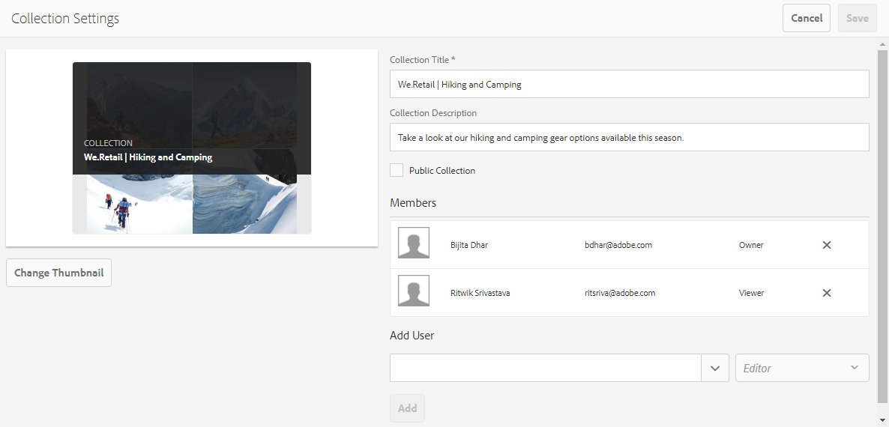

# Partage de collections {#share-collections}

Une collection représente un groupe d’actifs connexes stockés ensemble dans Adobe Experience Manager Assets Brand Portal. Les utilisateurs peuvent créer des collections dynamiques en [appliquant omnisearch ou facet search pour filtrer les ressources](brand-portal-searching.md) associées et les stocker ensemble pour y accéder facilement et les partager avec d’autres utilisateurs du portail de marque.

Les administrateurs peuvent partager et annuler le partage d’une collection avec les utilisateurs autorisés du portail de marques. Les éditeurs et les utilisateurs peuvent vue et partager les collections qu’ils ont créées, partagées avec eux et les collections publiques.

>[!NOTE]
>
>Editors cannot change a public collection to a non-public collection and therefore do not have the **[!UICONTROL Public Collection]** check box available in **[!UICONTROL Collection Settings]** dialog.

## Partage d’une collection {#share-collection}

Vous trouverez ci-dessous la procédure à suivre pour partager une collection avec les utilisateurs autorisés du portail de marques :

1. Connectez-vous à votre locataire du portail de marques. Par défaut, la vue **[!UICONTROL Fichiers]** s’ouvre et contient tous les fichiers et dossiers publiés.

1. Dans les navigations rapides en haut, cliquez sur **[!UICONTROL Collections]**.

1. Dans la console **[!UICONTROL Collections]**, effectuez l’une des opérations suivantes :

   * Placez le pointeur sur la collection que vous souhaitez partager. Dans les miniatures d’action rapide disponibles pour la collection, cliquez sur l’icône **[!UICONTROL Paramètres]**.

      

   * Sélectionnez la collection que vous souhaitez partager. Dans la barre d’outils supérieure, cliquez sur **[!UICONTROL Paramètres]**.

      

1. In the **[!UICONTROL Collection Settings]** dialog box, select the users with whom you want to share the collection and select the role for the user to match their global role. Par exemple, attribuez le rôle Editeur à un éditeur global, le rôle Lecteur à une visionneuse globale.

   Alternatively, to make the collection available to all the users irrespective of their group membership and role, make it public by selecting the **[!UICONTROL Public Collection]** check box.

   >[!NOTE]
   >
   >Les utilisateurs qui ne sont pas administrateurs peuvent toutefois ne pas être autorisés à créer des collections publiques, afin de limiter le nombre de collections publiques et gagner ainsi de l’espace sur le système. Organizations can disable the **[!UICONTROL Allow public collections creation]** configuration from **[!UICONTROL General]** settings available in the admin tools panel.

   

   The editors cannot change a public collection to a non-public collection and therefore do not have **[!UICONTROL Public Collection]** check box available in **[!UICONTROL Collection Settings]** dialog.

   

1. Cliquez sur le bouton **[!UICONTROL Ajouter]** pour ajouter l’utilisateur, puis cliquez sur **[!UICONTROL Enregistrer]**. La collection est partagée avec les utilisateurs.

   >[!NOTE]
   >
   >Le rôle d’un utilisateur détermine l’accès aux ressources et aux dossiers d’une collection. Si un utilisateur n’a pas accès aux ressources, une collection vide est partagée avec celui-ci. Le rôle d’un utilisateur détermine aussi les actions disponibles pour les collections.

## Annulation du partage d’une collection   {#unshare-a-collection}

Pour annuler le partage d’une collection précédemment partagée, procédez comme suit :

1. Dans la console **[!UICONTROL Collections]**, sélectionnez la collection pour laquelle vous souhaitez annuler le partage.

   Dans la barre d’outils supérieure, cliquez sur **[!UICONTROL Paramètres]**.

   

1. Dans la boîte de dialogue Paramètres **[!UICONTROL de la]** collection, sous la section **[!UICONTROL Membres]** , cliquez sur le symbole **[!UICONTROL x]** en regard des utilisateurs pour les supprimer de la liste des utilisateurs ayant accès à la collection.

   

1. Un message d’avertissement s’affiche. Cliquez sur **[!UICONTROL Confirmer]** pour annuler le partage de la collection.

1. Click **[!UICONTROL Save]** to apply the changes.

   Une fois que l’utilisateur est supprimé de la liste partagée, la collection non partagée est supprimée de la console **[!UICONTROL Collections]** de l’utilisateur.

<!--
1. Click the overlay icon on the left, and choose **[!UICONTROL Navigation]**.

   

1. From the siderail on the left, click **[!UICONTROL Collections]**.

   

1. From the **[!UICONTROL Collections]** console, do one of the following:

    * Hover the pointer over the collection you want to share. From the quick action thumbnails available for the collection, click the **[!UICONTROL Settings]** icon.

   

    * Select the collection you want to share. From the toolbar at the top, click **[!UICONTROL Settings]**.
    
   

1. In the [!UICONTROL Collection Settings] dialog box, select the users or groups with whom you want to share the collection and select the role for a user or a group to match their global role. For example, assign the Editor role to a global editor, the Viewer role to a global viewer.

   Alternatively, to make the collection available to all users irrespective of their group membership and role, make it public by selecting the **[!UICONTROL Public Collection]** check-box.

   >[!NOTE]
   >
   >However, non-admin users can be restricted from creating public collections, to avoid having numerous public collections so that system space can be saved. Organizations can disable the **[!UICONTROL Allow public collections creation]** configuration from [!UICONTROL General] settings available in admin tools panel.

   

   Editors cannot change a public collection to a non-public collection and, therefore, do not have **[!UICONTROL Public Collection]** check-box available in **[!UICONTROL Collection Settings]** dialog.

   

1. Select **[!UICONTROL Add]**, and then **[!UICONTROL Save]**. The collection is shared with the chosen users.

   >[!NOTE]
   >
   >A user's role governs access to the assets and folders inside a collection. If a user does not have access to assets, an empty collection is shared with the user. Also, a user's role governs the actions available for collections.

## Unshare a collection {#unshare-a-collection}

To unshare a previously shared collection, do the following:

1. From the **[!UICONTROL Collections]** console, select the collection you want to unshare.

   In the toolbar, click **[!UICONTROL Settings]**.

   

1. On the **[!UICONTROL Collection Settings]** dialog box, under **[!UICONTROL Members]**, click the **[!UICONTROL x]** symbol next to users or groups to remove them from the list of users you shared the collection with.

   

1. In the warning message box, click **[!UICONTROL Confirm]** to confirm unshare.

   Click **[!UICONTROL Save]**.

1. Log in to Brand Portal with the credentials of the user you removed from the shared list. The collection is removed from the **[!UICONTROL Collections]** console.
-->