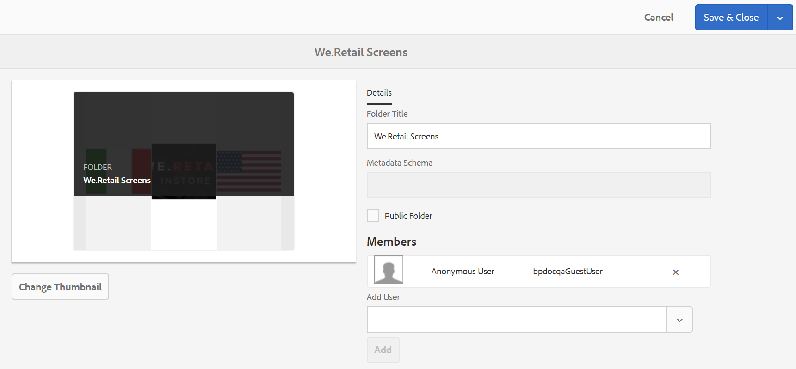

# Partage de dossiers sur Brand Portal {#share-folders}

Les ressources doivent être publiées sur Brand Portal à partir d’une instance AEM Author préconfigurée, car Brand Portal ne prend pas en charge l’ingestion des ressources.

## Workflow de partage de dossiers dans Brand Portal {#folder-sharing-workflow-in-brand-portal}

La section suivante décrit le workflow de partage de dossiers et l’accès utilisateur :

* Par défaut, tous les dossiers publiés depuis AEM Assets sur Brand Portal ne sont visibles que par l’administrateur de Brand Portal, sauf s’ils ont été désignés comme publics lors de la configuration de la réplication.
* L’administrateur utilise la console **[!UICONTROL Propriétés du dossier]** pour partager un dossier avec des utilisateurs ou des groupes sélectionnés. Seuls les utilisateurs ou les groupes avec lesquels le dossier est partagé peuvent le visualiser une fois connectés à Brand Portal. Le dossier n’est pas visible par les autres utilisateurs.
* L’administrateur peut également choisir de rendre un dossier public en cochant la case **[!UICONTROL Dossier public]** dans la console **[!UICONTROL Propriétés du dossier]**. Un dossier public est visible par tous les utilisateurs.

* Indépendamment des rôles et des privilèges utilisateur, lorsque des utilisateurs se connectent à Brand Portal, ils voient tous les dossiers publics et les dossiers partagés directement avec eux ou avec un groupe auquel ils appartiennent. Les dossiers privés ou les dossiers partagés avec d’autres utilisateurs ne sont pas visibles par tous les utilisateurs.

### Partage de dossiers avec des groupes d’utilisateurs sur Brand Portal {#sharing-folders-with-user-groups-on-brand-portal}

Les droits d’accès aux ressources d’un dossier dépendent des droits d’accès à son dossier parent, indépendamment des paramètres des dossiers enfants. Ce comportement est régi par les listes [ACL](https://helpx.adobe.com/fr/experience-manager/6-5/sites/administering/using/security.html#PermissionsinAEM) dans AEM, car les dossiers enfants héritent des listes ACL de leurs dossiers parents. Par exemple, si un dossier A contient un dossier B qui contient un dossier C, alors un groupe d’utilisateurs (ou des utilisateurs) possédant les droits d’accès au dossier A bénéficient des mêmes droits d’accès aux dossiers B et C. En tant que dossier enfant de A, le dossier B hérite de ses listes ACL. Tandis que le dossier C hérite de ses listes ACL en tant que dossier enfant de B.

De même, les groupes d’utilisateurs (ou les utilisateurs) possédant les autorisations pour accéder seulement au dossier B disposent des mêmes autorisations d’accès au dossier C, mais pas au dossier A. Par conséquent, il est conseillé aux organisations de hiérarchiser leur contenu de façon à ce que les ressources les plus exposées soient placées dans les dossiers enfants, et l’accès des enfants au dossier racine peut être restreint.

### Publication de dossier public {#public-folder-publish}

À moins que l’option **[!UICONTROL Publication de dossier public]** n’ait été sélectionnée lors de la configuration de la réplication de Brand Portal, les utilisateurs non-administrateurs (tels que les éditeurs et les observateurs) n’ont pas accès aux ressources publiées depuis AEM Assets sur Brand Portal.

Si l’option **[!UICONTROL Publication de dossier public]** est désactivée, les administrateurs doivent partager spécifiquement ces ressources avec les utilisateurs non-administrateurs grâce à la fonctionnalité de partage.

>[!NOTE]
>
>L’option **[!UICONTROL Publication de dossier public]** est disponible à compter d’AEM 6.3.2.1.

## Accès aux dossiers partagés {#access-to-shared-folders}

Le tableau suivant indique les droits d’accès et les droits de partage/d’annulation du partage des ressources pour différents rôles utilisateur :

|  | Accès à tous les dossiers publiés depuis AEM Assets sur Brand Portal | Accès aux dossiers partagés | Droits de partager/annuler le partage de dossiers |
|---------------|-----------|-----------|------------|
| Administrateur | Oui | Oui | Oui |
| Éditeur | Non* | Oui, uniquement si les dossiers sont partagés avec eux ou avec le groupe auquel ils appartiennent. | Oui, uniquement pour les dossiers partagés avec eux ou avec le groupe auquel ils appartiennent. |
| Observateur | Non* | Oui, uniquement si les dossiers sont partagés avec eux ou avec le groupe auquel ils appartiennent. | Non |
| Utilisateur invité | Non* | Oui, uniquement si les dossiers sont partagés avec eux ou avec le groupe auquel ils appartiennent. | Non |

>[!NOTE]
>
>Par défaut, l’option **[!UICONTROL Publication de dossier public]** est désactivée lors de la configuration de la réplication de Brand Portal avec un auteur AEM. Si l’option est activée, les dossiers publiés sur Brand Portal sont accessibles à tous les utilisateurs (également aux utilisateurs non administrateurs) par défaut.

### Accès des utilisateurs non-administrateurs aux dossiers partagés {#non-admin-user-access-to-shared-folders}

Les utilisateurs non-administrateurs ne peuvent accéder qu’aux dossiers partagés avec eux sur Brand Portal. Cependant, le mode d’affichage de ces dossiers sur le portail lorsqu’ils se connectent dépend des paramètres de la configuration **[!UICONTROL Activer la hiérarchie de dossiers]**.

**Si la configuration est désactivée**

Les utilisateurs non-administrateurs voient tous les dossiers partagés avec eux sur la page d’entrée, lors de leur connexion à Brand Portal.

**Si la configuration est activée**

Les utilisateurs non-administrateurs voient l’arborescence de dossiers (à partir du dossier racine) et les dossiers partagés organisés dans leurs dossiers parents respectifs, lors de leur connexion à Brand Portal.

Ces dossiers parents sont des dossiers virtuels et ne peuvent faire l’objet d’aucune action. Vous pouvez identifier ces dossiers virtuels grâce à leur icône de cadenas.

Aucune tâche d’action n’est visible lorsque vous les survolez ou les sélectionnez en **[!UICONTROL mode Carte]**, à la différence des dossiers partagés. Le bouton **[!UICONTROL Aperçu]** apparaît lorsque vous sélectionnez un dossier virtuel dans les modes **[!UICONTROL Colonnes]** et **[!UICONTROL Liste]**.

>[!NOTE]
>
>Notez que la miniature par défaut des dossiers virtuels est l’image de miniature du premier dossier partagé.

   

## Partage de dossiers {#how-to-share-folders}

Pour partager un dossier avec des utilisateurs sur Brand Portal, suivez ces étapes :

1. Cliquez sur l’icône de recouvrement située à gauche, puis sélectionnez **[!UICONTROL Navigation]**.

   

1. Dans le rail latéral gauche, sélectionnez **[!UICONTROL Fichiers]**.

   

1. Dans l’interface de Brand Portal, sélectionnez le dossier que vous souhaitez partager.

   

1. Dans la barre d’outils supérieure, sélectionnez **[!UICONTROL Partager]**.

   

   La console [!UICONTROL Propriétés du dossier] s’affiche.

   

1. Dans la console **[!UICONTROL Propriétés du dossier]**, indiquez le titre du dossier dans le champ **[!UICONTROL Titre du dossier]** si vous ne souhaitez pas que le nom par défaut soit visible par les utilisateurs.
1. Dans la liste **[!UICONTROL Ajouter un utilisateur]**, sélectionnez les utilisateurs ou les groupes avec lesquels vous souhaitez partager le dossier et cliquez sur **[!UICONTROL Ajouter]**.
Pour partager le dossier uniquement avec les utilisateurs invités, et aucun autre utilisateur, sélectionnez **[!UICONTROL Utilisateurs anonymes]** dans le menu déroulant **[!UICONTROL Membres]**.

   

   >[!NOTE]
   >
   >Pour que le dossier soit disponible pour tous les utilisateurs, quel que soit le groupe auquel ils appartiennent et leur rôle, rendez-le public en activant la case à cocher **[!UICONTROL Dossier public]**.

1. Si nécessaire, cliquez sur **[!UICONTROL Modifier la miniature]** pour modifier l’image de miniature du dossier.
1. Cliquez sur **[!UICONTROL Enregistrer]**.

1. Pour accéder au dossier partagé, connectez-vous à Brand Portal à l’aide des informations d’identification de l’utilisateur avec lequel vous avez partagé le dossier. Examinez le dossier partagé dans l’interface.

## Annulation du partage de dossiers {#unshare-the-folders}

Pour annuler le partage d’un dossier précédemment partagé, procédez comme suit :

1. Dans l’interface de Brand Portal, sélectionnez le dossier dont vous souhaitez annuler le partage.

   

1. Dans la barre d’outils supérieure, cliquez sur **[!UICONTROL Partager]**.
1. Dans la console **[!UICONTROL Propriétés du dossier]**, sous **[!UICONTROL Membres]**, cliquez sur le symbole **[!UICONTROL x]** situé en regard d’un utilisateur pour le supprimer de la liste des utilisateurs avec lesquels vous avez partagé le dossier.

   

1. Dans la boîte de message d’avertissement, cliquez sur **[!UICONTROL Confirmer]** pour confirmer l’annulation du partage.
Cliquez sur **[!UICONTROL Enregistrer]**.

1. Connectez-vous à Brand Portal avec les informations d’identification de l’utilisateur que vous avez supprimé de la liste de partage. Le dossier n’est plus disponible dans l’interface Brand Portal de l’utilisateur.
