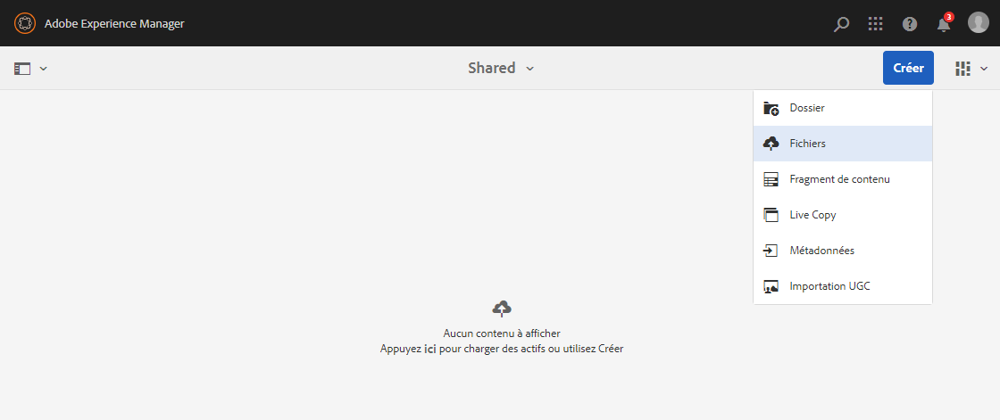
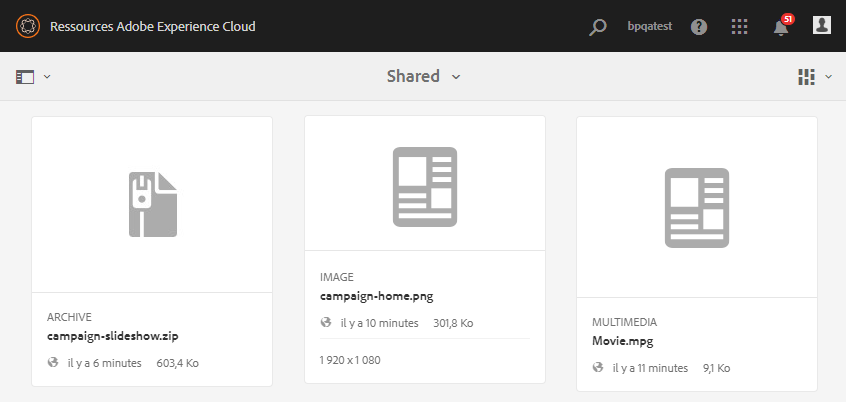

# Chargement de ressources de base {#upload-baseline-assets}

L’administrateur d’AEM charge des ressources de base dans le dossier **SHARED** afin de permettre aux utilisateurs de Brand Portal de comprendre les types de ressources requis pendant la contribution. Ces ressources peuvent être utilisées comme contenu de référence par les utilisateurs de Brand Portal lors de la création de ressources à des fins de contribution.

**Pour charger des ressources de base, procédez comme suit :**

1. Connectez-vous à votre instance d’auteur AEM.
URL par défaut : http:// localhost:4502/aem/start.html
1. Accédez à **[!UICONTROL Ressources &gt; Fichiers]** et localisez le dossier de contribution dans lequel vous souhaitez charger les ressources de base.
1. Cliquez pour ouvrir le dossier de contribution. Vous pouvez voir deux sous-dossiers,**[!UICONTROL SHARED]** et **[!UICONTROL NEW]**, dans le dossier de contribution. 
1. Cliquez sur le dossier **[!UICONTROL SHARED]**.
1. Cliquez sur **[!UICONTROL Créer &gt; Fichiers]**  pour charger des ressources distinctes.
Vous pouvez également cliquer sur **[!UICONTROL Créer &gt; Dossier]** afin de charger un dossier (.zip) contenant plusieurs ressources.
   
1. Parcourez les fichiers de base (fichiers/dossiers) et chargez-les dans le dossier **[!UICONTROL SHARED]**.
   

Une fois le chargement terminé, les administrateurs peuvent publier le dossier de contribution sur Brand Portal. Voir [Publication du dossier de contribution sur Brand Portal](brand-portal-publish-contribution-folder-to-brand-portal.md).