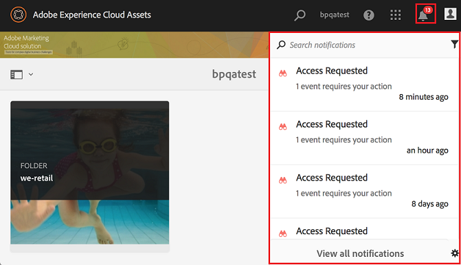

# Aperçu d’Experience Manager Assets Brand Portal {#overview-of-aem-assets-brand-portal}

En tant que spécialiste marketing, vous devez parfois collaborer avec des partenaires de canal et des utilisateurs professionnels internes pour créer, gérer et diffuser rapidement des contenus numériques pertinents aux clients. La diffusion au bon moment de contenu pertinent tout le long du parcours client est essentielle pour accroître la demande, la conversion, l’engagement et la fidélisation des clients.

Cependant, le développement de solutions qui prennent en charge le partage efficace et sécurisé d’éléments tels que les logos de marque approuvés, les ressources de campagne ou les prises de vue de produits avec les équipes, les partenaires et les revendeurs représente un défi. Pour garantir à la fois l’efficacité et la sécurité de ce processus, une planification et une exécution minutieuses sont nécessaires.

**Adobe Experience Manager (AEM) Assets Brand Portal** se concentre sur le besoin du professionnel du marketing de collaborer efficacement avec les utilisateurs de Brand Portal distribués dans le monde entier en fournissant des fonctionnalités de distribution et de contribution des ressources.

La distribution des ressources vous permet d’acquérir, de contrôler et de distribuer en toute sécurité des ressources créatives approuvées à des tiers externes et aux utilisateurs professionnels internes sur tous les appareils. Cependant, la contribution aux ressources permet aux utilisateurs de Brand Portal de charger des ressources vers Brand Portal et de les publier sur Experience Manager Assets, sans avoir à accéder à l’environnement de création. La fonction de contribution est appelée **Approvisionnement des ressources dans Brand Portal**. Ces deux fonctionnalités améliorent l’expérience globale en matière de distribution et de contribution aux ressources des utilisateurs de Brand Portal (agences/équipes externes), accélèrent le délai de mise sur le marché des ressources et réduisent le risque de non-conformité et d’accès non autorisé.
Voir [Approvisionnement des ressources dans Brand Portal](brand-portal-asset-sourcing.md).

L’environnement de portail basé sur un navigateur vous permet de charger, parcourir, rechercher, prévisualiser et exporter facilement des ressources dans des formats approuvés.

## Configuration d’Experience Manager Assets avec Brand Portal {#configure-brand-portal}

La configuration d’Adobe Experience Manager Assets avec Brand Portal permet aux utilisateurs de Brand Portal de bénéficier de fonctions de publication, de distribution et de contribution des ressources.

>[!NOTE]
>
>La configuration d’Experience Manager Assets avec Brand Portal est prise en charge dans Experience Manager Assets as a Cloud Service, Experience Manager Assets 6.3 et les versions ultérieures.

>[!IMPORTANT]
>
> * Brand Portal est en mode de maintenance. Toutes les nouvelles innovations sont disponibles sur [Content Hub](https://experienceleague.adobe.com/fr/docs/experience-manager-cloud-service/content/assets/content-hub/product-overview).
> * Si vous devez encore activer Brand Portal, contactez votre représentant Adobe pour obtenir des détails sur votre cas d’utilisation et les autres exigences spécifiques.
> * Brand Portal n’est pas disponible avec [Assets Prime](https://experienceleague.adobe.com/en/docs/experience-manager-cloud-service/content/assets/assets-prime) ou [Assets Ultimate](https://experienceleague.adobe.com/fr/docs/experience-manager-cloud-service/content/assets/assets-ultimate-overview). Cependant, les clients Assets as a Cloud Service existants, qui ont déjà accès à Brand Portal, peuvent continuer à l’utiliser lorsqu’ils passent à Assets Ultimate.

<!--Experience Manager Assets as a Cloud Service is automatically configured with Brand Portal by activating Brand Portal from the Cloud Manager. The activation workflow creates the required configurations at the backend and activates Brand Portal on the same IMS org as of the Experience Manager Assets as a Cloud Service instance.-->

Cependant, Experience Manager Assets (On-Premise et Managed Service) est configuré avec Brand Portal à l’aide de Adobe Developer Console, qui fournit un jeton Adobe Identity Management Services (IMS) pour l’autorisation du client Brand Portal.

Pour plus d’informations, consultez [Configuration d’Experience Manager Assets avec Brand Portal](../using/configure-aem-assets-with-brand-portal.md).

## Différents types d’utilisateurs de Brand Portal {#Personas}

Brand Portal prend en charge les rôles utilisateur suivants :

* Utilisateur invité
* Observateur
* Éditeur
* Administrateur

Le tableau suivant répertorie les tâches que peuvent réaliser les personnes qui disposent de ces rôles :

|  | **Parcourir** | **Rechercher** | **Télécharger** | **Partage de dossiers** | **Partage d’une collection** | **Partager des ressources en tant que lien** | **Accès aux outils d’administration** |
|--- |--- |--- |--- |--- |--- |--- |--- |
| **Utilisateur invité** | ✓* | ✓* | ✓* | x | x | x | x |
| **Observateur** | ✓ | ✓ | ✓ | x | x | x | x |
| **Éditeur** | ✓ | ✓ | ✓ | ✓ | ✓ | ✓ | x |
| **Administrateur** | ✓ | ✓ | ✓ | ✓ | ✓ | ✓ | ✓ |

>[!NOTE]
>
>Les utilisateurs invités peuvent explorer des ressources, y accéder et en rechercher dans les dossiers et collections publics uniquement.

<!--
&#42; Viewer users can access and download the public assets shared with them, and can add these assets to create their own collections.

>[!NOTE]
>
>There is a known issue that the share link for collections is currently visible to the viewer users. The viewer users does not have the privilege to add users to create a share link. This issue will be fixed in the upcoming release, the option to share link for the collections will not be available to the viewer users.
-->

### Utilisateur invité {#guest-user}

Brand Portal Experience Manager Assets permet aux [invités](#request-access-to-brand-portal) d’accéder au portail. Un utilisateur invité n’a pas besoin d’identifiants pour accéder au portail et a accès aux dossiers et aux collections publics. En tant qu’utilisateur invité, vous pouvez parcourir les détails des ressources et obtenir une vue complète des ressources des membres des dossiers et collections publics. Vous pouvez rechercher, télécharger et ajouter des ressources publiques à la collection [!UICONTROL Lightbox].

Cependant, la session de personne invitée ne vous permet pas de créer des collections et des recherches enregistrées, et de les partager davantage. Lors d’une session d’invité, les utilisateurs ne peuvent ni accéder aux paramètres des dossiers et des collections, ni partager des ressources sous la forme de lien. Voici la liste des tâches que peut réaliser un utilisateur invité :

* [Exploration et accès aux ressources publiques](browse-assets-brand-portal.md)

* [Recherche parmi les ressources publiques](brand-portal-searching.md)

* [Téléchargement de ressources publiques](brand-portal-download-assets.md)

* [Ajout de ressources à [!UICONTROL Lightbox]](brand-portal-light-box.md#add-assets-to-lightbox)

Pour plus d’informations, voir [Accès des invités à Brand Portal](../using/guest-access.md).

### Observateur {#viewer}

Utilisateur Brand Portal défini dans l’[!DNL Admin Console] ayant accès à Brand Portal avec le rôle d’observateur. Un utilisateur disposant de ce rôle peut se connecter à Brand Portal et accéder aux dossiers, collections et ressources autorisés. L’utilisateur ou l’utilisatrice peut également parcourir, prévisualiser, télécharger et exporter des ressources (rendus originaux ou spécifiques), configurer les paramètres du compte et rechercher des ressources. Voici la liste des tâches que peut réaliser un observateur :

* [Exploration des ressources](browse-assets-brand-portal.md)

* [Recherche de ressources](brand-portal-searching.md)

* [Téléchargement de ressources](brand-portal-download-assets.md)

### Éditeur {#editor}

Un utilisateur qui dispose du rôle d’éditeur peut effectuer toutes les tâches d’un observateur. En outre, un éditeur peut afficher les fichiers et les dossiers partagés par un administrateur. L’utilisateur qui dispose du rôle d’éditeur peut également partager du contenu (fichiers, dossiers, collections) avec d’autres personnes.

En plus des tâches d’un observateur, un éditeur peut effectuer les tâches suivantes :

* [Partage de dossiers](brand-portal-sharing-folders.md)

* [Partage d’une collection](brand-portal-share-collection.md)

* [Partage de ressources en tant que lien](brand-portal-link-share.md)

### Administrateur {#administrator}

Un administrateur comprend un utilisateur marqué comme administrateur système ou administrateur de produit Brand Portal dans [!UICONTROL Admin Console]. Un administrateur peut ajouter et supprimer des administrateurs système et des utilisateurs, définir des paramètres prédéfinis, envoyer des e-mails aux utilisateurs et afficher des rapports sur l’utilisation et le stockage du portail.

>[!NOTE]
>
>Dans Brand Portal, un utilisateur disposant du rôle d’administrateur d’assistance dans [!UICONTROL Admin Console] dispose des mêmes privilèges qu’un administrateur système.

Un administrateur peut effectuer toutes les tâches qu’un éditeur. Voici les tâches supplémentaires qu’un administrateur peut effectuer :

* [Gestion des utilisateurs, des groupes et des rôles utilisateur](brand-portal-adding-users.md)
* [Personnalisation du papier peint, des en-têtes de page et des e-mails](brand-portal-branding.md)
* [Utilisation des facettes de recherche personnalisée](brand-portal-search-facets.md)
* [Utiliser le schéma de métadonnées](brand-portal-metadata-schemas.md)
* [Application de paramètres d’image prédéfinis ou de rendus dynamiques](brand-portal-image-presets.md)
* [Utilisation des rapports](brand-portal-reports.md)

En plus des tâches mentionnées ci-dessus, un auteur dans AEM Assets peut effectuer les tâches suivantes :

* [Configuration d’AEM Assets avec Brand Portal](../using/configure-aem-assets-with-brand-portal.md)
* [Publication de dossiers sur Brand Portal](https://experienceleague.adobe.com/fr/docs/experience-manager-65/content/assets/brandportal/brand-portal-publish-folder)
* [Publication de collections sur Brand Portal](https://experienceleague.adobe.com/fr/docs/experience-manager-65/content/assets/brandportal/brand-portal-publish-collection)

## Autre alias pour l’URL de Brand Portal {#tenant-alias-for-portal-url}

À compter de la version 6.4.3 de Brand Portal, les organisations peuvent disposer d’une autre URL (alias) pour chaque URL existante de leur client Brand Portal. L’URL d’alias peut être créée avec un autre préfixe dans l’URL.\
Si le nom du client dépasse 32 caractères, un alias de client doit être créé.
Notez que seul le préfixe de l’URL Brand Portal peut être personnalisé et non l’URL entière. Par exemple, une entreprise avec le domaine existant `geomettrix.brand-portal.adobe.com` peut demander et obtenir la création de `geomettrixinc.brand-portal.adobe.com`.

Cependant, l’instance d’auteur AEM peut être [configurée](../using/configure-aem-assets-with-brand-portal.md) uniquement avec l’URL d’ID du client et non avec l’URL (alternative) d’alias de client.

>[!NOTE]
>
>Pour obtenir un alias pour le nom du client dans une URL de portail existante, les organisations doivent contacter le service clientèle avec une demande de création d’alias de client. Tout d’abord, vérifiez si l’alias est disponible, puis créez l’alias pour traiter cette demande.
>
>Pour remplacer ou supprimer l’ancien alias, le même processus doit être suivi.

## Demande d’accès à Brand Portal {#request-access-to-brand-portal}

Les utilisateurs peuvent demander l’accès à Brand Portal depuis l’écran de connexion. Ces demandes sont envoyées aux administrateurs de Brand Portal qui accordent l’accès aux utilisateurs via Adobe [!UICONTROL Admin Console]. Une fois l’accès accordé, les personnes reçoivent un e-mail de notification.

Pour demander l’accès, procédez comme suit :

1. Sur la page de connexion de Brand Portal, sélectionnez **[!UICONTROL Cliquez ici]** en regard de **[!UICONTROL Besoin d’un accès ?]**. En revanche, pour créer une session d’invité, sélectionnez **[!UICONTROL Cliquez ici]** en regard de **[!UICONTROL Accès d’invité ?]**.

   

   La page [!UICONTROL Demander l’accès] s’affiche.

1. Pour pouvoir demander l’accès au portail Brand Portal d’une organisation, vous devez disposer d’un [!UICONTROL Adobe ID], d’un [!UICONTROL Enterprise ID] ou d’un [!UICONTROL Federated ID] valide.

   Dans la page [!UICONTROL Demander l’accès], connectez-vous à l’aide de votre ID (scénario 1) ou créez un [!UICONTROL Adobe ID] (scénario 2) :

   ![[!UICONTROL Demander l’accès]](assets/bplogin_request_access_2.png)

   **Scénario 1**

   1. Si vous disposez d’un [!UICONTROL Adobe ID], d’un [!UICONTROL Enterprise ID] ou d’un [!UICONTROL Federated ID], cliquez sur **[!UICONTROL Se connecter]**.
La page [!UICONTROL Connexion] s’ouvre.

   1. Indiquez vos informations d’identification [!UICONTROL Adobe ID] et cliquez sur **[!UICONTROL Connexion]**.

      

   Vous êtes redirigé vers la page [!UICONTROL Demander l’accès].

   **Scénario 2**

   1. Si vous ne possédez pas d’[!UICONTROL Adobe ID], pour en créer un, cliquez sur **[!UICONTROL Obtenir un Adobe ID]** dans la page [!UICONTROL Demander l’accès].
La page [!UICONTROL Connexion] s’ouvre.
   1. Cliquez sur **[!UICONTROL Obtenir un Adobe ID]**.
La page [!UICONTROL S’inscrire] s’ouvre.
   1. Saisissez vos nom et prénom, e-mail et mot de passe.
   1. Sélectionnez **[!UICONTROL S’inscrire]**.

      

   Vous êtes redirigé vers la page [!UICONTROL Demander l’accès].

1. La page suivante affiche vos nom et e-mail utilisés pour la demande d’accès. Faites part de vos commentaires à l’administrateur, puis cliquez sur **[!UICONTROL Envoyer]**.

   

## Les administrateurs de produit accordent les accès {#grant-access-to-brand-portal}

Les administrateurs de produit Brand Portal reçoivent les demandes d’accès dans leur zone de notification de Brand Portal et par e-mail dans leur boîte de réception.

Pour accorder l’accès, les administrateurs et administratrices de produit doivent cliquer sur la notification appropriée dans la zone de notification Brand Portal, puis cliquer sur **[!UICONTROL Accorder l’accès]**.
Les administrateurs et administratrices de produit peuvent également suivre le lien fourni dans l’e-mail de demande d’accès pour accéder à l’Adobe [!UICONTROL Admin Console] et ajouter l’utilisateur ou l’utilisatrice à la configuration de produit appropriée.

Vous êtes redirigé vers la page d’accueil d’[Adobe [!UICONTROL Admin Console]](https://adminconsole.adobe.com/enterprise/overview). Utilisez l’Adobe [!UICONTROL Admin Console] pour créer des utilisateurs et les affecter à des profils de produit (anciennement appelés configurations de produit), qui s’affichent sous la forme de groupes dans Brand Portal. Pour plus d’informations sur l’ajout d’utilisateurs dans [!UICONTROL Admin Console], voir [Ajouter un utilisateur](brand-portal-adding-users.md#add-a-user) (suivez les étapes 4 à 7 de la procédure pour ajouter un utilisateur).

## Langues de Brand Portal {#brand-portal-language}

Vous pouvez modifier la langue du Brand Portal à partir des [!UICONTROL Paramètres Experience Cloud d’Adobe].

Pour modifier la langue :

1. Sélectionnez [!UICONTROL Utilisateur] > [!UICONTROL Modifier le profil] dans le menu supérieur.

   

1. Sur la page [!UICONTROL Paramètres Experience Cloud], sélectionnez une langue dans le menu déroulant [!UICONTROL Langue].

## Notification de maintenance de Brand Portal {#brand-portal-maintenance-notification}

Avant la planification de l’arrêt de Brand Portal pour maintenance, une notification s’affiche sous la forme d’une bannière en cas de connexion au Brand Portal. Exemple de notification :

Vous pouvez ignorer cette notification et continuer à utiliser Brand Portal. Cette notification apparaît dans chaque nouvelle session.

## Version et informations système {#release-and-system-information}

* [Nouveautés](whats-new.md)
* [Notes de mise à jour](brand-portal-release-notes.md)
* [Formats de fichiers pris en charge](brand-portal-supported-formats.md)

## Ressources connexes {#related-resources}

<!--
* [Adobe Customer Support]()
-->

* [Forums AEM](https://experienceleaguecommunities.adobe.com/t5/adobe-experience-manager/ct-p/adobe-experience-manager-community)
