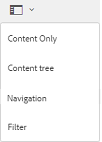

# Exploration des ressources sur Brand Portal {#browsing-assets-on-brand-portal}

Experience Manager Assets Brand Portal propose différentes fonctionnalités et éléments d’interface utilisateur qui facilitent la navigation dans les ressources, la navigation dans les hiérarchies de ressources et la recherche de ressources à l’aide de différentes options de mode.

Le logo de l’Experience Manager dans la barre d’outils supérieure permet aux utilisateurs administrateurs d’accéder facilement au panneau des outils d’administration.

Le sélecteur de rail en haut à gauche de Brand Portal se déroule pour afficher les options permettant de naviguer dans les hiérarchies de ressources, de simplifier votre recherche et d’afficher les ressources.

Vous pouvez afficher, parcourir et sélectionner des ressources à l’aide de l’un des modes disponibles (Carte, Colonnes et Liste) dans le sélecteur d’affichage de Brand Portal.

## Affichage et sélection de ressources {#viewing-and-selecting-resources}

L’affichage, la navigation et la sélection sont identiques sur le plan conceptuel dans tous les modes, mais leur manipulation présente de légères variations en fonction du mode utilisé.

Vous pouvez afficher, parcourir et sélectionner (pour une action ultérieure) vos ressources dans tous les modes disponibles :

* Mode Colonnes
* Mode Carte
* Vue Liste

### Mode Carte

Le mode Carte affiche des cartes d’informations pour chaque élément au niveau actuel. Ces cartes fournissent les détails suivants :

* Représentation visuelle de la ressource/du dossier.
* Type
* Titre
* Nom
* Date et heure auxquelles la ressource a été publiée dans Brand Portal à partir d’AEM
* Taille
* Dimensions

Vous pouvez parcourir la hiérarchie vers le bas en cliquant sur des cartes (en veillant à éviter les actions rapides) ou vers le haut en utilisant le [chemin de navigation dans l’en-tête](https://experienceleague.adobe.com/en/docs/experience-manager-65/content/sites/authoring/essentials/basic-handling).

#### Mode Carte pour les utilisateurs non-administrateurs

En mode Carte, les cartes de dossiers affichent les informations sur la hiérarchie des dossiers d’affichage aux utilisateurs non-administrateurs (éditeur, observateur et utilisateur invité). Cette fonctionnalité permet aux utilisateurs de connaître l’emplacement des dossiers auxquels ils accèdent, par rapport à la hiérarchie parente.

Les informations de hiérarchie de dossiers sont particulièrement utiles pour différencier les dossiers dont les noms sont similaires à d’autres dossiers partagés à partir d’une hiérarchie de dossiers différente. Si les utilisateurs non-administrateurs ne connaissent pas la structure de dossiers des ressources partagées avec eux, les ressources/dossiers portant des noms similaires peuvent sembler déroutants.

* Les chemins affichés sur les cartes respectives sont tronqués pour s’adapter à la taille de celles-ci. Cependant, les utilisateurs peuvent voir le chemin complet sous forme d’info-bulle en pointant la souris sur le chemin tronqué.

**Option Aperçu pour afficher les propriétés des ressources**

L’option Aperçu est disponible pour les utilisateurs non-administrateurs (éditeurs, observateurs et utilisateurs invités) afin d’afficher les propriétés des ressources/dossiers sélectionnés. L’option Aperçu est visible :

* Dans la barre d’outils, en haut, lors de la sélection d’une ressource/d’un dossier.
* Dans la liste déroulante, lors de la sélection du sélecteur de rail.

Lorsque vous sélectionnez l’option **[!UICONTROL Aperçu]** alors qu’une ressource/un dossier est sélectionné, les utilisateurs peuvent voir le titre, le chemin et l’heure de création de la ressource. En revanche, sur la page des détails de la ressource, la sélection de l’option Aperçu permet aux utilisateurs d’afficher les métadonnées de la ressource.

#### Paramètres d’affichage en mode Carte

La boîte de dialogue **[!UICONTROL Paramètres d’affichage]** s’ouvre en sélectionnant **[!UICONTROL Paramètres d’affichage]** dans le sélecteur de mode. Il vous permet de redimensionner les miniatures des ressources en mode Carte. Ainsi, vous pouvez personnaliser votre vue et contrôler le nombre de miniatures affichées.

### Vue Liste

Le mode Liste affiche des informations pour chaque ressource au niveau actuel. Le mode Liste fournit les détails suivants :

* Image miniature des ressources
* Nom
* Titre
* Paramètres régionaux
* Type
* Dimension
* Taille
* Évaluation
* Chemin du dossier présentant la hiérarchie des ressources
* Date de publication de cette ressource sur Brand Portal

La colonne Chemin permet d’identifier facilement l’emplacement des ressources dans la hiérarchie de dossiers. Vous pouvez parcourir la hiérarchie vers le bas en cliquant sur le nom de la ressource, puis revenir vers le haut en utilisant le [chemin de navigation dans l’en-tête](https://experienceleague.adobe.com/en/docs/experience-manager-65/content/sites/authoring/essentials/basic-handling).

<!--
Comment Type: draft lastmodifiedby="mgulati" lastmodifieddate="2018-08-17T03:12:05.096-0400" type="annotation">Removed:- "Selecting assets in list view To select all items in the list, use the checkbox at the upper left of the list. When all items in the list are selected, this check box appears checked. To deselect all, click or tap the checkbox. When only some items are selected, it appears with a minus sign. To select all, click or tap the checkbox. To deselect all, click or tap the checkbox again. You can change the order of items using the dotted vertical bar at the far right of each item in the list. Click the vertical selection bar and drag the item to a new position in the list."
 -->

### Paramètres d’affichage dans la vue Liste

Le mode Liste affiche la ressource **[!UICONTROL Name]** comme première colonne par défaut. Des informations complémentaires, telles que le **[!UICONTROL Titre]**, les **[!UICONTROL Paramètres régionaux]**, le **[!UICONTROL Type]**, les **[!UICONTROL Dimensions]**, la **[!UICONTROL Taille]**, l’**[!UICONTROL Évaluation]** et l’état de publication de la ressource, sont également affichées. Vous pouvez toutefois choisir les colonnes à afficher à l’aide de **[!UICONTROL Paramètres d’affichage]**.

### Mode Colonnes

Utilisez le mode Colonnes pour parcourir une arborescence de contenu à travers une série de colonnes en cascade. Ce mode vous aide à visualiser et à parcourir la hiérarchie de ressources.

La sélection d’une ressource dans la première colonne (la plus à gauche) affiche les ressources enfants dans la deuxième colonne à droite. La sélection d’une ressource dans la deuxième colonne affiche les ressources enfants dans la troisième colonne à droite, etc.

Vous pouvez naviguer de haut en bas dans l’arborescence. Cliquez sur le nom de la ressource ou sur le chevron situé à droite du nom de la ressource.

* Le nom de la ressource et le chevron sont mis en surbrillance lorsque vous appuyez ou cliquez dessus.
* Appuyez ou cliquez sur la miniature pour sélectionner la ressource.
* Lorsqu’elle est sélectionnée, une coche est apposée sur la miniature et le nom de la ressource est mis en surbrillance.
* Les détails de la ressource sélectionnée sont affichés dans la dernière colonne.

Lorsqu’une ressource est sélectionnée en mode Colonnes, une représentation visuelle de la ressource s’affiche dans la dernière colonne avec les détails suivants :

* Titre
* Nom
* Dimensions
* Date et heure auxquelles la ressource a été publiée dans Brand Portal à partir d’AEM
* Taille
* Type
* Option Plus de détails qui s’affiche avec la page de détails de la ressource

<!--
Comment Type: draft

<h3>Selecting Resources</h3>
-->

<!--
Comment Type: draft

Selecting a specific resource depends on a combination of the view and the device:

-->

<!--
Comment Type: draft

<table border="1" cellpadding="1" cellspacing="0" width="100%">
<tbody>
<tr>
<td> </td>
<td>Select</td>
<td>Deselect</td>
</tr>
<tr>
<td>Column View  </td>
<td>
<ul>
<li>Desktop:  Mouseover, then use the check mark quick action</li>
<li>Mobile device:  Tap the thumbnail</li>
</ul> </td>
<td>
<ul>
<li>Desktop:  Click the thumbnail</li>
<li>Mobile device:  Tap the thumbnail</li>
</ul> </td>
</tr>
<tr>
<td>Card View  </td>
<td>
<ul>
<li>Desktop:  Mouseover, then use the check mark quick action</li>
<li>Mobile device:  Tap-and-hold the card</li>
</ul> </td>
<td>
<ul>
<li>Desktop:  Click the card</li>
<li>Mobile device:  Tap the card</li>
</ul> </td>
</tr>
<tr>
<td>List View</td>
<td>
<ul>
<li>Desktop:  Mouseover, then use the check mark quick action</li>
<li>Mobile device:  Tap the thumbnail</li>
</ul> </td>
<td>
<ul>
<li>Desktop:  Click the thumbnail</li>
<li>Mobile device:  Tap the thumbnail</li>
</ul> </td>
</tr>
</tbody>
</table>
-->

<!--
Comment Type: draft

Deselecting All
-->

<!--
Comment Type: draft

In all cases, as you select items the count of the items selected is displayed at the upper right of the toolbar.

You can deselect all items and exit selection mode by clicking or tapping the X next to the count.

-->

<!--
Comment Type: draft

In all views, all items can be deselected by tapping escape on the keyboard if you are using a desktop device.

-->

## Arborescence de contenu {#content-tree}

En plus de ces vues, utilisez l’arborescence pour descendre dans la hiérarchie de ressources lorsque vous affichez et sélectionnez les ressources ou dossiers de votre choix.

Pour ouvrir l’arborescence, cliquez sur le sélecteur de rail en haut à gauche et sélectionnez l’**[!UICONTROL arborescence de contenu]** dans le menu.

Dans la hiérarchie de contenu, accédez à la ressource de votre choix.

## Détails de la ressource {#asset-details}

La page Détails de la ressource vous permet d’afficher une ressource, de la télécharger, de partager son lien, de la déplacer vers une collection ou d’afficher sa page de propriétés. Il vous permet également de parcourir la page de détails des autres ressources du même dossier l’une après l’autre.

Pour afficher les métadonnées de la ressource ou afficher ses différents rendus, utilisez le sélecteur de rail sur la page des détails de la ressource.

Vous pouvez afficher tous les rendus disponibles de la ressource sur la page des détails de la ressource, puis sélectionner un rendu dans le panneau **[!UICONTROL Rendus]** pour le prévisualiser.

<!-- removed as it is fixed in 2022.02.0 release
>[!CAUTION]
>
>(**Experience Manager Assets as a Cloud Service** only) The following known issues will be fixed in the upcoming release:
>
>The **[!UICONTROL Renditions]** panel does not list all the static renditions of the assets that are published to Brand Portal after December 16, 2021.
>
>The **[!UICONTROL Renditions]** panel lists the smart crop renditions of the asset, however, the user cannot preview or download the smart crop renditions.
-->

Pour ouvrir la page des propriétés de la ressource, utilisez l’option **[!UICONTROL Propriétés (p)]** de la barre supérieure.

Vous pouvez également afficher la liste de toutes ses ressources associées (ressources sources ou dérivées sur AEM) sur la page des propriétés de la ressource, car les relations de la ressource sont également publiées d’AEM vers Brand Portal.
