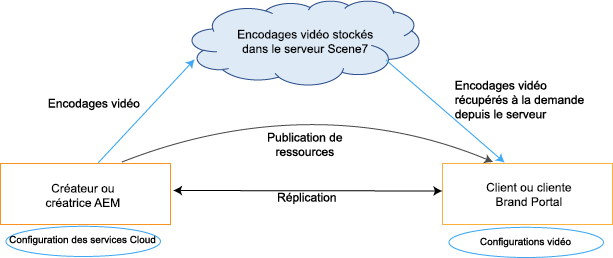
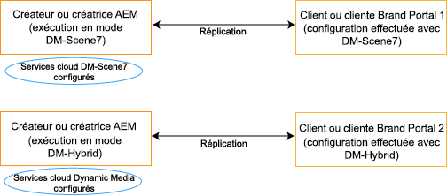

# Prise en charge de la vidéo dynamique sur Brand Portal {#dynamic-video-support-on-brand-portal}

Prévisualisez et lisez des vidéos de manière adaptative sur Brand Portal grâce à la prise en charge de Dynamic Media. Téléchargez également les rendus dynamiques à partir du portail et des liens partagés.
Les utilisateurs de Brand Portal peuvent effectuer les opérations suivantes :

* Prévisualiser des vidéos sur la page Détails de la ressource, la vue Carte et la page d’aperçu du partage de lien.
* Lire les codes vidéo sur la page Détails de la ressource.
* Afficher les rendus dynamiques dans l’onglet Rendus de la page Détails de la ressource.
* Télécharger des codes vidéo et des dossiers contenant des vidéos.

>[!NOTE]
>
>Pour utiliser des vidéos et les publier sur Brand Portal, vérifiez que votre instance de création Experience Manager est configurée sur le mode hybride Dynamic Media ou le mode Dynamic Media **[!DNL Scene7]**.

Pour prévisualiser, lire et télécharger des vidéos, Brand Portal expose les deux configurations suivantes aux administrateurs :

* [Configuration hybride Dynamic Media](#configure-dm-hybrid-settings)
Si l’instance d’auteur Experience Manager est en cours d’exécution sur le mode hybride Dynamic Media.
* [Configuration [!DNL Scene7] Dynamic Media](#configure-dm-scene7-settings)
Si l’instance d’auteur Experience Manager est en cours d’exécution en mode Dynamic Media **[!DNL Scene7]**.
Définissez l’une de ces configurations selon les configurations définies dans votre instance d’auteur Experience Manager avec laquelle le client Brand Portal est répliqué.

>[!NOTE]
>
>Les vidéos dynamiques ne sont pas prises en charge sur les clients Brand Portal configurés avec une instance d’auteur Experience Manager s’exécutant en mode **[!UICONTROL Scene7Connect]**.

## Comment les vidéos dynamiques sont-elles lues ? {#how-are-dynamic-videos-played}

Si les configurations Dynamic Media ([hybrides](../using/dynamic-video-brand-portal.md#configure-dm-hybrid-settings) ou [[!DNL Scene7]](../using/dynamic-video-brand-portal.md#configure-dm-scene7-settings)) sont définies sur Brand Portal, les rendus dynamiques sont récupérés à partir du serveur **[!DNL Scene7]**. Les codages vidéo sont donc prévisualisés et lus sans retard ni distorsion.

Comme les codes vidéo ne sont pas stockés dans le référentiel Brand Portal et sont récupérés à partir du serveur **[!DNL Scene7]**, assurez-vous que les configurations Dynamic Media sur l’instance de création d’Adobe Experience Manager Author et sur Brand Portal sont identiques.

>[!NOTE]
>
>Les visionneuses vidéo et leurs paramètres prédéfinis ne sont pas pris en charge dans Brand Portal. Les vidéos sont prévisualisées et lues sur les visionneuses par défaut dans Brand Portal.

## Prérequis {#prerequisites}

Pour utiliser des vidéos dynamiques sur Brand Portal, veillez à :

* **Démarrage d’Experience Manager Author en mode Dynamic Media**
Démarrez l’instance de création Experience Manager Author (avec laquelle Brand Portal est configuré) en [mode Dynamic Media - [!DNL Scene7] ](https://experienceleague.adobe.com/docs/experience-manager-65/assets/dynamic/config-dms7.html?lang=fr#enabling-dynamic-media-in-scene-mode) ou en [mode Dynamic Media - Hybrid](https://experienceleague.adobe.com/docs/experience-manager-65/assets/dynamic/config-dynamic.html?lang=fr) ou
* **Configuration des Dynamic Media Cloud Services sur Experience Manager Author**
En fonction du mode Dynamic Media (mode Scene7 ou mode hybride) sur lequel Experience Manager Author s’exécute, définissez [Dynamic Media Cloud Services (mode [!DNL Scene7])](https://experienceleague.adobe.com/docs/experience-manager-65/assets/dynamic/config-dms7.html?lang=fr#configuring-dynamic-media-cloud-services) ou [Dynamic Media Cloud Services (mode hybride)](https://experienceleague.adobe.com/docs/experience-manager-65/assets/dynamic/config-dynamic.html?lang=fr#configuring-dynamic-media-cloud-services) sur Experience Manager Author depuis **Outils** | **Cloud Services** | **Dynamic Media**.
* **Configuration de Dynamic Media sur Brand Portal**
Selon les configurations cloud de Dynamic Media sur Experience Manager Author, configurez les [paramètres Dynamic Media](#configure-dm-hybrid-settings) ou les paramètres [[!DNL Scene7] ](#configure-dm-scene7-settings) à partir des outils d’administration de Brand Portal.
Assurez-vous que des [clients Brand Portal distincts](#separate-tenants) soient utilisées pour les instances de création Experience Manager Author configurées dans le mode Dynamic Media - **[!UICONTROL Scene7]** et Dynamic Media - mode hybride. Surtout si vous utilisez les fonctionnalités de Dynamic Media **[!UICONTROL S7]** et Dynamic Media hybride.
* **Publication de dossiers avec des codes vidéo appliqués à Brand Portal**
Appliquez des [codages vidéo](https://experienceleague.adobe.com/docs/experience-manager-65/assets/dynamic/video-profiles.html?lang=fr) et publiez le dossier contenant des ressources multimédias enrichies depuis l’instance de création Experience Manager Author sur Brand Portal.
* **Mettre sur liste blanche les adresses IP sortantes dans SPS si l’aperçu sécurisé est activé**
En cas d’utilisation de Dynamic Media **[!DNL Scene7]** (avec l’[aperçu sécurisé activé](https://experienceleague.adobe.com/docs/dynamic-media-classic/using/upload-publish/testing-assets-making-them-public.html?lang=fr) pour une entreprise), il est conseillé à l’**[!DNL Scene7]** administrateur de l’entreprise[ de mettre les adresses IP sortantes publiques sur liste blanche](https://experienceleague.adobe.com/docs/dynamic-media-classic/using/upload-publish/testing-assets-making-them-public.html?lang=fr#testing-the-secure-testing-service) pour les zones géographiques respectives utilisant l’interface utilisateur Flash de SPS (**[!UICONTROL Scene7]** Publishing System).
Les adresses IP sortantes sont les suivantes :

| **Zone géographique** | **Adresse IP de sortie** |
|--- |--- |
| N/A | 130.248.160.68,  20.94.203.130 |
| EMEA | 185.34.189.3,  51.132.146.75 |
| APAC | 63.140.44.54 |

Pour mettre l’une de ces adresses IP sortantes sur liste blanche, voir [Préparation de votre compte pour un test sécurisé](https://experienceleague.adobe.com/docs/dynamic-media-classic/using/upload-publish/testing-assets-making-them-public.html?lang=fr#testing-the-secure-testing-service).

## Meilleures pratiques

Pour vérifier que vos ressources Dynamic Video sont prévisualisées, lues et téléchargées correctement depuis Brand Portal (et les liens partagés), suivez ces pratiques :

### Séparez les clients pour les modes Dynamic Media - Scene7 et Dynamic Media - Hybride {#separate-tenants}

Si vous utilisez les fonctionnalités du mode Dynamic Media - **[!DNL Scene7]** et Dynamic Media - Hybride, utilisez différents clients Brand Portal pour les instances de création Experience Manager Author configurées avec les modes Dynamic Media - **[!DNL Scene7]** et Dynamic Media - Hybride.

### Détails de configuration identiques sur l’instance de création Experience Manager Author et Brand Portal

Assurez-vous que les détails de la configuration soient identiques dans Brand Portal et dans la **[!UICONTROL Configuration Cloud Experience Manager]**. Les détails identiques de la configuration sont les suivants :

* **[!UICONTROL Titre]**
* **[!UICONTROL ID d’enregistrement]**
* **[!UICONTROL URL du service vidéo]** en mode **[!UICONTROL Dynamic Media - Hybride]**
* **[!UICONTROL Titre]**
* Informations d’identification (**[!UICONTROL E-mail]** et mot de passe)
* **[!UICONTROL Zone géographique]**
* **[!UICONTROL Société]** en mode Dynamic Media - **[!DNL Scene7]**

### Mise sur liste blanche des adresses IP sortantes publiques pour le mode Scene7 Dynamic Media

Si le mode **[!UICONTROL Scene7]** de Dynamic Media avec l’[aperçu sécurisé activé](https://experienceleague.adobe.com/docs/dynamic-media-classic/using/upload-publish/testing-assets-making-them-public.html?lang=fr) est utilisé pour diffuser des ressources vidéo sur Brand Portal, **[!UICONTROL Scene7]** crée un serveur d’images dédié pour les environnements d’évaluation ou les applications internes. Toute requête à ce serveur vérifie l’adresse IP d’origine. Si la requête entrante ne figure pas dans la liste approuvée des adresses IP, une réponse d’échec est renvoyée.
L’administrateur d’entreprise **[!UICONTROL Scene7]** configure par conséquent une liste approuvée d’adresses IP pour l’environnement de **[!UICONTROL test sécurisé]** de leur entreprise, via l’interface utilisateur Flash de **[!UICONTROL SPS]** (Scene7 Publishing System). Vérifiez que l’adresse IP sortante pour votre zone géographique respective (parmi les suivantes) est ajoutée à cette liste approuvée.
Pour mettre l’une de ces adresses IP sortantes sur liste blanche, voir [Préparation de votre compte pour un test sécurisé](https://experienceleague.adobe.com/docs/dynamic-media-classic/using/upload-publish/testing-assets-making-them-public.html?lang=fr#testing-the-secure-testing-service).
Les adresses IP sortantes sont les suivantes :

| **Zone géographique** | **Adresse IP de sortie** |
|--- |--- |
| N/A | 130.248.160.68, 20.94.203.130 |
| EMEA | 51.132.146.75, 130.248.244.202, 130.248.244.203, 130.248.244.204, 130.248.244.210, 130.248.244.211, 130.248.244.212 |
| APAC | 63.140.44.54 |

## Configuration des paramètres Dynamic Media (hybride) {#configure-dm-hybrid-settings}

Si l’instance de création Experience Manager Author s’exécute en mode hybride Dynamic Media, utilisez le volet **[!UICONTROL Vidéo]** dans le panneau Outils d’administration pour configurer les paramètres de la passerelle Dynamic Media.

>[!NOTE]
>
>Les [profils de codage vidéo](https://experienceleague.adobe.com/docs/experience-manager-65/assets/dynamic/video-profiles.html?lang=fr) ne sont pas publiés sur Brand Portal, mais sont récupérés du serveur **[!UICONTROL Scene7]**. Par conséquent, pour que les codes vidéo soient lus correctement dans Brand Portal, assurez-vous que les détails de configuration soient identiques à ceux de [Dynamic Media Cloud Services (mode [!DNL Scene7])](https://experienceleague.adobe.com/docs/experience-manager-65/assets/dynamic/config-dms7.html?lang=fr#configuring-dynamic-media-cloud-services) dans votre instance Experience Manager Author.

Pour définir les configurations Dynamic Media sur des clients Brand Portal :

1. Dans Brand Portal, sélectionnez le logo d’Experience Manager pour accéder aux outils d’administration dans la barre d’outils supérieure.
1. Dans le panneau des outils d’administration, sélectionnez la vignette **[!UICONTROL Vidéo]**.

   

   La page **[!UICONTROL Modifier la configuration Dynamic Media]** s’ouvre.

   

1. Spécifiez l’**[!UICONTROL ID d’enregistrement]** et l’**[!UICONTROL URL du service vidéo]** (URL de la passerelle Dynamic Media). Assurez-vous que ces détails soient identiques à ceux figurant dans **[!UICONTROL Outils > Cloud Services]** dans votre instance Experience Manager Author.
1. Cliquez sur **Enregistrer** pour enregistrer la configuration.

## Configuration des paramètres de Scene7 Dynamic Media {#configure-dm-scene7-settings}

Si l’instance Experience Manager Author s’exécute en mode Dynamic Media - **[!UICONTROL Scene7]**, utilisez le volet **[!UICONTROL Configuration de Dynamic Media]** dans le panneau des outils d’administration pour configurer les paramètres du serveur **[!UICONTROL Scene7]**.

Pour définir les configurations Dynamic Media **[!UICONTROL Scene7]** sur des clients Brand Portal :

1. Dans Brand Portal, sélectionnez le logo d’Experience Manager pour accéder aux outils d’administration dans la barre d’outils supérieure.

2. Dans le panneau Outils d’administration, sélectionnez la vignette **[!UICONTROL Configuration Dynamic Media]**.

   ![Configuration de Dynamic Media [!UICONTROL Scene7]sur Brand Portal](assets/DMS7-Tile.png)

   La page **[!UICONTROL Modifier la configuration Dynamic Media]** s’ouvre.

   

3. Fournissez les détails suivants :

   * **[!UICONTROL Titre]**
   * Informations d’identification (**[!UICONTROL ID de message électronique]** et **[!UICONTROL Mot de passe]**) pour accéder au serveur Scene7.
   * **[!UICONTROL Zone géographique]**

   Assurez-vous que ces valeurs soient identiques à celles qui se trouvent dans votre instance Experience Manager Author.

4. Sélectionnez **[!UICONTROL Connexion à Dynamic Media]**.

5. Indiquez le **[!UICONTROL nom de la société]** et **[!UICONTROL enregistrez]** la configuration.
