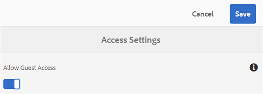
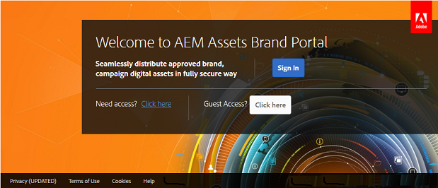
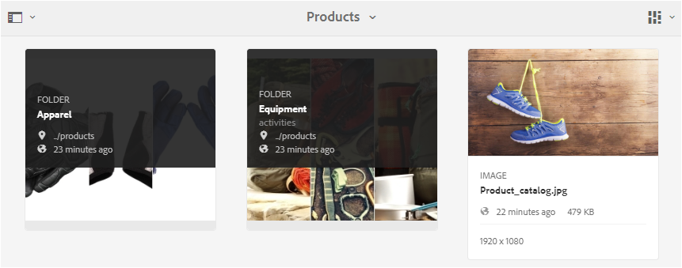
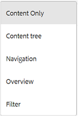
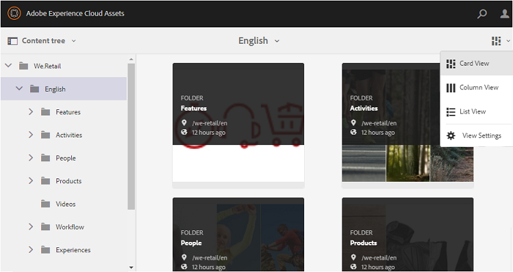
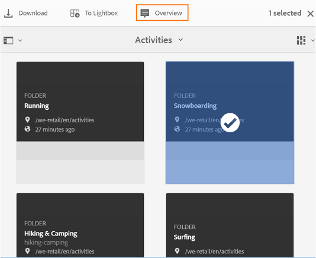
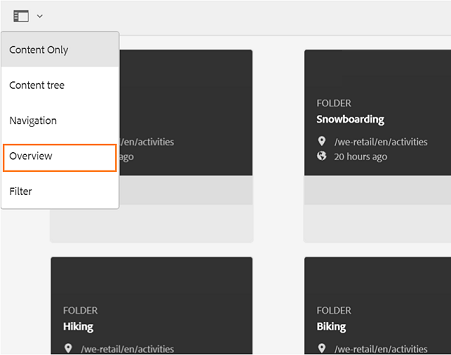
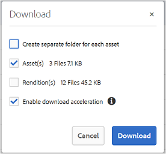
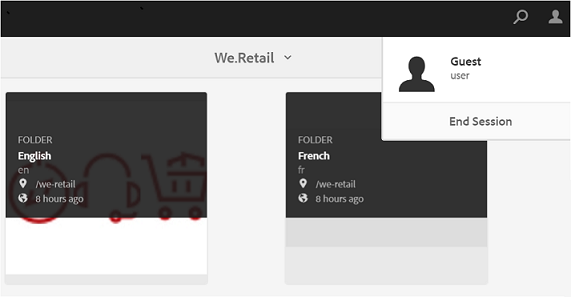

# Accès des invités à Brand Portal {#guest-access-to-brand-portal}

Experience Manager Assets Brand Portal permet aux invités d’accéder au portail. Un utilisateur invité n’a pas besoin d’identifiants pour accéder au portail et a accès aux ressources (et aux collections) publiques du portail. Les utilisateurs ou les utilisatrices se trouvant dans une session d’invité peuvent ajouter des ressources à leur Lightbox (collection privée) et les télécharger jusqu’au terme de leur session, à moins que la personne invitée ne choisisse de [[!UICONTROL Terminer la session]](#exit-guest-session). Une session de personne invitée reste active pendant 15 minutes.

La fonctionnalité d’accès des invités permet aux entreprises de [partager rapidement](../using/brand-portal-sharing-folders.md#how-to-share-folders) les ressources approuvées avec l’audience prévue à grande échelle sans avoir à les intégrer). À compter de la version 6.4.2, Brand Portal est capable de servir plusieurs utilisateurs invités simultanés sans dépasser 10 % du nombre total d’utilisateurs par entreprise. Autoriser l’accès des invités permet de gagner du temps dans le cadre de la gestion et de l’intégration de nombreux utilisateurs avec des fonctionnalités limitées sur Brand Portal.\
Les entreprises peuvent activer (ou désactiver) l’accès des invités à leur compte Brand Portal à l’aide de l’option **[!UICONTROL Autoriser l’accès des invités]** des paramètres **[!UICONTROL Accès]** du panneau des outils d’administration.

<!--
Comment Type: annotation
Last Modified By: mgulati
Last Modified Date: 2018-08-17T10:42:59.879-0400
Removed the first para: "AEM Assets Brand Portal allows public users to enter the portal anonymously and have restricted access to the allowed public resources as guests. Organization users with guest role need not seek access and authentication from administrators."
-->

## Démarrage d’une session d’invité {#begin-guest-session}

Pour accéder à Brand Portal de manière anonyme, sélectionnez **[!UICONTROL Cliquez ici]** correspondant à **[!UICONTROL `Guest Access?`]** sur l’écran d’accueil de Brand Portal. Saisissez la réponse à la vérification de sécurité captcha pour obtenir l’accès à Brand Portal.

## Durée d’une session d’invité {#guest-session-duration}

Une session de personne invitée reste active pendant 15 minutes.
Ce processus conserve l’état de la **[!UICONTROL Lightbox]** pendant 15 minutes à compter du début de la session. Ensuite, la session d’invité en cours redémarre, ce qui entraîne la perte de l’état de Lightbox.

Par exemple, un utilisateur invité se connecte à Brand Portal à 15 h 00 et ajoute des ressources à **[!UICONTROL Lightbox]** pour les télécharger à 15 :05. Si l’utilisateur ne télécharge pas la collection **[!UICONTROL Lightbox]** (ou ses ressources) avant 15 :15 heures (dans les 15 minutes qui suivent la connexion), il doit redémarrer la session. Le **[!UICONTROL Lightbox]** est vide, ce qui signifie que les ressources chargées ne seront plus disponibles si la session a été perdue.

## Sessions d’invités simultanées permises {#concurrent-guest-sessions-allowed}

Le nombre de sessions d’invités simultanées est limité à 10 % du nombre total d’utilisateurs pour chaque entreprise. Cela signifie que pour une organisation qui dispose d’un quota d’utilisateurs de 200, un maximum de 20 utilisateurs invités peuvent travailler en même temps. Le 21e utilisateur se voit refuser l’accès et ne peut donc bénéficier d’un accès invité que si la session de l’un des 20 utilisateurs invités actifs se termine.

>[!NOTE]
>
>Brand Portal n’envoie pas de notification si le nombre d’utilisateurs sous licence dépasse la valeur convenue (quota). En outre, elle ne limite aucune activité des utilisateurs sous licence.

## Interaction des utilisateurs invités avec Brand Portal {#guest-user-interaction-with-brand-portal}

### Navigation dans l’IU des invités

Lorsqu’ils se connectent à Brand Portal en tant qu’invités, les utilisateurs peuvent voir l’ensemble des [ressources et dossiers partagés](../using/brand-portal-sharing-folders.md#sharefolders) publiquement ou avec les utilisateurs invités exclusivement. Réservé au contenu, ce mode affiche les ressources dans les dispositions Carte, Liste ou Colonnes.

Si les administrateurs activent [Activer la hiérarchie de dossiers](../using/brand-portal-general-configuration.md#main-pars-header-1621071021), les utilisateurs invités voient l’arborescence des dossiers racine et partagés dans leurs dossiers parents lors de leur connexion à Brand Portal.

Ces dossiers parents sont des dossiers virtuels sur lesquels aucune action ne peut être effectuée. Vous pouvez identifier ces dossiers virtuels grâce à leur icône de cadenas.

Aucune tâche d’action n’est visible lorsque vous les survolez ou les sélectionnez en **[!UICONTROL mode Carte]**, à la différence des dossiers partagés. Le bouton **[!UICONTROL Aperçu]** s’affiche lors de la sélection d’un dossier virtuel dans la vue **[!UICONTROL Colonnes]** et **[!UICONTROL Liste]**.

>[!NOTE]
>
>La miniature par défaut des dossiers virtuels est l’image de miniature du premier dossier partagé.

   

L’option **[!UICONTROL Afficher les paramètres]** permet aux utilisateurs invités d’ajuster les tailles des cartes dans la vue **[!UICONTROL Carte]** ou les colonnes à afficher dans la vue **[!UICONTROL Liste]**.

L’**[!UICONTROL arborescence de contenu]** vous permet de vous déplacer dans la hiérarchie des ressources.

Brand Portal propose une option **[!UICONTROL Aperçu]** permettant aux utilisateurs invités d’afficher **[!UICONTROL Propriétés de la ressource]** des ressources/dossiers sélectionnés. L’option **[!UICONTROL Aperçu]** est visible :

* Dans la barre d’outils, en haut, lors de la sélection d’une ressource ou d’un dossier.
* dans le menu déroulant, lors de la sélection du sélecteur de rail.

Lorsque vous sélectionnez l’option **[!UICONTROL Aperçu]** alors qu’une ressource ou un dossier est sélectionné, les utilisateurs peuvent voir le titre, le chemin et l’heure de création de la ressource. En revanche, sur la page des détails de la ressource, la sélection de l’option **[!UICONTROL Aperçu]** permet aux utilisateurs d’afficher les métadonnées de la ressource.

L’option **[!UICONTROL Navigation]** du rail de gauche permet de naviguer entre les fichiers et les collections, puis de revenir dans la session des invités afin que les utilisateurs puissent parcourir les ressources des fichiers ou des collections.

L’option **[!UICONTROL Filtrer]** permet aux utilisateurs invités de filtrer les fichiers et dossiers de ressources à l’aide de prédicats de recherche définis par l’administrateur.

### Fonctions offertes aux utilisateurs invités

Les utilisateurs invités peuvent accéder aux ressources publiques sur Brand Portal. Quelques restrictions leur sont également appliquées, comme décrit plus loin.

**Les utilisateurs invités peuvent** :

* accéder à tous les dossiers et collections publics destinés à tous les utilisateurs de Brand Portal ;
* Parcourez les membres, la page de détails et disposez d’une vue complète des ressources des membres de tous les dossiers et collections publics.
* rechercher des ressources au sein des dossiers et collections publics ;
* ajouter des ressources à la collection Lightbox (les modifications apportées à la collection persistent pendant la session) :
* télécharger des ressources directement ou via la collection Lightbox.

**Les utilisateurs invités ne peuvent pas** :

* créer des collections et des recherches enregistrées, ni les partager ;
* accéder aux paramètres des dossiers et collections ;
* partager des ressources sous la forme de liens.

### Téléchargement de ressources au cours d’une session d’invité

Les utilisateurs invités peuvent télécharger directement les ressources partagées publiquement ou exclusivement avec les utilisateurs invités sur Brand Portal. Ils peuvent également ajouter des ressources à **[!UICONTROL Lightbox]** (collection publique) et télécharger la collection **[!UICONTROL Lightbox]** avant l’expiration de leur session.

Pour télécharger des ressources et des collections, utilisez l’icône Télécharger à partir :

* des miniatures d’action rapide, qui apparaissent lorsque vous placez le curseur sur une ressource ou une collection ;
* de la barre d’outils supérieure, qui s’affiche lorsque vous sélectionnez une ressource ou une collection.

Sélectionnez **[!UICONTROL Activer l’accélération des téléchargements]** dans la boîte de dialogue [!UICONTROL Télécharger] pour améliorer [ les performances de téléchargement](../using/accelerated-download.md).

## Quitter une session d’invité {#exit-guest-session}

Pour quitter une session d’invité, utilisez **[!UICONTROL Terminer la session]** parmi les options disponibles dans l’en-tête. Toutefois, si l’onglet du navigateur utilisé pour la session d’invité est inactif, la session expire automatiquement après deux heures d’inactivité.

## Surveillance des activités des utilisateurs invités {#monitoring-guest-user-activities}

Les administrateurs peuvent suivre l’interaction des utilisateurs invités avec Brand Portal. Les rapports générés dans Brand Portal peuvent fournir des informations clés sur les activités des personnes invitées. Par exemple, le rapport **[!UICONTROL Télécharger]** peut être utilisé pour suivre le nombre de ressources téléchargées par l’utilisateur invité. Le rapport **[!UICONTROL Connexions utilisateur]** peut indiquer la date de la dernière connexion de l’utilisateur invité au portail et la fréquence des connexions pendant une durée spécifiée.
