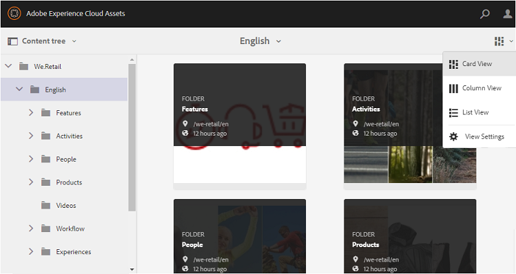

# Accès des invités à Brand Portal {#guest-access-to-brand-portal}

AEM Brand Portal permet à des invités d’accéder au portail. Un utilisateur invité n’a pas besoin d’identifiants pour accéder au portail et a accès aux ressources (et aux collections) publiques du portail. Les utilisateurs se trouvant dans une session d’invité peuvent ajouter des ressources à leur Lightbox (collection privée) et les télécharger jusqu’au terme de leur session qui dure deux heures, à moins que l’utilisateur invité choisisse de [[!UICONTROL Terminer la session]](#exit-guest-session).

La fonctionnalité d’accès des invités permet aux entreprises de [partager rapidement les ressources approuvées](../using/brand-portal-sharing-folders.md#how-to-share-folders) avec l’audience prévue à grande échelle sans avoir besoin d’une intégration. À compter de la version 6.4.2, Brand Portal est capable de servir plusieurs utilisateurs invités simultanés sans dépasser 10 % du nombre total d’utilisateurs par entreprise. Autoriser l’accès des invités permet de gagner du temps dans le cadre de la gestion et de l’intégration de nombreux utilisateurs qui doivent utiliser des fonctionnalités limitées sur Brand Portal.\
Les entreprises peuvent activer (ou désactiver) l’accès des invités à leur compte à l’aide de l’option **[!UICONTROL Autoriser l’accès des invités]**dans les paramètres**[!UICONTROL  Accès]** du panneau des outils d’administration.

<!--
Comment Type: annotation
Last Modified By: mgulati
Last Modified Date: 2018-08-17T10:42:59.879-0400
Removed the first para: "AEM Assets Brand Portal allows public users to enter the portal anonymously and have restricted access to the allowed public resources as guests. Organization users with guest role need not seek access and authentication from administrators."
-->

## Démarrage d’une session d’invité {#begin-guest-session}

Pour accéder à Brand Portal de manière anonyme, sélectionnez **[!UICONTROL Cliquez ici]**en regard de**[!UICONTROL  Accès d’invité ? ]** sur l’écran de bienvenue de Brand Portal. Les utilisateurs n’ont pas besoin de demander l’accès et d’attendre que l’administrateur les authentifie pour leur accorder l’accès à Brand Portal.

## Durée d’une session d’invité {#guest-session-duration}

Une session d’utilisateur invité reste active pendant deux heures. L’état de **[!UICONTROL Lightbox]**est ainsi conservé pendant une heure à compter du début de la session. Après deux heures, la session d’invité en cours redémarre et l’état de Lightbox est donc perdu.\
Par exemple, un utilisateur invité se connecte à Brand Portal à 15 h 00 et ajoute des ressources dans Lightbox pour un téléchargement à 16 h 50. Si l’utilisateur ne télécharge pas la collection **[!UICONTROL Lightbox]**(ou ses ressources) avant 17 h 00,**[!UICONTROL  Lightbox]** se vide, car l’utilisateur doit redémarrer la session à la fin de l’heure (c’est-à-dire à 17 h 00).

## Sessions d’invités simultanées permises {#concurrent-guest-sessions-allowed}

Le nombre de sessions d’invités simultanées est limité à 10 % du nombre total d’utilisateurs pour chaque entreprise. Pour une société disposant de 200 utilisateurs, un maximum de 20 utilisateurs invités peuvent ainsi travailler en même temps. Le 21e utilisateur se voit refuser l’accès et ne peut donc bénéficier d’un accès invité que si la session de l’un des 20 utilisateurs invités actifs se termine.

## Interaction des utilisateurs invités avec Brand Portal {#guest-user-interaction-with-brand-portal}

### Navigation dans l’IU des invités

Lorsqu’ils se connectent à Brand Portal en tant qu’invités, les utilisateurs peuvent voir l’ensemble des [ressources et dossiers partagés](../using/brand-portal-sharing-folders.md#sharefolders) publiquement ou avec les utilisateurs invités exclusivement. Réservé au contenu, ce mode affiche les ressources dans les dispositions Carte, Liste ou Colonnes.

Cependant, les utilisateurs invités voient l’arborescence de dossiers (à partir du dossier racine) et les dossiers partagés organisés dans leurs dossiers parents respectifs lors de leur connexion à Brand Portal, si les administrateurs ont activé la configuration [Activer la hiérarchie de dossiers](../using/brand-portal-general-configuration.md#main-pars-header-1621071021).

Ces dossiers parents sont des dossiers virtuels et ne peuvent faire l’objet d’aucune action. Vous pouvez identifier ces dossiers virtuels grâce à leur icône de cadenas.

Aucune tâche d’action n’est visible lorsque vous les survolez ou les sélectionnez en **[!UICONTROL mode Carte]**, à la différence des dossiers partagés. Le bouton**[!UICONTROL  Aperçu]** apparaît lorsque vous sélectionnez un dossier virtuel dans les modes **[!UICONTROL Colonnes]**et**[!UICONTROL  Liste]**.

>[!NOTE]
>
>Notez que la miniature par défaut des dossiers virtuels est l’image de miniature du premier dossier partagé.

   

L’option **[!UICONTROL Paramètres]**permet aux utilisateurs invités d’ajuster les formats de carte en**[!UICONTROL  mode Carte]** ou les colonnes à afficher en **[!UICONTROL mode Liste]**.

**[!UICONTROL Arborescence de contenu]**vous permet de vous déplacer dans la hiérarchie des ressources.

Brand Portal fournit aux utilisateurs invités l’option **[!UICONTROL Aperçu]**qui leur permet d’afficher les**[!UICONTROL  Propriétés de l’élément]** pour les ressources/dossiers sélectionnés. L’option **[!UICONTROL Aperçu]**est visible :

* dans la barre d’outils supérieure lors de la sélection d’une ressource/d’un dossier ;
* dans le menu déroulant, lors de la sélection du sélecteur de rail.
S’ils choisissent l’option **[!UICONTROL Aperçu]**lorsqu’une ressource/un dossier est sélectionné, les utilisateurs peuvent voir le titre, le chemin et l’heure de création de la ressource. En revanche, sur la page des détails de la ressource, l’option**[!UICONTROL  Aperçu]** permet aux utilisateurs d’afficher les métadonnées de la ressource.

 

L’option **[!UICONTROL Navigation]**dans le rail de gauche permet de naviguer des fichiers aux collections, et inversement, lors d’une session d’invité afin de permettre aux utilisateurs de parcourir les ressources dans les fichiers ou les collections.

L’option **[!UICONTROL Filtre]**permet aux utilisateurs invités de filtrer les fichiers et les dossiers de ressources à l’aide de prédicats de recherche définis par l’administrateur.

### Fonctions offertes aux utilisateurs invités

Les utilisateurs invités peuvent accéder aux ressources publiques sur Brand Portal et ont également quelques restrictions comme décrit plus loin.

**Les utilisateurs invités peuvent**:

* Accédez à tous les dossiers et collections publics destinés à tous les utilisateurs du portail de marque.
* Parcourir les membres, la page de détails et avoir une vue complète des ressources des membres de tous les dossiers et collections publics.
* Recherche de fichiers dans des dossiers et collections publics.
* Ajoutez des ressources à la collection lightbox. (les modifications apportées à la collection persistent pendant la session) :
* Téléchargez des fichiers directement ou par le biais de la collection lightbox.

**Les utilisateurs invités ne peuvent pas**:

* Créez des collections et des recherches enregistrées, ou partagez-les davantage.
* Accédez aux paramètres des dossiers et des collections.
* Partagez des fichiers sous forme de liens.

### Téléchargement de ressources au cours d’une session d’invité

Les utilisateurs invités peuvent télécharger directement les ressources partagées publiquement ou exclusivement avec les utilisateurs invités sur Brand Portal. Ils peuvent également ajouter des ressources à **[!UICONTROL Lightbox]**(collection publique) et télécharger la collection**[!UICONTROL  Lightbox]** avant l’expiration de leur session.

Pour télécharger des ressources et des collections, utilisez l’icône Télécharger à partir :

* Miniatures d’action rapide qui s’affichent lorsque vous passez la souris sur la ressource ou la collection
* Barre d’outils en haut, qui s’affiche lors de la sélection de la ressource ou de la collection

Sélectionnez **[!UICONTROL Activer l’accélération des téléchargements]**dans la boîte de dialogue[!UICONTROL Téléchargement]afin d’[améliorer les performances de téléchargement](../using/accelerated-download.md).

## Quitter une session d’invité {#exit-guest-session}

Pour quitter une session d’invité, utilisez **[!UICONTROL Terminer la session]**parmi les options disponibles dans l’en-tête. Toutefois, si l’onglet du navigateur utilisé pour la session d’invité est inactif, la session expire automatiquement après deux heures d’inactivité.

## Surveillance des activités des utilisateurs invités {#monitoring-guest-user-activities}

Les administrateurs peuvent suivre l’interaction des utilisateurs invités avec Brand Portal. Les rapports générés dans Brand Portal peuvent fournir des informations clés sur les activités des utilisateurs invités. Par exemple, le rapport **[!UICONTROL Téléchargement]**peut être utilisé pour le suivi du nombre de ressources téléchargées par un utilisateur invité. Le rapport**[!UICONTROL  Connexions des utilisateurs]** peut indiquer lorsqu’un utilisateur invité s’est connecté pour la dernière fois au portail et la fréquence de ses connexions au cours d’une période donnée.
