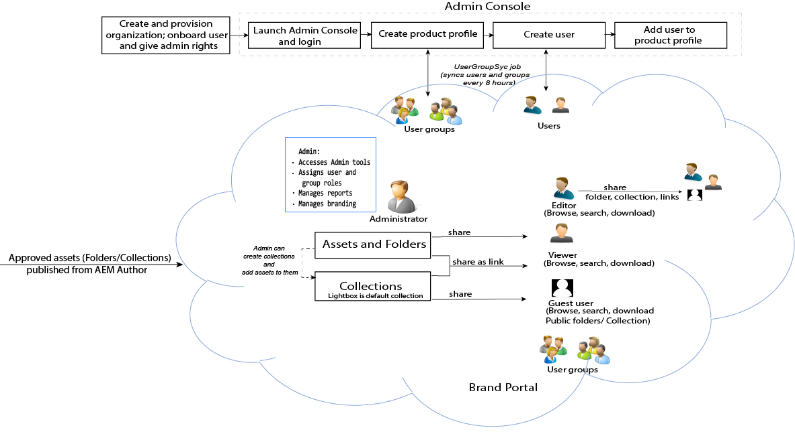

# Guide d’Adobe Experience Manager Assets Brand Portal {#aem-brand-portal}

**Adobe Experience Manager Assets Brand Portal** permet aux entreprises de répondre à leurs besoins marketing en distribuant en toute sécurité des ressources approuvées de marque et de produit aux agences externes, aux partenaires, aux équipes en interne ainsi qu’aux revendeurs pour téléchargement.

L’absence d’une solution sécurisée de partage de ressources peut entraîner :

* le partage manuel de ressources par courrier électronique ou dans le cloud ;
* des problèmes de conformité de marque ;
* un manque de contrôle sur l’utilisation des ressources ;
* des retards de lancement de campagnes et de produits ;
* une duplication du contenu dans plusieurs zones géographiques et organisations ;
* un stockage non sécurisé des ressources avant leur diffusion.

Avec Brand Portal, les entreprises peuvent garantir la conformité de la marque en permettant aux spécialistes du marketing de collaborer avec les partenaires de distribution et les utilisateurs internes afin de créer, de gérer et de fournir rapidement les directives de conception, les logos, les campagnes et les ressources de produits les plus récents aux parties prenantes.
Brand Portal est une offre SAAS basée sur le cloud. Il est disponible sous la forme d’un module complémentaire pour Adobe Experience Manager Assets (sur site ou sous la forme de service géré).

Le workflow de la solution Brand Portal est illustré dans l’image ci-dessous.

## Guide de l’utilisateur d’Adobe Experience Manager Brand Portal

Ce guide de l’utilisateur présente des informations sur les offres Brand Portal et les principaux workflows. Utilisez le rail gauche pour parcourir différentes fonctionnalités et explorer au niveau du détail comment les différents utilisateurs interagissent avec le portail.

### Voir également

| Guide de l’utilisateur | Description |
|--- |---|
| [Nouveautés](whats-new.md) | Modifications et dernières offres depuis les versions précédentes de Brand Portal. |
| [Notes de mise à jour](brand-portal-release-notes.md) | Améliorations, problèmes critiques résolus et problèmes connus dans la version actuelle. |
| [Configuration d’Experience Manager Assets avec Brand Portal](../using/configure-aem-assets-with-brand-portal.md) | Procédure de réplication de Brand Portal avec Experience Manager Assets pour publier des ressources. |
| [Résolution des problèmes liés à la publication parallèle](troubleshoot-parallel-publishing.md) | Résolution des problèmes de réplication entre Brand Portal et Experience Manager Assets. |
| [Formats de fichiers pris en charge](brand-portal-supported-formats.md) | Formats de fichier pris en charge dans Brand Portal pour l’aperçu et le téléchargement. |
| [Publication de ressources sur Brand Portal](brand-portal-sharing-folders.md) | Procédure de publication des dossiers, collections, liens, paramètres prédéfinis, schémas, facettes et balises sur Brand Portal. |
| [Approvisionnement des ressources dans Brand Portal](brand-portal-asset-sourcing.md) | Procédures de configuration de l’approvisionnement des ressources dans AEM Assets, de chargement des ressources sur Brand Portal et de publication du dossier de contribution sur AEM Assets. |

### Ressources utiles

* [Présentation de Brand Portal avec AEM Assets](https://experienceleague.adobe.com/docs/experience-manager-brand-portal/using/home.html?lang=fr)
