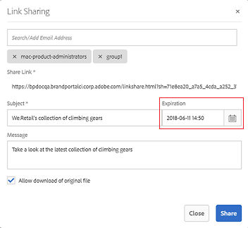
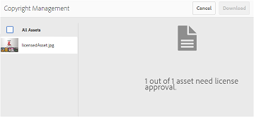

# Gestion des droits numériques des ressources {#manage-digital-rights-of-assets}

La sécurisation de la distribution et de l’utilisation des ressources créatives et des documents de marque est essentielle pour protéger votre marque. Elle peut être appliquée à l’échelle de l’entreprise et à l’extérieur de celle-ci en associant une date (et une heure) d’expiration aux ressources approuvées publiées à partir d’AEM sur Brand Portal, ou en octroyant des licences pour ces ressources pour une utilisation conditionnelle. En outre, Brand Portal vous permet de spécifier une date d’expiration pour les liens vers les ressources partagées à partir de Brand Portal.

Poursuivez la lecture de cet article pour savoir comment les ressources sont sécurisées sur Brand Portal et comprendre les autorisations d’utilisation associées.

## Expiration de ressources {#asset-expiration}

L’expiration de ressources est une façon efficace de contrôler l’utilisation des ressources approuvées sur Brand Portal à travers une organisation. Toutes les ressources publiées à partir d’AEM Assets sur Brand Portal peuvent avoir une date d’expiration qui limite l’utilisation de ces ressources par différents rôles d’utilisateur.

### Autorisations d’utilisation liées aux ressources expirées {#usage-permissions-expired-assets}

Dans Brand Portal, les administrateurs peuvent afficher, télécharger et ajouter des ressources expirées aux collections. En revanche, les éditeurs et les observateurs peuvent seulement afficher et ajouter des ressources expirées aux collections.

Les administrateurs peuvent publier les ressources expirées sur Brand Portal à partir d’AEM Assets. Cependant, les ressources expirées ne peuvent pas être partagées par l’intermédiaire d’un lien à partir de Brand Portal. Si vous sélectionnez une ressource expirée dans un dossier contenant à la fois des ressources expirées et non expirées, l’action **[!UICONTROL Partager le lien]** n’est pas disponible. En revanche, si vous sélectionnez un dossier contenant des ressources expirées et non expirées, les actions [!UICONTROL Partager] et **[!UICONTROL Partager le lien]** sont disponibles.

>[!NOTE]
>
>Un dossier peut toujours être partagé en tant que lien, même s’il contient des ressources expirées. Dans ce cas, le lien ne répertorie pas les ressources expirées et seules les ressources non expirées sont partagées.

Le tableau suivant montre les autorisations d’utilisation des ressources expirées :

|  | **[!UICONTROL Partager le lien]** | **[!UICONTROL Téléchargement]** | **[!UICONTROL Propriétés]** | **[!UICONTROL Ajouter à la collection]** | **[!UICONTROL Supprimer]** |
|---|---|---|---|---|---|
| **[!UICONTROL Administrateur]** | Non disponible | Disponible | Disponible | Disponible | Disponible |
| **[!UICONTROL Éditeur]** | Non disponible | Non disponible | Disponible | Disponible | Non disponible |
| **[!UICONTROL Observateur]** | Non disponible | Non disponible | Disponible | Disponible | Non disponible |
| **[!UICONTROL Utilisateur invité]** | Non disponible | Non disponible | Disponible | Disponible | Non disponible |

>[!NOTE]
>
>Si les observateurs et les éditeurs téléchargent un dossier contenant des ressources expirées et non expirées, seules les ressources non expirées sont téléchargées. Si un dossier contient seulement des ressources expirées, un dossier vide est téléchargé.

### État d’expiration des ressources {#expiration-status-of-assets}

Vous pouvez voir l’état d’expiration des ressources dans leur **[!UICONTROL mode Carte]**. Un drapeau rouge sur la carte indique que la ressource a expiré.

>[!NOTE]
>
>Les modes Liste et Colonnes n’indiquent pas l’état d’expiration des ressources.

## Expiration des liens de ressources  {#asset-link-expiration}

Lors du partage de ressources par le biais de liens, les administrateurs et les éditeurs peuvent définir une date et une heure d’expiration en utilisant le champ **[!UICONTROL Expiration]** dans la boîte de dialogue **[!UICONTROL Partage de lien]**. Par défaut, le lien expire sept jours à compter de la date à laquelle il est partagé.

Cela assure que des ressources partagées via des liens expirent aux date et heure définies par les administrateurs et les éditeurs Brand Portal, et qu’elles ne peuvent plus être affichées ni téléchargées au-delà de la date d’expiration. Les ressources partagées par des liens pouvant également être affichées par les utilisateurs externes qui ne font pas partie de l’organisation, la spécification de l’expiration vous permet de vous assurer que vos ressources approuvées sont protégées et ne sont pas exposées à des entités inconnues au-delà d’une période spécifique.

Pour plus d’informations sur le partage de lien, voir [Partage de ressources en tant que lien](../using/brand-portal-link-share.md).

## Ressources sous licence {#licensed-assets}

Les ressources sous licence sont sujettes à l’acceptation d’un accord de licence avant leur téléchargement à partir de Brand Portal. Cet accord pour les ressources sous licence s’affiche quand vous téléchargez directement des ressources à partir de Brand Portal ou par l’intermédiaire d’un lien partagé. Qu’elles soient ou non expirées, les ressources protégées par une licence peuvent être affichées par tous les utilisateurs. Cependant, le téléchargement et l’utilisation des ressources sous licence expirées sont limités. Pour connaître le comportement des ressources sous licence expirées et des activités permises en fonction des rôles d’utilisateur, voir [Autorisations d’utilisation des ressources expirées](../using/manage-digital-rights-of-assets.md#usage-permissions-expired-assets).

Dans le cas des ressources protégées par une licence, un [contrat de licence leur est associé](https://helpx.adobe.com/fr/experience-manager/6-5/assets/using/drm.html#DigitalRightsManagementinAssets) en définissant la [propriété de métadonnées](https://helpx.adobe.com/experience-manager/6-5/assets/using/drm.html#DigitalRightsManagementinAssets) appropriée dans AEM Assets.

Si vous choisissez de télécharger des ressources protégées par une licence, vous êtes redirigé vers la page **[!UICONTROL Gestion des droits d’auteur]**.

Vous devez y sélectionner la ressource à télécharger et accepter l’accord de licence associé. Si vous n’en acceptez pas les termes, le bouton **[!UICONTROL Télécharger]** est désactivé.

Si la sélection contient plusieurs ressources protégées, sélectionnez-en une à la fois, acceptez le contrat de licence et procédez au téléchargement de la ressource.

## Génération d’un rapport sur les ressources expirées  {#generate-report-about-expired-assets}

Les administrateurs peuvent générer et télécharger un rapport répertoriant toutes les ressources expirées pendant une période spécifique. Ce rapport comprend des informations détaillées concernant les ressources expirées (ex. : taille, type, chemin d’accès dans la hiérarchie de ressources, et dates d’expiration et de publication). Les colonnes de ce rapport peuvent être personnalisées pour afficher plus de données selon les besoins des utilisateurs.

Pour plus d’informations sur la fonction de génération de rapports, voir [Utilisation des rapports](../using/brand-portal-reports.md#work-with-reports).
